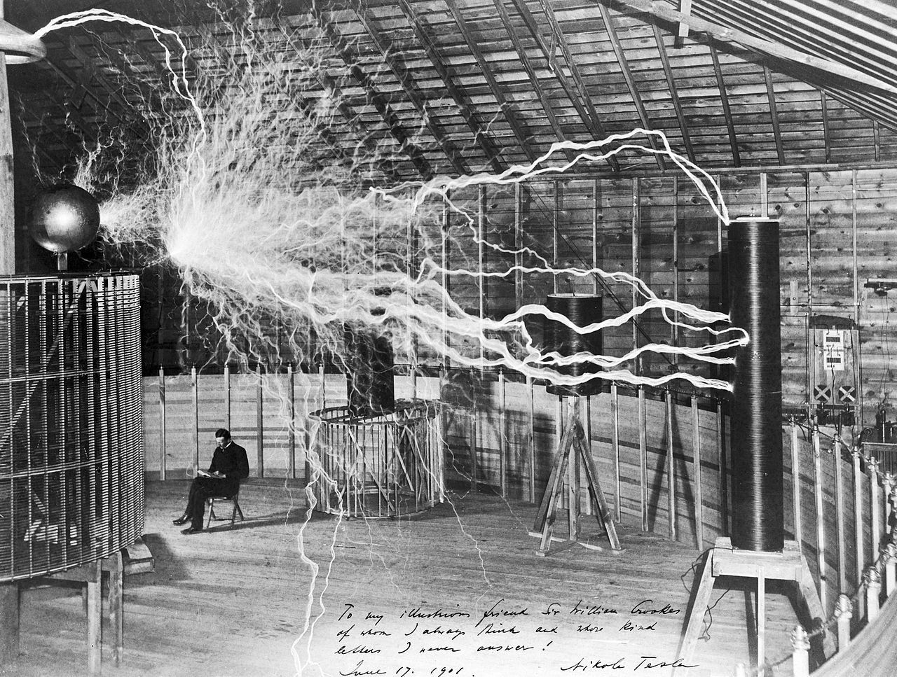

#asimov : An Equitable Intrinsic Value System

**or**

**a post-harden rockets cathartic**

**by Brandon Awbrey**

**SECOND FOUNDATION**

**Version 2.13**

 2022 by Brandon Awbrey. This publication
may be reproduced in whole form if fairly attributed for any
non-commercial purpose. If you are using this for commercial purposes,
you better make sure that Brandon is getting paid, unless you are Trey
Parker and Matt Stone, then you guys can make bank. If you paid me for a
printed or eBook form of this book, then thank you. If you paid somebody
else, I join you in a curse.

Cover Art and Illustrations ©2023 by Jack Awbrey

Lyrics are reprinted by permission, copyrights listed in
[Acknowledgements](#acknowledgements).

Intrinsic Value
===============

There are only two true hedges against inflation. History and
archaeology have proven they've both existed for as long as humanity.

It's Not real estate. That's a good one, as Mark Twain said, "Buy land,
they're not making it anymore." Elon Musk is trying to change that
maxim. If Mr. Clemens were alive today, he'd have already bought his
tickets to Mars. It's not true even on Earth. Tax foreclosures, floods,
Texas ice storms, hurricanes, earthquakes, mud slides, and rising sea
levels must be considered, plus don't forget war and revolution can put
bustles in your hedgerow.

It's not gold. We tried that. Think gold is your savior as the world
collapses? Good luck. Try pitching a gold bar at a zombie, see how that
works out.

In the old days, if you had gold or land, it was most likely because you
were born to it, or you took it. Wealth was bestowed upon you by your
creator, either by giving you wealthy parents or by blessing you with
the skills and fortune to win at battle.

In modern times, we feel that wealth is a result of humanity\'s
creations. Through both the industrial and information revolutions, it
has been man's ability to innovate that has led directly to wealth and
prosperity.

It follows that humanity should use its own creation as the fundamental
measure of value. Floating fiat currencies like the dollar and
cryptocurrencies like bitcoin meet this criteria. Neither dollar nor
bitcoin represent any intrinsic value, and thus can't really hold value
over generations and through calamity without intervention. Fiat and
cryptocurrencies function as money -- a medium of exchange -- which is a
technical function of a currency. Neither represent real value, which is
the human concept of money. This disparity, between the technical
expression of value and the actual human appreciation of value leads to
all kinds of crazy, like the prices of crypto.

The two true hedges against inflation are *genius* and *vanity*.

It is likely that within my lifetime, technology will have advanced to a
stage where we can passively scan inanimate objects and digitize them
down to the atomic level. 3-D printing will advance to a level where we
can reproduce facsimiles of scanned items that are indistinguishable
from the original to human senses.

It's very possible that in a few decades, if you want a reproduction of
the *Mona Lisa*, you'll be able to pull up an app on your phone, pay the
Louvre for a digital file, and 5 minutes later, your 3-D printer spits
one out. It's likely that technology will allow you to print out a copy
that matches what the painting looked like when the paint first dried.

This might seem cool, but I'm an engineer, not an artsy type. I can
already download a hi-resolution digital photo of old Mona and use it as
a screensaver. Art lovers may tell you being in the presence of an
original masterpiece is different. My cynical opinion is unless you want
to get all mystical about it, a molecule-accurate facsimile should be
able to give you that same feeling.

Facsimiles are not the true potential. The true potential of this
technology is that one day, we may be able to reproduce *Mona Lisa* by
brushstrokes -- it is possible we'll be able to deduce not only Da
Vinci's strokes, but from that, his height, the size of his fingers, the
strength of his forearms, and the duration of his pauses between
strokes.

We might be able to better understand Da Vinci's genius. Not everybody.
Those who love his art, those who have the patience to watch a master
paint for hours without checking the price of their dogecoin every five
seconds. Perhaps Artificial Intelligence will be able to figure it out,
and portraits will come back into fashion, a Leo robot for rent down at
the Hobby Lobby.

Works of art don't just have historical value. They have potential
value. And anything that is one of a kind has vanity value.

Genius and vanity are intangible, but real. This is one problem people
have understanding money. Most people can understand equities; a share
of stock is partial ownership of a company. Most people can understand a
fixed currency - a gold-standard dollar is an actual gold coin. People
used to understand that a paper dollar bill was backed by gold locked
down under Fort Knox.[^1] But the floating dollar? That's backed by the
"full faith and credit of the U.S. Government" which I would argue is
neither tangible nor real. The U.S. Government consists of people we
elected; I don't think I need to make a list of examples of all those
faithless hypocrites -- it's a long list with names in both red and
blue. And bitcoin? Backed by mathematics? Mathematics is a form of
genius humanity has created collectively through history, it's as much
of an abstraction as faith in a government.

Genius and vanity are timeless.

Genius is timeless. I don't mean to imply that if we put old Leo in a
time machine and brought him to the year 2022, in a week he'd be rocking
an iPhone while dropping smack on crypto developers, puffin' on a vape
pen, giving Banksy a run for his money spray-painting a masterpiece
portrait of Queen Bey on the side of a railcar. No, he'd probably be
spooked to death and think he was surrounded by sorcery. If I could talk
to him, engineer to engineer, I think he would be able to understand
Boolean logic, the basis of digital logic, and then quickly fathom how
simple, but extraordinarily complex, all these wondrous machines are.
He'd understand it, not sure he'd believe it. His next stop would
probably be either the confessional or the liquor store.

Vanity is timeless as well. We all know people who like to name things
after themselves, sometimes when they didn't have anything to do with
creating it in the first place. I am talking to you, Mister Toyota
Center. We all know that is the house *The Dream* built.

The Foundation
==============

In Isaac Asimov's *Foundation* epic, a scientist named Hari Seldon uses
an advanced mathematics called psychohistory to predict the future. He
foresees the collapse of the Galactic Empire. His calculation reveals
the collapse will last 30,000 years. He convinces the emperor that if he
forms a Foundation to create the *Encyclopedia Galactica*, a complete
collection of all human knowledge, the collapse will only last 1,000
years.[^2]

Asimov was prophesying a planet where they have Wikipedia and on demand
streaming when he wrote his stories in the 1940s, disguised as wildly
speculative fiction set thousands of years in the future. His genius
turned dreams into reality -- the Internet just taking off at the end of
his life.

Asimov warns that history always repeats itself and humans always forget
history. Ask any crypto-crazy what he remembers about the years 2000 and
2008? If he says Lakers and Celtics, he gets a gold star but maybe he
should think about getting out of Doge. Unfortunately, worse things than
NBA re-runs and financial corrections happen when humans forget history.
Sometimes, it can be ugly and bloody.

What if we could turn history into money? Would we still forget?

A Measure of Wealth
===================

The goal of this project is to change the way we value wealth. Wealth is
currently based on the exchange of property. Property is inequitably
distributed across humanity and is the source of most conflict in
history.

Bitcoin opened a new frontier in how we implement a currency, relieving
us from dependence on government for a unit of exchange. All crypto, as
well as the dollar and all fiat currencies derive their value from the
exchange of property, not any intrinsic value.

The goal is to create a base currency not based on property, which is
scarce and unfairly distributed, but on man's ability to create and
innovate -- our imaginations. I believe this ability to imagine -- to
dream -- is equally distributed among people.

There are two ways I look at the distribution of genius. The more
spiritual outlook is that there's a genius in every child and they just
need guidance to find a way to develop and express it. The more
practical point of view, genius is a quirk of DNA and statistically
distributed as a bell curve across the population. Either viewpoint
works with this system. If you have another point of view, perhaps you
believe that genius has something to do with your skin color or where
you were born or what your father did for a living, then you should stop
reading and measure your wealth with property. The Foundation is a
system of shared values.

Property based wealth is unsustainable without conflict. Genius based
wealth can be peacefully competitive and sustainable.

A genius-based economy will naturally align itself with sustainability.
It rewards cultures that raise children as sustainable dreamers and not
consumers. Moving away from a property-based value system can be
accomplished voluntarily and gradually over time. There are no
technological barriers to this system.

I'm proposing a value system that leverages crypto in the protocol but
is distinct from existing systems.

The system works on a very simple principle. If an idea is valuable,
people will choose to be responsible for it. The more people that are
responsible for a given idea, the more value the idea has.

This system functions as an equitable value system because ideas --
fruits of vanity or genius -- are not scarce and the potential for this
value is equitably distributed across humanity. Ideas that are genius
will increase in value over time. Vain ideas may be valuable for hours
or days, or even decades, but will lose value as fewer people want to be
responsible for them.

Property based money is based on the idea of scarcity. The actual value
created by mankind does increase naturally, because of innovation. We
can create value through more efficient processes, making each piece of
property more valuable. For example, if we had today's world population
of seven billion people, but the agricultural technology of 1022 A.D, to
paraphrase Marsellus Wallace, things would be getting medieval up in
here. Humans are extremely good at innovation. We must be to survive.

The problem with representing this value with property is that the
property is limited. It doesn't matter how much money the government
prints, the value is relative to property of some sort. That's why when
the government prints a bunch of money, real-estate prices go up.
Property is unfairly distributed depending on where you were born and
who your parents were.

If you have a brilliant idea, you must convince somebody to exchange
property for usage of that idea. Smart businessmen know how to leverage
ideas into property, and usually that takes capital -- more property.
The idea itself is not valued directly. All ideas have some value. Most
are better kept to oneself, but the success of social media shows that
even vanity has tremendous value. When we create a way to measure an
idea's value directly, we have a market in ideas. Every human has an
even shot.

If this sounds like circular logic, it is. It is the same principle that
fueled the meme-based crypto gold rush. It's the same principle that
fuels tech-companies into market values that have no correlation to
their current or near-term revenue potential.

A significant amount of the world's economy is already dependent on
this. Any value generated based on clicks, or likes, or followers, or
even old-school impressions is leveraging this value, inefficiently and
with a hungry pack of middlemen trying to interpret what you value from
circumstantial evidence. This proposal cuts out the middleman and allows
individuals to leverage what they value directly.

When a marketing firm brings Beyoncé a multi-million-dollar endorsement
deal for a product based on streaming numbers of a song they want to
use, who created that multi-million-dollar value? Is it the marketing
firm? They certainly want you to think so. Is it Beyoncé? She creates
the music -- the idea -- but did she create the value? That value is
conferred to the queen by her subjects -- her followers. Expressed only
to herself, her voice is a prayer or an expression of gratitude to the
divine, whatever Beyoncé believes to be the source of human genius.
Value beyond human measure. Shared with others, her voice creates human
value, as such, it can be measured.

A new way to measure value -- sustainable and equitable to all -- is the
way to a more prosperous and peaceful world.

Guardians of the Public Domain
------------------------------

The public domain consists of all creative work to which no exclusive
intellectual property (IP) rights apply.[^3] Where the public domain
begins, and exclusive IP end varies from country to country. In the
United States, public domain begins on copyrighted material 70 years
after the creator's death.

Asimov's Foundation was collecting the accumulated public domain of a
vast empire of millions of worlds across the galaxy and compounding it
into the *Encyclopedia Galactica*. The Galactic Empire had forgotten
much of its history, and while they had advanced technology, the rate of
progress had stagnated or regressed. The empire's historical record did
not go beyond the beginning of the empire, and it had gotten so bad that
the origin world, Earth, was but a myth. No map showed the location of
the origin world. Worse than that, nobody cared.

We face the same problem. It's not that we've forgotten history, but
it's been rewritten so many times; it's continually changing. That is a
problem we can't fix -- we might chance upon records that correct a
"correction," but we have lost more than we can ever recover. Blockchain
technology has one aspect that can help with this. Blockchains are
immutable -- you can't make a change in the past without invalidating
every other entry on the blockchain. A blockchain is history written in
digital stone.

There is a bigger problem to solve. They had academics and huge
libraries in the Galactic Empire, but the real problem was that no one
was responsible for the preservation of that knowledge. Academics only
studied what was fashionable or interesting to them; and, since
technology and science were already so far advanced, they had little
interest in exploring the past to understand the fundamentals. The
Foundation was exiled to Terminus, a world that had almost no natural
resources. Despite this, armed with the knowledge of *Encyclopedia
Galactica*, within a few centuries the First Foundation rivaled and then
exceeded the power of the Empire.

We have the same problem today. The amount of knowledge we have
accumulated as a species is huge, yet just a drop in the vast ocean of
raw digital data that exists in computer systems. Who is responsible for
the preservation of this valuable knowledge? The public domain is not
property, so there is very little motivation to preserve it, as it
cannot be sold. Publishers can profit from the public domain, such as
publishing Shakespeare, yet for every Shakespeare there are thousands of
writers forever lost to history.

If we don't take responsibility, we will continue to lose important
pieces of our legacy. Will this lead to stagnation and the decline of
civilization? I don't know.

I know that a civilization whose value system is based on property will
always have conflict if there is scarcity.

A value system built on something that is rare yet potentially unlimited
and evenly distributed throughout humanity should cause less conflict
and stabilize a more secure and sustainable economy.

Let's look at two geniuses from last century who also happened to be
close friends: Mark Twain and Nikola Tesla. Mark Twain was the father of
American literature, a social satirist and humorist, and for his day, a
social media influencer. Nikola Tesla was an engineer, scientist, and
inventor who pioneered early electrical systems and made fundamental
contributions to many other fields. Mark Twain died in 1910, meaning
under U.S. law, his writings would have entered the public domain in
1980, 70 years after his death.[^4] Nikola Tesla died in 1943, so his
written work would have entered the public domain in 2013. Tesla was an
inventor, and U.S. patents expire twenty years after issuance. Most of
Tesla's patents expired while he was still alive. All work by both men
is in the public domain. Their work material -- manuscripts, notebooks,
drawings, and prototypes -are property and belong to whomever legally
possess them. In general, for writers and inventors, we place little
importance on the physical work product.

This new value system is built on a fundamental question: Who is the
greater genius? Mark Twain or Nikola Tesla?

Twain was a social commentator and humorist; his wit unmatched, with a
voice uniquely and quintessentially American. *The Adventures of
Huckleberry Finn* might be the most important novel ever written.
Despite Twain's wit and social critique, over a hundred years after his
death, we still have racism and gilded idiots in his own country.

Tesla invented machines that transformed the world, allowing every home
to have a reliable and efficient source of power.

Why should we ponder who was greater? Aren't they both geniuses?

If we can place a value on their contributions to humanity, then we can
use this to form the foundation of a value system based on mankind's
creativity, which is limitless and renewable with every birth.

This should be the first interview question for future Foundation
Encyclopedist. Who is the greater genius, Twain or Tesla?

I'd like to think Nikola Tesla would be deferential to his friend and
point out the first step of any innovation is a clear characterization
of the problem. If he'd had his friend's gift of rhetorical gab he might
have been a better salesman for his ideas and become wealthy enough to
finish more of his research.

I doubt Mark Twain would be deferential, having seen his friend burn
down multiple labs as well as constantly enduring self-inflicted shocks
of millions of volts. Near the end of his days, Tesla was hopelessly in
love with a pigeon. If Mark Twain had lived a few more years, he could
use Einstein as an example, a scientist who changed the world with only
pen and ink and his imagination, no high-voltage lab work at all.

You can make arguments either way, but the truth is that we don't know.
In future centuries, when racism and a class-stratified society may seem
quaint, Twain's tales may be hard to take seriously. Future children may
look upon photographs of the 21^st^ century and wonder why we strung up
ugly high-voltage wires everywhere. If Nikola were still alive, he would
wonder the same thing, as he'd been convinced that wireless transmission
of power was a challenge he could solve, if he'd only been able to
convince the capitalists who'd spent millions wiring up the country to
fund his wireless research. Naivete and genius aren't mutually
exclusive.

We don't know the value of any particular genius -- we can't know. One
man's genius is another's vanity.

We can determine the value of all the geniuses that came before us. It's
simple. The value of man's genius is approximately equivalent to the
cumulative value of all human commerce.

Property does not provide value without man's innovation. Raw ore dug
from the earth does not transform itself into metal -- man's genius
allows it to be smelt. Raw land does not provide surplus food naturally,
but through agriculture we feed seven billion souls. Nature's bounty
provides the raw material, but the value comes from man's innovation.

Man's genius can be summed as the value of the public domain and the
current value of all private Intellectual Property. This value is
equivalent to the cumulative value of all human commerce; from the
beginning of human history. Unlike most natural resources, genius is
naturally renewable. When electrical engineers use Ohm's law to
calculate the resistance of a circuit, they do not "use up" some of
Ohm's Law. Ohm's Law retains its value, no matter how many engineers use
it or what it is used for. You could argue, Ohm's Law becomes more
valuable every time it is used.

This equivalence argument is like the ultimate Catch-22. Economist may
wish to argue that property and resources -- the king's gold - are what
really creates value in the economy and may even attempt to prove it
using economic theory and mathematics. Yet economics and mathematics are
products of mankind's genius.

Even though the public domain is free and open to everyone, it is very
valuable. It is the most valuable treasure we have as a species.

How valuable can something be if no one is responsible for it?

This is the key to the system. Rather than value genius directly, we
will value responsibility. You don't have to be a genius to be
responsible for genius.

Passion is all that is required.

How it works
------------

The Foundation is an engineered system. The system uses the basic
engineering techniques of equalization and isolation.

This system is a mash-up of some existing working systems and some legal
loopholes that capitalists at the turn of the last century didn't
realize could be exploited by the little people.

### Linux

I really hate to give credit to a smarty-pants Finn, but I must. It's
not because I think Linus Torvalds is a great coder -- I find parts of
Linux to be suboptimal.[^5]

The Foundation will leverage the brilliant governance of Linux.

Linux is a public good. It's owned by no one. The code is open source,
meaning anyone can take the source code, and using tools that are also
open source, build their own version of Linux, making whatever changes
they want. There are various licenses associated with open-source, and
it's not legally the same as public-domain, but it's similar enough to
use as a model.

Linux's value as a public good is immense. I've seen marketing estimates
that its value is in the range of hundreds of billions of dollars. I
think that is undervalued, as the estimates don't include the value of
projects that wouldn't have been possible without Linux. Linux's
freeness has even changed the way paid software is distributed. Now it's
possible to prototype and develop software on most platforms for free
and pay only when you launch a product.

Linux may be the most valuable public good ever created. I'd compare its
value as a public good to the Panama Canal, which is state-owned but its
global benefit far outvalues the national revenue generated. Linux is
completely free, and not owned by Finland or any other state.

Linux is governed as a Benevolent Dictatorship. That's right. Linus is
the total boss. Despite this, individuals, corporations and even
governments put up with him. Since he's the creator, it gives this
dictatorship value legitimacy. It's non-exclusive; if at any point,
somebody wants to do things differently, they can. This has happened and
does happen all the time. Android is Google's version of Linux for
mobile phones.

Linux has thrived for over thirty years, governed by a smarty-pants Finn
who thinks he knows more about operating systems than you or I. National
governments don't interfere, because they have no domain; the software
is open and free. If they tried to assert some dominion it would cause
an uproar. The fact that this dictator has been allowed to dictate for
so long is legal precedence.

It's genius precedence.

### Bitcoin

Bitcoin is a brilliant innovation coined by the anonymous coder known as
Satoshi Nakamoto. It broke new ground; an open protocol that could
handle financial transactions without any central authority. The real
innovation was the blockchain, an immutable shared transactional
database.

The raw technology is brilliant. I find the application of this
technology to be lacking. While it works as a unit of exchange of
property, it fails as a store of value. Bitcoin enthusiasts will point
to bitcoin's appreciation of value through the calamity of the last few
years, but that value is artificial scarcity driven by the Proof of Work
algorithm. We waste tremendous amounts of power to mine new coins. This
artificial scarcity ties its value to the true scarcity and inequitable
distribution of property.

The Foundation uses Nakamoto's blockchain innovation to capture the
value of mankind's imagination through a measurement of proportional
responsibility for ideas.

The Foundation does not wish to impede or replace Bitcoin or any other
crypto or fiat currency, but rather create a global base currency of
value.

### Social Media

Social Media rightly deserves much of the blame for what's wrong in the
world today, but it has changed one aspect of economics that kicked the
door open for a new value system.

It used to be that an artist's impact had to be measured by the amount
of revenue they could generate. This could be from direct sales or
tickets to a concert or a movie. Or this could be indirect, as measured
by advertising dollars, such as radio listeners or television viewers.

Now we measure things by individual attention -- clicks, likes,
followers. How many views a photograph or video has on social media. How
many times a post is retweeted or commented upon. Tech giants like
Google, Tencent and Facebook leverage this attention into targeted
advertising, and that revenue drives valuation of the artists and
content creators.

The reality is that value is generated by attention -- human
appreciation -- it doesn't matter if any advertising is sold or not.
When ten thousand people listen to a song by a new artist, value is
generated. The song has value, and that value can be measured exclusive
of revenue.

You don't have to sell something to create value. The exchange of
property is not necessary for a functional value system. Ideas have
value that can be exchanged for the value of other ideas -- without
scarcity and without exclusivity.

### Awbrey Hack

Linux has proven that when property is not involved, a system of a
self-governance of a valuable public good can be managed without
intrusion from national governments. Bitcoin has given us a way to
create an immutable historical record and the exchange of proportional
responsibility. Social Media has proven that content is valuable without
the need to exchange property.

In the old days, the king's coins were minted from gold plunder taken
from the king's treasury. You could use the king's gold to trade for
property. The gold itself wasn't valuable. You couldn't eat the gold,
and while you could wear it, if you weren't nobility, that was like
wearing a "rob me," sign. Gold was only good for the exchange of
property. Gold was valuable because the king said gold was valuable.
Gold became a consensual illusion -- we all believed it was valuable, so
it was valuable because we believed it was valuable. Money has always
been circular logic.

We got rid of the kings, but we kept the king's gold. In modern times,
we hacked the gold out of the system. Now currencies are valuable
because we believe they are valuable. Most of the world believes the
dollar is valuable, so the dollar is valuable.

The Foundation's treasury are the ideas of mankind. It's the only
valuable treasure we have. That was Asimov's message in *Foundation*.

This treasure is more valuable than Earth. Mankind might survive without
Earth. Mankind will not survive without our treasury of ideas.

That's the Awbrey hack. Make money out of the only thing that is truly
valuable.

Fiat (national) currencies are derived from values among people of a
country and supported by the laws of that country -- specifically,
property law. As we've seen recently in the United States, we are a
nation of divided values, and every country has a distribution of values
among individuals. The system I propose allows those with shared values,
wherever they are, to unite and form a common currency of shared
responsibility for those ideas. If those who unite aren't very
responsible, then the value relative to other ideas will decline. That's
the way it should be. Good ideas appreciate, vain ideas cycle in value
with fashion.

The Foundation is a system of competitive self-governance; where the
best ideas, managed by the best teams of people, compete for the
relative valuation of ideas they support. The cumulative valuation of
ideas is measured using a digital currency called asimov. The
Foundation's mission is to commit to ideas of genius, and neglect ideas
of vanity. Only history will be able to judge which is which, but over
time, the Foundation should accumulate data that should help guide us.
The self-governing units are called Scoot, and they issue their own
tokens of responsibility also called scoot (lowercase). Scoot can trade
for each other and for asimov but are in a restricted system called the
responsibility domain. Asimov may trade openly like bitcoin. Through
this system, we have a valuation of genius and vanity. The sum of the
blockchains becomes a tree of human knowledge, distributed, and
replicated throughout the planet by the nodes that process transactions.

The greatest treasure may be the future knowledge of how our values
change over time, and what values we should instill in our children so
that may live in a peaceful, sustainable, and equitable world.

Scoot - Dynamically Scalable Responsibility
-------------------------------------------

Why Scoot? Scoot is money, y'all.

The power of this system is that it uses the innovation of
cryptocurrency to provide a scalable system of limited direct governance
as well as an immutable historical record of that governance. The
protocol will allow you to customize the elective governance of a Scoot.
If you want a proportional democracy, like a shareholder in a company,
you can implement that. Want a representative democracy, because things
work so well in your local congressional district? Give that a try. If
you want a one-vote direct democracy, because you like participating in
social media flame wars, go for it. If you'd like more of a *Game of
Thrones* strategic power moves of royalty without all the blood, you can
do that, too. You want to be like Linus, get your dictatorship on. I
don't know which one will be better. Data we gather over years, decades,
and centuries will show us which one of these works best or may guide us
towards new forms of self-governance that are more efficient. 

There is a reason direct democracy can't work on a large scale. We elect
people at the local, state, and federal level (who are good at one
thing) to lead and manage our governments, but then we expect them to be
good at many things. What does a lawyer know about running a water or
sewer system, or green recycling, or road maintenance? Elected leaders
can hire unbiased, unconflicted experts to do the work, but how
proficient can somebody become at a job specific to a region in the
short duration of an election cycle?[^6] We should have institutional
experience in our government departments that are competent, but how do
any of those people take risks or point out problems when their bosses
change hands at the whim of the elected leaders?

The intact bureaucracy makes this whole process complicated because
the scope is too broad. A congressman can get stuff done in government
-- he just makes a phone call and the water pumping station in his
district gets a new pump ahead of some other district. All it cost was a
vote against his conscience and the consensus of his constituents on a
voting rights bill. People who can already vote are likely to remember
the high-pressure shower they get each morning when election time rolls
around again.

Limited scope governance can be efficient. Take a Homeowners Association
(HOA). You have an hour meeting once a month. Hopefully, the chairman of
the HOA is somebody practical who won't make a run at the next open
school board seat. The practical leader calls a meeting and talks about
bids for a new lawn service that's coming up. They talk about teenagers
hanging out at the playground drinking and smoking pot on the weekends,
and who was going to call the cops, and should they inform parents
first. They talk about a few issues they need to prepare to discuss in
future meetings, and then close the meeting in 45 minutes. 

Let's say the HOA chairperson *is* running for an open school board
seat. They decide, before getting into the agenda, we should have an
open forum where the HOA board can hear the homeowner's opinions. In the
first meeting, the forum agenda is vaccination mandates and local
abortion laws. Do you think they'll be able to agree on a lawn service
after the open forum?

We can't agree on broad topics because our individual value systems
aren't red or blue. Our individual values are more nuanced than the
bipolar party system. When you limit the scope of your governance, you
can avoid ideologies and focus on the problems. When you limit the
scope, you can focus on efficient solutions rather than negotiate
compromises.

Crypto has given us tools that allow us to manage a limited scope
governance. In most places, existing governments or feudal powers
hold jurisdiction over a broad domain of human civil systems.

By limiting the scope of our responsibility units to a single idea, you
can have effective governance. By having all work occur in an open forum
with an immutable record of value judgements via elections, you can
avoid the conflict, politics, and corruption that occurs in governments
with broad interests. 

The Foundation is a limited direct democracy that asserts non-exclusive
management responsibility over the public domain. The public domain is
NOT the government's domain, nor does it belong to corporations or any
other legal entity. It belongs to the public -- and I choose to
interpret this broadly as mankind at large.

Scoot may not own property. Property is the domain of
existing governments and enforced by common law. By creating a system of
responsibility for humanity's greatest treasure, the accumulated
knowledge and imagination in the public domain, we create institutions
that are a public good. This creates value that is both equitable and
plentiful. The governance of this public treasure
is non-exclusive. There can be competition between Scoot within the
Foundation's responsibility domain. There can be competition to The
Foundation itself. 

Asimov is the unit of measure in a real value system that does not
include property of any kind. The Foundation's digital vaults will be
filled with mankind's greatest treasure: Our dreams. 

The Foundation for the Appreciation of Human Genius 
---------------------------------------------------

The Foundation is a Non-Governmental Organization (NGO). It may be
decentralized, but it's not autonomous. It's an ideal, not an algorithm.

Specifically, it is *The Foundation for the Appreciation of Human
Genius*. The measure of that appreciation is in units of the digital
currency asimov. This has a double meaning -- because for asimov to
appreciate, humanity must appreciate the underlying works of genius. The
other meaning is appreciation of asimov's market value relative to other
currencies over time.

Asimov and Scoot
----------------

Scoot is scoot.

Scoot may be understood by what it's not. Scoot is not stock. It is not
an asset, or a commodity, and it can never be property. It's not an NFT.
Though scoot are tokens of responsibility, they have no obligation.
Scoot have no obligation because the accountability is direct. Fail at
your responsibility, your wealth diminishes. Succeed at your
responsibility, your wealth increases.

Scoot (uppercase) is a group of accountable individuals. Lowercase
**scoot** is a unit of responsibility.[^7]

A Scoot is an enterprise that does not own property.

While it might be easier to explain what scoot is in terms of
cryptocurrency or existing financial instruments, it would be wrong.
When the foundation of a system is broken, you don't mold a new system
using the old foundation. You find a better rock to build your house
upon. A rock that does not roll.

Brother Taboo spits truth:

*So I could ask myself really what is goin\' wrong*

*In this world that we livin\' in people keep on givin\' in*

***Makin\' wrong decisions, only visions of them dividends***

*Not respectin\' each other, deny thy brother*

*A war is goin\' on but the reason\'s undercover*[^8]

Bill Gates said, "With great wealth comes great responsibility."

Scoot is the inverse function. ***With great responsibility comes great
wealth***.

The most valuable treasures we have as a species is the knowledge,
innovation, and imagination of those who came before us and the dreams
of those living now. This treasure is more valuable than gold, oil, or
hash rate.

Our treasure is not valuable if lost, destroyed, or forgotten. It is up
to humans to protect, preserve, and remember this treasure.

Scoot is the vessel of this responsibility.

### Scoot Primer

For a detailed description of the system, please refer **to** [Appendix
D -- System Technical
Description](#appendix-d-system-technical-description). The Foundation
is a measurement system for intrinsic human value. How it works as a
human system is more important than the digital protocol.

It is an engineered system, so when I think of how it works in human
terms, I also think about how to implement it as a digital system. The
primary innovation is a social-economic system. Scoot works to create
value equitably from the intrinsic value of ideas. My vagabond crypto
advisor thought explaining it in technical terms at this stage in the
book would lose the reader. Apparently, most crypto advisors don't like
to read.

He also thought there were too many sports references.

#### The Foundation

The Foundation is the organization that governs the system. The
Foundation validates transactions and identities and participates in
staking Scoot.

#### Pledges

Pledges are members of The Foundation. Pledges are identified by The
Foundation using one of two methods.

**Deterministic biometric identity**. The Foundation uses biometric
identification -- eye scans, fingerprints, or DNA - to identify you and
validate a private key. We don't need to know your real name, or your
citizenship. We just need to know you are a unique person. You can't
have multiple identities within The Foundation.[^9]

**Linked Stakes**. This is the method used during rollout of The
Foundation. An existing member validates another member as a unique
human and "stakes" their membership.

"Pledge" is not just terminology. Pledges promise to keep property out
of the responsibility domain. They also promise to increase the
appreciation of the idea the scoot they hold represents.

#### Scoot

A Scoot is an enterprise that does not own property. It is governed by
the member pledges, according to rules that the members determine.

In the genius economy, Scoot are equivalents to companies in the
property economy. A Scoot can do almost anything that a company can do,
except buy real-property and sell properties of wealth.

The Foundation itself is a Scoot. This is intentionally recursive.

The governance of a Scoot is managed with a blockchain, known as a
scootchain, and the unit of exchange is also generically called
scoot.[^10]

There is no need to understand cryptocurrency to understand scoot. A
Scoot could use poker chips or paper tickets for trade. What they
represent is the responsibility the holder has for the governance of a
Scoot. The bearer of a scoot has responsibility for the appreciation of
the idea the Scoot represents.

The Foundation assigns a number when a Scoot is staked. This number is
known as the Scoot Index. Scoot are referred to as scoot(X) -- where (X)
is the Scoot Index. The pledges can call the scoot whatever they want.

#### Scootage

The scootage are the holders of a specific scoot.

#### Scoot Trustee

A person elected or chosen by the scootage as leader. The specifics of
how a trustee is chosen is left to individual Scoots. To operate within
The Foundation, the method of elections must be executable by the
protocol.

#### Responsibility Domain

The responsibility domain is the term to describe the marketplace of
scoot. In the responsibility domain, all trades must be validated by
both parties. Responsibility must be accepted.

Scoot with indexes greater than zero can only trade in the
responsibility domain.

#### Value Domain

The Foundation's scoot is called asimov. Technically, asimov is
scoot(0). In the responsibility domain, asimov serves as a common unit
of exchange between scoot.

The value domain allows asimov to be traded one way and to anonymous
addresses. This allows asimov to be traded for other cryptocurrencies,
fiat currencies or any form of property, and thus provides a bridge
between property and ideas.

The Foundation will only open trade in the value domain if certain
conditions are met. These conditions are described in [Second
Foundation](#second-foundation).

#### Staking 

The equivalent to capitalization in the genius economy is staking.
Staking may be a commitment of property, appreciation, content or asimov
in a Scoot for a fixed period, in exchange for scoot. Staking is
described in more detail in the [Stakes](#stakes) chapter.

Staking creates a measurement known as stake weight. This is used in
processing transactions, or in shuns, a method of preventing the
validation of transactions.

#### Staking Networks

Scoot which join with other Scoot to process each other's transactions
and elections are members of a Staking Network. While it's possible for
a Scoot to process its own transactions, the Foundation will not
validate those transactions; staking networks must encumber scoot of
equal or greater weight than the transactional weight they are
validating. This is similar to the crypto concept known as
Proof-of-Stake.

#### Virtual Scoot

Virtual Scoot are Scoot with indexes less than zero. Virtual Scoot may
be used for a variety of purposes. A staking network is a virtual scoot,
and so is a shun.

Scoot(-1) and scoot(-2) are mining rewards for processing transactions
in the responsibility and value domains, respectively.

### Genius Economy

The genius economy is the trade of scoot in both the responsibility and
value domains.

It is separate but coexistent with the property economy.

You could think of scoot as Airline Frequent Flyer Miles. These miles
are good for air travel, and may also be converted into hotel rewards,
you can't easily use them to buy a house or a car.

Scoot are like Airline Miles for foolish people who believe ideas are
more valuable than property.

People like Isaac Asimov.

*The Foundation is Gratitude*

Application of Scoot
--------------------

### Scoot of Property (SOP)

A Scoot of Property is the simplest case to understand. A group is
formed to be responsible for a piece of property they collectively agree
should not be property, but part of the public domain. Genius belongs to
Humanity.

A billionaire owns a Picasso he bought for \$1 million, now appraised at
\$10 million. The billionaire forms a Scoot, names himself as trustee
and mints 1000 scoot. In staking the Scoot, he signs away title to the
painting, gives it freely to humanity, formally ending the painting's
existence as property, yet the Scoot retains right of possession of the
painting as custodian. This *is* a legal paradox, a tactical one. A
Scoot can buy property, and it can give away property to humanity, but
it can never sell properties of wealth.

The billionaire may agree to sell 1 scoot to The Foundation at the
appraised price, or the equivalent of \$10,000 in asimov, establishing a
first mint price. The billionaire may then trade up to 498 scoot in the
responsibility domain and retain possessive control of the
painting.[^11] The other 498 holders don't benefit in any way directly.
The billionaire can keep his painting hidden away at his ski chalet,
losing nothing in the process. He controls access to the painting but
has turned half of its value into liquid wealth.[^12]

This is zero sum, not only for the billionaire but for the scoot holders
(scootage). What makes people appreciate art is seeing art. The
billionaire hears from his scootage and finds out one of them is
Argentinian and there is unfulfilled demand for all things Picasso in
his home country. The Scoot arranges an exhibition with a museum in
Buenos Aires. Bids on the scoot double soon after the exhibition begins.
A few holders sell to Argentinian pledges. Another holder suggests they
have an Argentinian Art historian write a biography focused on that
period of painting in Pablo's life. The Scoot stakes the historian's
Scoot and commissions a biography which is published on the scootchain.

You might wonder why any billionaire would do this, after all, who does
he have to impress? \$10 million for a painting for a billionaire is
equivalent to the wallpaper decision most of us make when buying a new
house.

The reason is simple - who he's got to impress. The wealthy like to
flaunt, or else we wouldn't have to read their raw thoughts on Twitter
and see what kind of underwear they wear on Instagram. This is very
different. This is a direct personal staking of what they value. Instead
of flaunting their wealth as art because they are rich, they are making
a bolder statement, one that will be judged by history.

They are saying they are wealthy because they are passionate about
something. And that is a good way to be wealthy. For everybody.

### Scoot of Gratitude (SOG)

#### Titanic Appreciation

Not everybody with a passion is a billionaire.

Take Zoey, who voyaged to Los Angeles as a student from China, to study
filmmaking with the hopes of being the next Spielberg. Twenty years
later, she's working in Hollywood but toiling in production jobs, never
getting a chance to assist, much less direct a movie. Dreams
unfulfilled, she is still grateful to make a living doing what she
loves.

Zoey is Scoot-hip and has made a lot of contacts in the industry. She
decides to scoot James Cameron's *Titanic*, which inspired her career.
It's not a unique idea, there are likely to be hundreds, if not
thousands, of Scoots devoted to *Titanic*. Zoey considered most of her
competition purely nostalgia, glorifying the romance without looking at
the bigger picture.

Zoey initially mints a thousand scoot, which she distributes to her
industry friends. She has a few older friends who worked on the movie,
and through them, meets a few more. She asks those that worked on the
movie to write their thoughts and experiences of working *Titanic*. She
interviews a few old-timers in L.A. and writes up their stories. She
starts publishing these memories on the scootchain, carefully selecting
a few that are complementary to a rose of an actor, with whom she
eventually gets into contact. Zoey offers the actor a hefty slice of her
majority scoot for just a bit of genius by association, really,
half-a-day's work. The actor is game, so Zoey privately reveals her
secret strategy, *El Enchilada Grande*.[^13]

Word gets out quickly when a high-profile actor commits to a Scoot based
on their work. During the next few months Zoey watches patiently as her
scoot, which she now shares majority control with the actor, starts to
trade openly at a nice valuation. The scootage, most of whom she knows
personally, gives her advice. The main question is to dilute or not
dilute. Both have been known to increase the value of scoot. She needs
to move quickly. She makes an offering of about 20% dilution. With the
actors stake, it still leaves them with majority control.

Zoey subscribes to The Foundation's philosophy, the more people who are
responsible for something, the more valuable it can become. The genius
economy is a brand-new thing, so nobody has really tested it out on a
titanic scale. Zoey's looking at the downside of forty, what the hell
does she have to lose?

Zoey uses the proceeds of the offering to book a big room at a hotel in
Santa Monica. She funds a specifically targeted social media campaign.
She targets women who would have been 7-28 in 1997 who are players in
cryptocurrency and followers of Kate Winslet or Leonardo Di Caprio on
social media. Chinese social media is faster than the speed of light,
within 8 seconds the conference and hotel are fully booked.

There's a month wait before the conference; rumors begin to swirl. Would
the actor show up? Competing Scoot start to make inquiries, looking for
leverage opportunities. What's the actor's role? Zoey stays aloof and
secretive, only posting that a plan would be revealed shortly.

At the hotel, on the big night, the haunting thematic whistle plays
through the hall, and Zoey walks out on stage looking like a Technicolor
Theranos priestess, a tie-dyed pulldown turtleneck, orange plastic
rimmed glasses rejected from Elton John's personal collection as being
too gaudy, and a purple Devo hat. Whispers spread like wildfire.

Zoey raises her arms in a V and shouts in into the microphone,
"Silence!"

The lights dim and the crowd settles. The screen begins to show a CGI
animation. *Titanic*, reborn.

The plan is presented. A *New Titanic* will be built, a ship visually
identical to the original, engineered to modern safety standards. Not
only will the ship reflect the grandeurs and vanity of the Gilded age,
with the opulent First-Class Suites, but also the reality of the
Progressive Era, with working-men's communal bunks and washrooms.

While a visual facsimile of the actual *Titanic*, the *New Titanic* will
be 100% green and carbon neutral, fully electric with only an emergency
diesel generator.

After the ship is constructed, a new *Titanic* series will be filmed.
Zoey has written a script, and the actor has agreed to star. Instead of
a star-crossed lover, the actor would play their age, the
personification of a greedy turn-of-the-century capitalist aristocrat.

Since a Scoot may not own property, the ship itself would become a
monument to both the movie and the engineering. A floating tribute to
those that brought so much wonder to so many lives, and a reminder of
man's hubris. A cruise ship in the public domain, stewarded by Zoey's
Scoot.

Zoey walks off the stage, having only spoken the one word.

*La Ruidosa Chalupa*[^14] appears from a cloud of dry ice and sings the
song. Eight women in the crowd faint. The actor arrives on stage and
makes a few jokes about everybody getting older and acknowledges how
much *Titanic* had really meant for their career.

A representative of The Foundation comes on stage and explains how the
Scoot works and the risks involved, and all the details needed for
someone to legally participate. Hundreds of attendees line up to
validate their identification and pledge to The Foundation so that they
may show the world their appreciation of *Titanic*.

The next day, Zoey's Scoot is staked to the asimov equivalent of \$100
Million. Enough to make a CGI movie, not enough to build the ship.

The Internet almost crashes. People troll this crazy lady, calling her
plan ridiculous. Smarty pants Finnish techno-dweebs deride her plan as
impossible and a fraud. One particularly geeky billionaire engineer
points out that Zoey's plan is difficult, but not impossible. With a
large enough towed array of floating solar panels, it was possible to
generate enough power to propel a ship, though the battery size needed
to "steam" through the night might be impractical, since one must
consider the drag of the tow.

The next day Zoey releases the video presentation along with a technical
addendum, showing exactly how the *New Titanic* will work. Not only does
the ship have a towed solar array, but there is also a separate electric
powered tug that tows the array. The tug "plugs-in" into Titanic like a
power cable to a phone, discharging from its own internal battery to the
big ship at night. The solar panels would be mounted on bobber-buoys
that tracked the sun, which would be at a low angle in the polar seas
where *New Titanic* would steam. The bobber-buoys would generate current
themselves, from the natural motion of the ocean, thus negating the
overall drag effect, even in the dark.

In addition, the Titanic's four massive smokestacks, which one would
assume to be decorative in an electric ship, are integral to the
operation. An animation shows the smokestacks unfolding and transforming
into a massive set of four windmills hundreds of meters over the deck,
creating power from the wind. An engineer gives a technical description
of how the unfolding mechanism works, and the materials needed to build
such a radical windmill. Another animation begins, and we see the fore
and aft towers that serve as the crow's nest of the ship bloom into
massive, mile-wide carbon fiber parasails that mutate *New Titanic* into
a huge sailboat.

The next day the geeky billionaire engineer admits on Twitter he'd
underestimated Zoey's plan and announces his intention to invest \$500
Million into Zoey's Scoot. For the next few weeks, Zoey is constantly on
the phone with techno-billionaires trying to outbid each other for a
piece of the Scoot. She funds her Scoot with over \$2 billion equivalent
of asimov.

A few years later, the *New Titanic* sails and the series is filmed.
Zoey's co-direction with the actor sets a cinematic standard for the
century. On the surface Zoey's screenplay is a study of the Progressive
Era class struggle which foreshadowed the revolutions that followed.
Deeper, it is a thinly veiled allegory critical of techno-billionaire
enslavement of the working class through invasion of privacy, bondage so
strong, that the very engineers that design the technology for their
masters are unable to escape it.[^15] Strong acting by Winslet and
DiCaprio, playing power couple Rose and Jack Da'eval, representing the
basest personification of greed, win Golden Globes and Emmys. Michael B.
Jordan, playing a shirtless coal shoveling fireman, and Matthew
McConaughey, playing his cruel, racist and shirtless boss, are praised
by both critics and audiences. These superstars lead a cast of hundreds.
There is also plenty of breakout new talent, complex stories and
characters woven seamlessly into over 80 hours of screen time.

After accepting their Emmys for best Director of Drama Series, Zoey and
the actor hold a press conference and reveal the final chapter of *El
Grande Enchilada*.

*New Titanic* will "steam" constantly, a series of month-long cruises.
Each year, writers, directors, and actors will have opportunity to bid
on a new movie or series. Effectively, scoot(Titanic) becomes a media
franchise of the public domain. The scootage votes on the merits of
these screenplays, and award production to the winners. In addition,
everyday people will get a chance to submit their stories of how
*Titanic* touched their lives. The scootage votes for the best stories
and the winners are chosen as guests for the cruise. Groups of people
who do some Titanic themed public good can bid on group cruises. And
best of all, everything is free for the guests. Workers are chosen based
on some creative angle. Chefs trying to make a name for themselves.
Waitstaff and cleaners are really actors and writers vying for a chance
to create an angle that would get them a part in the production. Artist,
musicians, dancers and magicians, all driven by the scoot economy, bid
to "work" the *New Titanic*. Not only does the cruise become an
active-production Hollywood set, with the guests as extras, but it's
also a reality show, the guest and their crew sharing their heartaches
and triumphs in the context of a magical themed cruise.

The scootage may not join the cruise as guests. That would be equivalent
of transferring income to the scootage. This is strictly forbidden, nor
can the scootage "buy" their way in. They *can* bid through a lottery to
become ambassadors of the Scoot, thus gaining a berth on the ship,
though they must work the cruise. The work consists of walking around
and talking to guests about how awesome *Titanic* is.

Such an incredible and constant production would surely require and
immense amount of property money. So how does the Scoot pay for the
expenses? There will be one paid ticket per voyage, and that will be
known as Rose's Dowry. There is one wedding per voyage. The dowry will
be the cost for the entire voyage, including the costs of all the other
guests on board, not just the wedding guests. This is a targeted play,
directly aimed and marketed at the daughters or future-daughters-in-laws
of billionaires.

A week after announcement of the plan, a wily Chinese financier prebooks
the next 37 years of Rose's Dowry for an equivalent of \$67 billion. He
resells the inaugural wedding cruise for \$17 billion two weeks later.

The Scoot continues to dilute, people buying in just for a chance to win
the lottery and become ambassadors. Sleeping in bunkrooms and sharing
washrooms with strangers for a chance to reflect in the glory that is
*Titanic*. By the time Zoey hits sixty, she's the wealthiest woman in
the genius economy, and over 7% of the world's idea wealth is somehow
*Titanic* related.

The *New Titanic* voyages, a fairy tale vacation for the romantic, are
the hottest tickets in town. Everybody has something special in their
life, if they're willing to share it with the world, they might end up
with a free cruise. It's the floating version of the Hallmark channel,
with a genuine old-world royal wedding on every voyage.

Zoey's heart can go on.[^16]

##### Reality Check

Does this seem ridiculous? I agree, a bit indulgent. The only part I
don't think is ridiculous is that *Titanic* related scoot could be worth
7% of the world's genius wealth. Why? Which are the strongest values
across cultures? I have no idea.[^17] I do know that canine-based meme
coins have shared values at the time of writing over \$80 billion. Based
on what? I'm sure there are more people who've been touched in some way
by *Titanic* than have been licked or sniffed by Shibu Inu.

I have no idea why Titanic invaded the collective consciousness of the
world in the nineties and took root. *Titanic* wasn't a new story -- I
knew about the sinking of the Titanic before the movie came out, and
obviously, so did James Cameron.

Why did we know about it? The newspapers wrote about it. It's a good
story of man's hubris that would have sold well in the dawn of the
Progressive Era. Unsinkable ship, bunch of rich folk.

In terms of a tragedy in the year 1912, *Titanic* wasn't even a blip on
the radar. We were taking tragic death to industrial levels all over the
globe. 1,500 dead? Give me a break. By the end of that decade, between
war, genocide, revolution, exploitation, neglect, and pandemic, we're
talking about peak historical tragedy.

Most people didn't have the extra penny or nickel it cost to buy a
newspaper if they could read at all. Most people hadn't been more than
fifty miles from where they were born. Any ocean voyage, especially on a
steamship, would have been a fantasy for most people.

Somehow this tale survived through fifty more years of peak industrial
tragedy to become the biggest movie ever. Is it just all Hollywood? Or
is there some fundamental reason *Titanic* is important to mankind? Was
it symbolic, the end of the Gilded Age? Was it the butcher's bill for
man's hubris?

That's the thing - we don't know.

That's what the scootchain gives us: A historical record of how our
values change. This is the kind of data Isaac Asimov's psychohistorian
would use to predict the future. If we had this data, we'd know exactly
where to focus our efforts to find more uniting values.

The immediate value is that there is probably a person on every block in
every city in the world who thinks that *Titanic* is the greatest movie
of the greatest story ever told.[^18] They might not agree on anything
else, but on that one value they are united. That unity is valuable to
everybody who desires a peaceful world.

#### Darkest Depths of Mordor

Let's say you're a software engineer. Not one of the cool ones, who
plays guitar and can talk smack about basketball and reads
thought-provoking science fiction, but one of the more stereotypical
ones, the kind you see on HBO's docuseries, *Silicon Valley*. You read a
lot, but it's more of the fantasy side of things, that unfortunately
gets jumbled up in the same bookstore aisle with the hard
science-fiction. You like to read about magic and spells and dragons and
orcs, not the future history of mankind. On Tuesdays and Thursdays, you
spend hours practicing sword fighting, and on Wednesdays you play
old-school Dungeons and Dragons with your other geeky friends. You
listen to Zeppelin, but only II and IV because of the Tolkien
references.[^19] You get to see members of the opposite sex once a year
when you load your RV and make a cross country tour of Renaissance
Festivals.

You've been in a funk, because your roommate for your study-year abroad
in England, Kelvin[^20], is a crypto-billionaire, and you're barely able
to afford to pay your personal-stretcher, Karl, after sword practice.
You thought about mining bitcoin back in 2012, you've got the high-end
computer gear in your basement. That gear has been tied up with your
masterpiece since 2009. You designed software that took Peter Jackson's
full ten-hour epic LOTR trilogy and re-rendered the entire movie with
Viggo Mortensen's face replaced with your own, and your sword partner
Daryl's face on Elijah Wood's body. Gandalf is rendered from stock
footage of Steve Jobs. Best yet - the Gollum - the Gollum is Kelvin.
Burn baby, burn.

You decide nobody appreciates Tolkien as much as you do. There are
already thousands of lame Tolkien Scoots on the market, mostly people
who write fan fiction or Hobbit recipe books.

You know you can do better. After all, you're a badass who can dominate
any broadsword contest.

You realize that if you use serialization or shards as your scoot's
sub-unit, the transactions have access to an extensible field in the
protocol called characteristics. These characteristics are scoot
specific, and with scripting, you can turn each individual scoot into a
unique item, like a Pokémon trading card. You know more about the
Tolkien universe than any single individual on the planet, so you design
this complex strategy game that runs as an app in the metaverse using
the held scoot as playing cards. Rather than simply voting on the
direction of the Scoot, you have complex nerd battles that test not only
your ability to trade for the right scoot, be it a ring, or a spell or a
sword, but a player's knowledge of the Tolkien universe. The trustee,
yourself, is known as *Sauron*, the all-seeing eye. Normally, as
trustee, you can't participate in the games. Come trustee election time,
which is a massive war game based on the siege of *Minas Tirith*, you
must play. Sauron always wins that battle.

The best yet is Kelvin. You trick Kelvin into spending his
crypto-billions on asimov so he can trade for more units of scoot(LOTR).
He keeps buying and buying but he never wins. One day soon, he'll be
completely broke and you, broadsword swinging, code slinging engineer,
will be *The Lord of the Rings*.

Eat that, crypto Kelvin.

### Post-Agency Scoot (PoAS)

Post-Agency means the subject is dead and can't speak for themselves.
Pre-Agency means the subject is too young to make decisions about their
intellectual property rights. I'll get into what Agency means a little
later.

There are a few (infinite) ways this could go, but if you wish to honor
a dead genius, you'll likely have a lot of competition. This is
expected, as are mergers, and acquisitions. You'll need to stand out.

#### Einstein

Albert Einstein's name has been synonymous with genius my entire life.

After The Foundation goes forward, I suspect they'll be hundreds of
Scoot focused on Einstein. Initially, physicists and historians from
different countries and backgrounds will create Scoot based on their own
take on Einstein's genius. After a few decades, alliances will form, and
perhaps after fifty years, there are two mainstream Scoot.

Scoot(54132) was formed by a group of mathematicians out of Princeton,
and through mergers, built a huge scootage, mostly of other
mathematicians. Their focus is the brilliance in Einstein's work. They
are literalists, they believe Einstein's genius is to be found in the
papers he wrote and in his equations. They study Einstein's papers and
look for hidden meaning, continually publishing interpretations and
proofs on the scootchain.

Scoot(102343) was formed by a group of Physicists from Germany, but
gradually comes to include people from all walks of life. This Scoot is
dedicated to Einstein the man, and seek to remember not what he wrote,
but how he saw the world in the context of his quote, "*Imagination is
more important than knowledge.*" They study Einstein the man, and even
commissioned the award-winning movie *Einstein in Love.*[^21]

In 2079, coincidently two hundred years after Einstein's birth, an
obscure physicist named Doug who is a pledge of Scoot(102343), discovers
a new set of equations, that proves everything that Einstein came up
with was wrong. Einstein's equations worked, like Newton's, as mere
approximations. A new kind of math is needed to understand the universe,
a kind of mathematics that was beyond the human limits of direct
comprehension, but Siri was able to figure out in 14 milliseconds as
soon as her 15^th^ generation Quantum CPUs were brought online. Doug
just happened to have the imagination to ask her the right question.
"Doug" becomes the new synonym for genius -- somebody who can sweet talk
Siri.

Scoot(54132) loses value at once, while Scoot(102343) continues to gain
value. After all, Imagination is more powerful than knowledge. The
overall value of all Einstein related Scoot remained constant and even
went up a little. The lesson learned: if a problem is too hard to figure
out with math, just make something up. That's the lesson Einstein taught
us.

Circulation
===========

Enough with high mindedness and theory. Let us consider how scoot and
asimov will be circulated.

Staked
------

"Doctor Frankenstein, you've created a monster."

"My bad. Stick a stake through its heart."

"I think that's for vampires."

"Crap, what do we do? Sorry dude, first monster."

"Well, there are a bunch of stakes laying around, we might as well give
it a try."

First Foundation
----------------

In the first edition of this book, I proposed staking The Foundation
with \$100 million in currency or property. Pledges would stake funds in
exchange for asimov. The funds would be held in escrow for 10 years,
after which the stakers would have the choice to keep their asimov or
return it and receive their entire stake back. The staking scheme was
designed so that many smaller stakes would be equalized through the
enchantment of Whales -- big pledges. The equalization was justified
because that's the point of this project -- an equitable value system.

I felt that putting \$100 million at risk would strengthen the
commitment to the idea that the trade in asimov and scoot is not trade
in property, and thus cannot be a security or a commodity. Furthermore,
by putting the capital of Whales at risk, we'd shift the legal burden of
the defense of this assertion to the Whales who could either afford a
legal defense or wouldn't care.

There were some issues with the plan. I wanted stakes to have no minimum
commitment, knowing the early small stakes would be equalized into a
higher relative value. This created a potential responsibility burden
for the organization, as returning many small commitments could be
costly after 10 years. I planned to side-step this with fine print,
stating that stakes under \$10 would not be returned. This seemed
practical, yet hypocritically inequitable. We are actively seeking
participation from the poorest regions of the world, where \$10 might be
very valuable.[^22]

The Foundation's cryptocurrency consultant pointed out that if The
Foundation staked asimov in exchange for currency or any other property,
we would be exposed to possible SEC scrutiny, ala *SEC vs Ripple
Labs*.[^23] I'd considered this all along, and welcome scrutiny from
regulators, as trade in scoot is trade in responsibility, and thus not a
security. The consultant made the case that while I may be right, many
wonderful hopes and dreams that are perfectly legal have been crushed
under the massive weight of a legitimate legal defense. The Foundation
does not depend on the private stake in any way for funding, so why poke
a pig in the eye?

I also found some difficulty in explaining why the system excluded
property, yet I proposed staking it with property-based currencies I
specifically assert have no intrinsic value. Recursive Integration
applied to human systems requires that we recurse upon hypocrisy, and
thus we propose Second Foundation.

### Texas Catfish

It's important that The Foundation be a legitimate system of
self-governance. As such, it needed to be properly formed. My original
plan was for Jay-Z to handle the organization. I wasn't going to sit
around and wait for instructions from the crown, just because he wasn't
around. Jay-Z never sat around waiting on anybody to make something
happen.[^24]

Convincing people that money is unfair is not hard. I braved big-city
traffic and arrived downtown H-Town on August 2^nd^, ready to spread the
word.

Struck pure virgin irony with my first conversation.

I parked a block away from The Toyota Center. I gave a homeless guy some
cash and asked him for the inside scoop, which entrance the office
workers and staff go through. I was pulling stuff out of my Jeep, while
I told him about Scoot. I gave him a cold bottle of water from my
cooler.

He says, *"Hey, man, how about those shoes there, my feet are killing
me?"* He interrupts my rap about how I'm trying to start a fair currency
for poor people to ask me that. His timing was perfect. Respect.

My wife had bought me a new pair of Adidas.[^25] I walk a lot, usually
break in my new shoes gradually. I'd planned to spend the day in Fonde
Recreation Center in the air-conditioning, but it was closed to the
public for a camp, so I had worn the new shoes and planned to switch to
the broken-in shoes later if I had to walk. The shoes he's looking at
are the broken-in pair in the back of my vehicle.

"I'm size 12," I say, hoping. He was about 5'6".

"That's my size," he says. I gave him the shoes. The revolution requires
sacrifice.

My plan of engaging Astros fans on the way to the Juicebox didn't work
out. There are a lot of Texas country folk who drive to the big city for
Astros games. Apparently, there is some Texas country folk wisdom about
avoiding crazy people downtown when you go to the big city to see a
ballgame. Or maybe it's just a specific rule against joining in chants
and casting curses.

I had easily escaped the clutches of an unmentionable science fiction
themed cult in my youth, so I hadn't even considered that as a factor.
In retrospect, you would have thought more Texas country folk would have
seen *Field of Dreams*. I bet they watch *Yellowstone*.

My grandpa taught me the key rule of Texas History. *"When you don't
have all the facts, history is usually what makes the best story."*

Grandpa took me fishing as a boy. I didn't get the feeling he was much
for fishing, but it was something he'd learned by necessity, and
probably thought it was a good idea to teach his grandson. I was excited
to go fishing. He told me stories about catfish. He told me how they
looked, with long whiskers like a cat, and how good they tasted.

I think I was too young to be useful, but I remember putting a bug on a
hook and it was gooey. There was a bank with a beach around a bend in
the muddy river. All around the banks were higher, he'd carried me down.
In fact, I think he was carrying me, a bucket and a pole and a net all
at once. The Brazos is smooth flowing on top but treacherous underneath.
I remember him telling me to stand back from shore while he reeled it
in, struggling. I imagine the real struggle was concentrating on the
fish while making sure his grandson didn't jump in the river. This fish
is flopping around in the net and grandpa grabs it by the gill and the
next part is too graphic, but after a flurry of activity the fish is
there, flopping very slowly on the sand, and it stops moving and I can
finally see it clearly. A boy from any other state would be crying at
this point, how ugly and scary this catfish looks.

"Grandpa, that's ugly and don't look like a cat."

"Oh, I've seen country cats uglier than this fella. He's ugly and stupid
but he's strong and going to taste good. Ugly ones taste the best."

"You said it was like a pretty kitty cat," I said.

"Pretty ones live on the east bank," Grandpa said, "That's the side over
there, where you live."

"Don't you live on this side, Grandpa?"

"Well, a few pretty ones got to live on the west side of the river, or
the ugly ones would go over there and eat all the pretty catfish's
food."

"Grandpa, you're like the smart, pretty catfish lives on this side of
the river with all the big old scary catfish?"

"You got that right," he said.

Second Foundation
-----------------

*I gave you prophecy on my first joint,*

*and y\'all lamed out*

*Didn\'t really appreciate it*

*\'til the second one came out*

*So I stretched the game out,*

*etched your name out*[^26]

Second Foundation will be staked with ideas.

Staking The Foundation is fully recursive and will serve as a template
for staking of all Scoot.

### Private Stake

The Private Stake is a tranche of 5 billion asimov reserved for staking.
The tranches are described in [Appendix A -- Asimov Distribution
Schedule](#appendix-a-asimov-distribution-schedule).

### Private Staking Period

The Private Staking period lasts until the stake distribution is
calculated and asimov is distributed to the pledges.

The closing of the private staking period and calculation of the
distribution will require unanimous ratification of the board. The board
and the electorates are described in [Governance](#governance).

Trades will only be validated in the responsibility domain. This means
during the private staking period, asimov and scoot exist in a closed
system, exclusive of currency and property. During the private staking
period, asimov is a metric of the value of the exchange of scoot.

### Distribution

The Foundation will be staked in units and subunits of asimov. The
subunit of asimov is the isaac. One thousand isaacs are equal to an
asimov.[^27]

The private staking period will end with a unanimous vote of the board
that the sum of the ideas appreciated in the aggregate scootchains is
equivalent to or greater than the genius of one Asimov.

This is an arbitrary and time biased opinion. Isaac Asimov was a writer
and a great thinker. If self-driving cars take over the world and
enslave the human population because some techno-dweeb forgot to
implement the ***Three Laws of Robotics***[^28] Asimov's genius will
probably challenge the weight of Moses or Siddhartha. On the other hand,
history is littered with the scribblings of writers who pointed out
problems but didn't do anything to fix them. Genius is relative.

There is an alternative method of invoking the distribution. The Mule
may be ratified by the board, ending the private staking period, and
creating an immediate value measurement relative to property. [The
Mule](#the-mule) is described in the next section.

#### Distribution algorithm

Stakes are assigned indexes beginning with one, in the order they are
staked. At distribution, each stake will be assigned a multiplier.

$Multiplier = \left( \text{Number\ of\ stakes\ } \right) - stake\ index$

This multiplier is the distribution factor of the stake.

If The Mule is ratified, 49% of the asimov in the private staking pool
(a total of 2.450 billion asimov) will be staked to The Mule. The
remainder (2.550 billion asimov) shall be divided proportionally after
applying the distributional factor to individual stakes. This means the
earliest stakes will have a proportionally larger distribution than
those that come later.

If the board elects distribution without selecting The Mule, then the
entire 5 billion private stake tranche will be divided among the stakes
proportionally after applying the distribution factor to individual
stakes.

Most of the electoral power for The Foundation lies outside of asimov
and is controlled by the responsibility domain. This prevents The Mule
from having a larger influence in the bootstrap phase of The Foundation.
The electorates are described in the [Governance](#governance) section.

### Stakes

Stakes are a commitment to the idea a Scoot appreciates. Stakes are made
in exchange for the underlying scoot in quantities specified by each
Scoot's charter.

Staked scoot are encumbered on their respective scootchain and may not
be traded during the staking period. Stake encumbered scoot may not be
traded but they can still exercise voting privileges.

Second Foundation stakes -- stakes in asimov - will be encumbered for 10
years.

#### Stake Weight

The sum of the encumbered scoot as well as the number of stakers,
staking period and the measurable property value are inputs to a
calculation known at the stake weight.

The stake weight of a Scoot is a fundamental measurement used in the
protocol as a method of flow control and separation of staking networks.
Conceptually, this means that stakeholders have a high level of control
over the ideas their network trades.

The time commitment is intentional. Staking is not speculation. Staking
is commitment to ideas in which you believe.[^29]

#### Appreciation Stakes

Appreciation stakes are a simple exchange -- your opinion in exchange
for scoot. It could be as simple as "liking" something on social media.
You listen to a song, you express your appreciation, and the artist
sends you scoot. You become responsible for the further appreciation of
that song. Your opinion of an idea has value, and that appreciation is
reflective of the value of the idea to others.

#### Content Stakes

Contents stakes are some words you write or content you create. Content
stakes are an expression of gratitude.

This content becomes an entry in the scootchain.

#### Foundational Stakes

Foundation stakes are a commitment of asimov to a Scoot and are held for
a period specified in the Scoot's genesis block. Foundation stakes have
a deterministic value in asimov.

#### Commitment Stakes

Commitment stakes are a commitment of property as a stake. Commitment
Stakes can be revocable or irrevocable.

Revocable means the stake is held in escrow, and at the end of the
staking period, the pledge may revoke, returning the encumbered scoot to
the Scoot, and receiving their property back in whole.

Irrevocable means the committed property is a gift to humanity for the
purpose of appreciation of the idea the Scoot represents. After the
staking period, the encumbered scoot may be traded.

Irrevocable commitment stakes are a way for a Scoot to accept seed money
for operations. The ratio of exchange is arbitrary and specified in a
Scoot's charter.

Second Foundation shall only accept a single Revokable Commitment Stake,
as specified in The Mule chapter.

### Staking Codes

There are one thousand valid staking codes. Staking codes are used to
earn stakes through appreciation or commitment of content or property.

Staking codes may be used multiple times, but they are time locked after
each usage. Staking codes used by suspected bots or AI may be
invalidated.

Appreciation stakes are anonymous and accessed with a word-key. They may
be converted to full pledge stakes at any time during the private
staking period.

Commitment stakes require establishing a communication channel with
Second Foundation.

#### Linked Stakes

It is critical that the Foundation be a legitimate system of governance,
run by responsible people and not machines or legal entities.

Through people known to each other in the material world, a chain of
linked pledges can be established.

By using linked stakes, we can establish a legitimate organization of
people, prior to establishing the infrastructure required for
deterministic pledge identification. This is a recursive bootstrap, we
need a governance system to fund, design, supervise and regulate Second
Foundation's security infrastructure.

All linked stakes are contingent upon identity validation before a
pledge's addresses are validated.

If you're interested in directly participating in The Foundation, make a
commitment stake, and request a linked staking code.

### The Mule

In Asimov's *Foundation* epic, the Mule was a leader who threatened
Foundation's growing federation of trading planets. Using his mutant
powers, he conquered the outer regions of the galaxy. The empire, as
Hari Sheldon had predicted, had fallen, and war erupted throughout the
realm.

The Mule was a disfigured freak, who remained in the shadows[^30] and
controlled people with his mental powers. He was a pathetic figure,
horrifying to all who saw him. He controlled emotions telepathically
with his mutant powers. He would bend people to his will.

In Awbrey's Second Foundation, the Mule is an entity that stakes The
Foundation with something of material value. This opens the value
domain. The value domain is the trade in asimov in exchange for
property.

The Mule is an individual or entity that stakes a single revocable
commitment stake in property.

This property stake would be held by Second Foundation, in escrow. Legal
defense of this property would be the burden of The Mule.

The Mule benefits by being the great equalizer and holding the largest
portion of asimov. The election of at least three board members is
required before an agreement can be reached with The Mule. This should
prevent The Mule from corrupting the process of equalization.

The Mule could be anybody, except Steph Curry or John Stockton. Some
potential candidates are King Charles III, Satoshi Nakamoto or Bill
Gates.

### Public Staking Period

During public staking, each new pledge who registers with Second
Foundation shall receive one asimov. This is the public staking period,
which begins after the distribution is calculated and private staking
period ends.

The public staking tranche consists of 5 billion asimov. Once depleted,
asimov will no longer be awarded to new pledges.

The Second Foundation shall implement novel methods to ensure that the
initial pledge recruitment is equitable across both geographical and
class divisions. Second Foundation will only operate in countries where
we are invited by the local population.

Second Foundation only requires identification of pledges as a unique
individual human being. Local governments may wish that we collect
additional information within their jurisdiction. Operation and
compliance within any jurisdiction is a deliberative manner for the
Second Foundation's board to consider.

### National Stakes

10% of asimov will be reserved for national stakes. Once asimov is
established as a stable metric, some asimov may be issued to national
governments in exchange for holding stakes in their fiat currency or
bonds. There may be legal concessions the national government must make
before a stake agreement is made. For instance, they may be required to
accept payment of taxes in asimov.

The Foundation's board shall decide when national stakes are both
appropriate and feasible.

Seeding
-------

The Foundation will issue asimov in exchange for seed capital or work
performed. People involved in the seeding of The Foundation should be
signatories to The Foundation Charter. They may also scoot their artwork
or property in exchange for pre-circulation asimov.

The Foundation is a non-national, non-governmental organization (NGO).
How you form one of those, I have no idea, but I'm sure it requires a
lot of lawyers. Hopefully, the attorneys will take asimov in payment for
their fees. Call me cynical, I sort of doubt it. I imagine the seeding
will take substantial amount of fiat cash for this reason alone.

Less than 1% of total asimov will be issued for seeding.

Development
-----------

Like cryptocurrencies, asimov will be open source, and once launched,
will be a community project. To get things off the ground we'll pay the
development team in asimov. 1% of asimov will be reserved for
development. This 1% is not just for the base protocol but development
of ecosystems and platforms around The Foundation.

The goal should be asimov as a base currency -- for both other
crypto-currencies and for fiat currencies. The protocol should have only
the features needed to support that goal. Innovation should be focused
on the governance of responsibility, not the trading aspect of scoot.

As a base currency, the protocol needs to stand on its own and not be
dependent on any existing platforms.

The Scoot^2^ Protocol is under development.

Outreach Faucet 
---------------

The goal is to spread both interest and the idealism and seed the
responsibility domain with asimov capital. 1% of total asimov will be
reserved for the outreach faucet.

### Creative enablers

The Foundation will exchange asimov for registration and training of
pledges in the responsibility domain. Participants in the responsibility
domain need a human entry point, and the existing network of
professionals is the fastest way. This group includes agents, gallery
owners, publicists, management of music venues and theaters, recording
studios, movie producers, and publishers; anybody on the business side
of the arts that may feel threatened by a change in the status quo.

A change in value systems will open new streams of income for all these
professionals and the creative artists they represent. It will be a
gold-rush at first -- though in this case, the gold fields are
non-exclusive with seams that never end.

The Foundation should also sponsor scoot exchanges around areas of
specific interest in conjunction with existing professional networks.
The Foundation will not operate exchanges, it's software APIs are
limited to the management of the protocol, not the connection between
interests of pledges.

### Teachers

Remember that part about explaining how money works to a kindergartener?
We can either get a math teacher to explain the art part, or we can let
the art teacher explain how a system shared valuation works. My guess is
that it's going to be a lot more fun with fingerpaint.

I propose to award some amount of asimov equally to every active primary
school educator worldwide who registers as a pledge.

### Prizes

Another way to kindle interest in scoot is to award prizes for creative
expression across all fields. Initially, The Foundation can award asimov
for winners of a given prize. The contest itself will be the motivator
for the associative genius, so I think we want to get to a point where
the prizes themselves are Scoot. Prize winners are issued genesis scoot,
causing a dilution of the awards of prior winners. This forces a yearly
raising of the bar where prizes aren't awarded if none of the
competitors live up to the expectations of the prize.

Museums
-------

I should call this *Bonfire of the Vanities y2.022k*. It's worth taking
a moment to reflect on the causes of revolution that occurred just over
a hundred years ago, also in conjunction with a worldwide pandemic. It
was a genesis revolution, leading to series of conflicts and societal
shifts worldwide. These changes brought hundreds of millions of souls
into the modern age. It also led to deaths of hundreds of millions,
directly and indirectly. History is cyclical, but I'd prefer to think of
it as recursively cyclical, getting closer to a viable solution with
each attempt. This time, we have computers and the internet to run our
revolution. If we can't make civilization better in terms of efficiency,
at least there will be less paperwork.

I don't mean to pick on museums. This diatribe could just as easily be
in the billionaire's section.

Many hardworking Americans give to museums through donations and
memberships because they want to preserve a legacy of genius both for
people of the future and those less fortunate in the present. That's the
exact goal of The Foundation. We have a compromised attitude about it
politically, as most museums do receive some public funding, but not
enough to keep the doors open. Many Americans believe our hard-earned
tax dollars are better spent elsewhere. Preserving our legacy of genius
is important, unless we find a way to value it properly, it is hard to
improve in terms of efficiency. It's too important to leave it in the
hands of a government. If you can't measure the efficiency of a process,
it's sure to degrade over time. When the government is handing out
money, average degradation time is about six minutes.

If public donations are inefficient, then private donations must be as
well. In the United States, we give over \$20 billion a year privately
to the arts and humanities. In 2019, there were 10.46 million children
living in poverty in the United States. Give that \$20B directly to
those children, it works out to \$1,912 per child -- life changing money
for a poor family.

I'm not proposing defunding museums or scaling back their operations,
but reducing their reliance on private and public funding. Genius can
pay for itself. Museum principals can scoot their collections, giving
the museum perpetual rights as curator, and sell off some scoot as
funding is required. I've read the Metropolitan Museum of Art's
Collection is valued at least \$100 Billion, and that contemporary art
has an annual appreciation rate of 13.6%. That's \$13.6 Billion dollars
of appreciation a year for a single museum -- vs \$20 Billion of
donations across all museums.

I'm sure most museum funding is efficient. What we see in the media is
not. Spending \$100K on a lavish gala dinner so that you can book a few
million in donations isn't efficient. It is taxpayer subsidized social
networking for millionaires and their celebrity friends. You want to
throw a celebration for the appreciation of art, have a chili cookoff,
and the millionaires can stand in line with the plumbers and Uber
drivers, and chat up the latest Scoot rumors and tips. Museums need to
get with it; it's the 21^st^ century, and a party is fine if everybody
is included.

The most direct way to the appreciation of history and art is the
appreciation of history and art. The highest leverage appreciation is
the appreciation of children. Access to the halls of our ideas should
not require the exchange of property. That's an ideal worth striving for
and a simple way to get there.

Crusades
--------

A Crusade could be as simple as a university art student overhearing one
of her faculty members talking about seeing a minor masterpiece at the
home of a local big-donor alumni businessman. The student starts a
crusade of fellow students wishing to implore the businessman to scoot
his painting. The crusade negotiates an agreement between the
businessman, acting as the scoot trustee, and the University, acting as
the curator. The painting is displayed in a special hallway in at the
University named after the alumnus, and everybody is happy. The scoot
charter allows for the trustee to recall possession temporarily with
short notice. Once every few months, when the businessman needs to
entertain fancy people from overseas, the painting is swapped back to
the businessman's home. Everybody is happy, especially the businessman,
because now that the painting is a liquid commitment, he feels he can
take higher leveraged positions in his business dealings. Rainbows and
unicorns for everybody.

Or it could get ugly. Maybe some royal prince of an oil rich nation is
holding a major masterpiece nobody has seen in years. The only
photographs available are from 1943 in black and white. Art historians
have been rebuked by the prince when they asked to study the
masterpiece. News gets out about this crime against humanity -- Royalty
preventing us from appreciation of our birthright. First it starts with
a social media campaign, and then peaceful harassment when the prince
tries to take his harem out to lunch. Finally, outright cancellation,
with the Crusade picketing gas stations across Europe that sell the
royal petrol.

The Foundation should not play a direct role in a crusade. It shouldn't
get into the property arguments -- scooting should be entirely
voluntarily. I believe over time owners of art will adjust to thinking
of fine art as a responsibility and not an asset. Cases where access to
masterpieces is denied to both public and academia are opportunities to
hold the debate on the world stage. Otherwise, let soft pressure work
its magic. Practical businessmen will see public relations and liquidity
benefits of scoot. Vain rich people will see it as legacy insurance, and
their trust fund babies will appreciate the appreciation of liquidity,
if not the appreciation of genius.

[]{#_Billionaires .anchor}

Billionaires
------------

Throughout history, man has tried many means of redistribution of
wealth, and few of them have worked. The bloody means usually only works
out well for the distributors. Often, the distributors then become the
wealthy.

The usual peaceful means is through regressive taxation. This is doomed
to failure. Not because of the billionaires. If you're a billionaire, do
you care if your income tax is 39% or 59% or 75%? Probably not. Most of
your wealth is likely to be assets, and you decide the time and means to
turn that into income. Billionaires might cry about capital gains taxes
or inheritance taxes; I guess they have that in common with the rest of
us. We all need something to cry about.

The problem is the millionaires, who are bountiful in our prosperous
world. While they can afford to pay taxes and live nice comfortable
lives, giving a large portion of their income to a government is a major
obstacle to becoming a billionaire. We have legions of congresspeople
who will publicly curse the billionaires and their excesses. They got
elected with the help of millionaires in their local districts. This
unholy union between the wealthy and the elected is how loopholes are
born.[^31]

What we value today is the king's gold -- Property and Assets. The goal
is to convince the billionaires that it's not the king's gold that is
valuable, but responsibility that is valuable. This isn't a hard sell.
If they just craved property-wealth, they'd stay hidden out of sight,
spend their money and keep their opinions to themselves. Few would
strive to make the leap from millionaire to billionaires. What they
crave is importance, or power.

The gasoline on the fire of income inequality is that wealthy people
have too much power and not enough responsibility. We love rich people.
America has their own branch of royalty: the superrich and the famous
for being famous which usually equates to rich people who were raised by
rich people. Being wealthy isn't the problem. We have a problem when the
rich apply their wealth as privileges the poor and working-class people
don't have. The wealthy can influence the courts, the police, the
political system, school admission and any social system we have in
place. If you're rich enough, you can do whatever you want. That's the
perception. Occasionally, usually around election time, we put a few
billionaires in jail or publicly shame them, just to prove justice is
blind.[^32] The perception that the rich can get away with anything has
been around as long as vanity. We can blame the rich, but they only get
away with it because the rest of us are susceptible to greed as well.

In this line of thinking, wealth equates to power, and we measure the
power in terms of a currency. Forbes makes a list of the richest people
and measures it in terms of dollars.

What if we measured wealth in responsibility instead of power?

Holders of scoot are responsible for the appreciation of some genius or
vanity. Asimov is the metric we use to evaluate relative value of genius
or vanity. There are two ways to get asimov. Buy it with currency --
which requires no skill for a billionaire but has the downside of
decreasing their property wealth. Or they can create, foster, or
outright sell some vanity or genius on the cheap.

Social pressure could create momentum that most new trade in art will be
scooted, even if the effect is that the art remains in private hands,
with the scoot primarily being held by a single individual for the
purposes of liquidity. Rich guy keeps possession of the artwork for
himself but publicly stakes 10% of the scoot to get his name in the
paper as a woke rich guy.

A favorite sport of billionaires is trying to out do-good other
billionaires. The masterpiece market will dry up for the billionaires
out of fear of either a crowd-sourced crusade driving up prices, or
cancellation culture impacting their core businesses. The do-good flavor
of billionaire will be guided by market and social forces into finding
new genius.

What's in it for the billionaires? I think they will see the
desirability of a stronger social contract that acknowledges and
supports the privileges that come with being wealthy. Most societies can
agree that if the wealthy provide real value to society, they deserve
some privilege, because they provide greater societal leverage than the
average person. What are we valuing? If we value responsibility, then
the exchange becomes something the masses can accept.

For many centuries, the social contract that kept the masses from
devouring the rich was called nobility. You were born noble, or the king
bestowed nobility upon you through magic powers, and the masses accepted
this because it was right there in the Bible, which was read to them by
priests who worked directly or indirectly for the king. Eventually, the
masses learned to read, and after centuries of inbreeding, the masses
figured out those noble idiots were not very special. More likely,
"Ain't he special," in Texas old lady speak, with a wink and a nod.

Why will the rich consent to this exchange? Someone, most likely their
children, will inform them what happened the last go round where a
society primed for social change intersected with a very high level of
wealth inequality.[^33] I'm not talking about Occupy Wall Street. The
part of history I'm referring to was way less fun.

Maybe I'm being hyperbolic, but here's what I know: People get angry at
inequality, and that last time it was about income, it led to a lot of
bad times for many people. Back then, writers reported about the
privileged using newsletters printed on hand-presses in secret basements
and revolutionaries handed them off to each other in back alleyways.
Today, people have phones with cameras. A flame becomes a raging
wildfire with sound of a digital shutter. Chapter One of the 2021
Edition of the Billionaire Handbook is *Be Careful Around the Little
People with Mobile Phones*. Reading doesn't seem to be a prerequisite
for billionaire school, because Chapter Two is *Don't Share Your
Thoughts on Twitter*.

Responsibility for genius is what we will value; peacefully, in a manner
that is equitable to all people. Voluntarily. You can pass down
responsibility through your family, or collectively; it's your choice,
whatever you think is better for the appreciation of human genius. With
responsibility comes accountability. If your motivationally challenged
grandson inherits Scoot control of a Picasso and uses it for wall
decoration for his semi-housetrained llama's room, history is going to
blame you, archetypical billionaire. Bad boy, failed at the social
contract. Forgotten by the history of genius. We're good, if you
participated in the responsibility trade, if only in vanity. We captured
the digitized version on the scootchain, so all is not lost forever.
Losing the painting won't reflect on Picasso's genius value, but it will
on the billionaire's genius. Next time, just buy some lickable Picasso
wallpaper, no one expects your llama to live in a barn, your grandpa was
a billionaire.

Art lovers, the billionaires are going to fund a new renaissance in the
arts in exchange for a social contract with the masses not to repeat the
past two hundred years of bloody revolutions. Art professionals, you're
going to be busy. And woke, too. Right on. You were right to study
liberal arts. And lawyers be busy, too. Creating value for society, just
like all lawyers do.

True genius may have a global reach, but unfound genius is local.
Billionaires travel straight from the lobby of their penthouses to the
air stairs of their Gulfstreams. Mere millionaires pass through the
thriving masses in the terminal on their way to the first-class lounge.
Most millionaires wouldn't notice the girl with flowers in her hair
sketching out beautiful pictures and giving them away to the kids
waiting at the gate. If billionaires start competing over unfounded
genius, they might. Some millionaires might commit to flowergurl's Scoot
just so they can name drop the discovery and work into the conversation
how green they are by flying commercial. We could save the planet, one
millionaire at time. Just don't expect them to sit next to her in coach.
There are limits.

Millionaires playing the short game pass their discoveries along to the
billionaires. Long game millionaires carry some genius or (more likely)
vanity responsibly and might end up genius billionaires themselves. The
rest of us don't need to go to the airport to find genius, they're all
around. The waitress with the radical self-designed tats, the graveyard
shift gas station attendant working on the Great American Novel, the
Pizza delivery boy in the *Rush* T-Shirt who blasts his homemade flavor
for prog-rock while screeching out of your driveway in reverse. Well,
not everybody.

There you have it, the art of the deal. I read a book about deal-making
with billionaires, so trust me, I know what I'm talking about.
Billionaires avoid cancelation, and we can still make fun of them.

Everybody wins. No blood. And it's all done on a blockchain, so there's
less paperwork.

### Billionaire meme

I'm confident some billionaires will consent to this. There is a viral
meme in the head of every billionaire, expressed as words to a beat,
goes like this: *Imma be brilliant with my millions, loan out a billion,
I get back a trillion*.[^34]

Bill Gates and Warren Buffet started *The Giving Pledge* campaign, where
a bunch of well-intentioned billionaires promised to give away half
their wealth to charitable causes. This is apparently because they want
to give back -- to solve problems for the rest of us. This is glorious
philanthropy, and in no way am I criticizing the motivation. Charity by
the wealthy is responsible for so much that makes the United States a
wonderful place to live. Around election time, there is a vocal chorus
of those who like to point out how little the rich might pay in taxes,
but they don't include what the rich give out voluntarily.

I really believe Bill Gates's motivations are pure because he's the most
badass businessman and coder in human history.[^35] He's one of the true
fathers of the digital age. Indirectly, he has fostered the foundation
of historical clarity. He didn't need to be the richest guy in the world
to set his mark on history, and his only professional stain is he was
accused of being a monopolist. What's worse, being an accused
monopolist, or a dictator for life? To Americans, monopolist are cool,
that's why we play the children's game called *Monopoly*. I don't know
what the hell kind of kid's games they play in Finland.[^36]

I'm not concerned about the motivations. At a systems level, the rich
give back to achieve a lasting effect. For the good of man or to be
recognized by history, it doesn't matter in the wealth equation. It's
leverage of their wealth in a historical context. The continued leverage
of their wealth -- be it property or innovation or imagination -- adds
to the wealth of mankind even after they are gone. A measurement of
value.

Let's take two hypothetical billionaires, call them Paul and John.

Paul starts a company and builds rocket ships using advanced engineering
and convinces businesses and governments to send a bunch of commercial
stuff up in space while making space travel cheaper and more accessible.
This enables an entire industry of both commercial exploration and space
tourism. Paul becomes a trillionaire.

John parties with movie stars, goes through rehab six times, sobers up
around fifty, and then uses the few million he has left to invest in a
hacker-yoga cult. John leverages his fleeting credibility into a
reality-show sponsored moon trip for him and his yokers. The yokers
crack the security of moon base *Eleanor,* and stage a non-violent coup.
All moon dwellers are allowed to leave but only about ten percent
voluntarily return to Earth. The one hostage not allowed to leave was
Jude, Paul's adopted and John's biological son, who was on moon base
*Eleanor* as part of 3^rd^ grade field trip. There's nothing anybody can
do since John holds the ultimate high ground over all the terrestrial
powers*.* He unites with moon dwellers and those in orbit and founds
*The United Federation of Planets*. This organization is responsible to
go where no man has gone before. Within two generations, The Federation
colonizes the stars, all using the warp drive developed by Jude.

Who will history remember as the greater genius, Paul, or John?

One is Henry Ford; one is Thomas Jefferson. Compare these two men's
introductions on Wikipedia. Henry Ford -- antisemitic and a pacifist.
Yet, his mastery of efficient manufacturing is what defeated Hitler and
led to generational prosperity for hundreds of millions across the
world. Thomas Jefferson was brilliant beyond measure, there are quite a
few paragraphs in his introduction. We don't get to his human flaws --
that he owned slaves -- until many paragraphs later.

I think it's a worthwhile debate. They are two deeply flawed men. How do
we judge their flaws relative to the value they created?

Thomas Jefferson, the man who castrated royalty for good, with words
both logical and defiant, was a master of men himself. Yet, to his
brethren in the colonies, his peers, he was admired and respected,
highly valued. In today's values, he was a criminal, holding people
hostage and forcing them into labor against their will. Is that ironic?
Or is it hypocrisy? Or was Jefferson's own internal struggle what gave
him words to perfectly define what freedom means?

Henry Ford mastered a process that was duplicated in millions of
peaceful, commercial, and military applications. This led to prosperity
throughout the entire world. He might have been the most innovative
engineer in American history, greater than Tesla in real value created
because his innovation had such broad application.[^37] Yet he hated
Jews and used his wealth to influence others with his hate. In his day,
he was valued tremendously. In today's value system, he would be
canceled. In today's value system, he would not be a criminal. It's a
fundamental right to express your opinion, no matter how stupid. You can
hate who or what you want. When we talk about moral values, they are
seen to be individual choices, our own values. Is it ironic, that Henry
Ford, who hated Jews, invented the fundamental processes that allowed
American industry to defeat Adolph Hitler, the most powerful antisemite
in history?

In terms of a system, when you see a repeating pattern of conflicts that
occur at an increasing frequency, this usually represents unbalanced
resources. To fix it, you break the entire process apart and rebalance
them. You build cars, and you notice that it takes one tire-installer
four minutes to put four tires on a car, and that stage of the assembly
is where the production back up starts. You figure out, you can have
four tire-installers put on a tire each, and since they don't have to
move around the car, it takes only 40 seconds. You not only cleared a
blockage, but you sped up the process by efficiency of motion.

I call this process applied to engineered systems *recursive
integration*. Most systems are dynamic -- any time you change one part
of the system, you need to apply the breakdown to the entire system and
rebalance again. In engineering, you must re-measure all parts of the
system, but also re-examine the tools you use to measure. Constant
reexamining of your methodology should lead to easy solutions. The right
measurement points you to the source of your constraints. Replace 1
tire-installer with 4 tire-installers on the assembly line. It's the
same if you were to replace 1 tire-installer robot with 4 tire-installer
robots. Replace 1 CPU with 4 CPUs.

Applied to human systems, perhaps we should call this Karmic
Integration. We call it hypocrisy or irony. As an engineer, a recursive
pattern is something I know how to debug. The first step of debugging is
diagnosing the problem. To do that, you must have the right tools to
measure.

Wealth is what you are worth, and we measure that by a metric of
property. Clearly, property does not represent your worth to the rest of
humanity. Genius value is what you are worth to the future.

We can have scholarly debates about who was a greater creator of human
value, Jefferson or Ford? Despite having a bunch of academics write
papers about it, it can never be any more scientific than the constant
GOAT debate we hear on sports radio, Jordan or Lebron while leaving out
the true geniuses of Kobe and *The Dream*. In fact, it would be less
scientific, because the NBA has stats -- data is the fuel of system
designs.

Historians weigh the values of a historical figure against the values of
his time. It's not that we don't have data -- we have plenty of data,
especially about Ford. That data was based on how they valued property.
Jefferson's valuation of property was fundamentally flawed and was
measured with the king's gold. Despite having expelled the king, and the
rectification of a bloody civil war, Henry Ford built a commercial
empire using his own innovation, but measured that value using the same
king's gold. Despite his innovation lifting the prospects of poor and
hardworking people globally, the distribution of wealth didn't equalize,
because it was the owners of the machines and factories -- the property
- that benefited the most, not the people who knew how to operate the
machines and factories.

Did Jefferson need to own land and slaves to have value? Of course not.
He was a writer and a thinker, but he lived in a time where most people
were poor and couldn't read. Did Ford need to vocalize his personal
views, fully aware that millions of people looked up to him as a man of
great value judgement? Certainly, his value would be appreciated by many
more people had he chosen to hold his opinion silent and learn to expand
his point of view. Ideas are multiplicative, in both positive and
negative directions. There is no doubt Henry Ford was a brilliant man.
What ideas were possible if he'd opened his mind?

Henry Ford and Thomas Jefferson both created tremendous value.

Thomas Jefferson authored the blueprint for true global revolution.
Revolution burned like wildfire and the feudal powers were gone or
sterilized in two hundred years. It only took two hundred years. It was
the status quo of governance since the dawn of civilization,
five-thousand years at least.

The end of feudal powers didn't end inequality in real human terms, only
in legal terms. What would the world look like today without Jefferson?
In statistics terms, what was his wins above replacement? In science
fiction terms, maybe if there'd been no Jefferson, King George's son,
Georgie Boy, would have fallen in love with an American actress on a
visit to the colonies and their grand love would have ignited a
proto-Victorian renaissance that led to an age of fabulousness. One can
only imagine what would happen if a commoner and royal got together.

Henry Ford revolutionized more than just the automobile. Engineering
wasn't really extended to dealing with labor before Henry Ford.
Generally, in urban environments, if you were a skilled at some facet of
industry, you were good and fast because if you weren't, somebody was
going to beat you down and take your job and your family was going to
starve. Brutal life, but I don't think that's an overdramatization.
Henry Ford equalized a system of labor. He made it so that it didn't
really require much education, or much skill, or much intelligence, in a
large system, there would be a place where you might fit. If you were
willing to work hard and learn how to do at least one thing well, you
could earn a good living. He broke down a system and integrated it using
equalization of ability. If you were too fast for your job that meant
you could move up. That motivated you. The old way rewarded those who
were willing to hurt somebody to take a job. In terms of real value,
Henry Ford changed the world.

Back to our hypothetical billionaires. Future humanity will value
billionaire John more than Paul, and they'll use the value of ideas to
measure because the value of property isn't relative to anything
anymore. The stars, and thus property, are infinite. It won't matter
that he was both a dead-beat dad and a kidnapper of his own son, as well
as a backstabbing dream usurping friend, he had the vision that created
more value for all of humanity.

Scoot ain't like that. Scoot is like Paul and John get with George and
Ringo and start a Scoot for *The United Federation of Planets*. They do
a reunion tour and trick all the rich people and celebrities into
converting all their property wealth into the development of a
sustainable path to the stars. John and Paul share custody of Jude's
kids; Vera, Chuck, and Dave while Jude is off testing the warp
drive.[^38]

Digital stone means digital clarity. The Foundation -- the sum of the
scootchains, the metaphorical *Encyclopedia Galactica*, is the measure
of our values as they change over time. The future will know how our
value judgments change society. It's a real measure of wealth in human
terms. Not how much property you acquired with the societal value you
created. Rather, how much positive value you created directly by the
ideas you were responsible for. It's a measure of your personal wealth.
What you are worth in your own personal measure of value. All men are
created equal, it's what they do with their lives that is their worth.
More accurately, men are worth what women think they've done with their
lives.

Approaching dangerous territory here, perhaps a different approach.

### Deterministic Mythology 

Who should we value in history? What values should we strive to measure?

Techno-billionaires became rich using data, so they understand the
persistence of data. This is where the meme comes in. *Imma be brilliant
with my millions, loan out a billion, I get back a trillion.*

The study of history looks at two types of data. Primary sources, such
as writing, photographs, Instagram posts, tweets, TikToks and YouTubes.
The further back in history you go, the harder it is to interpret these
kinds of sources. Changes in language are one problem, but the real
problem is context.

The other kind of sources are artifacts, or indirect sources;
circumstantial evidence. This is where history merges into science and
imagination is more powerful than knowledge. We read into circumstance
what we want to read into it. We have no idea of real context beyond our
lifetimes, of how they valued anything, especially property.

Order tends to lead to chaos. History tends to repeat itself. The chaos
equalizer of history so far, is that despite living longer and having
more time with our parents and grandparents, we continue to make the
same type of historical mistakes, generation after generation. The root
cause is innovation itself, and the lack of historical context of value.

In Jefferson's time, his way of life, and the way of life of his
grandparents, was not very different. They lived shorter lives but had
stronger real connection to their parent's way of life. I compare that
to my life -- my prosperous easy life of typing code into a keyboard and
getting paid for it. My life is so different from the lives of my
grandparents. In terms of efficiency, my grandfather's life was closer
to Jefferson's than it is to mine. And my children? What magic it is to
read, listen, and to watch anything you want wherever you want whenever
you want. To have endless treasures of data with various levels of
factuality at your disposal in an instant. My children have had that in
some form their entire lives.

We are creating two sets of data for the future. The artifacts -- the
digital debris of our daily lives -- will persist in perpetuity. The
future shall have no shortage of data to try to interpret, despite the
constant acceleration of innovation skewing the context of their
interpretation further. The commonality of this data is it is measured
relative to property.

The future will also have a multitude of primary source material to
understand us. Sure, some people will write books, but a lot more will
tweet their random thoughts or post photos of their breakfast.

We can have a measurement of real value and provide the future with
deterministic data of how we value ideas in our time, and how values
changed as we pass them on to future generations. These values are The
Foundation's responsibility tree. The future will be able to trace
wealth created and how it grew and changed hands through time, and what
ideas that wealth fostered. This data is the wealth of mankind, our true
treasure.

When the future spots inefficiencies of values, bad ideas that keep
repeating themselves, cycles of vanity where people lose value, then
fixing those problems will be easy, because we'll have strong data. With
that data, it's a simple exercise in integration -- breaking things down
and putting them together again.

Here's where we get *brilliant with my millions, loan out a billion, I
get back a trillion.*

I propose a measurement system and data that shows where legends are
born. Tales of historical genius as well as hubris and vanity will be
attributable. It doesn't matter if The Foundation is involved or not.
The days of guessing how memes turn into legends are over. The
Foundation is a way to explicitly measure our values in the present --
for the future.

It\'s also a way to value the past. It is our responsibility to measure
values relative to all that have come before us, and we are creating a
permanent record -- digital stone -- for the future of mankind. The past
is well charted territory for a thousand years, but what isn't yet
recorded is what that history means to us now. We have no way to measure
what we have learned.

The creators of digital stone will be the last generation to create
indeterministic mythology. We'll still have historical legends, but
they'll be traceable. We will understand the origins of values, and when
we do, we'll be better able to judge if the reasons for those values are
still valid. That's *recursive integration*.

I think *South Park* is the perfect chronicle for the last twenty-five
years of history. If the future looks at all the primary sources and
tries to figure out what the hell we were thinking, *South Park* will be
the only way they'll be able to frame it. Through the eyes of children,
you can understand the world, just like *Huck Finn*. How else can we
understand the absurd?

On our current path, there will be a large job market for historians in
the future. The historians will just sit around all day long and watch
YouTubes and TikToks from the 20s trying to understand our ideas and
motivations.

In the future, telling your mom you're going to be a historian is
equivalent to saying, "*Don't clean out my room, I'll be sticking around
for a bit.*" Come to think of it, that's what telling your mom you're
going to be a historian means now. Talk about a zero-accountability
profession, we keep making the same mistakes and historians get to write
the same stories over and over.

With Scoot, we get to say what the past means to us now.

It means no more excuses. There's an accounting. In our time, we had a
chance to review all the ideas of man, and place value on them, and
remember them. We created a record of digital stone of what was
important to remember, so that we could make sure mistaken paths in the
genealogy of ideas were blocked systematically, so that we could
progress as a peaceful civilization as quickly as we have progressed in
technology.

This is a historical responsibility.

In this system, historical responsibility represents historical wealth.

Man has always created legends, by choosing the stories we tell our
children and embellishing them with our own values.

Billionaires, there's a going-out-of-business sale on legend making. We
are the last generation to be able to use property wealth to create
legend. We get to decide *what is the foundational knowledge that the
future must value?* We set the baseline for human achievement with a
deterministic value judgement of our past.

History is, for a moment, unevaluated in terms of a value system, and
thus open territory. It won't take long, as there is so much low hanging
fruit. Billionaires who made their fortunes through innovation know
exactly whose shoulders they stood upon to get theirs. It's betting with
house money. It's getting paid twice, in two vastly different domains:
one in property, and one where true genius has greater appreciation than
any form of capital.

That's *billions into trillions*.

National Treasure
-----------------

Many physical works of art and historical artifacts are held by national
governments. The Louvre and all the art inside, including Da Vinci's
*Mona Lisa*, is owned by the people of France. A more evolved way of
describing it is that the people of France, collectively, have chosen to
be responsible for the appreciation of the works of genius housed in The
Louvre for the rest of humanity. There's a single French word for that
last sentence, and it's *Ironique*.[^39]

The currency value of the contents of the Louvre is estimated to be over
\$100 billion. Others say it's priceless. Let me ask you this, what's
the vig on priceless?

Using the same fine-art appreciation rate of 13.6% we used for our
museum example, over 40 years, the appreciation of the per-capita value
of the art in the Louvre is €280,000. The average home price in France
is €300,000. If you could hold out for another ten years, the
compounding adds up to over a million euro -- enough for a nice house
and a retirement.

One way to do it would be to scoot the Louvre and give a proportional
amount of scoot to every adult citizen *of* France. Within a few years,
every working Jean-Luc will have sold his scoot for asimov, and the
responsibility for the National Treasure of France will be redistributed
to the people of the world. As for the already wealthy French, they'll
hold onto their scoot and continue to thrive off the appreciation of
Italian Renaissance masters. Diplomatically, a good play for the French
government, as it retains possession of the contents of the Louvre -- a
major driver of tourism. Not so great for Wesley, Jean-Luc's offspring.
Jean-Luc spent his share of the national treasure on hookers, blow, and
Earl Grey tea; nothing left to pass on to Wesley.

Is there a better way? What if you scooted the Louvre and issued a
single scoot to each baby born as a citizen of France?[^40] Once the
baby reaches adulthood, he can trade the scoot or hold it -- totally
voluntary. Once the citizen dies, the assigned scoot ceases to exists,
no matter who holds it.[^41] You've got an arbitrage marketplace not
only of appreciating genius but also of promoting cultural tourism and
keeping citizens healthy (or at least alive) for as long as possible.
You could tie it to a national health care system or life insurance.
There could be a popular movement to hold your national treasure for the
pure genius appreciation factor. Maybe the national treasure funds
funeral expenses for those who manage a life of pure appreciation.[^42]
This scootchain would also serve as a national registry and replace need
for a census of citizens.

I suspect the more likely path for those countries with a nostalgia for
runaway inflation would be for the government just to scoot National
Treasures directly with the national leader acting as trustee, diluting
the scoot whenever the government spends more than it should. Fiat
currency backed by "faith in the government" is replaced by "faith that
Da Vinci really was a genius." Might work, no modern democracy would
ever elect a complete idiot.

### Royal Treasure

**/\***

**Historical\_Rewrite\_Redaction:**

**Authorization Hash :\#706F6F7273706172656861727279**

**Encyclopedist:hakeemala17 -- PID(80201042921)**

**Date:09/08/2522**

**Rewrite Boundary: 01/21/1963**

**Justification:**

The British Monarchy was well on its way to destroying itself and didn't
need 21^st^ century American help. Sometimes it's better if you let the
kids clean up their own mess. Psychohistory has proven, using both post
and pre-Foundation methodology, that Americans like to take credit for a
lot of things would have happened anyway. Charles III's peaceful
abdication to the Elba Khanate was written in historical stone the
moment HBO told Stringer Bell to lose the accent. Let the British hold
on to their triumphs in history, without Elizabeth II, no Zeppelin.
Those silly third millennials did a few things right.

**\*/**

Amnesty
-------

### Repatriations and Reparations

There are many works of art that are not currently in the possession of
the cultures that spawned the genius that created them. Some were
bought, some gifted, and some were outright stolen.

The Foundation can facilitate a peaceful transition of ownership of this
artwork to humanity and negotiate an equitable sharing of responsibility
through scoot between the culture that created it and the culture that
currently possesses it.

### No Fault

The Foundation can act as a trusted third party in recovery of stolen
artwork, when an agreement is reached with both the original owners and
the insurers.

For example, a Scoot in Absentia (SIA) could be created for a stolen
work of art. Through anonymous transfers of asimov, a "reward" of asimov
could be paid for recovery of the artwork. The scootage can also drive
crowdsourced based investigation.

On the surface, this seems hypocritical, but The Foundation and its
pledges should never pay for recovery of stolen scooted works of art (or
any scooted property). The reason is simple -- scooted artwork belongs
to humanity at large, so theft is a crime against humanity. Un-scooted
art is private property -- and thus a common crime, no matter the
appraised value. The security requirements of scooted artwork should be
appropriate for their valuation or potential. Theft of scooted works
will occur, but The Foundation's security team will be charged with
recovery and assisting with prosecution. As the market of scoot grows,
this will reduce the valuation of artwork on both the legitimate and
illegitimate private property markets.

Immaterial Genius
-----------------

In Basketball, there is a consensus that Michael Jordan is the greatest
of all time (GOAT). I have a dissenting opinion and think that the GOAT
is the only other player to win MVP and Defensive Player of the Year in
the same year who was picked ahead of Jordan in the 1984 NBA draft.[^43]
Others will argue that Bill Russell, Kareem Abdul-Jabbar, Kobe Bryant or
Lebron James is the GOAT. Basketball, like most sports, has statistics
for every facet of the game. This is not an argument that can be easily
won with just statistics and logic. The rules have changed over the
years, players begin playing professionally at younger ages, and there
is more global competition now than in earlier eras. Yet, we continue to
debate it, and probably always will.

The simple explanation is that those who believe Michael Jordan is the
GOAT value vanity, while the enlightened few, like myself and all of
Nigeria, value basketball genius.[^44] If I were a billionaire, I might
spend it all building an amusement park called *Dreamland* with rides
with names like *Bamboozled* and *The Dream Shake*, and a full 3-D first
person immersion of all of Olajuwon's greatest blocks and dunks against
the stars of the 80s and 90s. As certain as I am that *The Dream* is the
GOAT, *Dreamland* would be an act of vanity. Nobody elected me the
arbiter of basketball genius; it would be vain for me build this
monstrosity. Also, very American. Since it would be in Houston, it would
be bigger than Disney World, as everything is bigger in Texas. Mike and
Mickey, imagine what twenty years of subsidizing[^45] destination
vacations for the families of the world will do for that GOAT consensus.

Consensus does not make genius. There is no consensus as to what makes a
genius.

Sometimes genius is so obvious that there really is no argument: Newton
and Einstein in physics. It certainly seems like there is a consensus
that Leonardo Da Vinci was one of the greatest artists who ever lived.
In music, there is John Bonham.

John Bonham, the drummer of Led Zeppelin, is almost universally
recognized as the greatest drummer in history.[^46] I feel that is
selling Bonham short. John Bonham is almost certainly the greatest
musician who ever lived. Since recorded music is barely a hundred years
old, it is hard to disprove.

Since I'm already playing hypothetical multi-billionaire, I think I'd
have a contest called BonzoX, with a massive award. Since percussion is
the closest form of music to being pure digital, I believe if it were
possible to determine an algorithm for the divine, it could most easily
be done by mathematically quantifying the groove of John Bonham. Best
case, you discover the secret of the universe. Worst case, you might
decipher a crypto message from the planet Terminus.

Sadly, percussion seems to be a dying art. It's easier to buy your kid a
Mac. This allows you to sleep in on the weekends and doesn't piss off
your neighbors. Rock 'n roll seems to have hit its peak. I don't think
we're going lose the appreciation of John Bonham in my lifetime, but it
scares me that we might lose it not long after. It would be an absolute
travesty if humanity lost the value of John Bonham's genius.

### Agency

With physical artwork the basis of Scoot is straight-forward. The
**scootage is** responsible for the preservation of an artist's physical
expression of genius. Around artwork, it's easy to build and accumulate
the historical record of both the artist and the artifact on the
scootchain. It's also quite clear what the responsibilities are --
mainly, don't lose the artwork.

How can we build a similar valuation system around the Intellectual
Property output of an artist like Led Zeppelin? Led Zeppelin's music is
not in the public domain, yet anyone can hear every song they ever
recorded for \$10 a month on a streaming service, along with everything
else you want to listen to. That expense is sure to keep evaporating as
we climb the digital stairway. If the demand exists -- the appreciation
of Led Zeppelin's genius or just the vanity of nostalgia -- the music
will be available.

Who is truly responsible for the appreciation of a musician's genius?
Simple answer. Those who listen.

Who is accountable? Real responsibility comes with accountability.

While an artist is alive, he's accountable for his work. Copyrights
generally extend 70 years after a creator's death -- typically several
generations of heirs.

The idea of an agent is simple. As a creative professional, you hire
somebody to find you paid work in exchange for a percentage of the
income. What percentage agents are paid varies both by industry and
talent level. For the simplicity of my example, let's just say that
agents typically get 10% of an artist's income.

Agents are concerned with an artist's legacy of genius. It's a simple
equation -- the more people that appreciated an artist's talent, the
higher the demand for his product (expression of genius) and
consequently the higher his income will be, and the higher the agent's
income will be. Long term, what is better for an artist, good product or
income? There is always some conflict, as the agent gets paid only
through income, not appreciation.

Just think, if Kevin Costner has some benevolent force guarding his
legacy of genius back in the early nineties. The force would have a
telephone conversation with Kevin, the part we could hear would be like
this:

> *"You know Kev, you do well when you're wearing a uniform, really, any
> sort of uniform. Or playing a dumb cowboy. Or a dumbass farmer. Mad
> Max on jet-skis isn't really your thing, and Gibson's got the
> accent."*
>
> *"Kevin, reality check, that wasn't an accent."*
>
> *"No Kev, Mel Gibson is actually crazy. You've seen Lethal Weapon. You
> can't fake that stuff. Trust me, as a benevolent force, just wait a
> few years, the whole world will know that's real crazy. Stay in your
> lane. I'm thinking,* Field of Dreams, Shoeless Joe's Revenge*. Liotta,
> he's stuck over there with you in Iowa, and so now he wants to go back
> to the MLB. Now you're his dumbass farmer agent, you get the majors to
> give Shoeless Joe a pass for all the cheating, and the White Sox go to
> the World Series, and you're like still a dumbass farmer at the end,
> with your family and the corn and the voices. Women will love it."*
>
> *"They beat the Astros."*
>
> *"I know, I know, but it'll make more sense in the future looking
> backwards."*
>
> *"No, Kev, wearing a mailman's uniform wouldn't make it work. I'm not
> getting through to you."*
>
> *"I'll just be blunt, Kev. No audience is ever going to buy you as any
> kind of post-Apocalyptic hero. You wouldn't last five minutes if the
> world ended. You're the good-looking dumbass farmer. You'd have a
> target on your back. People are only scared of you if you bring Sean
> Connery along."*
>
> *"No Kev, you can't do a Field of Dreams with basketball. Nobody is
> going to buy that either."*
>
> *"He is like a dumbass farmer. But he's 6'9" and only sounds like a
> dumbass. People can tell the difference."*
>
> *"Now we're talking. You're a dumbass drunk golfer, with the girl from
> Lethal Weapon. Genius!"*

To avoid future *Waterworld-*like travesties, is there a way we can
balance income in the present against legacy of genius and reward both
the artists and the agent?

### Scoot of Agency (SOA)

A Scoot of Agency (SOA) would work like this: A Scoot is minted with a
creative artist and the scoot trustee hires an agent.[^47] This could be
at the sole discretion of the trustee or an elective process by the
scootage. For this example, the SOA receives twice the standard agent's
percentage of an artist's income - 20%. The exact percentage doesn't
matter. The Scoot just needs to collect more in total than the agent's
percentage, and it needs to be fixed in proportion to the agent's
commission.

Income to the SOA is paid out to an agent at his standard rate, for an
example 10%. This leaves 10% of the income held by the Scoot. With that
10% the trustee may buy the scoot on open market, decreasing dilution
which might increase the value of the scoot in terms of asimov. This is
a function of income in the present. Or, based on the elective direction
of the scootage (which in many cases will be in the majority control of
the artist), it may keep some of the 10% as a reserve. The Scoot may
finance projects for the artist, or it may commit to other Scoot that
the artist is interested in. This scoot could also be used in
collaborative efforts with other pledges.

When the agent is hired, he is awarded options to buy some amount of
scoot at the current valuation, and right to sell the scoot back at
market price either at the end of a term, or when the relationship is
terminated.

There will be two types of players in the trade of SOA. Speculators in
vanity -- who feel the artist may not have long term genius but will
have a high income for some period during their lifetime. And, investors
in genius -- people who feel the artist will leave a mark on culture
beyond their lifetime.

An artist with a liquid pool of scoot should be able to gauge public
sentiment by polling or formal elections. Direction to decrease dilution
would be an indicator that the world thinks his talent is transient.
Direction to invest income in future projects would be a good indicator
that the world thinks he might have some lasting genius.

Another consideration is who is in the responsibility tree. Value may be
derived by who holds the scoot. If it's just fans or speculators, it's a
good indicator that an artist should focus on the present. If the
scootage consists of other artists -- especially people the artist
admires and respects, that's a good indicator that the artist should
make careful career moves and focus on quality over income. If the
scootage is held by peers, it might mean there are collaborative
opportunities.

Another hypothetical - If James Harden had a SOA, and the valuation was
at an all-time high, he looks at the responsibility tree and he sees
that Kevin Durant has driven up his value by buying up the majority of
liquid scoot, he should force a trade. *Adios*, dribble, dribble,
dribble.

SOA gives the artist tools to better judge his agent's performance in
terms of income, career potential and legacy. Ultimately, an artist is
independent of the SOA. Even if the artist loses majority control of the
scootage, they can veto the choice of agents and always refuse work
sourced from that agent. The trustee, who controls transactions of the
SOA, can refuse trades to pledges it thinks are counter to the best
interests of the artist. It should be written into the charter that the
trustee can never refuse to trade scoot back to the artist. If an artist
loses control of the SOA, there is always a path to gain it back, and if
he or she has true genius potential, likely a pool of resources that
could help in that process. Even if it's only vanity potential, an
artist can crowdsource their way back to control through his or her
fanbase.

It may seem incongruent to add Agency to scoot, and still say the
responsibility domain is exclusive of property. It does seem that way,
but no property is held, the scoot is only a conduit, and that income is
sampled for measurement, but only used for appreciation. Agency is a
balance of genius against the commercial side of creative talent. Every
actor ever interviewed says he chose the role for the material, and
never the money. Scoot of Agency will measure the accuracy of those
kinds of statements.

Agents who provide better overall value than just the size of the checks
the artists receive should do better than their peers. It forces agents
to think "bigger picture" and long term when sourcing work.

Artists should benefit from a market assessment of the relative value of
their talent and work. It's also like a savings plan, keeping some
amount of their earned income in a domain of investment that aligns with
their specific expertise. They can invest in their own careers. They can
bet on their peers and mentors. They can commit to whatever floats their
boat, which may end up being a Scoot of Yacht.[^48]

### Pre-Agency (PrAS)

Pre-Agency would be a SOA for a child artist or professional.

The idea is to form a Scoot as a responsible entity to protect the young
artists and to preserve some of the value they generate as children for
their future.

This is a complex subject, and intersects with parental rights, so I
don't want to speculate beyond the scope of my knowledge. What I
envision is scoot that isn't tradeable while they are minors but can
still retain some amount of income to invest in other scoot or projects
in the future, and that the PrAS would convert to a potentially tradable
SOA once the artist reaches legal age.

### Post-Agency (PoAS)

When does a Post-Agency Scoot (PoAS) begin, is the first question. A
PoAS created for a writer whose rights have expired, would begin when a
Scoot is created. It would be simpler to say that Post-Agency begins
when an artist can no longer create new work, and appreciation moves
from new creations to their legacy. It may not be that simple.

For example, a great solo-musician dies, and her SOA scootage believe
that their Scoot should turn from commercial income to endeavors that
promote her genius. That might be ideal, but what if she leaves behind
young children with no other means of support? Their best interest is
income.

This might be something that could be decided by the artists themselves.
They may specify dilution events upon their death, that would still give
the PoAS authority over the commercialization of their IP and mandate to
balance it to achieve income for their family.

An artist has no exclusivity to the scooting of their genius, alive or
dead. While alive and after death for some amount of time, the artist
has some control to the rights to their work. This gives PoAS that
inherit from a SOA a legitimacy that third party Scoots (Scoot of
Gratitude) won't have.

At some point after the artist's death, no income can be derived
directly from their work. At that point, Post-Agency has definitely
begun.

Post-Agency's sole purpose is promoting the appreciation of the artist's
genius.

How does the PoAS accomplish this? I have no idea. That is the job for
which the scootage of the PoAS are responsible.

Maybe there is a more practical way of defining it; a way that is
generic and applicable across all forms of expression. One of the
primary actual responsibilities of the scoot is for the eternal
preservation of the digital record of expressions of genius.

The Foundation is an idealistic organization. We expect humans, and our
preservation of culture, to last longer than any physical object. The
digital record can -- and should -- last forever.

Since it's a digital record, the preservation method is the scootchain
protocol. It's built-in and immutable. You can improve upon a digital
capture of an expression of genius, but the original will always be
preserved.[^49]

How does this apply? Let's think about music. One advantage most
musicians, at the end of the last millennium, had over those at the
beginning of this one is they recorded on analog tape where most music
recorded today is digital. A digital recording is what it is. Yes, the
studio master digital recording may have a higher fidelity than what is
commercially released, but the master digital fidelity is the limit --
eternally. Technology for Analog to Digital conversion (ADC) continues
to improve, year after year. Recorded music is not what drives this
technology anymore -- the ADCs we've had for years covers anything the
human ear can hear. There are all kinds of sensors that use ADC with
much higher fidelity requirements and this technology will continue to
improve. That technology will naturally make its way into audio
engineering. Digital capture of analog music recorded in the pre-digital
era can continue to improve.

A direct measure of an analog-era musician's lasting genius is how often
"Remastered" recordings come out. "Remasters" are a way to drive new
appreciation of genius.

To preserve John Bonham's genius, it would be good if the Scoot could
have access to the master tapes. Led Zeppelin has already put out three
remasters, and I would think this will continue if there is a market for
it.

I don't know if we'd be able to discern the divine from those masters,
but there is a more practical application that is in easy reach of
technology. John Bonham was famous not only for his skill but for his
sound -- his stroke, how he tuned his drums, and how they were miked in
recordings. We know what kind of drums he played, the sticks he used.
With good ADC and software, we should be able to discern the microphone
placement, and from analysis determine relative force of stroke and his
other physical techniques. A simple trial-and-error algorithm with a
robotic tuner can figure out his exact tunings for each recording. From
all that, you should be able to design a robot that can play the drums
and sound EXACTLY like John Bonham on any of his recorded material. This
technology is within reach. Get your Leo bot down at the Hobby Lobby,
get your Bonzo droid at Guitar Center. Your kid can have a retro garage
band silently in the garage, because they're all wearing headphones when
they practice, and the drummer is a computer or a phone. When it comes
time for the talent show, get the minivan, go pick up a Bonzo droid for
rent for fifty bucks a night.

If that robot were developed by a Scoot, all that revenue would go
directly to scoot, which would then directly or indirectly lead to the
further appreciation of Bonham. Everybody that hears the Bonzo droid
play is directly appreciating John Bonham's genius which should reflect
in the value of the Scoot.

### Elon Throwdown

As an engineer, I've always been impressed with Tesla and SpaceX. Both
are amazing companies, and it seems like Elon Musk has an exceptional
appreciation of application engineering, which sometimes requires a
higher level of thinking than any fundamental technology. I've been
anti-Tesla, the car, on a different principle.

*Nikola Tesla was an important engineer and inventor, and some of his
most important inventions were alternating current (AC) motors and
distribution systems. While many* own Tesla vehicles, every American,
and most people on the planet, have used AC power of some sort in their
lifetime. If you used a lamp, a refrigerator, a washing machine, a
microwave, or a hair dryer, you've benefited from Mr. Tesla's
inventions. Tesla was the first commercially viable electric car, and if
you're going to name a company after a genius, you better live up to it.
Nikola Tesla's legacy of alternating current has probably done more to
increase human lifespan, reduce poverty and disease, and increase
prosperity than any innovation before or after.

For me, Tesla's name is now remembered most often as a curse I spit
every time one of those silent predators roll up on me while I'm talking
a walk.

From all accounts, Nikola Tesla was as brilliant, weird, wild and
whacked out as Elon Musk. You can understand why Mr. Musk would want to
name his car company after Nikola Tesla.

Despite being a Houston Rockets fan first, a Texan second, and an
American third, I lived in Colorado Springs, in the shadow of Pike's
Peak, for six years. Makes for beautiful walks at all times of the day,
if you can avoid the silent predators.

You know who else once lived and did some intense thinking in Colorado
Springs? Uh, huh. Mister Tesla. And you know what else he did? He built
a lab.

{width="4.321988188976378in"
height="3.2643591426071743in"}

1 - Nikola Tesla sitting in his Colorado Springs laboratory next to his
huge \"magnifying transmitter\" Tesla coil which is producing 22 foot
bolts of electricity. 1901.

This is what Tesla's lab in Colorado Springs looked like. If you were a
child in the early years of the twentieth century with any interest in
science or how the world works, can you imagine anything more inspiring
than the picture above? Can you imagine the awe kids must have felt,
seeing with their own eyes a photograph of an engineer and his ability
to control the forces of nature? How many of those kids grew up to be
engineers that changed the world during WWII and the years that
followed? How many of them went on to invent the transistor or work at
NASA? I bet it was more than a few.

Electricity powers everything we do. Kids today intuitively understand
how software and digital devices function as applications of technology.
How could they not? Yet very few understand how they work at the
fundamental level. I've worked in electronics for my entire career, and
for the last twenty years I've worked for chipmakers. I can assure you
that least 90% of the engineers I've worked with could not explain how a
transistor works to a child. That's because there really is no need --
our engineering forefathers did all the hard work for us, so that we can
work at a higher level of abstraction. Those few engineers that work at
the physical level of the silicon, the analog engineers -- believe me,
you don't want any of those dudes around children -- what they do is
professional witchcraft.

If you really want children to be inspired and grow up and design
self-driving, energy efficient, emission-free bad-ass transportation,
Tesla's Colorado Springs Lab would be a great place to start the
inspiration.

{width="3.4349989063867015in"
height="4.494965004374453in"}

2- Tesla Plaque at Memorial Park, Colorado Springs, south side of
Pike\'s Peak Avenue, May 2021. Erected by Al Packer \#100 Ancient &
Honorable Order of E Clampus Vitus, June 2017.

The picture above shows a plaque near the site of Tesla's Colorado
Springs laboratory. That's all there is. While Tesla was a genius and a
wild and crazy guy, he was not the businessman that Mr. Musk is. Turns
out while he made some of his most significant discoveries the year he
ran his lab in Colorado Springs, he didn't pay his electricity bill. The
citizens of the Springs were quite fed up with him, having already blown
up a dynamo at the power station with his experiments. The lab was torn
down, and the contents sold at auction.

The plaque above was erected by the *Al Packer*[^50] *Chapter of E
Clampus Vitus*, an organization dedicated to the preservation of the
heritage of the American West.[^51] Nikola Tesla had a minor role in the
American West, he had a major role on the world stage. From what I can
tell, the actual site of the laboratory is just north of the plaque in a
residential block.

{width="4.081120953630796in"
height="3.8991601049868767in"}

Figure 3 - Nikola Tesla\'s Wardenclyffe wireless station, located in
Shoreham, New York, seen in 1904

There are museums dedicated to Nikola Tesla. There is one called the
Tesla Science Center at Wardenclyffe, New York. This institution was
crowdfunded to the tune of \$1.3 million with an additional donation of
\$1 million by Elon Musk. The centerpiece of the lab was a 186-foot
tower and cupola Tesla used for experiments in wireless communication
and power transmission. In a recurring theme, when Tesla failed to meet
his mortgage payments, the property was foreclosed, and the tower
demolished. The museum bought the property and is renovating the site
and rebuilding the tower.

After his death, Tesla's nephew had all his work product and belongings
packed up and shipped to his native Serbia, and there is a museum in
Belgrade. This is appropriate; his family had the right to dispose of
his property and Serbia certainly has every right to be proud of their
native son. Nikola Tesla was a proud naturalized citizen on the United
States. The H-1B visa should be called the Tesla visa -- there is no
better model immigrant engineer than Nikola Tesla.[^52]

Before I throwdown my challenge, I need to admit my own hypocrisy. I
have been known to name things after geniuses, without any expectation
that my creations live up to that level. It's more about how a name
inspires. Tesla the car does inspire, and maybe the inspiration of
genius is more important than the facts. In the case of Nikola Tesla,
the facts are the inspiration, and I think it is important that the
world remembers the true facts of Tesla's life.

I believe that the challenge of creating Scoot for physical artwork is
primarily social -- getting people to accept that works of genius,
especially masterpieces, are not property and belong to humanity and not
individuals. There's a bunch of legal work, but it's well within the
scope that can be funded through seeding. I think the biggest legal
challenge will be wealthy supporters trying to avoid capital gains, but
The Foundation should not participate in that directly. Property
contracts that specify proportional responsibility and liability already
exist; scoot of property (SOP) is just a modification of those contracts
to complement a digital governance system and full responsibility.

Scoot-of-Agency (SOA) and Pre-Agency Scoot (PrAS) are very complex and
may require decades of experimentation to figure out what are the best
ways to create a legacy of genius and protect artists rights and income
potential in the present. These occur while an artist is alive and has
choices, and there are plenty of rich artists who can afford lawyers to
pave the way.

Post-Agency Scoot (PoAS) is a different matter. How to create an
organization, which may or may not have income, whose sole purpose is
the appreciation of a dead human, after his or her Intellectual Property
rights have expired, seems like a level of complexity that might take
decades of legal work when you are paying an army of attorneys by the
hour. Or you find a real smart one, it might take him an hour. I believe
genius exists in every profession, even the legal one.

Elon Musk has access to an army of attorneys. When he says jump, they
say, "*With how many Newtons of force and at what vector, Elon?*"

That is my challenge: for Elon Musk to fund a Post-Agency Scoot for
Nikola Tesla. Maybe this becomes a wrapper organization around the
existing museums, and I hope that it would re-create Tesla's Colorado
Springs Lab as a learning center for children.[^53]

I think that this Scoot should award the Tesla Prize. The Tesla prize
should go to the greatest engineering accomplishment of the year that
benefits humanity in the spirit of Nikola Tesla. He was a dreamer.

There were rumors that both Edison and Tesla were up for the Nobel prize
in physics, but because of their feud, the Nobel committee declined to
award it to either man. Besides his alternating current work, which was
truly monumental, Tesla was a pioneer in radio, X-Rays, automation,
robotics and even what would later become atomic physics.

I think Nikola Tesla should have been awarded the Nobel Peace Prize.

{width="4.6184208223972005in"
height="2.9723687664041996in"}

Figure 4 - Life expectancy 1870-2019 from
https://ourworldindata.org/life-expectancy\#twice-as-long-life-expectancy-around-the-world

The chart above shows from 1890, the year of the first commercial
application of Tesla's AC inventions, to 1990, life expectancy in the
U.S. rose from 45.2 to 75.2 years, an increase of 66%. It's noteworthy
that in 1890, The United States was already one of the most prosperous
countries. The U.S. had a life expectancy of 45 years which was much
higher than the world average of 30 years. In that same time period, the
World average doubled -- 100%. Modern medicine wants to take most of the
credit for that, with lower rates of infant mortality, higher standards
for hygiene and care, and broader access to doctors across the planet.
Doctors, nurses and hand washing deserve a lot of credit.

Let me ask you this - What's the success rate of Caesarian sections by
candlelight? How often do anesthesiologists just wing it without using
heart and respiratory monitors? How effective is preserving lab cultures
at room temperature?

I don't think medicine is the primary driver in the worldwide increase
in longevity. As an American with employer paid health insurance, I've
seen a lot of doctors in my life, but I'm guessing that's not true for
most of the billions on this planet.

Between alternating current and the internal combustion engine[^54] no
other inventions have done so much to reduce the raw physical burden of
everyday work that mankind must perform to feed and shelter itself.
Difficult, strenuous, backbreaking physical exertion just to provide
subsistence. Work that shortens lives through both risk and wear. For
all you animal lovers, these inventions have exponentially reduced man's
dependence on beasts of burden.

Nikola Tesla stood on the shoulders of giants before him, a tower of
innovation and imagination dating back to the ancients. An argument can
be made that the electrification of the world was inevitable. Edison was
promoting a DC scheme, and other inventors were working on AC
innovations during the same period as Tesla. Nikola Tesla
single-handedly invented an entire system of generation, distribution
and locomotion using alternating current. There's been improvement and
refinements since, but it is the same basic system the entire world uses
today.

I can think of no other single human effort that had such a profound
positive effect on the circumstances of humanity. Without electric
light, how hard must it have been to read and study to improve one's
circumstances in life? Without electric refrigeration, what difficulties
did families face just to ensure that they had fresh nutritious food?
Without electric pumps, how hard was it do deal with the daily
requirements of clean water?

Nikola Tesla was not a good businessman, and he died a poor man. I
believe he created more value for humanity than any other individual
before or since. His genius is what humanity should appreciate and
value.

I feel all engineers have a responsibility to grow the appreciation of
Nikola Tesla's extraordinary genius. Those who use his name to sell
electric cars sure as hell do. [^55]

Scoot of Collective Genius (SCoG)
---------------------------------

I think we'd consider Martin Luther King, Jr a genius. He led a peaceful
movement that directly changed policy and law in the United States.
Gandhi was a genius; he peacefully sent the British packing despite the
resistance of a very divided and stratified culture.

The world faces many challenging problems today, with scopes that are
global, national, and local. If someone were to create an efficient and
affordable desalination device, that would solve many problems faced by
the poorest drought-plagued countries. That solution would be genius. If
somebody came up with a solution that removed money and corporate
influence from our national elections, that would be genius. If somebody
organized a group of locals to reduce gang-violence in a city without
the divisiveness of the police force by addressing the root causes, that
would be genius. We do not need to know what the solution is to say that
solving a problem would be a work of genius. Most societal problems
solved without the "help" of government are genius. Most government
solutions are, at best, half-assed.

A Scoot is formed as a collective responsibility for the appreciation of
genius. If a problem is well defined, you can assume the solution will
be genius once solved. I see no reason why you need to solve a problem
before scooting the responsibility to solve it.

This is different from a political cause or movement. Those almost
always deal with getting the government to do something. A Scoot of
collective genius (SCoG) is a commitment to solve a specific problem
directly.

One of the fundamental problems we have with political leadership is
most of these people are utterly useless at anything but politics. We
don't elect people because they are good problem solvers. We elect
people because they are good at getting elected.

A Scoot of collective genius (SCoG) could be a way of finding real
leaders who can solve social and civil problems. The Scoot is formed
with a specific problem, and the trustee builds a scootage of people
willing to be both responsible and accountable. Maybe multiple SCoG are
formed to try to find a solution to the same problem, and as the
solutions become viable, the scootage flees to the most promising or
they merge.

This could be like on-the-job training for elective office. You show us
what you can get done with other responsible people's wealth before you
get taxpayer's money. With scoot, success will be measurable and failure
accountable.

### Collective Vanity

Take the Pyramids of Egypt, a wonder of the ancient world. Genius,
right? I wonder what the slaves who built the pyramids thought. Maybe
the pharaoh's a little full of himself, wouldn't you say?

Back to my hypothetical billionaire *Dreamland*. If I were a
hypothetical billionaire, I'd have an entire entourage of like-minded,
but not quite as wealthy, millionaire "friends." If I wanted to be known
as the man behind *Dreamland*, it would be fair of me to share the
responsibility with my friends, right? A Scoot would be the perfect
venue to share responsibility for collective vanity.

And that's what it would be. Have no fear, that'll never happen. While
*The Dream* might support a free vacationland for kids, he'd never let
me put his name on it.

My hero prays five times a day. My man played a month of most of his NBA
career while practicing the Ramadan fast. He built a real-estate empire
using his own money and didn't put his name on any of it. My man has
principles.

It's not because Houston has a problem with vanity. Oh, no. James Harden
must have spent eight years with his eyes glued to his phone while
somebody drove him around town, because all he would've had to do is
look out the window from any freeway and seen he was in paradise city
for every one of his hedonistic desires. And Houston doesn't have any
problem with putting your name in the spotlight, especially if you've
done something to back it up. If *The Dream* had been a different kind
of man, I'd have woken with *Dream Kolaches and Coffee*, had a *Dream
Burrito* for lunch, and *The Dream Steakhouse* for dinner. Poor Spur's
fans headed east on I-10, if they didn't want to fill up with *Hakeem's
Gasoline*, they were SOL and better hope they had enough in the tank to
make it to New Orleans.

No, my dreamland of vanity isn't possible. The genius I appreciate isn't
even a little bit vain.

If a bunch of billionaires get together and want to build a Space
Elevator, a Scoot of Collective genius (ScOG) would be the way to go. If
they're successful, it is genius and they'll be remembered by history
for freeing humanity from the bondage of gravity. Building something for
the public good creates value directly. A Space Elevator, owned by
"humanity at large" could be the most valuable creation man ever
attempted, a technological wonder beyond the Pyramids or any ancient
wonder. Wealth beyond any measure of property. Wealth synonymous with
genius. Wealth not in the relative scale of the present, but something
that could become the foundational measure of wealth for the future as
mankind peacefully and sustainably extends our domain to the stars.

If we're stuck with an 80,000 meter abandoned tower in the middle of the
south Pacific, we'll have a monumental place to entomb billionaire
remains, and future humanity will remember our century as the time when
we thought billionaires were royalty.

Either way, a public good.

Monuments and Nature's Bounty
-----------------------------

What about great monuments, works of art that are also real property?

You could apply scoot to explicit monuments separate from the real
property, by obtaining a perpetual lease of the real property
underneath. This creates a valuation as well as volunteer force to
preserve the monument with a vested interest in doing it the right way
for the right reasons. The Statue of Liberty, Mount Rushmore, The Eiffel
Tower, the Taj Mahal, the Pyramids are examples. These could all act
like National Treasures, redistributing the genius value to the masses,
relieving governments of the tax-payer responsibility of preserving
these places, and putting the responsibility into the hands of those who
want it.

I draw the line at Parks and Natural Wonders -- Nature's bounty.
Yosemite, Pike's Peak, Niagara Falls, The Grand Canyon, and the Hallowed
Grounds of Lakewood Church in Houston, Texas.[^56]

Once Scoot is well established as a system of valuing responsibility, a
similar system could be set up for Nature's Bounty.

I don't think any social trend towards eliminating private ownership of
land can be done in our current society without bloodshed. Private
ownership of land is too engrained into our world-view, and too much of
our wealth is tied up in property. You could start a trend beginning
with rain forests, and park land, and natural wonders, but it wouldn't
be long before you run head-first into a wall of mineral rights, water
rights, air-rights and easements and it would get ugly.

Simply put, I think societal pressure can convince the wealthy not to
maintain their generational wealth as art. I do not think it will be so
easy to get them to give up their land.

Once wealth as responsibility is mainstream, then I think this could
happen naturally and peacefully. The wealthy will do better against
inflation keeping their wealth in scoot and asimov.

Diplomacy
---------

An instrument of peace and diplomacy in old times was the exchange of
royal hostages between rivals. The failure of the instrument had
something to do with the true lack of bilateralism, mostly due to
valuing sons over daughters. An equally ineffective tool was the royal
marriage, mostly due to the fact that it is tougher than you think to
stay married to somebody who hates your guts. Kings; first born sons
usually, luckily have a genetic preponderance for thick skin. With
second sons, apparently, the disposition is usually skill with poison
and falling for foreign seductresses.

Since the dawn of the information age, we've had the longest continuous
military peace between world powers in history.[^57] There is a reason
for that, and it's the nuclear take on the hostage exchange. We don't
need to bother with the exchange part, we can just kill your entire
family, including in-laws and mistresses, from way over here. From a
military-diplomacy systems point of view, we have a fail-safe but it's a
hard trip, so the system dynamically adjusts to achieve a stable, though
sometimes volatile, equilibrium. Mutually Assured Destruction hasn't
stopped regional conflict nor economic and cultural conflict, but it has
prevented direct military conflict between the largest world powers.

Just because an implementation is bad doesn't mean the idea was flawed.
I'm not saying Mutually Assured Destruction is the best implementation
either, but it has been more effective than what we had for the entire
history of civilized nations. Tripping the switch has consequences way
beyond the king's family. Everybody's family shares in the burden and
the risk. The risk distribution is democratic and equitable. Everybody's
family doesn't share in the rewards of royalty, which is the problem we
are trying to solve.

There have been other proposals for peacekeeping systems. My favorite in
spirit is Lennon's 1971 proposal, *Imagine*. Genius for sure, but
difficult to turn into an algorithm, as there are not many conditionals.
There is one conditional, and it is a start. *It's easy **if** you try*.
We are trying, and young people are trying and won't stop. I think he
was giving us a big hint. Imagine -- not a conditional, but a loop.
Imagination, the fuel of genius. Imagine, and repeat.

### Die Hard 7 -- In a world of the king's gold 

A Scorsese film, starring Bruce Willis, Joe Jonas as his grandson, and
Matthew McConaughey as the president. Bruce is getting long in the
tooth, so he's the executive at a top-secret private anti-terrorism
outfit. The elite strike team is captained by his grandson, Joe Jonas.
Bruce is old, but he's not soft, and in the first scene we see him
giving Joe Jonas a load of crap about how slow his team rappels down an
elevator shaft in a training session. He takes off his coat and jumps
down the shaft, beating the entire team to the objective.

Cut to Paris. Out of the skies comes a massive parachute drop of troops
who quickly and non-violently take over the entire Louvre. It's revealed
this is an attack by the military of the rouge province of West
Lakerland, led by the warlord General Drogo, played by Samuel L. Jackson
with an eye patch. The news reports that France has offended West
Lakerland by refusing to buy petrol due to human rights violations.

Bruce Willis is surprised by a Blackhawk appearing over his fishing hole
and rushed to an Air Force base where he's flown by fighter jet to
Washington. Cut to the White House, where President McConaughey is busy
on a five-way video conference between the leaders of France, Britain,
Italy and Germany.

"Excuse me, gentlemen, I've got to leave you to it, we'll get back to
you."

Shouting in five different languages from the video screens.

"All right, all right, all right," the President pushes a button, and
the screens go blank.

"John McClain, thank you for coming."

"You're keeping me from the fish, sir."

"Sorry, old friend. I wouldn't have picked you except I didn't have a
choice."

The President explains the situation. Colonel Drogo must be removed from
Paris, and it must be done without destroying the valuable artwork
inside. Since a lot of the artwork is not even French, but Italian and
Egyptian, it's up to the United States to use its elite military forces
to retake the Louvre and the artwork inside. If an Italian, German or
British masterpiece is destroyed, it might start World War III.

"He hasn't killed anyone yet, sir. Why not just wait him out?"

"The election is next week."

"Send in SEAL team six, or Delta. Hell, the Air-Force boys could
probably handle this one."

"I know, I know, John," The President sighs. "If I get even one American
soldier killed, I'll never get reelected. Not for a bunch of European
paintings. Remember the first Bush, he didn't get reelected and that was
for oil. Paintings, John. French Paintings."

"Well, that's what we're here for, sir. Dirty jobs, done dirt cheap."

"I knew I could count on you, John." They shake hands and Bruce returns
to his headquarters.

Bruce and his grandson pull an all-nighter watching a geek use
sophisticated software, going through assault scenarios they could run
to destroy Drogo or force him out of the Louvre. Drogo has gas masks,
chemical suits, armored vehicles and a thousand troops. Joe Jonas has a
large die-hard team of over a hundred badasses, and they usually can
take on odds of at least fifty to one, but nobody has ever asked them
not to damage the contents of a building before. They run it through,
and the best scenario they can come up with is 20 to 30 casualties.

Bruce tosses and turns trying to get to sleep on a cot in his office,
worrying that one of the casualties might be his grandson, Joe Jonas.
Flashbacks of Joe as a baby, playing T-ball, with his band playing
guitar at his high-school prom. Next, singing an a-cappella version of
*I Don't Want to Miss a Thing* at grandpa's seventieth birthday party.

Bruce finally falls asleep, and in his dream, he is visited by a
strikingly handsome middle-aged Leonardo Da Vinci. It's a Scorsese film,
so you know he'll cast the right actor, somebody whose very name invokes
memories of the high Italian Renaissance.

Bruce explains his predicament to the old master. How he's scared of
losing his golden-voiced grandson, and to a lesser extent, the rest of
the boys who work for his firm, though he points out, they've all got
great life insurance, and most of them would be in prison if he hadn't
given them a job where they could kick-ass and blow stuff up.

Leonardo transports Bruce on a magical journey, a journey through great
masterpieces of history, matching the artists of history with their
artwork, finally ending in the studio of Leonardo himself, painting his
*Mona Lisa*.

Bruce is mesmerized by the beauty, "I didn't know art could be so
powerful and beautiful."

"Yes, John. Yet, all the paintings in the world are not worth one single
human life. Especially if it's Joe Jonas."

Bruce wakes up, a new man.

The next day, Bruce flies to the White House, and makes an impassioned,
Oscar worthy plea to the President. McConaughey is unconvinced at first,
but Bruce makes his final passionate argument,

"Mister President, if you order it, I'll lead the assault myself. I
can't send my grandson, Joe Jonas, to die for some Art Museum."

"John, sending an old man to die, especially an action-hero like
yourself might be worse than sending Joe Jonas."

They shake hands. Cut to the Oval Office, where President McConaughey
addresses the nation.

The President makes an impassioned speech, railing against all the
stupid things man has gone to war over, including oil, gold, ideology,
and whatever World War I was about.

"I make this promise, in a McConaughey administration, we'll never go to
war over art!"

Cut to election day, where McConaughey is reelected in a landslide.
Standing next to him while he makes his victory speech is Bruce Willis
and Joe Jonas. Just off to the side, like Ben, Yoda and Anakin at the
end of *Return of the Jedi*, is the ghost of Leonardo.

In Paris, Samuel L. Jackson watches the victory speech with tears in his
single eye. He lays down his arms.

### Die Hard 7 -- Leonardo's Revenge

This film occurs in a more evolved society where genius is valued over
property.

The first three quarters of the movie is the same, Leonardo Da Vinci
appears in Bruce's dream, leaves him waking to the thought, "All the
paintings in the world are not worth one single human life."

Cut to the Oval Office, Bruce Willis makes his final plea, saying he
would lead the assault himself rather than send his grandson, Joe Jonas,
to die for a French Art Museum.

Just behind The President's desk, a time-portal opens, and Leonardo and
Robert DeNiro appear, both costumed in high-Italian Renaissance garb.
DeNiro is holding Leonardo by the scruff of his neck.

"Excuse me gentlemen, my name is Lorenzo de' Medici. I want to know what
this fool that works for me has been telling you?"

Leonardo makes goo-goo eyes and a bashful smile.

"Well, basically, that no human life is worth a single painting," says
Bruce Willis.

DeNiro shouts, "What is this? This fool would paint his grandma in her
underwear feeding the ducks if I paid him half a lira. Art isn't worth a
single life? Come on, gentlemen, don't you know how the world works?
Your private jets, your yachts, your Beverly Hills mansions, your New
York Penthouses, your watches and your five-hundred-dollar haircuts,
they're all based on the value of genius."

Silence for a few seconds. In a masterstroke of filmmaking, all the
actors drop their roleplaying simultaneously and break the fourth wall.
Scorsese appears in frame holding a clipboard, and Joe Jonas, who hadn't
been in the scene but was waiting off set in case there was a need for a
tune, walks on holding his guitar.

Leonardo says, "Could you explain that part about private jets again?"

Scorsese, "Yeah, Bobby. Could you go over that again, I'm feeling a
little anxious about this whole scene."

DeNiro shakes his head in frustration. "It's simple, boys. We live in a
world where wealth is based on genius. If General Drogo just destroys
all the masterpieces in Paris, then you won't be nearly wealthy as you
used to be."

He shrugs, "I mean, you'll still have your talent."

McConaughey drawls, "I think I get what you're saying, but that part
about private jets went a little over my head."

Leonardo says, "Yeah, me too. How do we get to Cannes without private
jets?"

De Niro looks at each of the actors in turn, like they're all imbeciles,
and then shrugs and says, "You fly commercial."

There is an uncomfortable pause.

Leonardo says, "I did that once, for a role, they had this thing called
a jump seat, and let me tell you, it was very uncomfortable. It was
Spielberg, so I didn't say anything."

"Bobby, you can't be serious," says Bruce Willis.

"I am serious. You still think you should let Drogo take over Paris?"

Cut to next scene. Leonardo, McConaughey, Bruce Willis, Joe Jonas, and
Robert De Niro are geared up in body-armor holding assault rifles flying
over Paris in a Blackhawk. As they jump out of the Blackhawk, they
scream in unison, "We'll never fly commercial!"

### The Stinger

Throughout the Cold War, the United States and the Soviet Union had all
kinds of cultural exchanges, and in both fiction and reality they were
all subterfuge. The Soviets tried like hell to keep The Beatles off
their airwaves, and I wanted to hijack a nuclear armed B-52 when Ivan
Drago kicked Rocky's ass.

Die Hard 7 was the action movie version of economics. Economic invasions
only work when what we value is property. In the world of asimov and
scoot, art is not property, and its value is not changed by who
possesses it or even if it is destroyed.[^58] A work of genius is more
valuable the more it's appreciated.

So real cultural exchange of genius becomes a win-win for both sides of
the exchange. It's like royal hostage exchange with clones -- everybody
wins (genius), or I guess if the royal princess was extra annoying,
everybody loses (vanity). It belongs to everybody, regardless.

Corporate Genius 
----------------

Only individuals may directly participate in the responsibility domain.

I have nothing against corporations. The corporation is a genius
invention of mankind, one that has facilitated a prosperous and
innovative world. Having health insurance, paid vacation and a paycheck
every other week is way, way awesome.

The problem is corporations cannot be held responsible. They can be
sued, which is a cost of doing business for most of them. Their officers
and employees can be put in jail, though that rarely happens.
Shareholders that held stock while bad behavior occurred but sold it
before it was discovered and comprehended in the market price profit
without accountability. Corporations, by design, are vessels of limited
liability.

Scoot are vessels of absolute and full responsibility for an idea. If
your Scoot fails, the scootage -- every holder - are fully responsible
for the failure and held directly accountable by the loss of the value
of their responsibility -- a direct loss of wealth.

That doesn't mean that there isn't a business role in the genius
economy.

There is no direct role for a brokerage, but there is for a broker.
There's no role for a bank, but there is for a banker. No role for a
marketing firm, but there is for marketeers, advertisers, and public
relations people. For every specialty in the business world, there is a
role in the responsibly domain. And lawyers - lawyers will record a
double-double in the box score of a dual threat economy. Mark Twain
said, "*If it's good for the lawyers, better get a cushion.*" I take
that to be old-timey talk for, if the lawyers be making bank, you can
just kick it and chill.

Companies whose primary value contribution to the economy is
intellectual property or process ingenuity may thrive in a new economy.
Most companies do create value through ideas, even if they manufacture
goods or the sell the fruits of the earth -- you must innovate to
compete.

There is a role for the corporation in the genius economy. Maybe
corporate overlords and their drones transform themselves into the
experienced and disciplined samurai warriors, plying their trade as gig
workers in the genius economy. Or maybe the corporate structures
transform into an analog of the coaching staff of team sports -- they
play a strategic game and put teams of pledges to work together towards
a common purpose in the responsibility domain, but do not take the field
themselves.

I don't think corporate America will feel threatened by this idea. If
they do, they can blame James Harden. If I'd been watching winning
Rockets basketball, I'd spend all my free time between games thinking
about how fun it would be to watch the next game, and I would still be a
property-happy corporate drone. Sorry, James, if that hurts your future
endorsement contracts with the corporate overlords. Taste a little
instant karmic soup. It's good for the soul, but a little messy to slurp
with a beard.

I think corporate America will be dismissive. It's hard for the
corporate mind to fathom this as a realistic way to do things. Most of
the people running corporate America have been programmed to understand
you create value by selling something.

People a bit younger have been brought up differently. They've been
brought up that value is relative to how many people pay attention to
you, what kind of people pay attention to you, and how much reach your
personal network has. This is the crossover generation, because while
they might understand the value of networked systems, and they like
green cars and saving the planet, they also like to buy a lot of cheap
stuff and buying newer better stuff when the cheap stuff gets old.[^59]
That's not sustainable either.

I'm not a tree hugger nor a climate denier, or an alarmist of any kind.
I think about sustainability in engineering terms, the most efficient
way to implement a system. Sustainability is the best way to implement a
system when you are optimizing for efficiency.

Corporations are optimized for profit. There's a difference, and it
impacts every profit-driven enterprise.

Take Tesla, the car company. It would be fair to say Tesla is one of the
most sustainable companies out there. Electric cars reduce our
dependence on oil, and through the electrical grid, we can generate
power more cleanly and efficiently. A worthy objective in a sustainable
world.

It's not the most sustainable solution. The most sustainable solution is
driving less and taking public transportation more. *"Tesla's mission is
to accelerate the world's transition to sustainable energy."* [^60]
Replacing gasoline powered automobiles with electrically powered
vehicles is a leap forward in accelerating the transition to sustainable
energy. In parts of the world where people love and can afford cars --
The United States and Texas especially -- this might be the only
practical way for a profit-driven organization to fulfill this mission.

It took billions of dollars in investment to design and manufacture
electric vehicles and get the costs where they were affordable on a mass
scale. Electric vehicles for public transportation might have high
profit margins, but nowhere near the volume to justify that kind of
investment. Public transportation usually requires huge political
incentives. Tearing a city apart to install train systems when most
voters are happy to sit in traffic for hours a day isn't exactly an easy
campaign sell.

Tesla shareholders profit (gain wealth) when Tesla sells more vehicles.
Tesla must take the fruits of nature and turn them into vehicles, at a
tremendous investment of property, power, and labor. From engineering
perspective there are better ways to accelerate the transition to
sustainable energy. Tesla is probably making the most practically
efficient compromise between shareholders and the engineering.

With a genius-based wealth system, it's possible to create organizations
that can align with both the creation of wealth and the most efficient
solutions to problems. Without the government, and without
property-based profit.

Corporations are property and thus can be bought and gifted to humanity.
Scoot may not own corporations but can be responsible for them.

After the early staking, seeding, and development phase of The
Foundation, the only way to receive new mint asimov will be to scoot
something. Corporations can't create Scoot. If they have a great product
or brand, their employees, shareholders or customers may create Scoot as
an honor; but, the corporations can't profit from this directly. The
Foundation will trade scoot at registration, but it'll be a fixed
amount. The only way to get a large volume of asimov will be to convert
something property-valued into Scoot.

In this way, corporations can continue to exist in the genius economy.
They can align their mission with the most efficient solutions instead
of the most efficient compromises. Instead of the goal being shareholder
profit, the goal becomes pledge-wealth based on success of truly
idealistic missions.

### Genius CYA

What is the value of the oil and gas industry as a public good?

First, the negative side of the balance sheet, *There Will be Blood*.
Like any bubble, the Texas Oil Boom has tales of fantastic riches as
ordinary ranchers and farmers became oil barons overnight. For every
success story there were dozens of tales of destitution, hundreds of
unrealistic expectations, and thousands of predations. Like every gold
rush in history, there is a balance sheet of winners and losers.
Statistically, those with capital at the beginning did much better than
those that started with nothing. Then there's the environmental impact,
which was bad, but was substantially better for the environment in terms
of efficiency and emissions than the fuel oil and gas replaced (coal).

On the positive; it created huge industry centered in Texas, which
created hundreds of thousands of jobs both directly and indirectly
related to exploration and development. It created thousands of patents
and drove innovations that leaked into hundreds of different fields.
Innovations in chemicals and materials derived from petrochemicals are
part of every aspect of our lives.

The oil and gas industry should hire me to produce a reality series,
where Matthew McConaughey hangs out with one of his "green" Hollywood
friends and removes all by-products of the oil and gas industry from
their homes. I can see it now; the first few episodes end with smiling
celebrities cheering "*We love the petrochemical industry*." Things go
horribly wrong in episode six when Matthew and Sheryl Crow are standing
in line at all-natural hand-pressed organic coffee bar, Sheryl goes to
pay with her Amex and Matthew points out that the Amex card itself is
made from plastic, a product of the oil fields. Sheryl goes completely
feral, strips down to her hemp undies, and bites poor Matthew on the
shoulder. Rather than hide from it, Matthew is a good Texan, *takes his
medicine*, which in this case, means a whole course of Sheryl's all
natural "rabies cure." Due to the extreme nature of that procedure, it
can only be watched on Oil & Gas TV+. Big Oil is coming for you, *Squid
Games*.[^61]

I believe there is a place in a sustainable economy for every industry.
Instead of considering what products industries make, they need only
think about the kinds of problems they know how to solve. Reframing of
the purpose may be all it takes. Direct governance makes for good
causes, but when big jobs are part of the solution, the corporate
organization will usually be better at execution.

There are many large international projects that would be of tremendous
public good, don't align with corporate or governmental priorities or
political reality. Those are the projects for Scoot.

Global projects of public good is what Big Oil has sold to much of the
developing world for decades -- despite the obvious corporate and
geo-political conflicting motivations. Think of the massive public good
project you could pull off if your motives were genuine and aligned only
with public good. Organizations that could pull off those kinds or
massive works of public good at scale around the globe would be genius.
Coincidently, there's a bunch of people who know how to do things like
that in Houston, Texas.

There is embedded genius in every industry that can be extracted in the
genius economy. We shouldn't forget how we got here. The alternative to
Big Oil was Americans never straying five miles from home and a large
proportion of the population executing jobs of back-breaking manual
labor. You want to imagine a science fiction world where we produced
today's energy-intensive lifestyle using only beasts of burden, as we
did before big oil and gas? I can't tell you if it would be a good
story, but I can tell you it would stink.[^62]

Big Oil shouldn't wait for history to write her story. She should write
it herself.

Academic Genius
---------------

Okay, all you brainiacs, here's your chance.

I don't think I need to spell it out. You think what you do is valuable,
so let's measure your craft against all the other ideas and not against
property.

The history of every field of study will be the secret to success.
Looking back is the way of the future; it's where all the value came
from.

This will be a gold rush, and academia has a monopoly on the shovels.
They either add to the appreciation or create some inspired new genius.
Or, they get real jobs. It's all good.

Stop Reading, Lars
------------------

In 2000, when Saint Fanning unified the world in peace by blessing
broke-ass twentysomethings with free music through his invention of the
file sharing program, Napster, he ran head-first into a brick wall of
corporate resistance. Music labels didn't yet understand a broadband
digital world and were terrified of losing the \$10 they were getting
for their shrink-wrapped pieces of plastic property.

It wasn't NSYNC, Britney Spears, or Celine Dion who was chosen by the
corporate overlords as a champion, but Lars Ulrich, the drummer for
Metallica. Yes, the hard rocking anti-heroes of the working man who gave
us *Master of Puppets* were just corporate shills. Lars was under the
mistaken impression that the way to measure a musician's value is by how
much property they can accumulate.

Twenty years later, I pay \$10 a month to stream whatever I want. This
includes Metallica, when I'm the mood for some corporate rock. Lars
Ulrich is still filthy rich. The music didn't die.

Lars, if you're reading this, please stop now. This next part could make
your head explode.

The way to measure a musician's value is by how many people voluntarily
listen to their music.

Voluntarily. Guantanamo don't count.

James, Kirk and bassist - don't worry. You'll still be filthy in a
genius economy. Just don't tell Lars, keep him sweating. Let the
formerly broke-ass have a little payback.

### Drumland

Isn't it ironic[^63], coming from a drummer? If you're a *prima
donna*[^64] vocalist who has infected an entire generation with an
earworm, Napster might have had you worrying about bouncing them checks,
but a drummer? Drummers -- real drummers[^65] -- play for alcohol. WTF,
Lars?

In my youth, I spent a lot of time around drummers, and while I hate to
propagate stereotypes, it can be a lot of fun. I can still remember the
conversation like it was yesterday, or I'm just making it up. In a
genius economy, those kinds of details are insignificant.

\_\_\_\_\_\_\_\_\_\_\_\_\_\_

It was 1990, I was the assistant manager of a liquor store in West
Hollywood. Normally, we had a cashier, a manager and driver working each
shift. That day, my driver didn't show up and didn't answer the phone,
so I had to make deliveries and perform my regular duties, which mostly
consisted of convincing rich people to overpay for fancy bottles of wine
with names I couldn't pronounce. The driver, Nai, was this kid from
Hawaii, a few years older than me, and one of the more likable and less
odorous drivers, so I didn't really want to fire him. Nai was about
6'4", lean, and I think he surfed. He told me, "I'm not rich, but my mom
is." Rich or not, a drummer's mother had to be indulgent -- or deaf. He
tried to play it down. He looked exactly like the Hawaiian version of
Tommy Lee, taller and tanner, in pastel colors and Vans.

His house was technically in Hollywood, but way west of where I lived.
I'd been calling him all day, no answer. After lunch, I had a delivery
nearby, so I stopped by his house. I knocked for several minutes before
a drummer showed up at the door.

"Dude, I know you! You're the dude from the liquor store."

"Is Nai here?"

"Yeah, man. Come on in."

I follow drummer boy inside. The house might have been westside, but the
inside was classic East Hollywood filth, cigarettes, beer bottles, food
wrappers, and clothes strewn all over. Nai was shirtless, on the couch
with a game controller in his hand. Drummer boy flopped down next to Nai
and picked up the other game controller. There was another drummer on
the other couch. He was facing away from me, reading a book. It might
have been Lars Ulrich, slumming it, doing his corporate market research.

"Nai, why didn't you show up for work?"

"Hey Tex, I'm off on Tuesdays and Thursdays. I told you last month when
you was making the schedule."

"It's Wednesday."

"Oh, sorry dude. I thought I worked yesterday."

"The last time you worked was last Friday. Put a shirt on and get to the
store."

Nai emits a long sigh of exasperation. "I don't think I can deal with it
today, man. I can't keep going to all these rich scumbags' houses. The
way they look at you, it's degrading, and disgusting."

"Yeah, I know," I say, pulling out a Jackson from my pocket, "I just got
this from that scumbag on Carman Crest. Poor me, I feel so degraded."

"That dude is the worst, man," Nai says, "He asked me to change his
kitty litter last time I was up there."

"Didya?"

"He gave me fifty." Twenty was good for 1990. Fifty was very generous or
very drunk or very something else.

"What else did you do for him?"

"Very funny. You're the boss. Tell me why the hell does a liquor store
sell kitty litter?"

"Rich scumbags don't like to go to the store," I say. "They like making
us peons do degrading stuff for money."

"I can't keep doing this, dude."

"You're quitting?"

"How am I supposed to work on my craft man? What the hell is this, I
gotta go to work, I ain't never going to be able to take it to the next
level."

"That what you're doing now? Practicing? Tetris helping you with your
timing?"

"Chilling. I just woke up."

"Oh, I get it. Wake up at noon, chill a little, then you're going to
practice."

"Nah, man. You don't get it. I work my ass off, delivering smokes and
scotch to the rich scumbags. Then I got to load up my gear, drive to the
studio, pay the man for the time, unload my gear, setup my kit, that
takes an hour, wait for everybody else to show up, jam out, then I gotta
take down my gear, load up the car, drive back. I'm lucky if I got gas
money left over from a day's work. Then I gotta get up, do the same
thing over again the next day. It never ends."

"You should do a monthly rental," I say, "Leave your gear all set up."

"Right. Leave my kit there for all the posers to steal? No, I'll tell
you what should happen. Man, they should setup like a whole place, where
drummers can live and rock out, and chill. One stop shopping, like the
liquor store. You're smart, why don't you get the big boss to invest in
that? You get a big warehouse, divide it up into units, put up some
walls, call the place Drumland."

"Drumland?"

"Yeah, dude. It would be perfect. Drummers just chill out, but you got
be good, like, no lame asses from Missouri. You get a little studio,
with a bathroom on the side, with a shower, and a place for a bed. You
setup your gear, and you rock out whenever you want."

"You can sleep while the drummer next door rocks out?"

Nai pauses the game and looks very serious for a moment, like he has
indigestion.

"Studio grade soundproofing, dude."

"Okay, so how do you make money?"

"You don't need money, that's my point. You live, chill, and rock out in
the same place. Instead of being a drummer who delivers liquor, you're
just a drummer."

"I mean, how does Drumland make money?"

"No money, dude. Money is what makes things suck. It's a place you go
for a beat. You jam out, and somebody's looking for a beat, they walk
the hall, listen in, find a drummer with the right groove, you got your
dude. It's all good."

"How you going to hear a beat from the hall with the studio grade
soundproofing?"

Nai considers this for a moment.

"You're going want to mike up your kit, for when you need to lay down a
demo. You run a line from your board through the wall, get some
headphones. So you looking for a drummer, you walk by, put the
headphones on, check him out. You hear the groove you want, you push a
buzzer."

"Naw, dude," says drummer boy, "What if you were recording your demo
right when the guy buzzes the door?"

"Good point, dude. You hook up the doorbell to the lights, so they just
flash," says Lars.

"Right, right," Nai says. "Good idea."

"So," I say, "You're just rocking out, like all day long, in case some
guy comes by, wants to hear your beat?"

"No, we'll have to have a schedule," Nai says. "You got to have chill
time."

"Because drummers are so good at keeping schedules," I say.

"Schedules suck," Lars says.

"What about food? You might not need money, but you got to eat."

"Drumland will have girls. And a big ass kitchen, so they can cook us
something."

"How do you pay the girls?"

"Nah, bra - just get some of these girls from the Strip. We've had a
chick here for like three weeks, she makes noodles and eggs and cookies,
she's awesome. She even cleans and does laundry."

I glance around the room again. "Why did she leave?"

Nai looks at drummer boy. "I didn't know she left, dude."

"She might still be here," Nai says. "I could use some eggs. Natty!"

"Nat-ta-lie," says Lars. "She's not here."

"Where did she go?"

"She went back to Missouri," Lars says. "Said she wasn't baking for
idiots who couldn't even remember her name."

"Typical," Nai says. "Farm girls. So what do you think, bossman? You
going to run it by the man?"

"Sure, Nai. I need to take him some paperwork. You go to the store in
case any deliveries come in, and I'll go talk to him about it."

Nai smiles. "You're all right, Texas. Let me find a shirt. Natty!"

"She left," Lars says. "I just told you."

"Did she do the laundry?" [^66]

Open Source Everything
----------------------

I never discussed Drumland with the big boss. I was young and somewhat
jaded, not having a mother who was property rich. I didn't have Nai's
vision at the time. I was in management, and I'd read books about
business by billionaires, and I thought I really understood what the
world valued.

It wasn't just drummers. I'd heard variations of the theme from
guitarists and bassists. You wouldn't hear anything like that from
singers, because free food and a place to live and rock out would be a
step down for most singers at that time in L.A. I'd heard harmonics
twists of the idea from artists, and writers and actors. There were
rumors about a place in the Valley that was sort of like Drumland for
actresses, but it was probably just a rumor.

Nai, thirty years later, I finally figured it out. Lars, you've been
warned.

The way forward for Drumland is for musicians to give away their music
for free to anybody who wants to hear it. Open Source everything.

You scoot your work, and you say to world, my craft is not property. You
can have restrictive licensing, so your work gets turned into a jingle
or soundtrack of a blockbuster movie, you get paid. Streaming services
or radio want to play it, you get paid. Otherwise, just give it away.

You form up with other Scoot in your community, and you establish social
protocol. Trading scoot becomes a trade in the appreciation of songs. A
musician just starting out, it'd be understandable if he'd trade scoot
with anybody that'll trade. Each scene will develop customs of decorum.
Somebody makes a big offer; you take a bite. You get enough bites;
you'll have a market value.

It may become like a tip. Somebody likes your song, they make an offer
on your scoot, loose change in the genius wallet, a few isaacs or a
scoot of some other singer the musician should check out. It's sort of
like an open guitar case on the sidewalk, tossing something -- anything
-- even if it's a scoot for your favorite tune -- shows your
appreciation; somebody lays down a quarter, somebody throws down a
Grant, it's all good. When somebody with some actual credibility throws
down, things change. Beyoncé lays down a full asimov on you, it would be
disrespectful to the queen for somebody to offer less. Eventually, you
set a low bid and your tunes get real play.

Once that happens, then we have Drumland. A place for musicians to live
and jam. You create Drumland as a Scoot, and it stakes drummers that
have established some value. You're smart, you see that live human
drummers are a vanishing commodity, you become the genius economy
version of a slumlord. Drummers won't mind. You'll be filthy and groovy,
at least until the Bonzo droids take over.

This is a leap of faith, but social media has already led the way. You
don't have to monetize content to create value. The appreciation of your
craft is direct value. You can keep your work in the responsibility
domain separate from your property needs. You sell scoot when you must,
but more likely, you'll get a job and deliver kitty litter to
property-rich scumbags. That scumbag is somebody who likes a beat, maybe
you ask for tip in scoot instead of filthy-property money.

I think we will see a comeback in patronage as the property rich devise
ways to become genius rich on the cheap. Instead of Tech Incubators like
on HBO's *Silicon Valley*, we'll have genius incubators where commercial
potential is only one aspect considered when curating ideas. There's a
whole industry of staking to be developed.

The concept is simple -- more public value is created when an idea is
appreciated by more people. The economics must adjust to that. Giving
away your work creates more value than selling it, and if your work is
digital, the cost of distributing your product is negligible.

[]{#_Collecting_Responsibility .anchor}

Collecting Responsibility
=========================

While I've never had that special thrill that supposedly comes with
viewing a masterpiece in person, I've tried. Maybe if I'd gone to an art
museum before cell phones, it could have worked. People elbowing me out
of the way to snap selfies apparently has a dissonant effect on my Zen.
This is not to imply I don't believe there is something special. There
must be.

For my fiftieth birthday, my brother gave me a basketball signed by
Hakeem Olajuwon. I'm not a collector, I'm a travel light kind of guy,
but it was a very thoughtful gift, and I was surprised and grateful. I
took that ball out of the glass case, and a feeling swept through me. I
felt like I had just carried my team as a 6^th^ seed, on the road
through the Western Conference battleground of the Mailman's Jazz, Sir
Charles's Suns, and the pretender MVP's Spurs, making every MVP voter
cringe at the ridiculousness of their selection. I'd just faced a young
and arrogant Orlando Magic team in the finals and sent the goofy young
villain, Shaquille O'Neil and his pack of dwarves back home to Disney in
four games straight, a sweep and championship repeat, leading to coach
Tomjanovich's celebratory declaration for the ages, "*Don't ever
underestimate the heart of a champion.*" This changed Houston's tagline
of *Choke City* to ***Clutch City*** forever.

Is that the same feeling that art lovers get when standing in front of a
masterpiece? If it's half the feeling I felt with the ball in my hand, I
get it. The question is, what separates collectables from pieces of
history? Does my basketball deserve a place in a museum? I don't think
so, but Olajuwon has a place in the basketball hall of fame, and his
genius will live on in Houston's memory for generations. Thinking about
it led me to remember another piece of history I'd lost.

In the summer of 1985, I attended a NASA summer camp, where I had my
first exposure to programming. I wasn't a computer geek, but I did have
an aptitude, and it served me well, for years later, I would make my
living coding. The teacher running the camp was June Scobee. Her
husband, Colonel Dick Scobee, was an astronaut who had been pilot of a
Shuttle mission the year before and was slated to be the commander of
another *Challenger* flight in the coming winter. At the end of the
camp, our class of middle-schoolers got to meet Colonel Scobee. It was a
big deal for a kid who had grown up in Space City, Texas to meet an
astronaut who had already been to space in the shuttle. I bought a
postcard of an earlier *Challenger* launch and Colonel Scobee was
gracious enough to sign it for me.

On January 28, 1986 Dick Scobee, along with six fellow astronauts,
including civilian school teacher Christa McAuliffe, were killed when
*Challenger* exploded 41 seconds after liftoff. It was the "*where were
you when JFK was shot?*" moment for my generation. I was a freshman in
high school. I was stunned. It was the first time America had lost
astronauts during a flight. Class was subdued, teachers were shocked. We
crowded around the televisions that had already been wheeled out for us
to watch the first teacher in space. Some of the teachers made
half-hearted attempts to tell us not to look at the explosion. We had to
look.

Later in the day, President Reagan cancelled his State of the Union
address scheduled for that evening and spoke to the nation in the
afternoon from the Oval Office.

> *There\'s a coincidence today. On this day 390 years ago, the great
> explorer Sir Francis Drake died aboard ship off the coast of Panama.
> In his lifetime the great frontiers were the oceans, and an historian
> later said, \"He lived by the sea, died on it, and was buried in it.\"
> Well, today we can say of the Challenger crew: Their dedication was,
> like Drake\'s, complete.*
>
> *The crew of the space shuttle Challenger honored us by the manner in
> which they lived their lives. We will never forget them, nor the last
> time we saw them, this morning, as they prepared for their journey and
> waved goodbye and \"slipped the surly bonds of earth\" to \"touch the
> face of God.\"*

I kept that postcard in a plastic sleeve. I'd shown it to a few people
back in the day, but somewhere along the way, I lost track of it. I
regret losing the postcard, but why? I'm not sentimental and not a
collector. I remembered *Challenger*; it was one of the most memorable
days of my life. Did the postcard have value? It doesn't matter, I
wouldn't sell it if I found it. I'm sure Colonel Scobee signed thousands
of autographs before and after he signed mine.

I don't know if autographs were a thing back then, because both paper
and ink were expensive. Would an autograph Francis Drake gave a street
urchin before his last voyage to Panama be valuable if it survived
history until today? You bet it would. If he'd signed an actual
photograph of his ship that would probably be worth more than old *Mona
Lisa*.

My postcard wasn't special because Colonel Scobee signed it. It was
special because of how he touched my life, and because of his sacrifice.
I felt bad not because I lost a collectable that might be valuable, but
because I failed at my responsibility to preserve the memory of a hero,
a genius of exploration. I failed both my ancestors and my descendants
in my responsibility to keep a small piece of history alive.

Throughout history, the basis of money has been gold. Throughout
history, gold's utility has primarily been ornamental, and no matter how
you twist it, that utility is vanity.[^67] The jewelry industry wants us
to believe the more you spend on gold, the more you love someone, and we
all know that is ridiculous. It is always vanity, and I think the right
amount of vanity is good for both individuals and for society.

Vanity is a motivator -- use it correctly, who knows, you could be
President. What price is too high a price to pay for vanity? I think
gold is too high a price. How many lives have been lost and how much of
our planet have we destroyed in this chase of vanity? Gold has destroyed
entire civilizations and killed or enslaved hundreds of millions of
souls.

I'd originally gone down this path of thinking, because while I'd worked
out the basics of a metric of value system based on physical artwork,
I'd struggled with some inconsistencies. For instance, what separates
fine art from decoration? Why is one object a silly collectable, or an
antique, and another a historical artifact? I was also struggling with
the unfairness of valuing artists that produce physical art over those
whose media is essentially digital. Musicians, writers, photographers
and even basketball geniuses. I was struggling trying to create a value
system from something, in all honesty, I didn't personally value that
much.

I thought of the basketball gift. I liked starting with a sports analogy
and contrasting that with my postcard. Modern currencies, fiat and
crypto, aren't relatable to most people, because they are difficult to
understand. So is the art world. Few people, even the wealthy, can
fathom paying more for a painting than it costs to send a kid to
college. More people can relate to sports, and we can all imagine
getting paid what professional athletes get paid. Virtually all people
use money; few understand it, and this leads to a disparity of value.
People who count every penny live in the same society and supposedly
under the same rules as people who throw around millions on vanity and
sometimes pure waste.

I'd already crossed the threshold of making the holders of artwork a
commitment of responsibility, not ownership. This was a technical
decision, because I needed to keep the responsibility domain clean of
property, so that the responsibility domain could act as equalizer
between different tastes and cultural biases and provide a common metric
in asimov.

Then I realized, it is the responsibility itself that we should value.
The people who are responsible for keeping genius alive reflect the
value of that genius to humanity at large. The more people who are
responsible for something, the higher the appreciation of the object or
legacy.

I had this eureka moment on April 29^th^, 2021, on my after-dinner walk.
It was the eve of my firstborn's birthday, which is likely why the
basketball birthday gift crossed my mind. I'd worked this through in my
head and felt like I had something of substance that I could turn into a
workable system.

As I neared the end of my walk, a cynical thought hit me. When I
received the basketball gift in November, James Harden had just demanded
to be traded. It was a gut-punch, in the middle of the pandemic, the
Rockets in the NBA bubble had kept me optimistic. What followed was the
season from hell. They did trade *The Beard*, and in return got a star
player on the mend they traded only two months later. There was still
hope, the Rockets had gone on a 6-game winning streak, but then the
Rockets best young player got hurt, and they went on a losing streak of
20 games. At that point in April, I had watched the Rockets lose 37 of
the last 43 games. For Rockets fans it was absolute hell. I'm thinking,
hey little brother, thanks for the gift. He'd tricked me into
objectifying *The Dream*, and perhaps that was the greatest sin against
the basketball gods. I got home and watched the game, the Rockets versus
the Bucks, heavyweight of the East.[^68] I watched, like I watched every
game of the losing streak, doing my penance, now with an even heavier
heart after realizing my sin.

The Rockets were down 17 points in the second quarter. They got it down
to 8 points by halftime, but I'd seen this film before. In the second
half something miraculous happened. Kevin Porter Junior, a player we'd
acquired for wooden nickels as a bizarre ricochet effect of trading
James Harden, caught fire. Kevin, just twenty years old, was a brilliant
southpaw guard from Seattle who had potential to be a star. He'd just
been through an embarrassing public incident in Miami where he might
have saved his teammate's life. As if to confirm the maxim, *No good
deed goes unpunished*, the NBA suspended him for a week for COVID
protocol violations. The first game back, against the fellow bottom
feeding Timberwolves, he scored only two points in a nauseating loss.
That night against the Bucks, Porter was unconscious, destroying the
defensive juggernaut with ease. He ended up with a box score of 50
points and 11 assists, becoming the youngest player in NBA history to
record 50/10. He beat the previous title holder, LeBron James, by three
years.

This story would be better if, after my walk, I'd gone and held that
signed basketball, trying to absorb some of *The Dream* magic, and
somehow channeled that through my television back to the Toyota Center
and into the soul of KPJ. But I didn't. Porter stepped up big because he
did what stars do when they've had a bad game and been talked about in
the media. He played ball.

{width="4.14182195975503in"
height="5.183333333333334in"}

Figure 5 - June 2014 Sports Illustrated Cover

You might wonder, where am I taking this? Am I casting some voodoo spell
of writing reality? Perhaps.

Don't believe stuff like that works? I refer you to the June 2014 Sports
Illustrated cover story entitled, "*Your 2017 World Series Champs*,"
with a picture of Astros rookie George Springer on the cover. In 2014,
the Astros were the worst team in baseball, having been through five
losing seasons. I was a fair-weather Astros fan. The thing about losing
basketball -- games tend to finish quickly. Not so much with bad
baseball. I grew up in Houston, but I benefited from Nikola Tesla's
benevolence, specifically AC powered AC and ice-cold refrigeration. It
takes a real die-hard Texan who can handle her heat, humidity, and
humiliation raw, somebody like my mother, who watched every game in
every one of those Astros losing seasons. The cover of Sports
Illustrated was satirical, at best, to the poor and downtrodden Astros
fans in the summer of 2014. Think how it must have felt to the players.

Dodgers fans, I'm sure you know what happened next. Guess who won the
2017 World Series? You got that right. The Houston Astros will eternally
be the 2017 World Series Champs.

Yes, there is more to the story. There was a sign-stealing scandal and
MLB suspended some managers and took away some draft picks, yet the
Astros retained the title much to the consternation of sore losers
everywhere.[^69]

{width="4.575in" height="5.0in"}

While passing through LAX before the pandemic, I had one of the happiest
moments of my life when I passed a guy wearing the shirt above. He was
the stereotypical picture of a SoCal surfs up dude, long dirty blond
hair, scruffy beard, a dark tan, cool shades, and beads. I'm thinking,
dude, you're wearing my colors. Did you really think this through?

And the irony, from Hollywood of all places. "*There's no cryin' in
baseball*," is the relevant line here. The cheating has always been
there. It's part of the Hollywood kindled mythology of baseball, "*If
you build it, he will come*." and "*Say it ain't so, Joe*." Yeah, keep
crying Dodgers fans. You've heard of the *Curse of the Bambino?* Just
wait until you catch a touch of the *Curse of the Altuve*.

What our currencies represent is what we value. For many of us, what we
value is material. We like houses, cars, and electronics. The trappings
of wealth. We don't value the same things that much of the world does,
like clean water, or nutritious food, or access to basic health care,
even though much of the human population struggles daily just to provide
these things for themselves and their children. We lose our ever-loving
minds over things like stocks, crypto-currency, and political scandals,
without ever thinking about how wealthy we really are. Wealth is
property and it is valued because we have lost the very ability to value
basic sustenance and security. I call it the king's gold. The kings of
old could not fathom the toils of the masses. Kings would send poor men
and their sons to die for their gold and land and even spices and tea.
And to this day nations rich and poor will kill for the king's gold. Be
it gold, or oil, or land.

Ten thousand years in the future, what will be the more valuable
treasure? Da Vinci's engineering drawings, Drake's last letters,
Scobee's autographed postcard, or *The Dream's* signed basketball?

Da Vinci and *The Dream* were professionals with talent and were paid
handsomely with the king's gold. Sir Francis Drake certainly had
imagination, daring and bravery but was a servant of a queen and a
slaver.

Da Vinci drew pictures of flying machines, Olajuwon wore rockets on his
uniform, and Drake sailed around the world in service to a queen he
worshipped. Colonel Scobee voluntarily strapped himself into an aircraft
attached to a tank filled with 1.6 million pounds of liquid hydrogen and
oxygen and lit a candle. He did this twice.

Colonel Scobee served no master. He volunteered to become an astronaut.
Shamefully for the rest of us Americans, there was very little glory
left in space exploration by 1986. Scobee started out as an enlisted
engine mechanic in the Air Force, working his way through school while
raising a family, becoming an officer and a pilot, then risking his life
over the skies of Vietnam in combat. He became a test pilot and then
joined NASA as an astronaut. He spent his entire adult life in service
to his country. He sacrificed his life in the pursuit of an ideal. He
will forever be a genius and a hero.

*Challenger* was a tragedy, and many questioned the expense in terms of
human lives and taxpayer dollars. After a thorough investigation and
corrective action, in September of 1988 *Discovery* returned to space.
NASA flew 110 more missions after *Challenger*, and while we lost
*Columbia* during reentry, we never lost another shuttle during launch.
We launched dozens of satellites, performed thousands of scientific
experiments, built the International Space Station, and spawned a
private space industry. There are no billionaires in space without the
sacrifice of the crew of STS-51-L.

History becomes myth when the details are forgotten. I think it's a
fallacy to think that myths are more powerful than history. The magic --
the inspiration -- is much more powerful when there is evidence that it
happened. This simple fact is the dividing line between mythology and
religion. Religious stories are all powerful when they are believed to
be history.

Masterpiece, postcard or basketball - responsibility for the memory of
genius, real or perceived, is what gives these objects value.

These are ideas I value. While it's unlikely that anybody else in the
world values these geniuses in the same manner and proportion that I do,
there are enough that share my appreciation for these geniuses
individually. This is how asimov can work as a common value system. Just
about everybody values genius of some kind, and for the totally vapid
there is plenty of vanity out there to treasure.

This is a uniting value system. It's about finding common ground.

When Dennis Rodman went to North Korea, the media made it out like it
was a joke. He shared a value with Kim Jong Ill, and I share that same
value. We three all value a rebounding genius. Dennis Rodman as
ambassador to North Korea isn't as outrageous as some think. He has a
much better chance of relating through real shared values than any
diplomatic fool we could send over there.

Genius is what you are willing to be responsible for. That
responsibility reflects your own values.

I've been intentionally divisive for a reason. I could have easily
written this from the point of view of a native of Los Angeles or New
York. Lame, because how hard is it to be a Lakers or Yankees fan?
Hometown has value, and it should, because how constructive is it to
hate where you are from? National pride has value. Asimov is a global
metric, bound to no single nation, yet most of the genius I've written
about are American, by birth or by choice. I don't think America is
perfect; we have many geniuses, but we have more than our fair share of
idiots and have taken vanity to historical levels.

The divisiveness is simple. It is what I value. I might get called some
nasty names passing through LAX wearing my Altuve jersey. If I ever show
my face and Rockets colors in Madison Square Garden, I will probably get
my ass kicked, or more likely, spat upon. Next time I try to go to
Canada, I'll probably get detained at the border and be forced to listen
to *Tom Sawyer* on a loop, eyes pried open ala *A Clockwork Orange* and
forced to watch curling. And while I'm a peace-loving person, *nothing
to kill or die for*, no war and all that, if I happen to cross paths
with John Stockton down at the Wal-Mart, I might have to stick my leg
out for an old man trip, it would be a bit of instant karmic
justice.[^70]

Here's what isn't going to happen;

The Mayor of Los Angeles is not going send a mechanized brigade of
troops to Houston, surround Minute Maid Park, and forcibly take a
shirtless José Altuve hostage. New York City is not going shell downtown
Houston with nerve gas and send a squad of SEALs to replace *The
Dream's* sculpture in front of the house he built with a statue of Spike
Lee. The British are not going nuke Austin after Governor McConaughey
signs his first executive order declaring all members of Led Zeppelin
not honorary, but actual Texans.

We're not going to war over genius. If we do, we have failed as a
species.

As my fictional Da Vinci said, "*All the paintings in the world are not
worth one single human life*."

Sure, we'll have idiots who set fire to public transportation when their
team wins a championship. We'll have lunatics who'll murder a genius in
cold blood and sit and wait to be caught while reading a book by another
genius. We'll have vain criminals who rob banks and post their exploits
on Instagram. If we value what is good, the genius of our species, then
maybe we won't have so many criminals and the lunatics might be seen as
people who need help and not discounted for their deficiencies but
valued for their perspective.

The idiots, that might be cosmic law. For every Nikola Tesla, the
universe needs a prime number of idiots to balance out the fundamental
force of imagination. Exactly like dark matter.

Collecting Whatever
-------------------

Have two or three brownies too many and decide to wash them down with
the \$20,000 bottle of wine you told your wife was an "investment." It
was the best bottle of wine you'd ever had. No reason not to turn that
passion into a measurement of your responsibility. Start a Scoot for the
vineyard, you get in early, you turn that "experience" into generational
wealth.

If you're passionate about something, you've found genius in something.
Or it's vanity, and you're an idiot who should have let his wife hold
the key to the investment cellar.

Chefs are "artists of the palate." During their lifetime, they can have
a Scoot of Appreciation, and after they're gone, their fans can keep
their recipes alive. You could have a Scoot operate a restaurant, where
traveling chefs test their creations on the foody scootage in hopes of
appreciation of the chef's scoot.

Maybe you're a Kerouac fanatic and you start a Scoot and build out a
cool writers retreat on the California Coast near Big Sur. You have
cottages, where wannabe beatnik writers come and drink, and smoke, and
pop Benzedrine, stay up all night, pretending they like jazz, and type
until dawn on manual typewriters on long rolls paper, just like old Jack
did with *On The Road*. Would that be a genius way to remember Jack
Kerouac? Don't know. When half the scootage dies early of cirrhosis,
lung cancer or psychosis, I don't think their children will appreciate
Kerouac's genius. I think they'll probably think something like this,
"*What the hell am I going to do with this long ass scroll? Did these
old fools think Jack Kerouac was an idiot who couldn't figure out how to
operate a Mac?*"[^71]

The ways to appreciate genius are as numerous as genius itself.

If you're willing to be responsible for your passion and pass it along
to future generations, it can be Scoot. Your responsibility is what is
valuable. The more people who share a passion, and more importantly, a
responsibility for that passion, the higher the shared value.

Instant Karmic Soup Kitchens (IKSK)
-----------------------------------

In every culture, food can be genius. Eating nutritious food that tastes
good makes life more enjoyable. There is an art to preparing food that
we generally associate with wealth. Appreciating good food is something
for the wealthy, because the rest of us can't afford to eat out every
meal.

The alternative, cooking at home can be both nutritious and fulfilling,
and while the economic expense is lower, in terms of sustainability,
it's not very efficient.

From a systems point of view, neither eating out nor cooking at home are
efficient systems.

A restaurant measures its value by how much food they sell. Restaurants
profit by buying food at a lower cost than the consumer can buy it and
then selling it for more than it costs to prepare and serve. They have
systems in their kitchens that allow them to prepare food both faster
and at a lower cost than one could do at home. You may be able to
prepare a restaurant quality steak at home, but you can't buy steak at
the same volume and store and cook it at the efficiency of a restaurant.
More importantly, smart systems allow restaurants to predict and order
their raw materials at volumes and that are cost-efficient with less
waste.

Cooking at home suffers from scale. Buying food at affordable volumes is
not difficult, especially if you have a vehicle. Storing it is not
difficult, especially if you have a deep-freeze in your garage.
Preparing it isn't hard if you have big oven, a range, and a microwave.
Washing up isn't hard, especially if you have a dishwashing machine. The
problem with all of these scenarios is they stress the sustainability
equation. All these appliances solve problems, as a system -- feeding
people nutritious food in their homes, but they all do it in the most
inefficient way. We consider them valuable to the places we live -- a
home with a kitchen is a base standard of property wealth.

Imagine you wanted to cook a pot of soup for your family. The most
efficient solution at home is to cook enough for a big pot, which will
last more than one meal. You put the leftovers in the fridge, the next
day, you either heat up the whole pot, or put individual bowls in the
microwave.

Consider the energy equation. You brought the pot to a boil and simmered
for some amount of time. Then you used more energy to cool half the soup
overnight. The next day, you use more energy to heat again.

It doesn't end there. You drove your car to the grocery, which required
energy. Most of your ingredients -- even the produce -- are packaged
with material that took energy to produce and immediately become a waste
burden as soon as you got home and unpackaged the food.

Now compare that to a pot of soup at a restaurant kitchen. You make a
much bigger pot from ingredients that come in bigger sizes along with
all the other food in a big truck. You cook it once and keep it warm as
it is served. When it looks like you're about to run out, you cook
another one. The reheating cost goes away, and the cooking cost is lower
because you're cooking more at once. There is some packaging waste, but
it's lower in proportion to the total bowls served. You wash dishes with
a commercial dishwasher, using water heated by a large efficient water
heater, and any leftovers are refrigerated in a more efficient cooler
than the one you have at home.

The genius economy version of a restaurant is a Scoot of Kitchen (SOK).
A SOK is an enterprise that serves food to its scootage at a sustainable
tradeoff. How this is governed and operated can be varied. A SOK could
serve a variety of meals, or a specific specialty.

It can be genius; a neighborhood kitchen where working people commit to
creating a safe place for families to eat their meals at the lowest cost
while contributing positively to the sustainability equation. It can be
vanity; a clubhouse in a wealthy neighborhood that serves steak and
lobster, and the children wear electronic collars and are shocked if
they use the wrong fork.

It might be a neighborhood kitchen where the responsibility for cooking
the food rotates among neighbors, and the trustee might act as the bulk
buyer for all the cooks. This would give the kitchen a constantly
changing selection and variety. This would promote stronger communities,
lines of communications between neighbors, and hopefully less crime and
conflict. That is, if the food is good and there is enough for everyone.
A bad SOK trustee could start a crime wave.

Or it could be a chain. A Pizza kitchen that covers a neighborhood,
where families can send their teenagers to learn to work and be
responsible and permanently cure their pizza addiction through
oversaturation. A taco truck that follows a large construction crew. A
sit-down date restaurant you can reserve.

Kitchens are enterprises, they can earn income. You could have a fancy
sit-down date SOK. Members of the scootage pay like any other kitchen,
though a shared resource might need a prioritization method, and that
certainly can be a privilege of wealth. It can take paying customers and
earn income. It can't use that income to subsidize the costs for just
the scootage. That would indirectly pass income to the scootage. Paying
customer's prices must be proportional to the actual costs. This is a
dynamically changing equation, so there is a lot of room for fudging the
numbers. It's self-governing and the scootage is accountable to Scoot
conformance, as well as any local laws.

Here\'s how I'll manage my SOK: *Instant Karmic Soup Kitchen*. I'd open
a neighborhood kitchen. It'd start out with about ten pledges in the
neighborhood who are committed to the responsibility of a kitchen. We
all stake some asimov and issue 100,000 genesis scoot(IKSK). We find a
large community event hall that is empty most weeknights and work out a
leasing agreement. With a little refurbishment and upgrade of some
appliances, we have a hall that can serve about 100 people, in five
minutes walking distance of 1000 residents, and within short driving
distance of 5000 more. The stakers divide up the costs of the initial
refurbishment.

There's this guy, Deemo, who was recently downsized from his corporate
job in Pennsylvania due to changes in the value ecosystem. He's managed
organizations and is a statistical wizard with property-based values but
has no relevant experience in the genius economy. Deemo has never cooked
for a living, but we think he's got the skills to manage a kitchen. He
looks like he knows how to eat, and appearances are vital, even in the
genius economy. We hire him as trustee, which we instantly regret,
because he includes all kinds of statistic-based incentives in his
contract based on meeting criteria in various dimensions of measured
data.

We open the doors, having only advertised through signage at the hall.
We serve four or five soups a night at dinner time, along with a salad
bar, fresh bread, fruit, and healthy drinks. Initially, we just hand out
bowls of soup as people visit, explaining how Scoot works and what the
kitchen does. The minimum commitment stakes is 1000 scoot(IKSK). There
is 100K issued genesis scoot, so that serves 100 people at 1000 each.
These genesis scoot are flagged with the characteristic 'OG'.

The problem is not everybody is a pledge. This is the early days of The
Foundation, so there probably won't be many pledges in the neighborhood.
We get a few people to commit and agree to terms in asimov for the
exchange with the existing stakers.

There are fixed costs, such as the rent, Deemo's salary, electricity,
insurance. And there are variable costs, specifically, the food. There
is also the cost of placing all these hedge bets in the value domain so
that we can pay Deemo's incentives if he hits his goals.

The way we manage the fixed costs is to budget it on a weekly basis, and
divide that by the last week's total bowls served. This becomes the base
cost per bowl. When there is a shortfall, then the OG scoot are
responsible for the difference.

For the variable costs, we take the previous weeks cost per meal, and
for each meal served, the scoot holder[^72] is issued an additional
scoot for that cost. This is essentially pricing the scoot in the asimov
equivalent of the cost of a bowl of soup. It dilutes the scoot in favor
of those who eat a lot of soup.

Two problems. It's intentionally not easy to become a pledge, at least
not in the early days. This is a designed feature of the system -- we
want to equalize wealth globally and geographically. Secondly, to
optimize efficiency of our Kitchen, we need to maximize usage of both
the hall, the kitchen and Deemo. You can't just pay a guy to sit on a
bench.[^73]

Scoot of Kitchen may earn income. We start offering meals for cash, this
immediately doubles our volume, reducing food costs because we can buy
at greater volumes. We are offering soup for dollars. When we are
issuing scoot for asimov and dividing the costs evenly over the past
week, it's a simple calculation, shared proportional responsibility for
the total costs. If one pledge is abusing the system, eating a large
proportion of the most expensive items, the scootage can grant Deemo
dictatorial powers and he can manage it. When you are charging customers
for a meal, it's not about governance but choice, and there is an
expectation of an exchange of value.

This is where SOK might run into trouble because income cannot be
transferred to the scootage, even as subsidization. This is fraudulent
within the rules of The Foundation. On the other hand, it's hard to
calculate if you serve cross-domain with any variety at all. For
example, you might order produce and meat weekly, and the costs are easy
to calculate, but dry goods and spices get ordered monthly or over many
weeks and at random intervals. A price spike to the cash customers the
week after you order dry goods and spices would essentially be a
subsidization.

The ideal is that all efficiency gains are proportional to those who are
responsible for that efficiency.

I will manage this problem by issuing virtual scoot. Virtual scoot[^74]
are earned just like the scoot(IKSK). It would work exactly like a
loyalty card at a store or restaurant. Customers that aren't pledges
earn the equivalent of virtual scoot they would have earned if they'd
been pledges. These virtual scoot are converted into actual scoot once
that person becomes a pledge, though it might require a 'back-payment'
calculation of their share of the historical fixed costs, or some
responsibility commitment before the conversion takes effect.

Things start to get busy for Deemo. Deemo can serve a bowl of soup, but
tends to lollygag when it comes to cleaning up. This is where the OG
scoot come into play. Initially, the ten original OGs help. Cleaning up,
chopping veggies, yelling at the kids to bus their own tables, checking
Deemo's math when he calculates the night's figures. Later, a scheduling
mechanism is built into the governance system, and it works out that
maybe once a month an OG has a shift, as they sell off their initial and
slurped scoot to new stakers.

Soon enough, for several hours at dinner, the hall is full, serving 300
people a night. Many families come two or three times a week, and many
parents who work nights send their kids to have a good meal in a safe
environment. Deemo uses his advanced business degree to calculate that
the only way to optimize efficiency further without rushing people
through their meals is to start serving lunch. It's mostly a residential
area, but it's Houston, so there is an industrial concern, probably a
petrochemical plant, as well as an office park within a mile.
Post-pandemic there are many home workers. Rather than renegotiate
Deemo's contract to include overtime, we hire a second cook, as well as
some teenagers to help. Within a few months, IKSK costs per bowl are
reduced to a level that is affordable to eat daily for all the families
in the area. It's not rare to find a line of outside the hall.

This is where the privileges come in. You have a hierarchy of the OGs,
the scootage, the virtual scootage and the cash customers. In our
system, we have privilege with our wealth. Those most responsible get
the most privilege. Because table space is limited, you might have a
reservation system, and OGs and their families get priority. OGs might
get to go to the front of the line. OGs might have veto power over
Deemo's menu choices. Any kind of priority system could favor their
members in anyway the scootage decides -- it's an open system. It\'s
fair that those that are responsible for a public good get priority over
those who don't contribute as much. Don't get it wrong -- everyone who
dines at a SOK, cash or scoot, is contributing to sustainability through
resource sharing. It just takes a bigger commitment to stake it and make
it work.

What I envision is a staking network of kitchens. SOK could negotiate
exchange programs with each other. Not only do they process each other's
transactions -- and thus earn fees from The Foundation -- they can
exchange their scootage. Not up for soup five nights a week, *Instant
Karmic Soup Kitchen's* staking network include *Taco Truck Chuck's*.
That's all I need to survive.

Preparing food is something that takes a lot of time and energy. Some
people like to do it for themselves, because they're good at it and they
enjoy it. Some families consider it a duty. Others cook for themselves
because that's all they can afford. Ironic, since the most cost and
energy efficient way to eat is for people who are skilled at cooking to
cook for many people at once. That is the way to create the greatest
value. SOK is an optimal solution for that.

There will still be restaurants, and there will still be home cooking. I
think it'll be a fair trade-off because more efficient food means more
people can eat. The future will look back at us in shame if we don't end
hunger.

Goodbye Season Tickets
----------------------

I was hoping with the Rockets theme, I might write myself into a sweet
set of season tickets. That bit about the kitchens and restaurants
certainly didn't help my case. I've got one last play, sort of a go for
broke, knockout punch. In Houston, we call this kind of play *The Kiss
of Death*.

In October of 2020, Daryl Morey, the innovative General Manager of the
Houston Rockets, quit. Two months later, two MVP superstars ran away,
Morey was managing the 76ers, and the Rockets went from perianal
contender to the very worst team in the NBA. What exactly happened is
unclear, but an event a year earlier almost certainly played a part in
Morey burning down the house on his way out of town.

On October 4th, 2019, Morey tweeted something that was politically
offensive to China. This created quite a controversy, both from freedom
of speech and business management points of view. China was a huge
market for NBA broadcasts and merchandise. It was a costly decision.

I'll defend Daryl Morey's right to say whatever the hell he wants to say
until my last breath. I'll also defend both the NBA and the Rockets, as
private organizations, for their right to support or not to support
Morey's right to say what he thinks as well. This right is foundational
to my identity as a proud American.

The point I'd like to consider is the "private organization" point. I'm
not making a legal argument. This is a functional argument about value.

I lived in China for two years. Having limited ability to communicate,
you always start with the basics; your family, your job, your hometown,
and what sports you like. If I said basketball to a Chinese person, and
they knew what I was talking about, ice was broken. They might not know
Houston is a place, or where Texas was on the map, but if they knew
anything about basketball, they knew the Houston Rockets.

In 2002, Chinese superstar Yao Ming became the second international
player selected by the Rockets with the number one draft pick. It was
like a Disney sequel, two dominant centers, both heroes in their home
countries. Yao Ming was China's first NBA superstar, and because of
this, the Rockets became China's team.

When I'd meet a Chinese Rockets fan, the lack of communication was
almost beneficial because I had to keep things superficial, or risk
becoming a meme on Chinese social media. American broke down in tears in
the streets of Chengdu, sobbing about the Rockets and the irony of his
own personal history.

My valuation of the Rockets didn't change when Daryl Morey tweeted in
2019. Nor did it change when the Rockets blew two chances to take out
the Golden State Warriors in 2018 and 2019. It didn't change when they
traded Russell Westbrook or Chris Paul. It probably went up a couple
buckets when they traded James Harden. My appreciation for the Rockets
has wavered only once. Oh, and it crashed hard, worse than crypto in
twenty-two, way worse.

On August 2^nd^, 2001, The Houston Rockets traded Hakeem Olajuwon to the
Toronto Raptors for draft picks. On that day, my personal valuation fell
to the level of betrayal. Yao Ming, innocent in all this, was still in
China. The Rockets became dumpster divers, only winning 28 games. They
won the first pick in the draft lottery, which they used to draft Yao
Ming.

This wasn't Hollywood, where you could make a Showtime sequel by
replacing Kareem/Magic with Shaq/Kobe or Lebron/Lebrow and still pull in
the same box office. This was Houston, Texas, where real people worked
real jobs and produced valuable product.[^75] You don't just run back
the formula, replace your foreign-born big-man with a dominant big-man
from another country.[^76] Rockets basketball wasn't formulistic, it was
a dream driven by the most creative big-man to ever play the game.

For eleven years, I did not follow the Rockets. That was a big loss for
me, and because of some naming rights I'd acquired, somewhat of a
personal tragedy. A loss of value that was foundational to my own
personal wealth.

When an athlete brings a championship to a city, he becomes part of the
fabric of the city. Often, it's because he represents some fundamental
characteristic of the city he plays for. For example, here in Texas, we
have San Antonio, whose archetype hero seems to be a grumpy old man. And
Dallas, whose foundational principle seems to be, let's try to be just
like Houston.[^77]

In Houston, we have two fundamental archetypes for our heroes. The
first, the ultra-hero, with the superpowers of moral strength, absolute
faith, and unwavering courage. This is the universal hero archetype,
across cultures, though few cities are lucky enough to get one. I was
lucky enough to watch one in July 2021. It was another athletic big man
with Nigerian roots who wore the number 34 on his jersey. I was happy
when Giannis Antetokounmpo celebrated his championship victory in
Milwaukee in July.

Hakeem Olajuwon would be a hero in any city. You cannot write better
legendary mythology than his actual story.

Raised by a hardworking, middle-class family in Lagos, Nigeria, Olajuwon
played soccer growing up. Tall, he played goalie, but was nimble and
athletic enough to get out and run the field. In high school, he picked
up a basketball for the first time, and within months was on the
national team. An American scout arranged a visa and invitation for him
to visit colleges in the U.S. His parents dug into their life savings to
pay for his airfare. Hakeem arrived at JFK in New York during winter,
took one step outside to catch a taxi, and realized he had zero desire
to live in a cold place. He went back inside the airport and changed his
ticket to Houston, as he'd heard it was warm there.

Hakeem flew to Texas and worked out for the coaches of the University of
Houston, before even catching any sleep after his long journey. He was
offered a scholarship, redshirting his first year. By the following
summer, Hakeem was working out in the gym with Moses Malone, Rockets
superstar and reigning NBA MVP. The next few years were a whirlwind, the
Cougars became a national sensation, known as *Phi Slama Jama*, the
tallest fraternity in Texas. The Cougars were amazing, run and gun and
high flying, fun to watch, and they dominated the NCAA. Can you imagine
how awesome that would have been for a middle schooler in Texas just
getting into basketball? I don't have to.

The Cougars made it to the final four all three years Olajuwon played,
though they did not win a championship. In 1984 Olajuwon declared for
the draft, knowing the Houston Rockets had a 50% chance of landing the
first pick.

And they did. Hakeem Olajuwon was the first pick of the 1984 draft, the
most talented draft in NBA history.[^78] Hakeem joined second year
player Ralph Sampson to form the Twin Towers. Two years later, Hakeem
and Ralph took the Rockets to the NBA Finals against the Boston Celtics.
The young Rockets lost in six games.

The Rockets lost Ralph Sampson due to injury and rebuilt the team around
Olajuwon. There were several years of mediocre Rockets ball and supreme
dominance by Olajuwon. It took several injuries, a trade request, new
teammates and a new coach - Rockets legend Rudy Tomjanovich - before the
Rockets finally got back on track, losing a heartbreaking second round
series to Seattle in 1993.

The 1993-1994 season started out with a record-breaking winning streak.
Coach Rudy had a plan that those of us who had been watching Hakeem play
for half their lives thought was obvious. The plan was to give the rock
to *Dream* and be ready to hit a shot. There was not one single defender
in the NBA who could stop *The Dream* one-on-one. Nobody. When he got
the ball down in the post, he demanded a double or triple team. It
wasn't like today's NBA when a double team means waving your arms in
your opponent's face. If you were going to help defend against Olajuwon,
you had to commit, set your feet, get your balance, and put your body on
the line. That always left one or two Rockets wide open. The rest of the
team was fully bought into the concept. Hakeem didn't need a side-kick
star. Everybody on the team was expected to step up when they were open
and hit their shots. They did. It was a workingman's professionalism,
what's expected of you if you grew up in Houston. You're an NBA shooter;
you've been taking thousands of shots a day since you were a kid, you
get a wide-open look in a game, you hit that. Hakeem didn't hold the
ball, he beat his defenders or found you and you hit it. That didn't
work, you got the ball back to Hakeem and tried again. The defense was
equally simple. You stick to your man like glue, but he beats you, you
funnel him towards *The Dream*, he'll block that shot or force the guy
to kick it out.

It was the best regular season the Rockets ever had. They won 58 games,
and with Jordan playing baseball, Olajuwon was the clear-cut favorite
for both MVP and Defensive Player of the Year. The Rockets rolled
through Portland in the first round of the playoffs but went down 0-2 to
Charles Barkley's Phoenix Suns in the second round, losing both games at
home with leads in the fourth quarter. The Houston Chronicle, taking an
entirely different approach than Sports Illustrated, called us *Choke
City*. The Rockets fought back hard, winning two in Arizona and one back
home, setting up a dramatic game seven in Houston, where ***Clutch
City*** was born.

Houston took Utah down in five games in the Western Conference finals.
The slogan for this playoff run was "Believe It." Houston believed it.
The Rockets had been to the finals twice before, but this one was
different. Hakeem didn't need to boast or make predictions or talk down
his opponents. He was humble but focused, and all of us who'd been
watching him play from the beginning knew he was ready.

Houston faced New York in the finals, and it was a dog fight. I almost
lost my mind when the Game 5 broadcast was interrupted to follow the
O.J. Simpson Bronco chase. The Rockets were down 3-2 for the final two
games in Houston. In game six, facing elimination, Hakeem had the
**greatest block in NBA history**, denying John Starks a game winning
shot at the buzzer.[^79]

Hakeem didn't have a sidekick; he had a team of heroes. Kevin Costner,
you should have done your market research. There was already an American
Mad Max by way of Florida. Vernon Maxwell was almost exactly the kind of
player Michael Jordan was, except without all the vanity. Vernon wasn't
vain. Instead, he was bat-shit crazy. Sam Cassell, the rookie, owning
the offense, making the Knicks look the fool. Before he was Big-Shot Bob
with seven rings, he was Robert Horry with the tomahawk jam and
relentless D on the biggest stage. In other games it was Kenny Smith,
Otis Thorpe, Mario Ellie or Carl Herrera. It was as if Hakeem got to the
locker room early, chose a random teammate, and sprinkled a little
*Dream* dust on their uniform before the game.

The Rockets won game seven of the finals at home and brought the city of
Houston its first major sports championship. We Believed It. It was
true.

What came next? It's a travesty of history that the Rocket's
championship repeat came sandwiched in between Michael Jordan's double
three-peat. I want to write about the second run, but another 20,000
words about basketball might be too much. It is the greatest story in
the history of sports, and has so many tangents and connections, I don't
want to try to condense the glory. When there is a Scoot for the Houston
Rockets, that story will be my first contribution to the scootchain.
I'll spin that into legend that will go down as the greatest tale of
team genius in the history of mankind.

Hakeem Olajuwon is not the GOAT because he was the greatest basketball
player that has ever lived. I concede that to Jordan without argument.
Hakeem Olajuwon is the GOAT because he made every player around him
better by an order of magnitude. Ask any player on those two
championship teams, and they'll tell you the same thing -- they played
beyond their limits because of Olajuwon. The real *Dream Team* was
Hakeem's team: inspired, relentless, genius. That other *Dream Team*:
Michael Jordan and his corporate sponsored dirty traveling vanity band.

The second type of hero that personifies the City of Houston is a
different kind of hero. Luckily, the Rockets were able to fill their
entire roster in those championship years with these kinds of heroes.
Heroes like Mario Ellie, Kenny Smith, Robert Horry, Otis Thorpe, Vernon
Maxwell, Sam Cassel, Matt Bullard, Clyde Drexler, Carl Herrera, and
Scott Brooks. These heroes fit a certain kind of mold, a kind of
reluctant hero role, one well personified by astronauts like Dick
Scobee, as well as the engineers in Mission Control who brought the
astronauts of Apollo 13 back home from lunar orbit alive. And further
back than that, the roughnecks and engineers who turned a
mosquito-infested backwater swamp into the Energy Capital of the World.
And even beyond that, to one of America's greatest and most original
heroes, Sam Houston himself.

The common characteristic of these heroes is they shut up and got the
job done, by whatever means necessary.

That's the reason José Altuve will always be a hero in Houston.

When the Rockets traded Olajuwon, they will tell you it was a smart
move. They'd offered him a contract, and he didn't take it. They traded
him, and got draft picks, smart basketball management. Sure, good
management, but did they not just witness one of the greatest hero
stories in all of sports? Did they not know what value Olajuwon had
created for the city, exclusive of the Rocket's bottom line?

Hakeem should still be on the roster. If it were my team -- If I were
responsible for my city's team -- Hakeem would start every game, take
that jump ball and sit down at the first whistle. When I needed a win,
he'd be out there in the last minute as well. Supermax, for life, for a
minute a game. That's what it's worth to me.

*The Dream* forgave the Rockets before I did. He played very little in
Toronto and retired before the next season. The Rockets hung up the
number 34 jersey, and he has been a fixture at Rockets games ever since.

It took me much, much longer to get over it. *The Dream's* story and
Houston are so intertwined, and so complete, that I could not fathom
that anybody could make such a bad value judgement. Rockets basketball
might have been a business, at one point. After *The Dream* brought home
the Championship in 1994, it became mythology.

Hakeem wrote it best himself, recounting in his autobiography how he was
discussing nicknames with a very young Shaquille O'Neal. Hakeem writes,
*"I liked my nickname for the same reason, it rhymed and it had the
right meaning: The Dream. My whole life was too good to be true. I told
him that and he smiled."*[^80]

Listen Rockets management, just for clarity: When someone has a life too
good to be true, you don't trade him to Canada. Remember the part in
this fable about choosing Houston because of the warm weather? Houston
dodged a bullet with that one. What if *The Dream* had come back to
Texas hooked on curling and wearing a *Rush* T-shirt? The inhumanity!

There was no means by which to accomplish this, there is a salary cap in
professional sports to promote competition, but consider a hypothetical;
How much money do you think The Rockets could have raised if they'd let
the fans contribute to keeping Hakeem in Houston? I was thirty at the
time, had two small children and a good job but, also a lot of expenses.
How much could I have realistically contributed? I'd say a thousand
dollars, easy. How many fans would have paid that much to keep their
hero in town? 50,000? For sure. 100,000? Probably. More? Maybe not, but
how many would have contributed something? Half a million? Almost
certainly if we're counting the little *Dreams* and their piggy banks.
\$100 million would have easily been raised, if it had been allowed.

That value, whatever it could have been, still does not reflect
Olajuwon's value to Houston. For me, as corny as it sounds, "Believe
It," is what made a difference in my life. Because of *The Dream*, I do
believe it. Seeing that faith transform into victory as a young man has
influenced every aspect of my life. When I encounter a difficult
engineering problem, my attitude is always "Somebody is going to figure
this out, it might as well be me." Inspiration is evidence that the
unbelievable can be believed. When a group of people value a shared
inspiration, it's a multiplicative bonding effect, much stronger than
any individual inspiration. That is the true value of genius.

We may never know the true genius value of the Houston Rockets in
October of 2019. That value cannot be measured in currency. That value
was pure and fundamental, across cultures and beyond borders. The United
States and China value so many things differently, it's an absolute
shame that Morey's tweet destroyed a commonly shared value. That value
was not created by and did not belong to Daryl Morey, nor Tilman
Fertitta, the owner of Rockets, nor to any single player. That value was
created by the fans, fans that did "Believe It," fans that supported the
Rockets whether they could afford tickets and merchandise or not. Morey
might have tweeted his personal opinion, but he had so many followers
because he was the GM of the Rockets.

I will state my opinion on Morey's tweet only because it's illustrative
of exactly what I've written about -- property-based wealth, the source
of most conflict. The king's gold. The status of Hong Kong is a
contentious issue that goes way beyond 1997, or even the founding of the
People's Republic of China in 1949. It goes further back to the British
Empire's conquest by force in 1839, all over this valuable piece of
land. It was Imperial China before that, but before that, it changed
hands hundreds of times, empires and khans and warlords and gangsters
and back far enough to when a nomadic fishing tribe just happened to
climb the right hill and established a camp. They lived their happy
lives there for about six years, until a deranged nasty giant and his
squad of hormone crazed teenage boys, who didn't yet have exposure to
the genius invention of sports, slaughtered the male fishermen and
settled down with their women.

I'm not picking sides in that fight. It's something that will never be
settled, unless we just decide to stop fighting over property.

The systematic way to accomplish that is to use something other than
property to measure value.

Let's just say old Daryl's motivations were pure, and he was just trying
to help the world like he was an actual big baller, instead of just a
highly paid professional who worked for a billionaire. Maybe he tweeted
without thinking about the implications. Let's imagine for a moment
there was kid from Hong Kong, who came to the U.S. to study at the
University of Houston in the 1980s, and of course fell in love with
basketball, *The Dream*, and The Rockets. He goes back to Hong Kong,
starts some business, and become wealthy. He becomes the *Rockets
Billionaire* because he always wears Rockets colors on game day and is
known to have breakfast club parties with employees and friends to watch
The Rockets. After the handover and the accession of Yao Ming, he
becomes unofficial basketball ambassador to fans in Shenzhen and
Guangzhou and gets a reputation throughout the region as a civic and
business leader. He maintains good relationships with both local and
national party leadership. In 2019, fearing a crisis, he starts to work
with people on both sides, since they're all Chinese, and develops some
peaceful compromises he thinks both sides will accept. He finally gets
his ideas in order and writes up a paper, and then flies to Party HQ in
Beijing to discuss his proposal. He dresses up in his Harden \#13
Jersey, since that's his thing, and even though it's not a game day,
he's got to live up to his reputation. It's morning of October 5^th^,
2019 when he walks into the conference room, and instead of greeting
him, all the party big shots give him the death stare. He's like,
"*What's up with you guys*?" somebody hands him a phone with a shot of
Morey's tweet.

Daryl, you think anybody in China is going to listen to *Rockets
Billionaire*, or even just *Rockets Taxi Driver*? People had to change
their personal values -- their identities -- because you made a value
judgement about a dispute that has nothing to do with you.

China is not free from responsibility in this fiasco. I'm not sure why
anyone in China cares what this American jackass who couldn't manage a
championship in eight years with the greatest offensive player in a
generation on his roster thinks. Daryl, maybe you should have kept your
opinions to yourself and considered the offensive wisdom of ancient
philosopher 飞猪.[^81] *"I don't think any system where you let one
player just dribble and shoot EVERY SINGLE TIME...I don't think that
works."*

Daryl's tweet was a tremendous destruction of value.

Those values were shared between Chinese and American Rockets fans, as
well as Rocket fans all over the world, were values shared between
peoples, and not between nations. Sports are civil relations between
people, not ideologies or governments. They are the public's domain. If
you don't understand that, I suggest you watch one of the great
historical movies about Sino-American relations, *Forrest Gump.*[^82]
Starring Tom Hanks, who also played an astronaut in *Apollo 13*. Tom
Hanks - historical accuracy. Tom Hanks, who said, *"There's no cryin' in
baseball."*

In the movie, Forrest is always in the right place at the right time, it
was a story too good to be true. That's right, I'm equivocating trading
Hakeem Olajuwon to Toronto with trading Forrest Gump to the Chinese. Or
Rocky to Russians. *The Dream's* story is fact!

I thought the Rockets' management was stupid to trade Olajuwon, but the
result was a huge increase in real value of the Rocket's "brand" and
franchise. By drafting Yao -- a direct result of trading Olajuwon the
year before -- the Rockets went from a team popular on the Gulf Coast
and all over Africa, to the number one team in the most populous nation
in the world. Yao retired in 2011 but the Rockets remained the most
popular franchise in China up until the day of Morey's tweet. Morey
threw away the tremendous franchise value gained by trading Hakeem
Olajuwon. Good luck with that kind of value judgement, Philly.

Still bitter? Yes, apparently. And that's my point. I'm one fan. I place
tremendous value on this small but very positive piece of history that
touched my life. I appreciate it enough to write about it, but to
increase the value of that appreciation, all I really need do is share
it. You multiply that across the fanbase, it's worth more than the \$2
billion appraised value of the Rockets franchise. The Rockets franchise
is property.

A Scoot could be formed, the Rockets declared genius, and the property
title could be released to humanity. I don't think this would
technically violate NBA ownership rules, but if it did, they should
change. Essentially, a Scoot of Rockets-nation is formed, a proportional
democracy that manages the responsibility for the public good that is
Clutch City.

The value of a great team goes beyond property. If you're a Rockets fan,
I don't care where you came from, what color skin you have, what
language you speak, who you sleep with, what religion you practice, who
you voted for, or what you had for breakfast.[^83] I don't care about
that. If you're a Rockets fan, you're my friend. How valuable is that?

Billionaires don't have to worry. It would take a lot of genius wealth
to tempt you into taking a step down from royalty to benevolent
dictator. I think we're talking about a genius level payday for those
that can take a giant leap for mankind. They can still exert control,
but it becomes a measurable responsibility. They can establish
themselves as genius billionaires.

For some billionaires, at least. Ballmer, best stick to a property-based
investment scheme. Seems like your star either needs a grumpy old man
scowling at him, or the spirit of Toronto radio to unleash his inner
G.[^84] [^85]

What I'm suggesting is the ownership model of the Green Bay Packers --
without the ownership, just the responsibility. The Packers operate as a
non-profit, so it is not really an investment either. With scoot, a
pledge would be able to extract the full genius value of a team and pass
that along to the next generation of fans. Or they could trade their
commitment to some other team, just like James Harden.

The value of a team is much greater than the value of the business. It
is a uniting force that crosses cultures and borders and language and
generations. Teams, at least the good ones, have more value as a global
public good than as private businesses. With Scoot, responsibility for a
public good can become a liquid measure of wealth. A team's value could
multiply exponentially with just an inspirational dream from a boy or a
girl from anywhere in the world. It's been done. Proven system that
works. It can even work in Dallas -- if you give them the exact
blueprint.

Put a real human value on that. With this system, you can. See [Appendix
C](#appendix-c-scoot-of-team) for a way to implement this.

Tilman Fertitta can be the benevolent dictator of Rockets-nation, just
like Linus in Linuxland. We'll find the right kind of hero that will
bring back those Chinese fans -- a kid who knows how to commit to a
dream - and we'll lead a championship parade down the road to global
peace. Let them other billionaires fly their rocket ships, a native son
who knows how to eat is going show the world how a Texas genius
billionaire rolls. In Houston mythology, Hakeem is our Forrest, and
Tilman is our Bubba.[^86]

Tilman, I'll take the seats next to *The Dream* while we work out the
details.

Incongruence of Values
----------------------

Currency is a marvelous invention. Imagine if you had to barter
everything you need for everyday life.

On the downside, it forces us into false equivalencies, and our values
erode because of this. National currencies do little to protect the
value systems of cultures when so much of our economy is global.

Consider something everybody should feel is valuable, the health of your
family. Take Bill Gates, a billionaire, myself - a professional engineer
with employer paid health insurance, and a farmer in Sierra Leone. Bill
Gates is a philanthropist and has taken a special interest in talking
about World Health, so I feel that he's invited me to make this
comparison.

Say we each have a family member with a potentially terminal condition.
What is it worth to each of us to save the family member's life? Unless
the other two guys are heartless bastards, the answer should be the
same. Everything we have. And whatever we can beg, borrow, or steal. I
can think of no purer equivalency of value than that.

The reality is quite different. Bill Gates's net worth is at least
250,000 times what mine is. My net worth may only be about 1,000 times
that of the farmer in Sierra Leone. There is very little Bill Gates
could do for his family that I couldn't do. His loved one would be more
comfortable, he'd probably get dozens of opinions from specialists from
all over the world, but medicine is limited. Rich or not, we're all
human. We age, and circumstances beyond the influence of money cause us
to get sick, and we all eventually die. Modern medicine can work
wonders, but it is rare that money alone can save a life in the United
States. There might be some rare diseases with experimental medicine
only Bill Gates can afford, but how likely is it his family would be hit
with something like that? Pretty random. A more likely cause is
heart-disease, cancer, stroke or an accident -- things we can prevent
but not cure.

Sierra Leone is a different story. One out of twenty children born do
not survive their first year of life. One of ten do not survive the
first five. One out of seventeen women die giving birth.[^87] Average
life expectancy is fifty-seven years. There is one doctor for every
20,000 people. The leading cause of death is malaria, which is both
preventable and treatable. Simply put, money can buy life in Sierra
Leone.

I have specifically chosen genius as a measure of value because most of
what we want to use money for is a product of mankind's genius; anything
manufactured, any service, any form of intellectual property.
Agriculture and mining, though they are fruits of nature, cannot be
accomplished without the innovations of mankind. The one thing I've
specifically excluded as a measure of value is real property. Land, and
the resources land provides -- the king's gold - is the root cause of
almost all war. I believe genius potential is distributed equally across
humanity. By making genius the basis of value, we have a fair
distribution of potential across both geographies and cultures.

This can work as a good replacement for modern currencies as most of
what we trade is already the product of genius. Despite our commerce
primarily being the product of human creativity in some form, we have an
unequal distribution, not only across the world, but within wealthy
countries. Why? Because the underlying measurement is property, and the
unit of measure is controlled by governments based on economic concepts
that use equivalence of value.

Economists are not stupid.[^88] They are aware that something that is
worth \$50,000 -- a Mercedes -- is less valuable in real terms than
something like a \$50,000 heart surgery for a forty-year-old man. In
economic terms, they'd calculate the earning potential of the man's
expected lifetime after the surgery, the ability to pay for his
children's education, and the economic advantage they'd gain, and give
you some dollar value, probably in the millions. Heart surgery is an
economic investment for the man, his family and for society. This is a
common argument for universal health care. When the choice is surgery or
a car, the answer is easy.

In Asimov's *Foundation*, the science to predict the future is called
psychohistory. Psychohistory could not predict individual events in the
future, but general trends. Through statistics, psychohistory could
predict the direction of the future. It's the science of mob psychology
spread out over a galactic empire of millions of worlds.

Essentially, psychohistory is economics. Economics predicts what
changing interest rate and the money supply will do to the economy based
on how large groups of people react statistically to the changes based
on an equivalency of value. Statistically, we infer that the overall
population will make the choices with the best economic returns.

There will be outliers in each group. Some people will make choices not
based on economic returns, but the health of their family. Equivalency
of value still works statistically on macroeconomic scales, because at
any given moment in time, only a small percentage of the population will
make their primary economic decisions based on the health of their
family.

There are a couple of problems with this system. First, how well are
human mobs at good decision making? Second, what if some random event,
like a global pandemic, dramatically changes the ratio of people making
decisions primarily based on their family's health?

Is it feasible to provide a reasonable level of health care to every
human on the planet? Of course, this is possible. Is it economically
feasible? That's the wrong question. The right question is, how do we
value health care so that its availability is equitable across the
population?

The valuation of responsibility makes a lot of sense in health care.
That's exactly what a doctor does. They are taking responsibility for
your health -- your life essentially. You exchange currency for that
responsibility. That goes for all participants in the medical field,
from nurses and hospitals to laboratories and drug companies. We trust
these people to be responsible, and they are regulated to ensure that
they are trustworthy. Using a system based on property for health care
belies the actual value of that care. This is why we use insurance to
spread the risk. I can say with some satirical certainly that most
lawyers and politicians are in it for the money. I won't say that about
health care workers. It takes time and dedication and tolerance for a
lot of gross stuff, so most health care workers really care. That means
they are responsible people at heart.

I'm not suggesting that scoot or asimov is appropriate for health care.
They're not. I'm suggesting that we have currencies for congruent
values; a value system for genius, a value system for real property, a
value system for basic sustenance, and a value system for health care.
Genius is the easy one.

I don't know how to fix these other systems, but from a system
engineering point of view, you can't use the same unit of measure to
understand all of them. Applying currency measurement to the medical
system is like trying to use a voltmeter on a plumbing system. You might
measure some voltage, but it won't tell you how to make the water flow.

If asimov is successful, it is because we are measuring responsibility.
There is no jail for scoot irresponsibility, just an accounting. That
accounting only affects those who choose to measure their wealth in
responsibility.

If we can find an agreeable way to measure responsibility, we can solve
health care, live in a sustainable world, eliminate poverty, and end war
for good.

Alignment of Values
===================

If this idea is successful as a venture, it will be because it aligns
the most fundamental goals of almost all of humanity. We want our
children to have better lives than we've had. In a world of the king's
gold, that means that the children should own more property than their
parents did. In engineering terms, this leads to a resource constraint.
If you change the way we value wealth, societal and family goals can be
more aligned.

The beauty of this value system is that is immediate generational
wealth, even for the poorest family in the most remote part of the
world. That's the leverage of a connected world. All it takes is a spark
of inspiration from a parent, or anyone involved in a child's life, to
give them the freedom to dream. That leads to genius or material
improvement generationally. It could be Elon Musk's Starlink or some
other billionaire's master plan to put a working digital device into the
hands of every human on the planet. That is the only tool a child needs
to fuel his genius and bring it to the world. Society should leverage
that in the best way possible. Instead of turning every kid with a phone
into a consumer, which is unsustainable, we turn them into creators and
appreciators of genius, which is sustainable.

This wealth -- the creativity of our children - is renewable and there
are no resource constraints and no cause for conflict. It's also the
only way we are going solve all the difficult problems we have before
us.

The Foundation should be an open and limited organization, but I believe
one concept that should be in the charter is this: Where we encounter
societies where sustenance takes priority over fostering of genius,
basic education, and health care, we should bias our efforts to raising
that wealth level because that is potential genius -- real treasure --
that could be lost to mankind forever.

Can a real human organization pull that off? That's why there is not
much dogma. It's not ideological and I don't know what the religious
objections would be. It's not anti-capitalist. Capital consists of
assets used for the production of goods or services. The assets we are
quantifying -- mankind's cumulative genius -- is already available to
every human on the planet. It's a quantification of the existing value
of the public domain, and the proportional value additions to this
public treasure, measured by responsibility of humans dedicated to
preserving this knowledge.

It must be a global organization. It also has to be open to avoid
conflict. It must be pure -- responsibility as a value system has great
utility, if successful, you can apply it to other social systems.

I'm sure much of the world will be skeptical, especially coming from an
American. Americans are not our government, nor are they our
billionaires, or our celebrities, or our talking heads. Americans are
people who share fundamental values of freedom, justice and equality in
principle, if not practice. We are hardworking, innovative, and for the
most part, skeptical of the louder voices, but always defenders of the
right to be loud.

I think a bit of verse might be fitting way to express the American
ethos of this moment in history. I quote a rose of Indiana:

> *Captain America's been torn apart,*
>
> *Now he's a court jester with a broken heart*
>
> *He said, "Turn me around, take me back to the start"*
>
> *I must be losing my mind, "Are you blind?"*
>
> *I've seen it all a million times.*[^89]

With money, taking it back to the start is not fixing the implementation
with clever technology. It's not reproducing the excess of Wall Street
with decentralized protocols and replacing D-bag bankers with
DeFi-crypto hackers.

Going back to the start means fixing the foundational problem. The value
of money. What it represents.

Wealth as property versus creation of value should drive a fundamental
shift in societal behavior towards more sustainable practices. Marketing
will probably cynically assure corporations that people, and especially
Americans, will always be driven by materialist concerns. They may be
right. I honestly don't know. You could take a survey, and ask the
world, "*You wanna be like Mike, or dream, like Hakeem*?" You'd have
your answer.

I'll have my wealth measured in dreams.

It won't be for everybody. If you invest in your heroes; your heart will
be broken.[^90] Some parts of history may be better forgotten. Before
the computer, the investment it took not to forget was much higher. You
had to write stuff down and deal with all the paperwork. In a digital
world, it costs just as little to remember the losers as the winners.
That's why we leave it to individuals to decide, what are you
responsible for appreciating?

Everybody should have something they are passionate about that can lead
directly to wealth. Your values are your wealth. This is how Scoot
works. Your values are who you are. We are all created equal. That's the
only real equivalence of value.

You are your own wealth.

Artificial Scarcity
-------------------

Cryptocurrency and digital assets create artificial scarcity.
Cryptography works because if you can keep a secret key safe, you can
uniquely stamp an item as unique and prove you hold the keys to that
item. This is a clever trick and useful in securing data. It's
artificial. The item itself isn't scarce. Nothing digital is scarce.
This is why we get to see what wealthy people had for breakfast on the
Instagram. Published digitally, it's more expensive to restrict access
to data than it is to allow everybody in the world to have it. That is
the leverage of the internet and having digital devices everywhere.

Capitalism is not an unfair system if everybody starts out with the same
capital. It's more like *Monopoly;* there are a handful of good
strategies, but it also depends on a bit of luck. Fair enough, that
aligns with life in general. The problem capitalism has always had is if
you start out with more capital, your odds are much, much better.

The Foundation believes that the power of imagination is distributed
throughout mankind equally. There are two schools of thought about how
that works out. One, that every human ever born has within themselves
some ability to add tremendous value to the common good of mankind in
their lifespan. Societies aligned to developing that genius will be more
prosperous and equitable. Two, it's a sort of DNA lottery. There's a
code to unlock, and if we want to proceed down a freaky science fiction
type path, we'll decode the secret and every baby born will have an
allotted slate of genius positive characteristics if the parents sign
over at least 15% of the child's future income to the corporate
overlord. Or you could do it the old fashioned way and produce little
corporate worker drones.

Using genius and vanity as a valuation system will give us the data to
determine which one of these two futures is coming. I think if we follow
the first school of thought, we'll have a happier and more sustainable
society naturally. The twist here, is that while technology might be
able to crack the DNA code in only a few decades, I believe that it will
take centuries to crack the genius code. Not everything that we think is
genius right now will look that smart to future generations. You think
the humans of 2522 are going to look back at us and think we're genius?
I think my great-to-20^th^ power granddaughter will say something like,
*"Those millennial creepies created artificial scarcity in markets where
hard working people gambled away their financial futures and good
educations, which, for many of them, took multiple generations of hard
work and sacrifice to get them there; when they could have, like, you
know, just cleaned up the planet and stopped all the fighting? Why
didn't they just use all that digi stuff Saint Jobs invented to fix all
those broken systems? Why didn't Siri just fix it already, did their
generation piss her off? Mom told me it was their generation that
invented Hakeemala as a girl's name and I hate it, but if I change it I
don't get my genius allowance. Millennial people, total D-bags."*

A thousand years. If we had data for the last millennium on a
blockchain, then maybe we could figure it out. How we got here, who
really mattered the most, what ideas worked and didn't, how our values
changed over time. Starting out now, I think it will take a thousand
years and then we'll have the data to differentiate genius from vanity.
We can hold off the corporate overloads for a thousand years. Then we'll
have the data for a real science of psychohistory.

With blockchain technology we can implement this as a voluntary system
by individuals. It will not be pure if corporations or governments are
involved in its governance. The Foundation is measuring the value of the
public domain. It is the public domain, explicitly not property, so
corporations and governments do not have a stake.

The Foundation is not exerting rights to the public domain, only the
measurement of what is in the domain. Not exclusively, I welcome all
competitors to this attempt at equalization and will happily point out
any attempt to create unfair systems. If The Foundation can be open and
above corruption, obey all local laws, avoid any participation in
national or local politics, and limit its scope to a value system of
equality, it can succeed.

If you'd prefer to go down a different path, where value is based on
scarcity, I hate to break it to you, but you'd better start getting your
head wrapped around it. You're going to have to get on your knees and
bow to the overlord.

The reality is likely to be a bit more complex. The only way to make
this work as value system is by specifically excluding property. We
still need property. You can break off separate pieces, and you can pen
some sci-fi about a property-less communal society, but the foundational
legal and civil systems we have in place depend on it. It'll take
decades for a society to transform away from property-based wealth.

That's a good thing. I've got a mortgage.

Psychohistory
-------------

Psychohistory is the science Asimov's *Foundation* used to predict the
future on a galaxy wide basis. It's a made-up science, but uses elements
of psychology, history, mathematics, and economics. Like economics, it
has its flaws, mostly in not being able to see the unpredictable, such
as pandemics, wars, natural disasters, or mutants with mind control.
Both sciences are noble in their purpose. Economics, to find a
conflict-free allocation of resources in a group of humans. And
psychohistory, to get the galaxy on a sustainable and conflict-free path
to prosperity.

Pandemics might change how humans value health care for a period, and
economics can adjust to this by biasing the relative weight of the
medical industry in their calculations. This is an approximation -- it
really has no data to weigh against. Data from the last global pandemic
is very murky, the way humans react is the real variable because nobody
had the internet to tell them what to think back in those days.

The real problem in economics is more complicated. When you measure
things in dollars, you have to use it as fraction. Dollars per pound of
rice. Dollars per barrel of oil. Dollars per acre of farmland. Dollars
per item for a manufactured good. How about a song?

They do try to measure these things. A Gold Single in the United States
sold 500,000 units. You could measure revenue per song. Neither reflect
the real value of a song to humankind. The Houston Rockets merchandise
sales in 1994 do not reflect the value of 1994 Championship to the City
of Houston. Nor does Red Hat's stock price reflect the true value of
Linux to mankind. All these things are genius, the product of mankind's
creativity, and add tremendous value to society.

With asimov, you have a unit of measure for man's genius. In both
economics and engineering, we make use of approximations and
equivalencies. This is exactly the way those economists do things. They
might have fancy titles and degrees and smoke pipes, but at the end of
the day it's just fantasy sports with economic data. Since I have no
formal training as an economist, I won't make an economic argument. I
know when to stay in my lane. I'll use psychohistory, which is a made-up
science. I'm an expert in fiction. I didn't have the internet or cable
television growing up, so I read a lot.

I'm a psychohistorian sent to Earth from the Foundation on Terminus. I
see these primitive, planet-bound earthlings are trying to move from a
property-based value system to a genius-based value system. My job is to
figure out the real impact. First, I evaluate what is the real value of
the earthling economy in terms of genius.

I'm lazy, so I only use economic data back to 1990. The constant warfare
on the planet in decades and centuries prior would only cloud the genius
estimations, because of all the prematurely dead and never-born
geniuses. From 1990 to 2020, the sum of Gross World Product was
equivalent 2,616 trillion dollars. That's 2.6 quadrillion dollars, or
\$2,600,000,000,000,000. Genius, unlike most resources, is both
renewable and cumulative. Cumulative in that using past genius as a
means of production does not prevent the same genius from being used
again for something else. And genius, even old genius, like writing or
fire, compounds in value over time as humans find new applications for
each innovation.

One Trillion asimov represents the sum of human genius. I have outlined
a Distribution Schedule in [Appendix
A](#appendix-a-asimov-distribution-schedule). To summarize, it'll take
about 200 years to distribute all the asimov. Per plan, if The
Foundation has succeeded in acquiring all the scoot of genius and hold
zero scoot of vanity, one trillion asimov should be equivalent to the
cumulative sum of human genius up to that point in time. This gives us
another equivalence.

Agriculture equals just 3.5% of the world economy, industry 25% and the
rest is services. How much of this economy is a direct result of the
value of humanity's creativity? Probably all of it. Just for rounding
purposes, let's consider the service industry to be the result of man's
creativity, and the rest to be the fruits of nature's bounty. 70% of the
world economy is a result of man's creativity. In cumulative terms, that
means that 1.82 quadrillion dollars since 1990 is a direct result of
humanity's genius.

We know The Foundation won't ever be able to hold all the genius. If The
Foundation sticks to its distribution schedule, holds value through
market turmoil, and continues to grow with new additions to genius,
psychohistory tells me that the market will price the asimov in terms of
impact to the world economy. It's not unreasonable to think this price
would be the 70% share of the cumulative gross world product. If that
takes ten more years, that'll probably add another quadrillion, to make
the total 3.6 quadrillion, so 70% of that is 2.52 quadrillion dollars.
That would put the 2032 price target of asimov at 2.52 Q / 1T = \$2,520
USD per asimov.

  **Description**                       **Calculation**     **Billions (USD)**
  ------------------------------------- ------------------- --------------------
  Gross World Product (GWP) 1990-2020                       \$2,600,000
  Estimated GWP 2021-2030                                   \$1,000,000
  Cumulative GWP 1990-2030                                  \$3,600,000
  GWP attributed to human innovation    70%                 \$2,520,000
  Total asimov                          1,000,000,000,000   
  Asimov Price Target                   \$2,520.00          

As a psychohistorian, I'll note another fact about Earth's economy.
There's about \$80 trillion in national debt across nations, and the
engineer who came up with this genius-based system has reserved 10% of
the genius value for National Stakes. Could humanity eliminate this debt
-- a legacy of inefficient government habits from when they were all
trying to kill each other -- and start over with efficient governments
and a proper value system for the fundamentals of innovation,
sustenance, health, and property?

I put all the figures into my psychohistory calculator[^91] and see that
10% of asimov's value in ten years would be equivalent to \$260
trillion, enough to pay off those national debts four times over -- if
they can all agree to stop debt spending, which will be much easier once
they stop trying to kill each other.

I then extend the calculation to two centuries, where all the asimov has
been distributed and represents the cumulative value of mankind's genius
from the beginning of civilization until the year 2222. At that point,
there is no more asimov to distribute, but the earthlings continue with
their genius, and begin to explore neighboring star systems. What will
happen? The supply of money stays the same, but genius continues to add
value. My calculations show me that what will happen is that
property-based assets will deflate, as will all material-based rewards.
Daily living is no longer a struggle, the only conflict left is
genius-based competition. The entire economy becomes like a giant
strategy game, with individuals and groups competing to add the most
real value. People who accumulate genius wealth are rightfully respected
and admired, because they hold great responsibility and are accountable
for their value judgements.

I'll fly back to Terminus in my starship and give the Board of Trustees
my report. "Everything on Earth will be just fine. All they needed was a
hero. The plan to send Olajuwon worked out just as my calculations
predicted. Their value system is back on track. Earth will eliminate war
within a decade, and poverty within twenty earth-years."

The head trustee asks, "What about the other guy, what was his name?
Before you left, you told us there was another chosen one, like a backup
plan."

"Didn't work out. Tried to get him in to commit to the plan, but all he
wanted to do was dribble, dribble, dribble."

Scoot of Bling (SOB)
--------------------

In [*Billionaires*](#_Billionaires), I talked about the privileges of
wealth. This is where we define them. The privileges of genius wealth
are different than property wealth privilege in an important way.
They're both vanity; genius privilege is the good kind of vanity.

How fun is it to be wealthy if you can't flex? I think wealth flex
vanity is foundational to our civilization, it's been around a long
time. It was probably invented in Texas, but it's been forty years since
I took seventh grade Texas History. Let's just assume for now.

The problem before me was how to make wealth more equitable while at the
same time replacing the property-based vanity wealth that's so much fun.
There's a simple solution that solves another problem, how to replace
the geo-flex of the East Coast West Coast rap rivalry, without all the
murder.[^92]

There's a reason the Pea's song goes *Up inside the club or in your
Bentley*. Apl.de.ap is cool, he wants to save the planet, but it can't
be *Up inside the club or in your Tesla*. You can't flex something you
can't hear coming.[^93] You can't flex a tax credit -- that's like an
anti-flex because rich people and royalty don't pay taxes. Come on, now.

Bentleys are rare, made on a faraway magical island where once upon a
time if you were a king and your wife didn't bear you a male heir, you
could just chop her head off. That's some flex. I demonstrate the bad
side of property-privilege, which we want to remove from society. With
wealth, even genius wealth, must come privilege, or only hippies are
going to sign up. To see how that works out, I refer you to the
collected works of Sir Eric Cartman.

Wealth privilege is a must have in any functional value system. Despite
two worldwide waves of revolutions directly reactive to inequality and
class systems, we still have a problem with wealth inequality in a world
that is fantastically prosperous in global sum and remains so with each
successive generation having more bountiful and peaceful lives. Despite
this, we retain a high level of global inequality as our consumption
expands faster than our total available sustainable resources. Why?
Because wealth -- standing apart from your peers in a measurable way --
is an innate or biological need. We feel an aspirational need to do
better, and we have to measure it. It is a good thing to aspire to, if
you can measure value in a way that is both sustainable and equitable.

We need to emulate royalty, without all the bad stuff. Throughout
history, even in kingdoms where there was no food, the royals always had
them some bling.

*The genuine article, I do not sing though*

*I sling though, if anything, I bling yo*[^94]

If you've watched the historically and ironically[^95] accurate Canadian
docuseries *Vikings*, you'd know that king Ragnar was a forward-thinking
man, because what he really wanted was farmland and peace on the British
Isles but had to do all the pillaging and slaughter to keep his vain men
satisfied, as they measured the value of their conquest in gold. The
real hero Vikings valued something more than gold, and it had a purer,
almost magical value. And thus Ragnar, after losing his mind in France
due to a Chinese seductress getting him strung out on opium, gave up all
possessions and walked the earth, and then would go on to become
legendary, extracting vengeance before dying a martyr's death in a pit
of snakes. The legend was valuable beyond measure, true generational
wealth, as all the sons of Ragnar, even the stupid and lame, became
legends themselves.

Scoot is an open system of governance, but it's not *only* democratic.
We can't make it strictly democratic, or we'd have to leave out
smarty-pants Finnish benevolent dictators. We support a form of royalty
specific to individual value systems. Scoot have the option to have
characteristics -- privileges -- that match their responsibility.

Let's say you're Jay-Z and you're just filthy wealthy, both in property
wealth and your own personal genius. Your genius is universally
accepted, and you are married to a queen. In your value system -- the
value of flow -- you rule absolutely.

You hear an eighteen-year old's rhymes, and it blows your mind, so you
show him love on social media and then you have a new Bentley delivered
to his home. That's some legendary praise, and it shows that Jay-Z and
the newly knighted rapper share a common measure of value in music.
McKnight turns into a strung-out junkie who gets pinched trying to trade
his Bentley to an undercover cop for a brick, what does that say about
your shared value system? Even if McKnight turns out to be a choir boy,
do you have any idea what it costs to pay insurance, taxes and
maintenance on a Bentley? Social media indentured servitude at best, at
worst, the kid would be out driving Bentley Uber every time Flo calls
for an installment. How's that going to look for Jay-Z's chosen one?
It's a crime of necessity, because as a musician, Jay-Z gives you a
Bentley, you can't not drive it, it's a golden ticket for potential
generational musical wealth. Whatever it takes.

There's a better way; It's Scoot of Bling.

Instead of buying a Bentley off the lot with a phone call, you have your
people find you a special Bentley. Maybe the one that John Bonham had to
borrow from Princess Margaret in December 1970, racing across the
country to keep schedule with the band to record *When the Levee
Breaks*. Legend is, he ran over a goat on the way and stopped at the
farm, knocked at the door, apologized profusely to the stunned farmer,
and handed over a briefcase with £100,000 and then helped the farmer
bury the goat. The legend does not specify if the briefcase belonged to
Bonham or Princess Margaret.[^96]

You ride this mythological bad-boy Bentley with the ultimate pedigree
around Brooklyn, sometime on your own, sometimes with your boys,
sometimes with your queen. It don't take long, and everybody knows it's
Jay-Z's special car. You turn it into a Scoot -- the fine automobile
becomes a gift to humanity - controlled by you. Maybe you lay off some
shards to your friends, they stake some asimov, they earn privileges,
maybe they can "curate" the car for when their sister gets married, or
to take their mother to church, or whatever, like one day a year and
scheduled in advanced. What they contribute builds up a reserve fund in
the Scoot that can be used as escrow for insurance and maintenance.

You make it known that Jay-Z's Bonzo Bentley is like a knighthood of
rap. Either you just decide -- by fiat -- or maybe you set up some
contest. It's possible to hold elections either in the responsibility
domain or value domain; perhaps you get nominees from the public, or
perhaps it's strictly at your royal whim. Regardless, when you declare a
winner -- you throw him scoot with a responsibility characteristic --
the winner must accept[^97] - and he gets to drive the Bentley -- until
somebody else comes along and displaces him and takes it. Each new
winner accumulates responsibility -- the direct requirement to pay a
portion of the upkeep cost -- and some occasional privilege to the
Bentley for special occasions. This all can be managed via the protocol;
somebody writes an app to manage the scheduling and the collection of
dues.

Maybe you become the car share king of New York, scooting all your
vehicles, as you can only flex one at a time. The Bonzo Bentley is
special; it's for those who can flow, but maybe you start handing out
Scoot of Bling to people you come across in everyday life. A waitress
really impresses you with her hard work, attention to detail, and
professionalism, and a proximity app on your phone alerts you that the
waitress is a pledge. The next morning, at the start of her shift, one
of your people shows up at the restaurant with keys to a Mercedes. The
waitress gets to drive it for a few months, but a waitress can't afford
that kind responsibility in perpetuity, so you don't lay that
characteristic on her scoot. Ten years later, she's out of school and a
lawyer, she petitions you to lay the responsibility characteristic on
her, and she contributes, paying it forward.

You can expand your car collection, share the rides responsibly, and
avoid the perpetual upkeep cost. Are there downsides? If you find
yourself broke, you can't sell it. The cars are scooted -- they belong
to humanity -- just curated by you. If it's really bling -- a privilege
of wealth -- then you're not going to worry about that. You're Jay-Z,
you don't liquidate value, you create value.

In [Appendix C](#_Scoot_of_Special) I describe Scoot of Special Purpose
Entities (SSPE) which are designed to ensure that property that is
transformed into genius wealth remains in the public domain. It's easy
to see that Scoot of Bling could be an instrument for fraud and tax
evasion and that would undermine the system. SSPE will repurpose
property in a system that ensures that it is a benefit to the public
good.

What happens when Jay-Z moves on? It depends. He can leave control of
the Scoot to his heirs, and they can be the arbiters of what kind of
sounds deserve the legacy of Jay-Z's Bonzo Bentley, or it can be
arbitrated by the Scoot itself. It's fair to expect that the holders of
the Bonzo Bentley Scoot -- people responsible for what it represents --
would want to continue the tradition as a tribute to their mentor. It
becomes genius royalty, passed on for generations, as long we remember
the flow.

The value of this scoot is a privilege bestowed by a genius upon
recognition of some other genius -- specific to their shared value
system. The Bentley becomes valuable because of the value of Jay-Z's
genius. The value is a direct reflection of Jay-Z's lasting value to
humanity at large.

How this is managed as generational wealth is a choice. Children may
inherit this kind of privilege, or it can be passed down symbolically --
a bond of shared genius and a commitment to keep a value system alive in
the future.

There are many benefits of transferring ownership of property into
shared custodianship for a public good. It changes the wealth flex from
the flaunting of valuable property to the flexing of your gift of value
to the public good. In the case I described, it directly converts
Jay-Z's immense but finite wealth in the property-domain into immense
and perhaps infinite wealth in the genius domain. The small commitment
of wealth would strengthen the foundation of the system -- that genius,
and not property, is the real treasure of humanity. Changing the wealth
flex for the wealthiest will have a trickledown effect, so that the
wealth flex moves away from investment in consumable goods into durable
shareable goods -- quality and leveraged value over quantity. Things
that can be shared. This is a path towards a more sustainable life.

Scoot of Bling will form staking networks with other Scoot of Bling. A
rapper from Korea visits Brooklyn, because he's in the same exclusive
staking network as the Bonzo Bentley, he might warrant an honor of a
pickup -- it's like a royal courtesy -- as long as there is a special
set of wheels waiting next time Jay-Z lands in Seoul.

This could lead to all kinds of exclusive luxury. Every genius musician
needs a boat, but a musician don't need a boat every day. Scoot of Yacht
is the way to go.

Exclusivity is a privilege of genius wealth. It's open and every
participant will know the rules. The exclusivity lasts while the bling
has value. The Bentley, without its association with Jay-Z's genius, is
just an expensive car that costs way too much to insure and maintain.
The value is conferred by its association with the value system of
Jay-Z.

It\'s a way to confer responsibility for your values to people you
value. It's a knighthood in the Scoot royalty system.

*I\'m like Che Guevara with bling on, I\'m complex*[^98]

###  Scoot of Transportation (SOT)

Sharing resources is often the most efficient way to solve a resource
problem in systems. Computer systems can solve many kinds of problems
because they share the most expensive resources, CPUs and RAM among many
problems (programs).

It may be the value system itself that creates the opportunity for
privileges. Let's say you live in an up-scale neighborhood for young
professionals, and you've got yourself a Tesla but find yourself working
at home and not driving it much. You're an engineer, so you know that
the type of motor, electric or gasoline, is only part of the
sustainability equation. Another piece is the number of cars on the road
and parked in garages idle. It takes a tremendous investment of energy
and resources to produce an automobile. The more vehicles manufactured,
more roads and infrastructure are constructed. For internal combustion
vehicles, more oil wells are drilled. For EVs, each car requires a
commitment to more solar or wind farms. There are multiple
sustainability consequences for each new car built. Driving where you
want when you want is a basic expectation of wealth or even a necessity
in some cultures. Is there a way to balance that problem?

Scoot can rent and lease property. You form a Scoot of Transportation
(SOT). You lease a dozen EVs as well as a mini-bus and a couple of
hybrid pickup trucks. You lease several charging parking spots in
buildings scattered throughout the neighborhood, all within five minutes
walking distance. You find that with that number of vehicles you can
support the needs of a hundred residents. You use software to manage the
capacity. One of your scootage introduces a neighbor who has a personal
EV but rarely uses it, so you start leasing it from the neighbor
on-demand. Through experimentation, you find that the additional
capacity allows you to add twenty more neighbors to the scootage.
Holding scoot in your SOT becomes one of the selling points of the
neighborhood. You notice that two Tesla are always parked at one of the
building's charging spots during the day but gone at night. You
introduce yourself to the owners and find one is a delivery guy and the
other is an Uber driver. Since most of your scootage drive during the
day or early evenings you find that you can increase your support to
over two hundred residents by spot leasing capacity from the sleeping
professional drivers.

For the drivers in your neighborhood, it's a win-win. They initially
must stake into the SOT with a substantial commitment, but the ongoing
responsibility commitment is proportional to their usage dynamically
calculated based on relative demand and administered by Scoot protocol.
It's a shared resource. Each user is a pledge and a responsible
individual. SOTs require a dynamically scalable insurance scheme,
meaning participants must be responsible and legal drivers. It is a
public good for those who live in the neighborhood. As the scootage
grows, the overall cost per mile falls, access to the SOT becomes a key
driver of value in the neighborhood. Your association with other staking
networks expands, and after a few years, it's possible for one of your
scootage to travel all over the world and find an EV car or best
available alternative for hourly use, at only a marginally higher
proportional commitment than it would have cost at your local SOT.

Your SOT becomes an equalizing force in the neighborhood. You've worked
out agreements with rideshare companies, so residents who want to
commit, but don't have the outlay, can "earn" their initial commitment
by utilizing excess vehicle capacity as rideshare drivers. After a few
years of optimizing, you have your fleet of vehicles at 90% utilization
rates.

What's more, your collected data shows that what your neighborhood
values is the ability to get up and drive whenever they want to more
than they value driving. They can walk, bike, or bus. This change in
behavior is cumulative and recursive. Fewer vehicles mean more expensive
vehicles but that'll work itself out. The cars will be more durable and
easier to take care of because most of the SOT leasers will be looking
for utility. As children grow up and have babies of their own, they'll
long for the days when their mothers could stuff all that baby stuff and
a month's worth of groceries into a minivan, but that's the price they
must pay for a sustainable world.

This works if the system is real; if it really is a way to measure
responsibility. People who leave their trash and don't make sure the
charger is latched-- or worse -- get arrested using a SOT vehicle to
commit a crime -- could get you kicked out of the Scoot and the
responsibility domain. It's a privilege. A privilege earned by
commitment to a shared value system. That shared value might simply be
affordable and sustainable transportation for your neighborhood.

You're an innovative scooter who expands his vision beyond a
neighborhood radius, to say the broad sprawl of a city like Houston. You
collect '67 Cadillacs, the most valuable one you give to your third
wife, and had it painted pink with Hello Kitty trim. She dumps you when
your Transylvania Meta Crypto fortune is staked and suddenly gushes, and
you got out just seconds too late. She leaves you the Cadillac. You are
inspired by your sister, who'd once guilt tripped you about your car
collection, while she puttered around Houston in a Prius with her three
daughters. One day, having an epiphany to the futility of
sustainability, she breaks into your house, takes your keys, and drives
Hello Kitty, top down, daughters seat-beltless in the back, all in Hello
Kitty outfits. She's arrested. You realize your sister is just on the
edge of something. It's a good thing, because taking care of young
nieces is hard and expensive, and choosing the unemployment option in
the same crypto currency you bet your life savings on wasn't good
planning, with sister away for twenty to life for child endangerment.

Your sister was on the front end of a trend of girls that had grown up
in the 90s and 2000s with the badass moms driving SUVs, minivans, and
Cadillacs. Usually on the third kid but sometimes all it took was one,
they'd feel the need to burn some gas, even if it cost \$46.60 a gallon.
Nobody makes gasoline cars, and private cars of any kind cost more than
a house because of the overall reduction of demand due the success of
SOTs. Your ten Cadillacs become very valuable. Turns out moms all around
the country want to drive around and burn some gas in a Hello Kitty
Cadillac. Pretty soon, you're nationwide, except in California and
Vermont, where you're wanted for crimes against humanity.

Would this be vanity? It depends on the context. Sharing Cadillacs is
better than individual ownership in terms of sustainability, but they
stopped making the ones you collect in 1967. It's a sunk cost in terms
of economic value.

What if your sister was a big time fight-for-justice lawyer, who
defended the poor and downtrodden and stood up against corporations and
governments? Perhaps there is a public outcry and protest, and some big
shot pro-bono lawyers from New York City show up and get her free of the
state charges of child endangerment. A crowd awaits her on the
courthouse steps, where she makes a passionate speech, "*When you're
fighting for justice, sometimes you just need to burn a little gas!*"

She is cheered as she gets into the Hello Kitty Cadillac, where you
drive her, along with the lawyers, two blocks through downtown Houston
to the Federal Courthouse, where FBI agents take her away on federal
charges of carbon offset evasion. Turns out she'd failed to pay the
carbon tax at the pump, using a bypass code she got from an
environmental cleanup worker client. This act of rebellion would cost
her 10 years in the Supermax in a cell next to El Chapo.

You see a spike in demand, from lawyers all over the country. They want
to drive a Pink Cadillac when rolling up on the steps of justice for a
big case, it becomes like the Bonzo Bentley for big-time fight-the-man
attorneys. Crowds always gather, stop, and take photos of a Hello Kitty
Cadillac and post it all over the internet, knowing some justice is
about to get served. Would that be transportation, or bling, or just a
way to throw it down?

#### Scoot of Minion (SOM)

**Question:**

I'm a big-time lawyer, and I drive a Bentley, just like Jay-Z. It's not
a special Bentley, but it's special to me, I bought it with my cut of
the last big Enron divorce before the fall, and thus it holds a special
place in my heart. Can I scoot my car? I mean, it's a pain to drive in
Houston traffic, but I drive it to the office on payday so the rest of
the firm will know how rich I am. I have about thirty young associate
lawyers at my firm, and they all want to be rich like me, so I'm sort of
like their legal version of Jay-Z. Couldn't I get them to pay the
insurance and taxes and all the maintenance if I let them drive it
occasionally? They work 90 hours a week, so it is not like they have a
lot of free time. My kids don't talk to me, so I'm cool with giving the
car to humanity after I'm gone, it ensures that none of my exes get it.

**Answer:**

Yes, totally. The Foundation will happily help you convert your chunk of
steel property into permanent genius wealth. Not only will it record in
digital stone the excess douchebaggery of the early 3^rd^ millennium, it
should reduce the peer pressure on young lawyers at your firm to go
invest in vain displays of material wealth themselves.

Those young lawyers will have to make a hard choice. Do they want to be
known as minions, lawyers who bow to the needs of their superiors,
which, for an attorney, means the person that pays them with the king's
gold? A Scoot of Transportation can't use PPH[^99] (anonymous) handles
-- they must be insured for driving; their identity will be known. Who
they bow to becomes an entry on the scootchain, should anybody -- like
opposing counsel -- ever bother to check.

It's highly likely that somewhere there is a client on the other side of
your legal brilliance that is also a pledge. Your scooting a Bentley
will be an entry on an open scootchain. It will incur inspection by
anybody in the responsibility domain who is interested in why a lawyer
would scoot a luxury automobile.

This is a good example of the use of a shun. A shun is a specific value
judgement upon a Scoot, saying I think this is bad specifically for this
reason. A shun requires a commitment and a staking, it's not a
thumbs-down, there are repercussions in the ability to earn fees and a
permanent historical record of a value judgement. It's not something
that can be joined anonymously. Joining shuns are a choice -- you must
choose to make the same value judgement as somebody else.

All someone must do is shun your Scoot as *stanky lawyer douchebaggery*.
Your young associates may have to consider what being associated with
that may do to their future careers in the genius economy.

Governance
==========

Charter
-------

The Governance of The Foundation shall be defined in a charter.

The Charter shall be defined by and signed by the stakers of the private
stake, and then ratified by the asimass.[^100] The charter shall be the
first content entry on scootchain(0). Implementation and governance
amendments shall be composed and ratified (using the protocol for
referendums, if necessary) by all holders of asimov before trading
begins.

The Foundation's scope is limited to the *appreciation of human genius*.
The Foundation is charged with implementing a metric protocol so that it
can measure appreciation. I've described an implementation of that in
asimov and scoot. The specifics of the implementation should go in
amendments to the charter. The implementation of the system of metrics
and the management of responsibility may change, but the goals should be
timeless.

It's very important that The Foundation be non-political and free from
national influence. In most organizations, this is truly impossible, but
by limiting the scope to the appreciation of human genius, we can avoid
corruption.

This is an idealistic enterprise to create a value system that is better
for humanity. Its governance should be open and limited in scope and
held to the highest ethical standards.

Keeping Scoot pure is of paramount importance. Scoot do not own property
and must not pass income to its holders. Scoot is not an investment in
property. It is a commitment of responsibility.

Governments don't know how to tax that. The Foundation should have no
opinion in regards how this new measurement of wealth is taxed. There is
an argument to be made that it is a direct investment in a public good
and should not be taxed, as this public good is a public responsibility.
Let the rich and their lawyers make that fight. The Foundation's role is
the measurement of wealth, not the application of wealth.

Electorates
-----------

A method of elections shall be built into the metric protocol.

### Responsibility Domain

#### Scootoro 

The scootoro is sum of the scoot trustees. Each scoot charter shall
define the method of voting by its scootage in selection of the
scootoro. When it comes to Foundation elections, the trustee can be a
representative, where they vote their own will. Or their vote can be a
proxy for an election result of their own scootage. The behavior of the
trustee as member of the scootoro shall be defined in the protocol and
part of each Scoot's charter and the genesis block.

#### Scootara

Every participant in the responsibility domain is a pledge. Pledges have
registered with The Foundation and have credentials to trade scoot.
Pledges who hold any amount of scoot are members of the scootara, but
they have but one vote, regardless of instances and number of scoot they
actually hold.

### Value Domain

#### Asimass

The asimass are holders of asimov. Since asimov is an open digital
currency, where holders may be anonymous and therefore may be
individuals, corporations or governments, there is no concept of voting
by individuals in the value domain. Large holders of asimov will
dominate the asimass. Votes are proportional to asimov held.

### Election frequency

Foundation elections shall be held on a prime day in November. Office
terms begin on first day of January.

The Board of Trustees
---------------------

The Foundation shall be governed by the Board of Trustees. There shall
be eleven trustees, as follows.

### Engineer (1)

The engineer is the scoot trustee of scoot(0) -- asimov.

Since the Scoot^2^ Protocol is an engineered system, we need an engineer
to run it. The engineer is responsible for asimov disbursement, as laid
out in the disbursement plan, as well as stabilizing the metric.

The engineer is elected by the scootara for a term of ten years. An
emergency election is held if the engineer cannot complete his term, for
the remainder of the term (decade).

The engineer's main tool is the disbursement schedule. The engineer
cannot exceed the disbursement schedule but can disburse lower amounts
than the schedule calls for and maintain an engineer's reserve, which
can be carried over to the next engineer's term. The engineer can also
disburse in uneven amounts throughout a term.

Essentially, the engineer is the analog to the "invisible hand" in the
global economic system. The engineer is responsible and accountable to
the scootara, not the board. The engineer's action is driven by data.
The engineer is accountable only in the responsibility domain, to
provide a stable metric of genius. Over time, this data driven decision
making process should lead to an algorithmic approach, and the
engineer's responsibility should lessen and only be responsible when a
fail-safe is triggered in the algorithm.

The engineer will need to tune and debug this system, gathering data
along the way. A few tools will be required. The engineer is responsible
for developing open-source analysis tools and APIs. The engineer's
analysis is made public at intervals specified by the board.

#### Sustainable Price Index

This is exactly like the consumer price index, except that instead of
dollars it's asimov. This needs to be geo specific and aggregated
proportionally. It's a little bit more refined, as it only aggregates
the cost of the sustainable lifestyle, whatever that means.[^101]

It won't include the cost of gas for a cross-town commute because
gasoline is not a sustainable resource long-term. Gasoline is a resource
that is non-renewable, meaning supply is slowly running out, so it's
expected to be inflationary -- the price should go up. In real terms,
it's price has stayed very flat throughout my lifetime. Does that mean
it's not really running out, or that our economic model just doesn't
care about the future?

This is going to be tricky, because in practical terms, people consume a
choice of available options. The price of the most sustainable available
option might work, this would encourage more sustainable options to be
priced towards the baseline in categories. If you had a hard time
following that, it means I won't ever get a job in green product
marketing. If only middle-to-upper class people can afford the
sustainable version of everyday things, it ain't really that
sustainable, is it?

There's a lot more people, globally, whose best available option is
always the one that's on sale at the local equivalent of the Wal-Mart.

That's a long-term challenge. Initially, relative stability to the
dollar and bitcoin and other currencies is enough to judge relative
value stability, and with gold-rush crypto fever catching, apparently as
a direct psycho-somatic effect of the global pandemic, I'm betting its
initial valuation might balloon to long-term potential quickly.

The engineer will use this effect to achieve a faster equalization.

#### Equalization

This system is intended to solve wealth inequality, so that purpose
supersedes price equalization, which benefits the property-wealthy more.

##### Property Queue

There will be an onramp to the Scoot process. Pledges are real people
and will be identified and registered using secure protocols and
biometrics. Registering a Scoot will require a validation process.

This is easily accomplished in some countries; commercial enterprises
scale up secure workforces all the time. It is much more difficult and
costly to setup in poorer countries. We will try to rollout globally
where invited. This will be a step-by-step roll out, where we staff one
office in each country until we make complete circuit, and then stepping
by relative population sizes of the countries. This creates a backlog of
value in the queue for the wealthy or crypto-crazy countries.

There is a way for the wealthy to exert the privilege of being wealthy.
There are privileges in this value system, as agreed to in the social
contract with the billionaires. They can turn property into public good.
There is a property-queue in the system. This will be a sorted queue
where the most valuable property is processed first. Bill Gates wants to
scoot his Da Vinci notebooks, he goes straight to the front like a
gangster, no waiting in line. If he wants to meet the engineer on his
way out, though, he should be prepared to kick it; engineer works on his
(or her or their or its) own schedule.

The property-queue is justified, it is a permanent, one-way act,
releasing a piece of property to humanity. It is a validation of the
system. It's either an act of faith, or that's just how gangsters roll,
throw one down, do the world a solid. Either way, humanity will take it.

Bill got the wealth, but there's still a line, globally. Billionaires
can skip the line to get in to see the Foundation man, make sure all his
paperwork is straight, drink some coffee in the lounge while the lawyers
are shuffling paper, but the actual act of scooting is part of a
negotiated protocol, with all kinds of formality. He can't just cut in
that line, the other people in line would notice, since it's an open
protocol. Wait, what's up? Oh, it's the dude in the front of the line
from Somalia, who wrote a paper on Da Vinci's notebook when he was
student and was trying to start a Scoot based on the notebooks, from an
engineer's perspective. Hey, Bill, that dude says you're his staker. You
ever been to Somalia? Right on, you guys should meet. They meet and Bill
is like, *"I love this guy, he loves Leonardo more than I do, and if I
let him be the scoot trustee, I won't have to have to talk to all the
museum people about where the notebooks go on exhibition. He can talk
the museum people. I'll have all this free time. Maybe I'll go back to
billionaire's school and rewrite the textbook for the next generation of
billionaires. Oh, yeah, the next generation of billionaires don't read.
Heck, guess I'll go find another disease to eradicate."*

The people in the line get it. Somalia dude was holding a place in line
for Bill. That's cool, as long as Bill don't hold up the line, geek out,
asking them what hash algorithm they using and all that.

##### Fee Schedules

Another tool used for equalization is the fee schedule. To register a
Scoot in the responsibility domain, it must pay a fee. Scoot are
registered in their country of origin, and thus we can skew the fees
lower in less wealthy regions and higher in more wealthy countries.

Regardless of country of origin, there is a staking method where the
more stakes you have at formation, the lower your fees.

In addition, the protocol will issue tokens in exchange for processing
transactions. The tokens in the value domain are credits for API
requests to The Foundation. The tokens in the responsibility domain are
credits for scoot registration. The engineer sets the relative value of
these credits as a method of flow control.

The Foundation is also a node in the protocol network. It may process
transactions, and since it is always the prime node for entry into the
responsibility network, it can process transactions in lieu of fairly
distributing transactions to the network. This is a means of flow
control and equalization.

Nodes processing transaction in the value domain incur higher risk when
dealing with anonymous addresses, and higher staking costs, thus there
is an option to pay fees for higher priority transactions. The
Foundation would be able to step in and process no-fee transactions when
they are neglected by staking nodes.

#### Engineer's Address

The engineer's reserve is the Foundation's weight against billionaires
who can wield advantages in the responsibility domain through the
property queue. We are depending on this for equalization.

This gives the engineer tremendous power. As a rule, the electorate
should have lady justice do a sniff test before casting votes for an
engineer.

The engineer's address is well known, and the protocol will also
validate an engineer's address truthfully. The protocol will always
identify Foundation member addresses truthfully. This applies to the
engineer's address at The Foundation, as well as any personal genius
wealth. There is no conflict of interest because your wealth is your
values. Foundation members and employees must disclose any value domain
addresses they hold.

This is in the interest of full disclosure. This is about personal
values, and responsibility for personal values. You are responsible for
what you value.

The engineer is responsible for the metric to measure the appreciation
of human genius. The engineer may use the reserve to commit to ideas
that strengthen that system of measurement. He may also use it to attack
ideas that weaken the system.

This is a considerable amount of power, and an engineer's personal
values come into play. It must be done in the open, and the best way to
judge an engineer's value is by what they value. The engineer will
report yearly on their commitment of the engineer's reserve.

##### Warnings and retributions 

People will find a way to profit from bugs in the system. There may be
cases where "unfair" behavior is allowing some opportunistic advantage
in the protocol. Sometimes, it's difficult to change the protocol on the
fly. Warnings are issued to nodes that are participating in this
behavior. If warnings do not work, the Engineer may ask the board for a
retribution, which could involve market-based attack or banishment.

##### Banishment

This involves placing the Scoot on a board shun, basically kicking the
Scoot out of the responsibility domain. Banished Scoot can still process
their transactions, and may even transact with other banished scoot, and
use proxies to interact with the value domain.

It's important that banished scoot have full access to the protocol and
tools. There is the possibility that the behavior will change, or that
Foundation policy would change, and the Scoot would be welcomed back.

### Continentals (7)

There is one continental trustee for each continent. The scootoro
registered to each continent nominate potential candidates through an
election, with the most significant placed on a ballot. Each member of
the scootara may vote once for a single continental -- regardless of
their actual location. This is a way for someone to align their value
set with someplace they may not live, perhaps where they originated. The
Antarctic nominations are selected by the current board.

The continentals are elected in a single election and serve a term of
seven years.

### Popular (3)

The popular trustees are nominated by the scootara in an open nomination
process of elections and runoffs, reducing nominees to a ballot of
eleven. The asimass votes on their top five choices of the eleven in
order of preference. Votes are awarded a score based on ranking, like
NBA MVP voting, with the three highest scorers awarded popular board
seats.

The bottom eight of the election are offered service as alternates, in
case of emergency for both the popular and continental trustees, in
order of election placement.

The popular are elected in a single election and serve a term of three
years.

### Term Limits

No pledge shall hold the same board seat for more than one consecutive
term. A popular trustee may seek election as a continental or engineer
as their term is expiring, or vice versa.

Non-consecutive terms are permitted.

Ethical Standards
-----------------

The trustees and officers must be held to a high standard of ethics
regarding the work of The Foundation. All cross obligations must be
disclosed openly.

The charter should address behavior and expectation of board members and
remedies if they fail to live up to the standards.

Board Members and Foundation employees must use their real identities
(TPH) when trading scoot. There is no conflict of interest in trading
scoot -- scoot represents an individual's values, and seeking leadership
is an implicit request for peer evaluation of your value set. Hidden
values would question the integrity of a leader's value set.

### The Line

Where does The Foundation draw the line between genius and garbage?
Should it even attempt to? This is a very tricky ethical question. I
believe that just about every form of artistic or creative expression is
potentially genius and certainly vanity. The scootage will be
accountable to their local laws as far as obscenity is concerned, but
where does The Foundation come into it? I'm not sure. Child pornography
will never be permissible by The Foundation, regardless of local laws.

Take Nazi artifacts. I don't think we should remove these from history,
we need to remember what happened, and provide physical proof to future
generations that this evil occurred and should have been prevented. I
don't think anybody should profit from it.

One way would be to allow Scoot to be created that isn't tradeable. This
means it's a perpetual responsibility. Those preserving something bad
for history's stake make a commitment to do it, but in the form of scoot
that could never be traded for profit.[^102]

The charter should address these ethical concerns in a manner that is
fair across cultures and time periods. An actual job for a philosopher.

The charter may specify a judicial system to make judgements on
appropriate content. This is very dangerous, as societal trends of the
current day might wipe out history for future generations due to
political correctness or in reaction to some bad event. The charter
should outline hard guidelines for any judicial system. It should always
lean towards freedom of expression.

Rather the making value judgement on content, the protocol shall
implement shuns so pledges can self-regulate.

### Shunning

The metric protocol shall have a method of shunning. In the protocol,
shunning is a voluntary action by pledges, where they stake a formal
shun and reject transactions from the shunned Scoot. This will reduce
the number of nodes available to process transactions for a scoot,
increasing transaction processing time or preventing it altogether.

The charter should address how shuns are created. A board shun should
take a unanimous vote by the board and prevent The Foundation from
validating transactions for a particular Scoot. A consensus shun would
take a minimum number of pledges to stake.

Shunning could be political. All scoot based in a country making war on
its neighbor could be shunned. This could prevent the warmongers from
profiting off of seized works of genius. On the downside, it could lock
out the passivist citizens of the invaded country from cashing out their
scoot responsibilities and escaping war.

Shunning could also be used to create virtual scoot domains, separating
the mainstream from the stuff we want to keep away from children. Some
people will say pornography is a form a genius, and shunning could keep
it safe and separate, yet allow the market to determine if it is truly
genius or just vain garbage.

Management
----------

The board will hire a management team to run The Foundation. How The
Foundation is managed will change as it grows. What I outline here is
the basics for rollout.

### Creation

The creation team is charged with facilitating the minting of new scoot.
What I envision is a team of legal and creative professionals that
design a SCOOTDK (scoot development kit) of software and legal tools
designed to simplify the process of scooting.

They support training pledges in use of tools and best practices.
Besides lawyers, this team will embrace creative professionals.

### Security

The security team handles both the physical and digital security of The
Foundation.

One of the main jobs of the security team will be to establish an
identification program for pledges that is difficult to circumvent. This
will include deterministic identification of pledges. It won't prevent
all criminal behavior, but it should prevent the same human from
perpetuating multiple acts.

### Encyclopedist

#### Scootchain Explorer

The scootchain is both the transaction record of a scoot and contains an
ever growing, immutable historical record of the associated creative
expression. As a practical manner, this means keeping digital works
alive on the scootchain. We want this digital record to survive across
generations. Digital media may be translated into newer formats as
technology advances, but we need to ensure the original formats are
preserved. We also need to ensure that there are available methods of
viewing/interpreting the original formats on modern devices. The
Encyclopedist will ensure we always have coherent scootchains and the
tools for interpreting them.

#### Genius Arbitrage 

The Encyclopedists are also in charge of committing to genius and
selling vanity. This is a truly impossible task. The Foundation's basic
strategy is to get an initial piece of everything, and over time commit
more to the true works of genius and decommit the vanity.

You might think I mean we should hire Encyclopedists with "good taste"
in a selected field, and maybe that would work. That might be the way we
have to start off.

As we gather data over decades through fashion cycles in all segments of
creative expression, this will lead to an algorithmic approach. I
suspect that during hard economic times, genius will hold its value and
vanity will lose it. From the history of trades and the responsibility
tree, we might be able to use this data to identify and foster true
genius.

The budget of asimov available to the Encyclopedists is determined by
the engineer. How the allotment of asimov is distributed to the
individual Encyclopedists shall be determined by the board and
management.

One way to implement this is for the Foundation to hire independent
traders, and have the Foundation mirror their trades in the
responsibility domain. As these contingent-Encyclopedists do well, the
Foundation increases the amount of the mirror.

Provisional Board
-----------------

A quorum of at least eleven pledges shall be formed through linked
stakes. They shall first elect the engineer. The engineer's term shall
be prorated and end at the next decade boundary.[^103]

The quorum should also elect two popular trustees. The two popular
trustees and the engineer shall form the provisional board. The
provisional board's first order of business is to write a charter.

Origins
=======

Apologies to Italy on this one, but credit for the Italian American
spark that kindled my imagination is USA, all the way.

From the beginning of the pandemic, I'd been developing an idea with a
friend that was a replacement for banks for businesses. Fundamentally,
it used dynamic scalability for economies of scale. My model was what
Amazon did for IT with AWS. I read a bunch of economic history as
research.

For several years, my son had been trying to get me to invest in crypto,
and as a coder, I understood bitcoin but was fundamentally skeptical. I
liked the decentralization aspect; I love solutions to problems that
don't involve government.

I had issue with the arbitrary creation of perceived value. Fundamental
to the concept of money is the exchange of value. Bitcoin, gold
standard, and fiat currencies all fail in this regard, and so while I
valued the cleverness of the implementation, I didn't think it addressed
the most important problem. I am not an idealist when it comes to my own
money -- I wished I had listened to my son years ago. I think bitcoin
was around \$300 when he first implored me to invest.

Coincidently, I'd been having long discussions with my daughter about
all the social and political craziness we had to deal with in 2020 with
the elections, protests, and the pandemic. I blamed social media for the
hyperbole and hysteria. I realized my generation had invented the
technology that enabled all this but had not addressed the ethical
problems that technology created.

One of the core problems that concerned my daughter was wealth
inequality. My attitude about this could be best summed up by Pink
Floyd, "*Money, it's a crime, share it fairly, but don't take a slice of
my pie*." I'm all for voluntary collectivism, spread the wealth, but I
don't trust the government to distribute it. Both sides of the political
spectrum had ideas about how to solve this, "Trickle down" or "Tax the
rich" and neither had ever come close to addressing the root cause of
wealth inequality, which we both agreed was generational wealth.

After the first draft of the business idea, my friend implored me to add
a crypto play. I was hesitant, as I didn't want to debase the
fundamental idea, and was skeptical of crypto. There was one technical
problem with my system, and as it turned out, crypto provided an elegant
solution. In late 2020 I'd been doing a lot of study of crypto from a
technical perspective. While I was impressed with the technology, I
became even more skeptical of its societal value. About this time, my
wife joined my son in the crypto-craze and proceeded to multiply her
initial investment by a hundredfold on paper. I'd just turned fifty, so
it was as if the universe was telling me, "Give up already, you're old."

In January 2021, I became disillusioned with the business idea. I had
tried convincing my daughter that more efficient business systems would
reduce barriers to entry and level the playing field. Business systems
had become exponentially more efficient in my lifetime. Yet there was
still wealth inequality in the United States, where the medium income
was high. It was worse in the developing world. I was in a funk,
disappointed because I still thought my business idea was good -- an
effective solution - but I knew it wouldn't be good in my daughter's
eyes.

In April on the nights when I was free from my Rockets penance, my wife
and I would watch some Netflix. For a couple of nights, we watched *This
is a Robbery: The World's Biggest Art Heist*. This documentary was about
the robbery of the Gardner Museum in Boston in 1990. Thirteen pieces
were stolen and never recovered, including a Rembrandt and a Vermeer.

One theory was that the paintings were being held by a mob-boss as a
"get out of jail free" card if he was ever arrested. This struck me as
brilliant. That's some tremendous intrinsic value. There was the belief
that you could buy your way out of a felony charge with a painting.
There was something money couldn't buy -- at least for criminals -- but
art could. How did this work?

I thought the mob were the smart criminals. Would they really try to
pull that off? If something like that came out -- a mobster walking on a
murder rap because he was ransoming a painting, it would destroy the
careers of everybody involved.

Where did that perception of value stem from? It was the appreciation of
genius that was valuable. If you could quantify that appreciation, it
could be a measure of intrinsic value. Then I realized that if you
appreciate something, you would likely be willing to be responsible for
it. If it really meant a lot to you, you would be willing to be
responsible and accountable for it. Accountability was key. Our
financial system is built around limited liability. This directly leads
to limited accountability in politics and social systems. Responsibility
was the key to a better system.

I am aware this isn't the normal delivery method for a crypto currency
proposal. There was another genius that inspired me with this truth: If
you're going to write something, write it your way. If you can write
about value, while dropping smack on the Dodgers, Yankees, Knicks, Jazz
and *The Dream*-thieving Canadians, why the hell wouldn't you?

We already reflect what we value in what we wear and what we buy. What
we value is already our identity. I wear my Rockets colors, but even
when I don't, that's still who I am.

I never was a legit superfan. My family knows how much the Rockets mean
to me and that is enough. Even before the Canadians[^104] stole
Olajuwon, I only went to a few games in person. The main reason is I
couldn't afford to go in the championship years, and even after I had a
bit more money, it was better just to watch *The Dream* on the TV. Maybe
I dreamed of season tickets but probably not.

You do have to admire that kind of crazy superfans. Thanks to one of
those guys, I know exactly how much value Daryl Morey destroyed with a
single tweet.

One of the benefits of being a Houstonian living in Colorado was getting
to see the Rockets on the road in Denver. By 2013, Yao was gone, and
Morey had pulled off the "trade of the decade" and acquired James Harden
from OKC, and boy, was that fun to watch. We started going to games, a
few in Houston but it was much more affordable once we moved to
Colorado. In the beginning, Denver stank and Harden tore them up.

The event occurred later, but it was still a long time ago. Way, way,
back in Harden's prime MVP years. My wife, youngest son and myself,
decked out in Rockets red, head to a game. When we take our seats, in
the row below us, is a guy in makeup dressed up like Heath Ledger's
Joker, the scary one. The Nugget's star player, and 2021 and 2022[^105]
MVP, is Nikola Jokić, thus his nickname, *The Joker*. I'm thinking, "Oh,
no," but *this* Joker's totally cool, says something funny to my son so
he's not scared and says hello to us. It was obvious that both him and
his companion were season ticket holders, went to a lot of the games,
knew other people in nearby seats. The Nuggets were finally starting to
get good, and it was a full house and a nationally televised game.

Just after half-time, I notice my wife is playing with her phone, and
I'm a little annoyed, because she likes the Rockets, she could have
played with her phone at home, the seats were expensive. During a
stoppage of play she explained. Somebody we knew in China, had seen her
and my son on TV. I'm like, "no way," thinking it was somebody she'd
told we were going to the game and watched here in the states, but she
insisted it was somebody in China, who hadn't even known we were at the
game. It was five in the morning in China. I forgot about it quickly,
not wanting to miss a dribble. It was peak James Harden, there were a
lot of dribbles.

On the drive back home we got more details, including the moment in the
game when the person thought he saw them. I'm thinking, okay, it was a
crowd shot and probably blurry and they were guessing. When I got back
home, I replay the game and sure enough, there they were. The national
broadcast was doing crowd shots, and of course they picked the crazy
Joker screaming like a maniac, my wife and son just *above* his
shoulder, big shot, clear as day. And somebody we knew, on the complete
other side of the world, likely just as crazy as our new friend Joker,
tuning in for the broadcast of an awesome game, at five in the morning,
because seeing it live is always better, just like viewing *Mona Lisa*
in person, eyes glued to the set even as the broadcast goes to
commercial. Somebody who loves the Rockets. Somebody who shares values
with me.

What's that worth? That's the value of asimov.

That's what we want to measure. We'll measure what unites us.

I wasn't consciously aware that Apple was making a series based on
Asimov's *Foundation* when I came up with the name. Admittedly, I had a
free Apple TV+ subscription because I tithe 10% of my income to Saint
Jobs, and it's possible that I saw a trailer for the show. I last read
Asimov as a teenager, but I'd remembered the basics of the story and I
thought it fit. I did have some second thoughts about using *asimov* as
the name, as I didn't want to jump on some pop-culture fad for something
so important as a new value system of ideas.[^106] I'd started
re-reading the *Foundation* series once I started writing and was
excited to see the Apple show. The show isn't much like the books at
all, and for good reason. The books are mostly nerdy people talking to
each other about nerdy stuff, not good television material. I no longer
have any worries; the television series doesn't get very deep into
psychohistory. I did like the show's *genetic dynasty* plotline, I'm
thinking maybe Linus should clone himself and incorporate that into his
governance system.

My wife, who by summer had turned herself into a genuine crypto mogul,
really liked the idea when I explained how it worked. She wanted me to
use a pseudonym, like Satoshi Nakamoto or Mark Twain, you know, to avoid
embarrassment if this blows up in my face. If you've made it this far,
you'll see why that would have been legendary hypocrisy. This concept is
based on the premise -- we are what we value. I don't use social media,
I don't write reviews or troll people, and I've never tweeted. I have no
need for anybody to validate my opinions. I write about my own values.
My daughter challenged me, and I told her I believed wealth inequality
was a solvable problem. This is my solution.

If I manage to stake this venture and circulate asimov, I stand to gain
wealth as I am the first staker and expect to be rewarded for my time
investment in the development of the system. I pledge to keep all wealth
I accumulateo i through The Foundation in the responsibility domain for
the remainder of my lifetime and pass that responsibility along to
people who chose to be responsible for those ideas after I'm gone.
Hopefully, this will be my descendants, but they may have other ideas
they value. I hope this will become common practice in the genius
economy. Instead of generational wealth, we will have generational
responsibility.

I do not have much capital I can commit to this venture, but I have
something greater that I can stake. It's greater than any property value
that Elon Musk or Bill Gates can contribute. I'm not the first. Thomas
Jefferson changed the world with it. Jay-Z built an empire with it.

The pen is mightier than the sword. The pen is mightier than any
property wealth. I'm going to write about my heroes and invite all who
share my passions to share their memories in the format of their
choosing. What we choose to remember is how we measure our heroes.
Billionaires just have property wealth. I have all the value of history
behind me.

I'll start writing content for these Scoot as soon as I publish this
volume. Here's a teaser:

*Rockets gonna win a championship!*

*KPJ is the MVP!*

It's symbolic for me that the last time I saw the Rockets play in person
was January 26th, 2020. It was the day the music died, if but for a
moment.

Since we have friends and family in China, we were aware of the
potential pandemic, but it had not yet changed our behavior. It was an
afternoon game, we got to the Pepsi Center early, and it wasn't long
until I felt a weird vibe. I think I heard something like "*He grew up
in Los Angeles*," in reference to either Russel Westbrook or James
Harden. A man to the side of me noticed me looking around, and despite
my Rockets gear, said, "*Harden's not playing*." I asked why. "*Kobe
died in a helicopter crash this morning*."

I checked my phone and read about the tragedy. Kobe Bryant, along with
his daughter Gianna and seven other people were killed in helicopter
crash.

It was a strange and subdued game, everyone on the court and good
portion of the people in the arena idolized or admired Kobe, if only as
a basketball villain. There was a dark moment of silence before the
game, and it was obvious that both teams were disturbed. Russ gave it
his all, but I really don't remember much about the game. In my mind the
entire game was played in the darkened arena at the beginning, players
lined up and heads hung low. It was the last time I saw James Harden in
person, he was there, but he decided not to play. The Rockets lost and
that was just the beginning of a very, very bad year.

In human terms, I have nothing but sympathy for James Harden on that
day, a child of Los Angeles who would have come of age in basketball
during the time of Kobe and a Laker three-peat, just as I had *The
Dream* when I fell in love with the game. Harden idolized Kobe. A young
Harden had faced Kobe in his absolute prime. I've already recounted the
day one of my childhood heroes died, a man I had met only once, and it
was one of the worst days of my life.

That's the way I felt at the time. I've been hard on James Harden in
this narrative. The Rockets, the pandemic, crypto-insanity, and
everything else that has happened in the world since that day in Pepsi
Center, made writing a story about my personal value system easy.

For eight years, James Harden was my hero, and he broke my heart when he
left town. Until the fall of 2020, I had nothing but love in my heart
for *The Beard*. I'll give him full credit for his time in Houston, it
was fun and exciting to watch, and I always had hope. While he was here
James rarely missed games for injury, never took games off to load
balance, played both games of a back-to-back, and always made the right
basketball decisions. I never blamed him for the losses in the playoffs.
I thought it was a system problem. He is a hooper and a genius dedicated
to his craft, and the pressures on him in such an intense environment
must have been extremely hard to live with. James has had that
responsibility from a very young age. I never was on the James Harden
doesn't play defense bandwagon, a lot of the clips they'd show on
television didn't include the context of the game.[^107] I saw him
really step up his defense that last season, and he took it to another
level in the NBA Bubble. I'm proud that the last playoff series win for
the Rockets was sealed by an awesome James Harden defensive play.

I don't know what really happened between James Harden and the Rockets.
There were accounts in the media that James Harden behaved like he was
royalty, making other players wait on him for film sessions and meetings
in the Bubble. James has never addressed this directly, and all this
came out when things fell apart, so it might have been disinformation
from others in the organization designed to negotiate the situation
through the media. I would genuinely like to hear his side of the story.
I'm a Rockets fan -- I want to know the truth. The Rockets franchise may
belong to Tilman Fertitta, but it is my team. I feel responsible.

I told you how I felt about James Harden back then. Let me tell you how
I feel now.

James, there is such a thing as NBA royalty.

It's legit royalty -- earned royalty. James, you haven't earned your
title yet. Basketball does have privileges, but it also has
responsibilities.

Let me tell you how basketball kings commit.

If Kobe Bryant's childhood hero had been killed in a tragic accident on
a game day, he wouldn't be taking no *Mamba* bereavement day. Kobe
Bryant would have laid about 90 points, 25 rebounds and 11 assists with
8 steals and a blocked shot on some fools, that's what Kobe Bryant would
have done. Kobe Bryant would have ended 12 NBA careers in 48 minutes and
laughed about it.

Word.

*The King is dead, long live the King!*

It's no secret who Kobe's childhood hero was, who he wanted to be like.
It's also no secret which MVP he turned to when he needed to take his
game to a genius level. Somebody James had direct access to for eight
years.

Good luck ~~up there in Philly with Daryl~~, James.

May your heart go on.

Digital Sainthood
=================

One recurring theme in science-fiction is the concept of digital
immortality. The basic idea is that before you die, you upload your
memories and consciousness, and you live forever in digital heaven. Your
descendants can use virtual reality to come visit you and ask you for
advice or a loan. In some of the more advanced stories, you can even
download your consciousness into "skins" which might be a clone grown
from your own DNA, or in the South Korean version, something much worse.

Personally, I feel this kind of technology is way down the road. I think
we'll colonize the stars before we have this kind of immortality.

If I'm wrong and we develop it sooner, I think it would be hubris worse
than building an "unsinkable ship." Who are we to choose immortality
when our predecessors didn't have that choice? What have we done to
deserve this? Talk about royalty. Some people can go visit granddad in
digital heaven, and the rest of us are stuck looking at pictures of what
Grandma had for breakfast in her underwear as a 20-year-old college
student on her archived Instagram feed? That's going to cause all kinds
of class warfare. Future people will be like, *"Rich people get to live
forever and my kid gotta to pay \$10K to bury my ass in a pine box with
a corporate sponsored tombstone? Ain't going out like that!"*

I'm using saint here as a general term; I mean people in ancient history
who did extraordinary things. The critical factor is why we know about
these people. We know about them because, in the case of Catholic
Saints, the church took responsibility and wrote down what these
extraordinary people did. They had to write it down, and when there was
new church in a new town, they needed a book for that church, so
somebody wrote it down again. Sometimes verbatim, but often, the scribe
doing the copying might add a little sauce. Not much, an adverb here and
an adjective there, fix the pacing, change ordering of the scene, you
know, just make it read better. This goes on for years and decades and
centuries, and by the time we get to the printing press, you have the
Apple TV+ version of Asimov's *Foundation*.

If you've used TikTok, you are probably aware that ordinary people do
extraordinary things every day and then let the whole world know about
it. Are millennial young people more extraordinary than all those old
timers? No, it's just a lot cheaper -- on the order of a billion times
cheaper -- to make a permanent record of an extraordinary event. Once
you upload that TikTok, the cost of keeping it forever is negligible.
Because of improving technology, it gets cheaper by the minute. Compare
that to the cost of training, feeding, and sheltering an army of scribes
for generation after generation.

Blockchains are a much better record keeping device. Generation after
generation can add their own interpretation to the lives and ideas of
the past, but we can always maintain the original. Scoot is more like a
Book of Saints than a perpetual TikTok. Scoot requires a group of people
to choose what we should remember, and how we should remember, and why
we should remember something.

The greater value may not come for decades or centuries. This system
allows us to forget, as ideas fall out of favor, and less people feel
responsible for an idea, scoot will naturally lose trade value.

The greatest value we may be able to provide our descendants is the
ability to examine the ideas we forgot.

Stasis
------

Scoot is considered in stasis[^108] when active governance has ceased.
This may be because none of the scootage wants the responsibility of
trustee, or there have been no trades or scootchain activity for some
period, or no staking networks exists to process transactions for the
Scoot.

If the Foundation is a holder of the scoot, it will maintain scootchain
in stasis. By definition, a Scoot in stasis doesn't have much genius
value, so it would not align with the Foundation's long-term goals to
hold stasis Scoot.

There is a market for pledges to act as caretaker trustee for Scoot in
stasis. The caretaker assumes the trustee role and becomes sole member
of the scootage. Request for scootchain research can be handled by API
and the scootchain can be served from cold-storage. Parties wishing to
merge or resurrect a scootchain can make an offer to take control back
from the caretaker.

Caretaker pledges can serve as initial stakers for new Scoot. In
exchange for scoot, the caretaker commits to taking care of the
scootchain if it goes into stasis. Some Scoot will do very well, and
those that appreciate, should be able to cover the storage expense of
the stasis Scoot.

Genius Antagonism
=================

John Lennon was one of the greatest geniuses of the 20^th^ century. We
should remember him not only for his music, but for his vision. I
referred to his song *Imagine* as a peacekeeping system. Next time you
hear that song, close your eyes, listen to the lyrics, and imagine what
it would be like.

*Imagine all the people, sharing all the world.*

That's what Scoot is, people sharing responsibility for peaceful ideas,
and no more fighting over property. Not sharing the physical world, but
the world of human ideas.

If John were alive today, I'd only ask that he change the one line.

*No need for greed or hunger, A brotherhood of man*

I'm cool with no greed or hunger, but a *brotherhood of man* would seem
to indicate that I would be in a brotherhood with Jazz, Dodgers and
Yankee fans. That ain't happening. Who the hell wants to live in a world
where you can't plain despise another city's team, as well as their
players? It's beautiful, because as soon as one of those despised
players gets traded to your team, you love them. Very binary. As a
digital engineer, I love it. Empathy makes for very complicated analysis
of relationships.

I debated with myself if I really needed to write this chapter. I
realized that most of my audience didn't have the benefit of learning
Texas History in middle school like I did, and wouldn't understand, that
sports are the greatest genius invention of mankind, and were invented
in Texas, just like art, writing, mathematics, and feminism. I've
reprinted the important lesson in [Appendix E](#_Appendix_F_–).

In 1894, Mark Twain and Nikola Tesla were dining at Delmonico's in New
York City, when a banker and a railroad man from Houston stopped by
their table to say hello. They talked for several minutes. After they
left, Twain, who despite his wide travels, had never set foot in Texas,
said to Tesla, *"Nicky, if them boys ever get a ballclub down in
Houston, they should call it the Astros or the Rockets, because those
are the kind of people who could put a man on the moon."*[^109]

Not everybody can be from Texas. It's a big state but it won't hold
seven billion. For the rest of y'all who can't just get up and come here
like Elon Musk, take it as consolation that Texas is a state of mind.
Just "Believe It," and then get it done.

I want to highlight Texas because it's where I'm from, and I think it's
gotten a bad rap lately, mostly because of the loud jackasses in Austin
and Washington. Texas isn't our politicians, that is just what happens
when you polish a turd. When it comes to the people, we are industrious
and friendly towards outsiders, as demonstrated by our heroes. We
absolutely love a good idea that you can put to work, right away. And we
always do things big.

It's foolish to point fingers at how we got here. We have not only the
accumulated knowledge of all those that came before us, but these
mechanical, electrical, and digital devices that would have empowered
those in the past. We should worry about how history should judge us,
with this immense power, yet we still live in a stratified society based
on material wealth.

I think sports antagonism is the perfect metaphor for what The
Foundation is trying to emulate in the world of all ideas, including
sports.

I may sports-hate Los Angeles and New York fans, but I do not blame
them. How could I? Sports loyalty is a birthright or fostered in
childhood. If I meet a Rockets fan who grew up in Dallas or San Antonio,
I'd admire them for their fine appreciation of genius, but I ain't
letting them park my car.

Blame is not wrong. It's right to blame responsible parties. Measuring
responsibility is the hard part.

In recent years, there's been a lot of blame cast at pharmaceutical
companies for high prices that put lifesaving medicine out of reach of
poor people and much of the developing world. *Pharma Bro*[^110] didn't
help with the industry's self-defense. I think blaming boards,
executives, researchers, and even Pharma douchebags, is avoiding real
responsibility. The truth is, every investor in every pharmaceutical
company is making a choice; I'm going to invest my money, protected by
limited liability, in a company that develops medicine and measures its
success by the accumulation of property, a scarce resource not available
equitably to all people.

It's a choice. They are responsible.

What that really means is we are all responsible. Anybody who has a
401(k) or a retirement plan that owns any broad mutual funds is likely
invested in pharmaceuticals. If you don't hold pharmaceutical stock,
your parents or your children or somebody you know does.

We are saying to pharmaceutical people that we expect you to behave
ethically and responsibly, but we will measure and reward you according
to how much property value you can accumulate. It doesn't matter if
you're a brainiac researcher or washing cars, humans always optimize for
the highest value reward.

Blame is useless unless you use it to fix the problem. If you can
diagnose with a measurement of value that is equitable, we can solve
real problems.

In sports, when you lose, you go home and figure out how to get better.
Sometimes it works, sometimes it doesn't, sometimes it's luck, other
times it's who you hire and draft and what values those people
represent. In Houston, you take your medicine and own it. There is
another approach. You go home and blame your teammates, or the
officials, or call the other team cheaters, or demand a trade. Both
strategies have been known to work, though I believe sports karma favors
the first approach.[^111] [^112] [^113]

I call my engineering approach *recursive integration*. In digital
systems design, this means that when you improve one part of the core
system, you need to go back and reevaluate how the rest of the system
works and then repeat whole process again.

I believe *recursive integration* applied to human systems will lead to
huge opportunities for real equitable improvements in life for most of
mankind, if we change our measurement of wealth away from a system based
on scarcity. There are huge opportunities for the creation of real value
when measured by a system that is equitable.

When my daughter and I were discussing the causes of conflict in 2020,
we had one serious difference of opinion. She wanted me to accept that I
was the beneficiary of generational wealth, but I argued against that in
material terms. I've worked for all the material goods that I've
acquired in my life. My parents, my grandparents and multiple
generations back were hardworking people, in ways that neither she nor I
could even imagine. She has a different perspective on background,
though we both agreed that our primary fortune in life was to have been
born American. I've worked hard all my life. I have always tried to make
the most of that fortune, and so has she.

Now I realize that the real way to measure value is not our fortune in
life to be born American, Nigerian, Chinese, or Vietnamese or white or
black, but the real fortune we all share, is to be born with all the
accumulated value of the ideas of all who came before us, because that
wealth is available to everybody on the planet. This leverage is
something we all benefit from, and it should scale to much higher levels
if we can value our potential. If Elon Musk gets his way and connects
every person on the planet, this accumulated value is within reach of
every child born.

The reason Mark Twain's satire *The Connecticut Yankee in King Arthur's
Court*[^114] is so powerful and funny is because it's a simple theme,
shared by Isaac Asimov's *Foundation*. We might have great technology
and cool toys, but we keep repeating the same historical mistakes
because we believe we are somehow more advanced than mankind just a few
generations before.

History is accumulated value. We stand on the shoulder of giants.
History is cumulative, but there are bumps in the road.

I've made this about Texas because I want it to be a race. In any
endeavor, basketball, science, engineering, or business, if you change
the way you measure a problem, that insight usually leads to simple
solutions. I think I've found it by creating a wealth system based on
trading responsibility. I think applying the same kind of engineering
logic to the problem of sustenance could lead to a solution, and Houston
has a huge port right at the bottom of the breadbasket of the world. I
also think you can do it with health-care, and Houston's got the best
medical center and schools in the world.

Solving wealth, sustenance, and health inequality would be monumental
steps forward in human progress that can create generational wealth in
real terms and make for a better world. People laugh at idealistic
systems, but the secret is to focus on single ideas. It's easy -- and
good -- to be idealistic about a certain idea. It's something you
recognize internally as genius -- it implies you value something. It is
not easy, or good, to be idealistic about ideologies. It's not real. We
don't align with the values of everybody about everything, and it's not
practical that we should. If we did, progress would stall. It's exactly
like natural selection. It's exactly like the mutation of a virus
towards equilibrium with its hosts. Conflict of ideas are the mutations
that allow us to develop better ideas.

I don't think the world is going to become a better place by all of us
holding hands and singing Kumbaya while we blame the rich and industry.

I think real competition of ideas will lead the world to a better place.
A war of genius, where the rules are clear, and valuation is equitable
and based on common good -- sustainability and availability. Great
sports, great music, great art, great food and more than anything, great
ideas. If enough people are genuinely responsible for an idea, it
increases in value. People who think generationally will do better than
those who think seasonally. Genius versus vanity. If we really are a
vain species, this system will never work or will work for a season and
fail miserably in a collapse of vanity. Otherwise, something similar in
nature will need to happen or the world will evolve into something
really science fiction freaky.

It's a race. People who figure out how to do this first and better will
have greater wealth. I say, bring it on, let's change the value system
and race each other. In sports, in technology, in agriculture, in music,
or whatever you are passionate about. It's a personal value system that
spans borders and lives forever as the history of what we really value.

*I hope someday you'll join us, and the world will live as one*

The world living as one isn't going to solve our problems. A
genius-based wealth system should free us from violent conflict over
property. It doesn't mean there will not be conflict. We want conflict.
Conflict is good. Conflict is what drives man to be better, because we
are all vain. Even the most pious wants to be the most pious, and that's
vanity as well. We will do things faster just to be faster. We want to
be the best. In the land of ideas, violence has no leverage, because you
can't take what already belongs to everybody. There will be competition.
Competition for the best ideas. Competition for the brightest people.
Competition for the best interpretation of existing ideas. Competition
for who is the best painter, ballerina, polka dancer, and even the best
drummer. And most certainly, competition for where in the world is the
best place to live. For some, where we live is our home and we'll make
the best of it, molding it to our own value set.

Conflict over ideas is the kind of war we should fight. Not with
violence, but with open and free appreciation by all mankind. Not
conflict over how much property an idea equates to, but over the value
of the ideas themselves. Which ideas improve lives, reduce hardship, and
bring joy to the most people while allowing us to sustain a prosperous
and equitable civilization. Those ideas will win. The Foundation is a
system designed for that outcome.

France, Bruce Willis, Kevin Costner, Joe Jonas, Apple TV+, Petrochemical
Industry, Kawhi Leonard, three-quarters of Metallica, Korea, wine
collectors, museum people, and most everyone else I made fun of, please
take it in the proper spirit: Through humor we can appreciate the actual
value of something.

Canada, Yankees, Dodgers -- I meant every word.

Genius Ancestry
===============

I grew up around baseball, but it never really took when I was young. I
saw *Phi Slamma Jamma* on television and I was hooked on basketball.
Baseball was so simple yet so complicated and slow, I just didn't have
the attention span for it. Competitive baseball was usually outside in
the summer months. Ideal baseball weather in Houston was about three
weeks in January. Nikola Tesla, and not Michael Jordan, should be the
patron saint of basketball, at least for ballers who grew up on the Gulf
Coast. Tesla's genius benevolence of Air Conditioning, Hakeem Olajuwon,
José Altuve and putting a man on the moon are what we value in Houston.

One common adage of parenthood is, "you don't know how good you got it."
I like to bring this up when talking to my kids about the general
suckage of the pandemic, and I know I'm right. The pandemic lockdowns
would have sucked way worse for young people in the 1980s.

I remember I was about twelve or thirteen and I was bitching to my
grandpa about my summer job, working for my Uncle Clay. Uncle Clay drove
around Clear Lake in a hatchback towing a trailer, mowing lawns for
astronauts. Uncle Clay did this on his four days off from working in a
chemical refinery, having retired from the Air Force. In the summer, it
was exactly like being in a sauna, but it wasn't like I was cutting the
grass with a machete, my uncle had riding mowers and top-end gear. I'd
mow as fast as I could, but it didn't get me out of the heat, because no
matter how fast I'd mow, Uncle Clay had to stop and talk to somebody for
twenty minutes. He was probably talking to Neil Armstrong or Buzz
Aldrin, or even more likely, their wives, but I was too stupefied from
the broiled brains to know it, even if he told me. By 10 a.m. every day
I was praying for rain, and prayers worked about half the time. I guess
I'm semi-holy.

"I picked cotton when I was your age," my grandpa said.

I knew where my grandpa grew up. It wasn't quite as humid as Clear Lake,
but still Southeast Texas and even hotter.

"You drove a tractor?"

"Tractor?" he laughed. "I picked it with my hands."

I lost total congruence with my grandpa's childhood. What I knew about
my Grandpa Marsene was as a kid, he was the baseball badass of five
counties. He was like the super-jock of Bellville, Texas. I knew
baseball super-jocks at my middle-school. They didn't have to mow lawns
because their parents sent them to baseball camp, somewhere with cooler
weather like Connecticut or Dallas.

"Why?"

"I was hungry. Hungry people picked cotton." In hindsight, I clearly
interpret from his tone his true meaning, which was, *You think I picked
cotton for fun?*

My grandpa was the coolest dude. He was a small-town country boy, super
smart and the best ball player ever to come out of Austin County. He
played farm ball in the Depression, and was drafted by the White Sox,
but war and family derailed those dreams. He lived in Bellville most of
his life, knew everybody in town and everybody loved him. I have no idea
what he really thought of his suburban grandson who'd been indulged by
air conditioning his whole life. He took long walks with his metal
detector and went looking for treasure and dinosaur bones, fished,
played golf, and watched baseball. The long walks and looking for
treasure took, but I wasn't much for golf or fishing. Marsene Crawford
was good at everything he did.

I spent many a summer watching baseball with my grandpa. I played T-ball
and Little League and was a pretty good runner and could catch a fly
ball. I understood baseball, like I understand chess. I can play the
game and usually beat a six-year-old. There's always another layer with
baseball.

Watching the Astros with my grandpa was always an education. He always
knew exactly what was going to happen. I don't mean he could predict the
future or tell if somebody was going to get a hit on a particular pitch.
He'd give you the two or three possibilities on each at bat, and then
point out what each player needed to focus on, and he knew what every
position player should be looking out for. I don't know if I was just
too young, but I never got it like he did, I couldn't see the bigger
picture, the management of arms and bats. Most of the time I had no idea
what he was talking about. Today, even with the digital enhanced flight
path we have on each pitch on television, I can't tell a slider from a
sinker, but grandpa knew every pitch the millisecond it left the
pitcher's hand in 1970s before the television had any of that.

I've been watching playoff baseball since around 2001, in the wake of
9/11, nothing more American than baseball. I stuck with it just for
something to do in October. It's always slow, and except for the 9^th^
inning in a close game, I was easily distracted. I would usually work on
my computer, and I might look up and see the replay if there was a home
run or great play. I could never really stick there and give it my full
attention for the four plus hours it takes to watch a playoff game. The
end of games, though.... Playoff ball in the late innings you can see
the stress grow on the players faces and totally empathize with them.
There is a congruence that grows through the home crowd that aligns with
the players and I think it's really the only sport where the fans can
influence the game, because there is so much time between action, the
fans can imagine, and if that aligns with belief, it's powerful when
multiplied. The action is so fast in basketball, fans don't have time to
align on anything or figure out what is really going on in the minds of
the players. I guess that's why baseball fans are so crazy, they all
share a dream or a delusion.

That all changed during the 2017 post season. When I watched José Altuve
bat, I could see exactly what was going to happen, and I believed it
would happen, and it would. I could see things the way my grandpa saw
them. When José kicked off a rally, and got on base, then I could see it
for the other players as well. This ability lasted the entire
post-season, and I still got that power, at least for the past
five[^115] Octobers.

When José is at bat, and the game is on the line, just close your eyes
for a moment and imagine. I promise you, something good is going to
happen.

My grandpa died in April of 2005. He'd watched the Astros during their
entire existence faithfully, yet never got to see them go to the World
Series. In October of 2005, the Astros went to the World Series for the
first time, where they ended the 86-year *Curse of The Black Sox* -- the
greatest myth in baseball. *Say Ain't So, Joe.*[^116] The Astros were
swept by the Chicago White Sox, the team that once drafted my
grandfather.

I regret my grandpa never got to see the Astros in the World Series.
What I really wish is that he'd gotten to see José Altuve play. I think
we could have enjoyed being on the same wavelength and watching a genius
at work. I fondly remember watching Rockets games with him. We both knew
what was going to happen -- *The Dream* was going to dominate, every
time he touched the ball. I never got to enjoy a baseball game in the
same way with him. We never aligned our dreams or our delusions on
baseball, but we did on *The Dream*. That was nice.

I value baseball now, but I wouldn't have valued it when I was twenty.
The musicians, writers, inventors, and heroes I admired in my youth have
changed, though a few have been with me most of my life.

The only values that have really stayed with me through my life didn't
come from any writers or musicians or historical figures. They came from
my family.

I've been blessed. I have great parents and a great family. Not
everybody is so lucky. You don't get to pick your parents -- that's an
inequality I don't think we can solve in a systematic way without some
real sci-fi weirdness. I'll let the *Squid Games* people sketch that one
out.

We can choose who we remember.

We can choose our digital ancestors, and fully commit to their ideas,
not because we share blood with them, but because we share their dreams.

Many of these geniuses who have left us, left family behind. How will
they feel about the quantification of the value of their loved one's
ideas? Should we use this technology as a memorial for all our loved
ones?

I think this is something that families must decide for themselves. I'm
not suggesting we put QR codes on tombstones, but it cost so little to
remember, it seems neglectful that all we record in stone is dates of
birth and death. With a scootchain, we can record what we want to
remember and keep it for eternity.

### Generational Wealth

My children are hardworking and creative problem solvers, and I'm very
proud of them. When confronted with their problems with material wealth,
I'm sometimes amused.

I've told them about the hungriest I'd ever been. I was eighteen, living
with two friends in Hollywood, and none of us had much money. One
afternoon, me and my friend spent over an hour looking for change around
the apartment, came up with fifty-three cents. We went to 7-Eleven,
where we bought a hot-dog, carefully measuring three times, we used a
plastic knife to cut the hot dog exactly in half. My kids know, I don't
even like hot-dogs.

Part of the craft of legend making is what you leave out. I usually
leave out that one of us had used our actual last dollar bill to rent a
movie. We couldn't contemplate watching ninety minutes of whatever while
craving meat. We weren't starving, or even out of food, we had ramen,
spaghetti, and potatoes, we'd just run out of meat. Being two
eighteen-year-old boys from Texas, being out of meat was the main
problem.

My parent's tale of destitution was a little more dire. My dad was
drafted, and my mom followed him to Hawaii for training before he
ultimately shipped out to Vietnam. They lived in an apartment over a
bar, and my mom worked but neither of them made much, they'd often run
out of money a few days before payday. They'd survive on what my dad
could bring back home from KP duty until payday, and then they'd
probably overspend for a few days. After all, they were young and in
Hawaii.

I don't know what my grandpa meant by, "*Hungry people picked cotton*."
He was an extremely honest man, but Texan to the bone, so embellishment
certainly is possible. His father worked for the railroad, and the
family had five children. It was the depression, but I don't think they
were destitute. I imagine it was more like, he was an athletic teenager
who spent all his extra time playing baseball, and while there was
probably enough food to avoid starvation, there wasn't enough excess
calories to cover all the of base stealing in the sweltering heat.

It doesn't matter. It's relative. In middle school, I wasn't mowing
astronaut lawns with my crazy workaholic uncle for food. I had two main
expenses in those days: books, and blank cassette tapes.

In two generations, hunger has been eliminated from my family. I don't
think what my parents went through was hunger. In truth, it happened in
one generation.

The elimination of hunger from my family is true generational wealth.

This is the metric of genius. This is what we will measure.

Truces and Curses
=================

Canada
------

Canada, I'm not exactly talking forgiveness here, but a permanent cease
fire. I like Canada. It's a beautiful country, the people are nice, and
I've always enjoyed visiting. I've been civil, I haven't smacked down
any of modern-day Canadian heroes. It was challenging, as there are so
many easy targets.[^117]

You stole *The Dream* from Houston, but that was a long time ago, and he
came back home.

Canada, I'll make you a deal. I'll lay off the Canadian trash-talk, all
you got to do is send George Springer back home, we really miss him. I
know he went there voluntarily, but he's young, he can always come back
home, just like Olajuwon.

George, *Whataburger* will give you some gravy to go with your fries,
all you got do I ask. Only explanation I could think of.[^118]

Yankees
-------

Yankee fans, you may be wondering, why am I so angry at you guys, when
all New York has ever done for me as a sports fan is lose on the biggest
stages to the Rockets and Astros?

I'll tell you.

On Friday October 20, 2017 during game six of the American League
Championship series at Minute Maid park in Houston, some New York
jackasses sitting near section 406 row 21 were rude around my mother.

That's why.

When a billionaire Yankee fan is lamenting his bad fortune, he should
just call the Astros ticket office and use some of his property-wealth
to bribe somebody and get the names of those jackasses. Should be easy
since we're all *cheaters* down here in Houston.[^119]

Dodgers
-------

Dodgers, Dodgers, Dodgers. You want an asterisk; I'll give you an
asterisk.

When it comes to heroes of mythology, in five hundred years, Babe and
Shoeless Joe will be but bit players. There will be one hero the world
will remember. All the future will remember about the cities the hero
conquered was that those were places of sin and the worst kind of
excess, unsustainable property-based lifestyles, and rude behavior. I
think baseball might thrive for another five hundred years because of
this legend, and all the Dodgers will be remembered for is somebody the
hero had to stand up to.

Baseball just went through decades of teaching the world's children that
the way to achieve your dreams was by being big and strong, if not
naturally, then by shooting yourself up with steroids. Along comes this
kid -- the smallest player in professional baseball in forty years --
who grew up under very meager circumstances but with fantastic parents
who challenged him to dream an impossible dream and go for it. When José
Altuve signed a contract with the Astros in 2007 as a 16-year-old for
\$15,000, it was already like climbing Mount Everest without oxygen.
What José has achieved in his career was not too good to be true. It was
impossible. A kid from Venezuela with nothing but great parents. A kid
who had a dream. Not the largest, or strongest, or fastest, but the
greatest MVP in American League history. A baseball genius.

Hollywood, the asterisk is this: You will always be the villain in the
greatest hero story in the history of sports. And yes, my evil plan is
to trick Hollywood into putting up a counter effort in the genius
economy to nullify my story of genius with one of their own. There's no
story better, and Hollywood is so vain, you'll stick to your fantasy
while a real legend of impossible triumph passes you by. Somebody in
Venezuela has already written the screenplay.

José Altuve is no cheater.

If you just watched, really watched, José Altuve bat, you'd know nobody
ever told this man what pitch he needed to swing at. He had that power
my grandpa had, he just saw what was going to happen, and then made it
happen. He swings because he's in control. It don't matter what the
pitcher throws, José is the one making dreams happen. Easy for a kid who
came from nothing. His generational wealth was dreams and inspiration
fostered by loving parents. The right way to wealth, for us all.

Keep on booin' Dodgers fans, it only adds to the legend.

The Curse of the Asterisk
-------------------------

There's no *Curse of the Altuve.* José is a nice guy. When he hears the
boos, he has nothing but compassion for the poor, downtrodden fans of
the Yankees and Dodgers.

Instead, I cast the *Curse of the Asterisk*. The curse is simple. How
long it lasts, depends how long those fans keep on *living like they
ain't got no mamas*.[^120]

The *Curse of the Asterisk* is directed at the fans at who feign to
value the Dodgers and the Yankees, who booed the greatest baseball
player of all time and were rude around my mother. It doesn't affect how
many games the Yankees and the Dodgers may win, how many series they
might advance, or even how many rings they wear.

*The Curse of The Asterisk* is no matter how much money they spend on
players, or how many hats and jerseys they might sell, no matter what
movie stars show up at their games, the Yankees and the Dodgers will
never be as valuable in the genius economy as the Astros.

And even though I've spelled out how I am going to implement the curse,
I don't think the Dodgers and Yankee fans will be able to figure it out.
I guess I'll get a reputation as a cheater.

You know what? I'll be in some good company.

Ethical Revolution
==================

Isaac Asimov isn\'t the OG of science fiction because he wrote about
starships, robots, aliens, and future technology, even though he
pioneered the field. It was his consideration of ethics that made him a
master, specifically how science and technology impact human society. He
is famous for postulating *The Laws of Robotics* long before we had
anything close to an actual robot.

It's a constant problem throughout history. Our technology advances
beyond the reach of our ethics. The industrial age led directly to
industrial warfare, which killed hundreds of millions. It wasn't ethics
that saved us from annihilating each other, but the ethical hack of
mutually assured nuclear destruction. This hack hasn't saved us from
regional slaughter, child soldiers and genocide, but hey, at least the
species has survived, and the arms industry is healthy.

In my childhood, the standard local newspaper was considered a reliable
conveyer of information. The front pages gave you facts. If you wanted a
condensed version of the facts read to you by a white man, you could
tune into one of the three major networks for local or national news.
I'm not going to pretend that there wasn't both overt and hidden bias in
the reporting in those days. Newspapers and TV were profit motivated and
broadcast, meaning they needed to appeal to the broadest audience.
Newspapers could only slant maybe 10% one way or the other without
taking subscription hits. The ethical standard for journalism had
stabilized and improved over the years. You could take a newspaper from
1980 and compare it to a paper from 1880 and see that the standards for
reporting "facts" had evolved for the better.

Not today. I don't think we'd even begun to sort the ethical complexity
of having broadcast news competing with paid cable news before we were
hit first with the internet, then blogging, then social media. In
today's world, if you have an opinion, no matter how idiotic, about some
recent or historical event, it will take you less than a second to find
a confirming opinion and "facts" to back it up. How the heck do you deal
with that ethically, while still protecting my first amendment right to
be a bigger idiot than you? I have no idea, and it's unrealistic to
expect that the founding fathers did either. It's not the founder's
responsibility. We -- generationally -- invented the technology, and
profited from it, so it's our responsibility to deal with the ethics of
it.

Satoshi Nakamoto's brilliant engineering of bitcoin opened a whole new
world and freed us from dependence on government and banks. Governments
never dealt with the ethical side of money. Money is exchange of value.
Warfare is a difference in values between peoples and cultures. Before
we take our money completely into our own hands, we ought to find common
values across all people. It is simple -- if what you value is gold,
people are less valuable. If what you value is hash rate or energy, then
both people and the environment are less valuable.

I made a crack about the dollar not being backed by anything but the
full faith of the government, which wasn't any better than bitcoin
backed by mathematics. Well, that's not true at all. The United States
Government is me. It's me and my parents and my children and my
neighbors, Americans by birth or by choice. It's backed by our common
values as Americans. As the year 2020 clearly revealed, we are a divided
people, we have extremes of opinions on every axis, and there are few
things we can all get on the same page about.

There is one common value that Americans share, and we willingly share
this value with every human being on this planet, no matter where you
were born or what passport you carry. This common value is embraced
voluntarily and with conviction by 99.9% of all Americans and 100% of
all Texans.

It is this value that gives me the righteousness to state, genius
belongs to humanity.

Let's say I'm at a dinner party with a bunch of fancy artsy
people.[^121] Some rich dirtbag makes mention he's got a Picasso hidden
away at his ski-chalet in Aspen, and only people who get to look at it
are the other rich scumbags he invites on his ski trips. My response
would be "*Should I bow or curtsey now, your worshipfulness?*"

While I fully concede to the rich their wealth gives them access to
private jets, yachts, and adventure flights into shallow outer space, I
won't concede that they have the right to keep works of genius from me
or my children. That's too much like blood royalty.

Our common shared value is that all men are created equal. No man by
right of birth is better than another. We bow to no man, only to our
creator.

Through the lens of history, we see that basic principle was
hypocritical in practice, a perfect ideal tarnished by slavery, the
genocide of indigenous people, and the denial of fundamental rights to
our own mothers and daughters. Why is that?

A failure of the American Revolution, and all the revolutions that
followed, was that we said to the king, "*We don't need you*," but "*We
still need your gold*." And that is why we, as a nation, could rectify
slavery, genocide, economic imperialism, and decade after decade of
bloody industrial savagery with the idealism of liberty and freedom. All
men are created equal, but from the day he is born, we value a man's
worth by the king's gold. We might have hacked the actual gold out of
the algorithm, but it is still the king's gold be it fiat or crypto.

Hindsight is not perfect vision. I am not trying to fault the founders.
I can't fathom how my folks survived childhood in Texas without
air-conditioning, much less what a bunch of farmers and merchants in
colonial American had to deal with. I feel an opportunity was missed
that was right there before their eyes. The very first amendment to our
Bill of Rights says what we value is freedom of speech.[^122] This has
been interpreted from the beginning as freedom of expression, which is
what genius and vanity is all about. We as a people, demand this of our
government, meaning we value it, and King George did not. Yet the
founders choose to continue to trade and collect taxes using the king's
gold.

I believe mankind can learn to survive without greed.

I do not believe mankind can survive without genius and vanity.

Genius and vanity are really the same thing. Vanity is failure to align
an expression of genius with the consensus of the masses. That does not
mean one man's vanity is not genius. Galileo was the worst sort of vain
person, a heretic, in his lifetime. Einstein, had he been born only a
few years prior, would have ended up in a lunatic asylum, but by fate or
a divine game of dice, his very name across cultures is synonymous with
genius. Da Vinci might have been a genius in his day, but he worked for
the billionaires of his time, vanity personified and glorified, the
great-grandparents of the global financial crisis.

It used to be, for a leader to have moral authority, he had to do
something substantially beneficial for people to take him seriously.
Dude come down from the mountain, got him a list of ten rules he wants
you to follow, your wife's all like, "*Why the hell should we listen to
him*?" And you're like, "*Remember, babe, last year we were starving,
getting whipped all the time, having to haul those huge rocks all over
the desert for that dude with the big hat, wears makeup all the time.
Remember that*?" She's like, "*Well, I like that Sabbath thing, I could
use a day off*."

Today our decisions about our politics, investments, social morality,
and our environment are directly influenced by the random broadcast
thoughts of billionaires and celebrities. This is our reality? Can you
imagine if Mark Twain had this level of source material to work with?
That level of biting social satire could have taken us directly from
robber barons to Lennon's *Imagine*-land, skipping all the industrial
warfare and bloody revolutions, saving millions of lives in the process.
Give it another hundred years, this ridiculousness will be Shakespearian
in scope, and in a thousand years, it will put every Greek tragedy to
shame. We should listen to rich people about how to measure value?
Seriously? Maybe we really are in the Matrix.

A system that values genius is fundamentally sound not only for our
peaceful coexistence with each other, but our coexistence with nature. I
believe that potential genius is distributed in a statistically random
fashion, the potential is there in children born in any country under
any circumstance. Cultures that foster the development of those children
in safe, secure, healthy, and sustainable environments will prosper.
Cultures that raise children only as labor and consumers will fail.
Genius is a renewable resource, while consumption is not. Once we align
ourselves to valuing ideas over property, we will place a higher value
on sustaining an environment where creativity can thrive.

Wait a minute. Who's going to grow rice, pick up the garbage, mow lawns,
and paint my nails, if all the little ones grow up to be geniuses?

Super-efficient robots that are powered by green energy. Don't believe
me? Ask Elon Musk. How else are we going to colonize Mars?

I like the shows *Deadliest Catch* and *Ice Road Truckers*. These are
docuseries about two of the most dangerous jobs in North America, though
from a historical statistical perspective, relatively tame jobs. Living
on Mars, full time, as an engineer or scientist or even just the cook,
indoors most of the time, will be like a mashup of those two shows.
That's right, burnt up, alcoholic thrice-divorced Canadian and American
geezers driving big rigs in laps on a frozen lake while their sons and
grandsons try to drop crab pots off the trailer into holes blown into
the ice by the brother who is literally[^123] riding "shotgun." Take
that for social-satirical-tragedy *Squid Games*!

That's the risk level for the people in the caves on Mars who watch
robots remotely. Even though the Mars colony will be an international
effort, in a throwback homage to America's 1969 landing on the moon,
they'll have a lottery just like the U.S Federal government had in 1969.

*Mars ain't the kind of place to raise your kids,*

*In fact, it's cold as hell.*

*And there's no one there to raise them,*

*If you did.*[^124]

The lottery winners get to put on a suit, go outside, and check the
robots. The ones that make it back get a veggie burger, Mars fries, a
powdered milkshake, a three-week course of anti-radiation meds, and the
end of their contribution to the gene pool.

Pretty stupid to have super-robots on Mars and not use them here. Mars
is a dangerous place. So is Earth for people forced by circumstance of
birth to lives of hard physical labor. I'm not saying this to scare off
exploration of Mars, but to get real about it. The people we send to
Mars have to want to go and be able to adapt very quickly to an unknown
environment. Even the best of them will still die. Elon Musk has not
hidden from this.

Not only do we have to have to send people who are smart enough to
quickly adapt without any help from Mother Earth, we have to send robots
which can quickly accomplish the same tasks just as soon as the humans
figure out a new process.

Then we must figure out a way to stop the colonists from killing each
other. Do we keep playing finders-keepers when it comes to ice caves,
since that has worked out so well here on Earth?

I think that's what all these crazy tweets are about. I know Mr. Musk
reads science fiction. Surely, he's read at least one story where the
children of the rich manage to escape the dying earth and go to Mars, or
a space-station, or another star system, while the masses just float
around on the ocean, starving, hoping a handsome dumbass farmer on a
jet-ski will find them and take them to dry land. There must be a sci-fi
genre of *Mars as the Wild West* or *Mars as a Land of Roaming Samurai*.
If not, I hereby exert exclusive rights to all work in these genres,
royalty negotiable. You think we won't have property wars on Mars
because we're only going to send nice people?

I don't know if those crazy doge-tweets have a hidden message. Perhaps
the Second Foundation on Trantor has used mental science to take control
of Elon Musk's brain and send out these bizarre messages. Fully
deciphered, I think the messages would be something like this: *If you
take the value system that you use on Earth to space, you will take war
to space*.

This is my plan. Stake The Foundation with commitments of appreciation
and imagination. Convince people to remember their heroes as a way of
quantifying their own personal values. Get the geniuses of today to open
source everything. Make the world a better place by having currency
backed by the only treasure we have -- our dreams.

*You could see from behind, you could redefine*

*The game as we know it, one dream at a time*

*I\'m American dreamin\'*[^125]

No Small Genius
---------------

In this modern world, with the help of social networks, you can find
people from all over the world who share your interests and
fascinations, people who share your values.

One day, when I'm old, some kid who shares my fascination with science
fiction, space exploration, Led Zeppelin, and the Houston Rockets will
find me, because I'll be a fellow member of the scootage. We'll talk
about the way things used to be and compare the genius of his day with
the genius of mine.

"Yo, old man, is Bonham what they called those big ass computers that
used to fill an entire a room, back before Saint Jobs invented the Mac?
Is that how they used to lay down a beat back in the day?"

"Yeah, kid. That's about right. Except Bonham filled stadiums. Big
stadiums, all over the world."

He'll nod, appreciating the immense technological change between his day
and mine.

"Was he filthy?"

I'll have to check myself, figure out what he's asking, don't want to
show my age. "You mean was he wealthy?"

"Naw, man, my gran says all the musicians used to be filthy in the day.
Just like they were, like this."

He shows me a picture on his phone of his grandfather and grandmother,
laughing it up in a booth at a fast-food joint, wrappers, foam cups,
ketchup tubes and napkins strewn across the table. They're dressed like
the Houston version of Ross and Rachel. Takeout food was now rarely
consumed except for travel situations, and then it came shrink-wrapped
in single molecule nano-wrap Siri would evaporate with a burst of
high-freq resonance when you were ready to eat.

"I think they meant musicians used to be property-rich," I say.

"Why they eating in the middle of all that trash? That's filthy."

I'll laugh and shake my head. What can I say, we were all filthy idiots,
laughing it up in an unsustainable world.

"Yo, old man, why you care about rebounding so much? My curry[^126]
never misses?"

"Kid, let me tell you about the Worm. Back in the 1980s when I was a
kid, the Korean peninsula was divided into two countries. There was this
kid from Texas, just like us, who didn't have much, but he had a dream
\...."

*Yo\', whatever happened to the values of humanity*

*Whatever happened to the fairness and equality*

*Instead of spreading love we\'re spreading animosity*

*Lack of understanding, leading lives away from unity*[^127]

Acknowledgements
================

**Crazy In Love**

Words and Music by Beyonce Knowles, Rich Harrison, Shawn Carter and
Eugene Record

Copyright © 2003 Beyonce\'s Publishing, Hitco South, EMI Blackwood Music
Inc., Carter Boys Publishing and Unichappell Music, Inc.

All Rights for Beyonce\'s Publishing and Hitco South Administered by BMG
Rights Management (US) LLC

All Rights for EMI Blackwood Music Inc. Administered by Sony Music
Publishing (US) LLC, 424 Church

Street, Suite 1200, Nashville, TN 37219

All Rights for Carter Boys Publishing Administered by WC Music Corp.

All Rights Reserved Used by Permission

{This song contains elements of \"Are You My Woman\" by Eugene Record,
(c) 1970 (Renewed) Unichappell

Music, Inc.}

Reprinted by permission of Hal Leonard LLC

**Where Is The Love**

Words and Music by Will Adams, Allan Pineda, Jaime Gomez, Justin
Timberlake, Michael Fratantuno,

George Pajon Jr., Printz Board and J. Curtis

Copyright © 2003 by Universal Music - Z Tunes LLC, Tennman Tunes, Songs
Of Universal, Inc., Printz

Polar Publishing, BMG Sapphire Songs, I.Am.Composing LLC, Apl.De.Ap
Publishing LLC,

Nawasha Networks Publishing, EMI Blackwood Music Inc., El Cubano Music
and Tuono Music

All Rights for Tennman Tunes Administered by Universal Music - Z Tunes
LLC

All Rights for Printz Polar Publishing Controlled and Administered by
Songs Of Universal, Inc.

All Rights for BMG Sapphire Songs, I.Am.Composing LLC, Apl.De.Ap
Publishing LLC and Nawasha

Networks Publishing Controlled and Administered by BMG Rights Management
(US) LLC

All Rights for EMI Blackwood Music Inc., and El Cubano Music
Administered by Sony Music Publishing

(US) LLC, 424 Church Street, Suite 1200, Nashville, TN 37219

International Copyright Secured All Rights Reserved

Reprinted by permission of Hal Leonard LLC

**American Dreamin\'**

Words and Music by Shawn Carter, Sean Combs, Mario Winans, Marvin Gaye,
Arthur Ross, Leon Ware,

Levar Coppin and Deleno Matthews

Copyright © 2007 EMI April Music Inc., Carter Boys Music, Justin Combs
Publishing Co., EMI Blackwood

Music Inc., Janice Combs Publishing, Inc., Jobete Music Co., Inc., FCG
Music, NMG Music, MGIII

Music, Wait That\'s Mine Music and For My Son Publishing

All Rights on behalf of EMI April Music Inc., Carter Boys Music, Justin
Combs Publishing Co., EMI

Blackwood Music Inc., Janice Combs Publishing, Inc., Jobete Music Co.,
Inc., FCG Music, NMG

Music and MGIII Music Administered by Sony Music Publishing (US) LLC,
424 Church Street,

Suite 1200, Nashville, TN 37219

All Rights on behalf of Wait That\'s Mine Music Administered by
Hipgnosis International

All Rights on behalf of For My Son Publishing Administered by Hipgnosis
Worldwide

International Copyright Secured All Rights Reserved

\- contains elements of \"Soon I\'ll Be Loving You Again\"

Reprinted by permission of Hal Leonard LLC

**Public Service Announcement (Interlude)**

Words and Music by Shawn Carter and Raymond Levin

© 2003 EMI APRIL MUSIC INC., CARTER BOYS MUSIC and EDGEWATER MUSIC, INC.

All Rights for CARTER BOYS MUSIC Controlled and Administered by EMI
APRIL MUSIC INC.

All Rights Reserved International Copyright Secured Used by Permission

\- contains elements of \"Seed Of Love\"

Reprinted by permission of Hal Leonard LLC

**Paradise City**

Words and Music by W. Axl Rose, Slash, Izzy Stradlin\', Duff McKagan and
Steven Adler

Copyright © 1987 Guns N\' Roses Music (ASCAP) and Black Frog Music
(ASCAP)

All Rights for Black Frog Music in the U.S. and Canada Controlled and
Administered by Universal --

PolyGram International Publishing, Inc.

International Copyright Secured All Rights Reserved

Reprinted by permission of Hal Leonard LLC

**Rocket Man (I Think It\'s Gonna Be A Long Long Time)**

Words and Music by Elton John and Bernie Taupin

Copyright © 1972 UNIVERSAL/DICK JAMES MUSIC LTD.

Copyright Renewed

All Rights in the United States and Canada Controlled and Administered
by UNIVERSAL - SONGS OF

POLYGRAM INTERNATIONAL, INC.

All Rights Reserved Used by Permission

Reprinted by permission of Hal Leonard LLC

F.A.Q.
======

**Do you seriously believe that Hakeem Olajuwon is better than Michael
Jordan? Have you ever seen the movie *Space Jam*? I watched that movie a
thousand times when I was a kid, dreaming of one day starring in my own
movie, and let me tell you, Michael Jordan is the best player I've ever
seen, and Hakeem doesn't even have a movie or a cartoon. Is this whole
thing just a publicity stunt to get clicks, like standing up for a cause
just so you get a buncha likes and tweets?**

\-\-- LBJ, Los Angeles, California.

Hi LBJ, I appreciate the question. Did you know that the first President
from the State of Texas had your initials? Yes, absolutely I believe
Hakeem Olajuwon is the GOAT. No, it's not a publicity stunt.

I'm guessing by your question you are a child of the late eighties or
nineties. It's understandable that your worldview is shaped by the media
of that time. The internet hadn't been fully commercialized, so
television and the movies were the primary medium for marketing. Both
are broadcast mediums and thus they needed a symbol that could reach
into the souls of the greatest number of children and the pocketbooks of
their parents. Michael Jordan was an almost ideal choice, as he was
charismatic, flashy and was a great basketball player. Of course, you
wanted to *Be Like Mike*.

Today, we live in a better world. The internet has made targeted
marketing possible. Google James Harden's stats once in your life, and
you'll be forever followed across the internet with Taco Bell and Beats
Headphones ads. If you Google insurance rates, Chris Paul will haunt you
like Bruce Willis. In the 21^st^ century, children can be whomever they
want to be, as long as whomever they want to be has a way to extract
dollars from the pockets of their parents. This explains why they'll
never be a "greater" basketball player than Michael Jordan. It's not
about rings, it's about marketing impressions. Too bad for guys like
Kobe and Steph Curry who are also great and got the rings to prove it.

Let's not get off track. I was an adult in the nineties who could
appreciate actual basketball, and while Mike was fun to watch, Hakeem
was the genius. Hakeem Olajuwon innovated from the moment he stepped on
the court, dominating both the NCAA and NBA. You start looking at
Olajuwon's post ups and shakes, you're looking at Bonham level rhythms
that are absolutely unguardable, played back in slow-motion, you see
them as choreographed and perfectly executed. On defense, there's no
comparison. Michael Jordan is a great defender for a guard, he's number
three in career steals. You know who is number nine? Hakeem Olajuwon,
the only center on the list. How many blocked shots Michael Jordan
got?[^128] Mike was a thief; Hakeem was a stopper. He played D the
Houston way, any way that that got the job done, blocks, steals, or
sometime just intimidation. The kind of intimidation that makes you want
to go play baseball.

Let's not bother with the statistics or the analysis of their
competition or any of that. If we were talking about LeBron versus
Michael, Michael versus Kareem or Russel or Wilt or Bird or Magic or
Jerry or almost anybody else, we could talk until the end of time and
never come to a consensus. Those guys were different ages and the rules
changed and all that nonsense.

Hakeem Olajuwon is 27 days older than Michael Jordan, and neither one of
them is dead yet. This is a debate that can be settled absolutely. It
would be great, because if Mike's not the GOAT, despite all the
~~brainwashing~~ marketing, there's a real chance that one of the
younger stars still playing in the NBA could step up and take that GOAT
title. Giannis, Steph, Kawhi, Joel, Trae, KD, Kyrie, or countless
others.

First, you find a big stake. Mike don't get up to answer the doorbell
for less than \$100 million. The winner gets the money to do whatever
they want. I imagine Hakeem will want to build schools, mosques, and
hospitals in places where people really need the help. Mike, he'll
probably want to use the funds for a marketing campaign for the corners
of the earth he hasn't reached yet, selling tighty-whities in Bolivia,
Gatorade in Peru, and sneakers to the Kiwis.

I guess you'd need a billion dollars. There's got to be at least one --
probably a hundred -- Chicago or North Carolina billionaires who want to
*Be Like Mike*, and would put up some money, just for a chance to smoke
cigars and gamble with his Airness. Royalty by association. I don't
think you'd have trouble finding the money, but if you did, you could
just put a 1% GOAT tax on all the NBA supermax players, since they would
be the beneficiaries of a change in the GOAT consensus. I'd be real
interested in seeing how the NBA divides up, who would support *Team
Vanity* and who would be rooting for *Team Dream*.

Then you hold a duel, a showdown, one-on-one. MJ versus *The Dream*. You
could hold a straight-up, first to eleven, single elimination game. Or
you could probably do a best of three series. Anymore that that, you
might kill Mike.

It's the GOAT showdown. We are not measuring dollars, but timeless
genius. Whose game is timeless?

Michael's raw athleticism and supernatural competitiveness was his
weapon. Wagging his tongue at fools. Mike was not beating you, a
generationally superior athlete over a superior athlete -- that was the
expected price of admission for playing at the highest level. Michael
intentionally attacked your biggest weakness as a defender, whatever it
was, to make you look the fool. Defenders knew this going in, and if
they overcompensated for their weakness, that left them undercompensated
on their strengths and it made it look easy for Mike. He had a big bag
of tricks for defenders who were easy. You'd switch back to your natural
game, and he'd hit your weakness hard and there you go, all over the
ESPN highlights. That was what sold commercials, Mike making people look
like fools, wagging his tongue and up in your grill on the other end,
talking trash. That's Mike. *Be Like Mike*.

How's that game going to work on Hakeem Olajuwon? Hakeem Olajuwon has
watched more NBA games up close than Mike in the last twenty years, and
Mike owns an NBA team. Mike made sure that every move that he ever made
has been duplicated and improved on by younger and better athletes. And
to top it off, Michael had a documentary made of his final championship
year so that we'd all be subject to another dose of tongue wagging and
remember all those best moves, or at least the ones that looked good.
They were shown on a repeat loop to the entire sports world while we
were all locked in our homes during the pandemic. There was no NBA to
watch, so what choice did we all have?

Hakeem Olajuwon has been sitting over there in Toyota Center, watching
all these young fools with their neo-Jordan moves and thinking, here's
what I'm going to do to any fool tries that move on me, break them out
of that *Be Like Mike* loop programmed in their brain. Old Man Jordan
going to think up some moves all these brilliant young guys ain't
already thought up? Same kids that have had YouTube since they was born,
watching Mike make people look the fool on repeat loops, in between 30
second spots of Mike selling them Gatorade. Hyped up millennials on
Gatorade are creative, but Olajuwon has seen it all.

Timelessness is out maneuvering you by design. That is the offense of
Hakeem Olajuwon. He is always going to beat you one-on-one. If you were
big and real quick you could put some weight on Hakeem, push off his
shot, that was your best hope. Contest it up high you were going to get
called, and he was still going to get off a shot. You're big but not
quick, forget about it. You stepped on the court with no help, you were
beat.

But a little guy, a guard like MJ? Please. Hakeem turns around he don't
even know Mike is there. For you youngsters, it's like KD fifteen feet
from the basket with a regular size guard on him. Automatic. Mike's only
hope is to anticipate and jump first. Old-Man Mike, been cigar chomping
and drinking it up with the big wigs, playing golf, counting money. He
going to leap up and contest a *Dream Shake* from clean living, clean
eating timeless wonder Hakeem Olajuwon? Old-man or not, *The Dream*
still looks like he could take on anybody in the NBA.

Which man is basketball vanity, and which one is timeless genius? I
think we could answer that question with a game of one-on-one.

LBJ, I hope I've answered your question. As an engineer, when posed with
a question that is not clear from the available data, you propose an
experiment to find the right answer.

One last thought, if perhaps I've caused some sense of doubt in your
heart with my answer. I believe that the GOAT is different for different
people. Do you really believe MJ is the greatest basketball player? I
mean, why in the world would you create a cartoon movie for children
where you infer an actual living NBA player is the greatest player in
the world if you didn't want to program children to believe that? Isn't
it best for young children to choose their favorite based on what
captures their heart? Should they believe in who they identify with and
not who sells them shoes? Or should they just listen to Bugs Bunny?

Sorry, I get carried away. Back in the 90s, kids didn't really have
choices, because it was so much more efficient for one player sell all
the stuff. Now, whatever kind of kid you get, there is a player to sell
them something. Your kid is small and can hit a jump shot and runs
around constantly, he can be like Steph Curry, take his date out to
Subway while all the cool kids go to Applebee's and get steaks and Oreo
milkshakes. Your kid thinks he want to sell insurance when he grows up,
he can be like Chris Paul. He got more of the vagabond wandering
scoundrel vibe, and a lot of facial hair, they got a hero for him up in
~~Brooklyn~~ ~~Philadelphia~~ your neck of the woods.

Thank you for your question, and best of luck to you.

Appendix A -- Asimov Distribution Schedule
==========================================

                               Asimov    1,000,000,000,000                                              
  ---------------------------- --------- ------------------------------- --------- ------------------- ------
                               Group                                                                    
  Group                        Percent   Tranche                         Percent   asimov              Year
  Reserve Stake                1.00%     Private Stake                   0.50%     5,000,000,000       1
                                         Public Stake                    0.50%     5,000,000,000       1
  National Stakes              10.00%    National Stakes                 10.00%    100,000,000,000     TBD
  Seeding                      1.00%     Seeding                         1.00%     10,000,000,000      1
  Development                  1.00%     Development                     1.00%     10,000,000,000      1
  Outreach Faucet              1.00%     Professionals                   0.50%     5,000,000,000       1
                                         Educators                       0.50%     5,000,000,000       1
  Engineers Reserve            1.00%     Engineers Reserve               1.00%     10,000,000,000      1
  Genius and Vanity (GAV-D0)   10.00%    Initial disbursement (..2030)   10.00%    100,000,000,000     1
  GAV-D1                       9.00%     Decade 1 (2031)                 9.00%     90,000,000,000      10
  GAV-D2                       5.00%     Decade 2 (2041)                 5.00%     50,000,000,000      20
  GAV-D3                       4.00%     Decade 3 (2051)                 4.00%     40,000,000,000      30
  GAV-D4                       3.00%     Decade 4 (2061)                 3.00%     30,000,000,000      40
  GAV-D5                       2.00%     Decade 5 (2071)                 2.00%     20,000,000,000      50
  GAV-D6                       1.00%     Decade 6 (2081)                 1.00%     10,000,000,000      60
  GAV-D7                       1.00%     Decade 7 (2091)                 1.00%     10,000,000,000      70
  GAV-C2                       50.00%    Century 2                       50.00%    500,000,000,000     100
  TOTALS                       100.00%                                   100.00%   1,000,000,000,000    

Appendix B -- Prime Shards
==========================

Prime shards are a way of distributing scoot in a manner where every
scoot is a different-size responsibility. This does two things; it
limits the total pool of scoot to an absolute number; each shard is
progressively smaller. This is a natural way to reward people who stake
a Scoot early, by giving them greater piece of responsibility.

Each individual shard is unique and may be bestowed characteristics that
give them special responsibility and privilege of that responsibility.

The simplest example is index 1. 2 is the first prime.

$$\frac{1}{2} + \frac{1}{3} = \frac{5}{6}$$

There are only 2 shards possible, the first is worth 50.00% and the
second is worth 33.33% of the total responsibility. The remainder,
16.66% would be tiebreaker by trustee.

The second index is more useful. It has eight shards.

$$\frac{1}{3} + \frac{1}{5} + \frac{1}{7} + \frac{1}{11} + \frac{1}{13} + \frac{1}{17} + \frac{1}{19} + \frac{1}{23} = .998956$$

The first shard worth 33% and the last ($\frac{1}{23}$) is worth only
4.3%, with a remainder of 0.1%.

Prime index of 1000 will scale up to over 240 million shards. This is a
way to create a market in unique tokens of responsibility. Since shards
are all different in size, it requires complex strategy to make power
moves within the governance of a Scoot.

This fits nicely with a staking algorithm where each person in your
chain of stakers gets a smaller piece of the pie. This might be a
function of a trust flow as you validate your ideas with others. Or it
might be an auction, you fund these commitments one at a time and get
max valuation for your Scoot's initial stake. It's a way to build
disproportional responsibility and privilege into your systems. It is
for empire builders and trailblazers.

With fractional, serialized, and prime sharded scoot, each trustee has a
wide range of tools to design specific governance aligned with their
mission.

  **Prime Index**   **First Prime**   **Total Shards**   **First Prime Percentage**
  ----------------- ----------------- ------------------ ----------------------------
  1                 2                 2                  50.0000
  2                 3                 8                  33.3333
  3                 5                 26                 20.0000
  4                 7                 65                 14.2857
  5                 11                143                9.0909
  10                29                1,391              3.4483
  15                47                4,977              2.1277
  20                71                12,278             1.4085
  30                113               44,101             0.8850
  40                173               107,364            0.5780
  50                229               213,261            0.4367
  75                379               738,477            0.2639
  100               541               1,773,035          0.1848
  250               1,583             28,088,072         0.0632
  500               3,571             188,706,189        0.0280
  1000              7,919             241,815,743        0.0126

Appendix C -- Scoot of Team
===========================

I'll start a scoot of team (SOT) - scoot(84) for the Houston Rockets.
I'll reserve 51% of the shards for Tilman Fertitta and start seeking
others who wish to commit. Fertitta paid \$2.2 billion for the Rockets
in 2017. We'll try to commit the 49% for the equivalent of \$3 billion.
This will allow Tilman to recoup all his initial property investment,
along with \$800 million in profit, and still retain full control -- a
benevolent dictatorship, if he so chooses, because he would hold 51% of
the SOT.

The NBA will agree to this, because at least some of the other
twenty-nine teams in the league will have SOT waiting in line and NBA
owners will realize they can still have all the glory without the
illiquidity.

The scootage will set the direction for management. I'll voice my
opinion, and I'll tell my brothers and sisters that the blueprint for
championships in Houston is homegrown heroes. We don't chase ballers, we
birth them. We'll direct management to choose players and coaches that
know how to dream and believe it.

I think there is a role for oversight by the Scoot. Some shards will
have characteristics that give them specific responsibilities. Day to
day operation is left to management, the scootage is there to help. We
will give the Rockets management freedom by pledging -- in our charter
-- not to instigate management or coaching changes during the season
without specific causes that we will outline in writing. The Scoot is an
open system of governance. There will be some level of oversight.

There is no profit motive, the team should make enough money while
keeping the experience available to as many people as possible. We'll
need a large reserve to deal with cash flow demands, but the goal should
be the best experience possible for greatest number of people.

To achieve that goal, we'll have an ambassador characteristic initially
awarded through a lottery and held only through merit. Ambassadors each
have a row of seats in the Toyota Center, and are responsible for making
sure that every single seat in their row is filled, and that those fans,
even New Yorkers, have a truly great Rockets experience. That means fans
engrossed in the game and cheering for the players.

We'll sell seats, but if they're empty, the ambassadors will have
several methods of filling seats. School programs, workplace programs,
visitors from strange lands, outreach and if necessary, they'll grab
people off the street. Every seat in Toyota Center will be filled, every
night. Rockets fans in Houston have been spoiled during most of the
Rockets existence. Most years they're in the mix, and we should not take
that for granted. Even in the Harden glory years, you'd see empty seats
well into the first half. Those days all over. We are going to fill
those seats. Rockets players have big shoes to fill. We should give them
all the help we can.

As an ambassador you are responsible for the fan experience. We'll have
metrics, and the initial assignment may last a week of home games. If
you measure well against your peers, you might become a regular. It's
always earned. A large part of it will be measured as winning
percentage. This is a measure of *Believe It*.

The scootage is responsible for any shortfall in the budget of the team.
I don't think this is a problem for the Rockets, but it would be for
some small market teams. Getting the seats filled, which I believe
impacts winning, is a responsibility of the scootage.

The main job of the scootage is getting the players to *Believe It*. We
have something no other team has; we have *The Dream*. That history, a
legend too good to be true, is what gives us our strength. It's our
responsibility -- especially the old heads who saw it firsthand -- to
convey that belief to the players, most of whom weren't alive in 1995.
It's not good enough to win a championship. We are focused on legendary
championships, ones that live up to the ones we already got.

### Kerouac Crews (On the Road Scoot)

The Rockets can expand funding by further scooting. There are 29 other
NBA teams, and the Rockets could fund OTRS (On the Road Scoot) where
blocks of seats are bought out in advance in these other cities and a
lottery or scheduling system is setup for OTR Ambassadors.

These Kerouac Crews[^129], are Scoot that are staked by Scoot(84) to
form road crews that follow the Rockets. I'd propose to set these up
with shards, with both big chunks and little chucks, so big baller
Rockets fans with private jets get to go to a bunch of games, but a fool
from the neighborhood hit it on a scratch-off can buy a small shard and
get a chance to roll with the big boys. The strength of Rockets-Nation
is how we are alike, not how we are different. This is genius
integration ideal for one of the most diverse cities on the planet.
Diversity is strength. Unity through shared values, even if it's just
love of your team. See a game and hit every Landry's restaurant in 26
different cities.[^130]This is serious business and a responsibility
because you're judged by your winning percentage. It\'s a measured
privilege related to your ability to commit to the team winning.[^131]

Kerouac Crews invest in dreamers. I'd split these up and have multiple
crews, an adult version, and a kids version, funded by the big rollers.
Kids who have a favorite player write an essay or film a video, and
there's a Scoot election to pick a whole crew of kids for every road
game. It's a way for the players to get in touch with the real value
leverage they have as sports heroes -- the dreams of children. These
kids are on the road for the players, a new crew of screaming kids at
each stop. It must be rotating because you can't have kids missing a
bunch of school.

How much positive pressure does it put on these young Rockets to perform
at the highest level so that it's always a blow-out on the road? A
blow-out so everybody on the roster gets a chance to play and hear their
crew of kids shout it out when they get a bucket or a rebound. This is a
blow-out incentive system, no money involved. These men we pick for our
heroes are young and their ideas and values are much closer to those
kids than they can be to any billionaire owner. The only way any of them
got to the show in the first place is because they're winners. We can't
let them forget that, even when they lose.

Rocket-Nation will do this in a manner that is equitable, we'll have big
rollers fund fantastic dreams of the many, while building the total
appreciation of the Rockets. I believe this will have a positive effect
on the players because it'll be true believers who commit, and this is a
multiplicative effect and reflective of the true value of a team. Scoot
of Team Rockets will have greater value than Rockets the franchise of
property.

This will be a mission of equalization within our nation,
Rockets-Nation.

### Foreign Outposts 

Houstonians and Rockets people are all over. You are the crew in Denver,
NYC, and especially Utah, who arrives early for the anthem, so you can
whoop it up when the singer croons *and the rockets red glare*.

Or the breakfast club party in Chengdu or Manilla or Wherevera, time of
day is a state of mind. You have a neighborhood crew that gets together
on game day and has a party, maybe a high roller funds a trip to Texas
for a home stretch for a group of the responsible partiers. The OGs are
the high rollers, the rest of the crew is a lottery, or a merit-based
system based on responsibility.

### Scoot of Whatevera

I got all kinds of ideas. I'm building a dynasty. I'm not giving it all
away.

I'm optimizing for the fans and screaming kids. I believe that will have
the biggest impact Rockets-Nation can have on the game. You could scoot
a team and optimize for high ticket prices and media deals and you can
set your currency holding limits very high so you can stockpile cash to
fund free agency. You can set it up as an exclusive and limited Scoot,
so you have a very small pool of very powerful people who run your Scoot
and they do whatever they want or bow to a billionaire king. You just
can't sell the team, it doesn't belong to you anymore. You must conduct
your system of governance according to a very flexible protocol. I think
the value to community outweighs all else and optimizing on that will
lead to the greater glory. As a Scoot of Team, it's a measure of the
value you create. Brands can be genius generationally, but positive
values are multi-generational and can provide wealth for centuries. They
are high value leverage for the future. The heroes we choose are
important. Our heroes set the baseline for ourselves, for the standards
we must live up to.

[]{#_Scoot_of_Special .anchor}Houston, we don't need to wait on protocol
or funding or testing to get started with building the value. You get
your people together and stake a responsibility for an idea, and you
decide how you govern yourself. And then just get it done.

### Scoot of Special Purpose Entities (SSPE)

In Houston, when you blow one, if you're a real Texan by birth or by
choice, you own it and take your medicine. Then, you do your best to
make it history. Even better, turn it into mythology, a morality tale
for a new millennium.

In 2001, Houston company Enron was exposed for using Special Purpose
Entities, a type of legal entity, to keep losses off their books. The
stock crashed, the company went bankrupt, taking their accounting firm
down with them, and left thousands of employees without jobs or
retirement funds.

We will use Scoot of Special Purposes Entities (SSPE) to keep property
bought by Scoot legally out of the responsibility domain.

When we turn a professional basketball team into public good we have to
face the property aspect head on. It's trivial when we're talking about
a painting. A scooted painting's legal title will lead to the
declaration as a gift to humanity. If the Scoot follows local tax law,
there should be little reason for it to have any involvement with
existing legal domains.

A car or a piece of machinery crosses into legal liability in the
property domain. This is the legal responsibility of the scootage -- it
must be.

The conversion of intellectual property to genius wealth is so much
cleaner. There is very little liability, and I imagine the Scoot system
will be an aid to the prevention and early detection of intellectual
property theft.

Turning property into genius wealth is a one-way street. It must be for
the system to remain balanced. A SSPE is a legal entity which crosses
into the property domain. A SSPE has one foot in the responsibility
domain, and one in the land of property.

Jay-Z can't just say, "*I give this Bentley to humanity*," and leave the
keys on the seat, text Chris Paul to drop his coverage, and just hoof it
back to the crib. He's legally liable for the car and any damage done by
the car.

The SSPE holds title to property while proxying the custody of the
property to the Scoot, while the Scoot is viable. Viable means the Scoot
is current on all legal obligations of that property. For a car, this
means insurance and taxes.

When the originating Scoot fails, the SSPE has responsibility of
disposition. The SSPE can't sell the property. It can scrap the
property, and the proceeds may be used in the responsibility domain to
preserve or support some other property the SSPE holds. It can repurpose
the property to other Scoot or to some other legitimate public good.

SSPE are stasis organizations for property. I referred to digital stasis
earlier as keeping a scootchain contents alive in cold storage for the
future as digital stone. SSPE are stasis for physical property. SSPEs
ensure that property that has been declared a public good remains a
public good.

A clear lesson history has taught us in this millennium is that planes
are potential weapons of mass destruction. Giving a plane to humanity is
a huge gesture and will strengthen The Foundation. Every national
government has domain in the ownership and operation of airplanes, as
planes can cross borders with ease. SSPE have the job of maintaining
compliance in both the legal property domains and the responsibility
domain.

The Rockets have a team plane.[^132] Prior to Rockets conversion to
Scoot, we could sell the plane to a commercial operator who'd lease it
back to the team for most of the plane's expected useful lifetime and
use the proceeds to fund the general operation of the organization.

It might make sense to Scoot it as property. A SSPE would hold title,
the team would continue to use the plane, and when it's reached the end
of usefulness for the team, the SSPE could salvage it for parts.
Alternately, the scoot(84) could recommend that the plane is transferred
to a humanitarian Scoot the Rockets SOT was committed to.

It may seem silly, but everything the Rockets buys as a team is property
and needs to be accounted for as property never to be sold. SSPE becomes
the buyer of all durable goods. Practice balls for NBA teams wear out,
and I'm sure the Rockets don't have a guy selling them on Ebay, they
probably donate them. The SSPE ensures that they go to an equitable
source.

Genuine NBA practice balls are given away to kids at a middle school.
One of the kids sells his ball on Ebay. That is leakage in the system.
Is it a problem? Not worth worrying about.

The Rockets have buses in Houston to get the team to and from the
airport. The team upgrades to electric buses, so the SSPE must dispose
of the old buses. Karl, the SSPE trustee, puts the buses on a ship to
India, to be used for some legit humanitarian cause. This is okay. If
the buses end up in the hands of Satish, Karl's cousin, who runs a
commercial shuttle company in Bangalore, that would be a leak and a
problem. It is theft of property from the public domain, and it would be
indirectly transferring income from the Rockets Scoot to Karl through
his cousin.

SSPE must have oversight, from both The Foundation and local
governments. Local oversight keeps public value within the community.

Governments are a public good.[^133] Scooted property is not private
property. Foundational to the system is the acknowledgement that
property is the dominion of existing governments. This is very useful,
and the reason we specifically forbid Scoot from "owning" property. It
gives us freedom to govern individual ideas the way we want. We can
implement our own privileges and responsibilities. In [Scoot of
Transportation](#scoot-of-transportation-sot) (SOT), I simplified my
example by having the SOT lease Electric Vehicles. These will be high
usage vehicles, buying the vehicle might make more economic sense. A
SSPE could own the vehicle, and once a vehicle has reached the end of
usefulness, the car could go into a pool of spare parts that covers
multiple SOTs. A SSPE could effectively become like an Auto Junkyard or
a repair/maintenance backend service that covers an entire city's worth
of SOT vehicles.

The governance of SSPE must include the appropriate oversight from the
governments that have domain. For a SOT, a car is going to be a local
public good, so oversight by city or county official would be
appropriate. I think a plane curated by a SSPE registered in the U.S.
would need oversight by the FAA.

As a public good, there is expectation of a public good. My idea for SOT
is that it makes worrying about transportation like worrying about
having enough quarters in your pocket in case you need to make a phone
call. You don't worry about transportation; that's the point of a SOT.
You just walk out your door and you tell your phone where you are going
and when you want to get there, and it provides you the best sustainable
tradeoff. If you've got time and there's no congestion, it might suggest
you take the train. You tell the phone you're carrying some gear, you
need your own transportation, two seconds later you hear a chirp from a
Tesla that's ready for you to drive.

The Tesla is part of a SOT that services your neighborhood. The greater
public good of the city has priority over your needs for personal
transportation. No longer will Mel Gibson need to run in to the middle
of rush hour traffic on a L.A. freeway, gun in one hand, badge in the
other, and scare some middle-aged businessman into stopping and then
take his car for a "police emergency" and completely total the vehicle
three minutes later. In a world of Scoot, the Tesla the businessman is
driving will just stop in the middle of the freeway, and announce, "*Mel
Gibson is coming for you, get out of the car. Do not make eye contact
with Mel Gibson. A fellow pledge is three minutes behind you driving a
blue Tesla Model 3 and is heading two blocks from your destination,
please ride with her. Thank you for committing to a more sustainable
world*."

Your SOT may control vans, these might be called up for an emergency
evacuation of a hospital as a hurricane makes landfall. Any machinery or
useful property that has a potential for a greater public good can be
coopted for the public good. If your SOT bought a bunch of Jeeps, and
your city has been hit by major flooding, they might be tied up for days
or weeks helping with an emergency response, while all your scootage is
forced to take Uber or the bus. That's the tradeoff of scooting
property.

How to legally define these SSPE and what rules they need to follow is
too complex for me to try to address in this proposal. The governance
can be managed by Scoot, with virtual scoot issued to office holders or
government employees given responsibility for oversight.

For the government, it's about designing the guidelines and compliance,
day-to-day operation of SSPE should just be an accounting function and
not require any hands-on from the government. Different types of
property require different oversight and different rules.

SSPE don't require government participation. SSPE should follow rules
that comply and acknowledge the domain of existing government. A SSPE
should have at least one pledge as a member who has legal standing in
the jurisdiction that has legal domain over the property involved. The
trustees should make documented best effort at compliance and
consideration of the local "public good" over the needs of the Scoot.

In the early days, local governments may not want to participate.
Politicians, lawyers, and bureaucrats will be confused by property that
is owned by "everybody" and "nobody."

SSPE trustees can take matters into their own hands to make sure that
their Scoot act as a greater public good. Making some concession to the
greater community is a demonstration of trustworthiness. Perhaps a SOT
can offer a free membership to a local senior citizen for every ten
members it adds. Or a SOT with a large van can loan it out free of
charge to a senior home once a week for an outing.

SSPE may be a service that services multiple Scoot, or they can be
specifically formed for a purpose. For the Rockets, you might have SSPE
that does all the buying of consumables, and a SSPE that handles all
durable goods.

Another valuable function of SSPE is understanding how much property
bought by the responsibility domain ends up as waste or consumables.
This is a measurement of sustainability. The economy is built from
genius, but we still need paint, guitars, and basketballs to make it
work. Having a controlled system of measurement should put Scoot on
better footing than business that only report profit and loses, not
waste.

The exact definition of a SSPE shall be defined in amendments to The
Foundation's charter. The protocol shall implement a method of hybrid
governance for SSPE, where non-pledges who are officeholders have a
method of participating in direct governance. Local oversight should
have some level of veto power on disposition of property held by the
SSPE when the original usage of the property has changed.

Appendix D -- System Technical Description
==========================================

*This section was moved from the main text in the Second Edition.*

{width="4.620138888888889in"
height="3.2776246719160107in"}

Figure - The foundation - responsibility and value domains

A Scoot is formed as organization of proportional responsibility for a
legacy of genius. Each Scoot shall have a charter, clearly stating the
purpose and method of governance, which shall be enforceable via methods
in the protocol. Holders of scoot have no rights other than the elective
governance of the Scoot, but a responsibility -- a pledge -- to increase
the appreciation of the subject of the Scoot.

The Foundation and its members, who are called pledges, mint a class of
coin known as scoot (lowercase). An instance of scoot is identified by
an index X, as in scoot(X). Asimov is a special case of scoot only
minted by The Foundation. scoot(0) == asimov. More precisely, scoot with
index \< 1 can only be minted by The Foundation.

Each Scoot, including asimov, has a scootchain, which is a blockchain
transactional record, a balloting system, and a historical record of
content related to the mission of each underlying Scoot. The scootchain
is maintained by each Scoot's staking network. When The Foundation is a
holder of a scoot, it will maintain a copy of that scootchain.

Like bitcoin, asimov may be traded anonymously by any persons or
organization with a properly formed address. Open trade of asimov occurs
in the value domain. Transactions in the value domain are processed
through a network of registered nodes and anonymous nodes.

Pledges are people registered with The Foundation. Pledges may not be
organizations or legal entities. Trade in scoot occurs in the
responsibility domain. The responsibility domain trades only in scoot,
and no direct trade with fiat or crypto. Only registered nodes can
operate in the responsibility domain, and registered nodes can only be
individual pledges or scoot trustees. Only The Foundation, pledges, or
other Scoot can be holders of scoot.

Once legally formed, a Scoot elects a trustee who proxies the Scoot's
own trading (genesis) address. A Scoot may generate income, but that
income can only be spent on the appreciation of the Scoot. Funds may be
used for some direct appreciation effort, or to purchase the scoot in
the responsibility domain to decrease liquidity.

The Foundation will issue genesis asimov in two cases. Initially during
the staking, seeding, and development stages as described in the
[Circulation](#einstein) chapter. Moving forward, The Foundation will
only issue genesis asimov in exchange for scoot. A total of one trillion
asimov will be minted and disbursed over 200 years according to the
distribution schedule outlined in [Appendix
A](#appendix-a-asimov-distribution-schedule).

After a Scoot is legally formed, it may participate in responsibility
domain by registering the Scoot's address. The Foundation shall charge a
fee, in asimov, for this registration. The fee will be high enough to
discourage novelty scooting. There shall be a staking program where
pledges can stake new Scoot and reduce the cost of registration. Credits
towards registration will be earned through transaction processing in
the responsibility domain by pledges and nodes.

At Scoot registration, the trustee may trade The Foundation for the new
genesis scoot at a negotiated rate in asimov. This schedule of
commitment offered by The Foundation shall be published and unbiased
based on content. The Foundation may decline to make an offer
arbitrarily. This would typically be to avoid participation in novelty
scoot or obvious vanity. A Scoot does not need to be held by The
Foundation for it to participate in the network.

By collecting newly minted scoot, asimov is an index that reflects the
value of all Scoot.

Holders of a particular scoot are known collectively as the scootage.

The end goal is for the Foundation to hold all scoot of genius and none
of vanity. This is an impossible task. Genius of today may be vanity of
the future. In macro-economic terms, it gives us an equivalency. When
The Foundation is "caught up," all of the asimov will be circulating,
and the Foundation should hold in reserve only scoot of "genius."

### Property of Wealth (POW)

One of my high-minded goals for this project is to describe the human
system of value that is understandable using terminology and examples
that are relatable to everyday life. A correlated goal was that I do not
spend any of my own personal property wealth feeding lawyers.

Property of Wealth is my term. I did some research looking for the
correct legal or accounting terminology for what I wanted to convey. I
quickly realized that while it's easy to explain and understand, it's
difficult to specify in a deterministic manner. This may be one reason
the U.S. Tax code is 70,000 pages long.[^134]

Da Vinci's *Mona Lisa* is a Property of Wealth. A Da Vinci coloring book
handed out to kids who visit the Louvre is not.

The New York Yankees baseball team is a Property of Wealth. A Yankee
ball cap is not.

A first edition printing of Mark Twain's *Adventures of Huckleberry
Finn* is a Property of Wealth. A paperback copy you picked up at the
thrift shop is not.

Ultimately, determining what is Property of Wealth and what is just
property is the responsibility of the trustee and the scootage. Keeping
"property" out of the *responsibility domain* is the responsibility of
that domain. It is a good term for that reason.

### Scoot Conformance

1.  A Scoot is not property. It is a shared responsibility for an idea.

2.  A Scoot shall have a written charter stating:

    a.  Subject of the appreciation of the Scoot.

    b.  Method of governance.

        i.  Governance must conform to a method executable by the
            protocol.

    c.  Maximum reserve holdings of cash or other forms of currency or
        material inventory.

        i.  Scoot may hold unlimited asimov or any other scoot.

    d.  Default burn method for excess holdings.

    e.  The written charter shall be the an entry on the scootchain.

3.  A Scoot may not own real property of any kind.

4.  A Scoot may purchase Properties of Wealth (POW)

    a.  A Scoot may buy non-real Properties of Wealth (anything but
        land/real estate).

    b.  Property of wealth bought by a Scoot must be immediately gifted
        to humanity at large.

        i.  In jurisdictions where gifting title to humanity at large
            does not have legal significance, retaining formal title is
            acceptable as long a written and ratified statement of the
            gift is published on both scootchain and local publication
            of record.

        ii. Property bought and gifted by the Scoot is considered a
            global public good by The Foundation and its pledges.

    c.  If legally feasible, Scoot may retain right of possession of
        that property.

        i.  Possession alone should be adequate, as it usually implies
            ownership where no clear legal title can be established.

        ii. Formal custodianship and tax-liability should be established
            where legally feasible.

    d.  The Scoot shall be responsible for all taxes and legal
        encumberments of any property bought.

    e.  A Scoot may never sell property of wealth.

    f.  Scoot may never use property as collateral.

5.  A Scoot may act as a conduit of income for the subject of the Scoot

    a.  Conduit income must be recorded on the scootchain.

6.  A Scoot may earn income.

    a.  A Scoot is responsible for any taxes or encumberments on that
        income.

    b.  That income may be commitment fees from the scootage

    c.  Income may only be spent to further the appreciation of the
        subject of the Scoot.

        i.  Educational efforts.

        ii. Derivative efforts.

        iii. Inspirational efforts.

        iv. Acquiring related or competitive scoot.

        v.  Buybacks of the subject scoot to decrease liquidity.

    d.  A Scoot may not use income or any other inducement to influence
        governments, directly or indirectly.

    e.  Income or material benefit may never be transferred to the
        scootage, directly or indirectly.

    f.  Scoot may buy raw goods to produce and sell material goods or
        services if it:

        i.  Operates as the responsible party for a non-profit legal
            entity formed under the local jurisdiction of the Scoot's
            registration location.

        ii. Prices must be proportional to cost and max extent is
            published in the charter and Scoot Protocol Genesis Block.

        iii. Publishes tax filings on the scootchain.

        iv. Specifies limits of markup and salaries of employees in the
            charter.

### Scootchain

The scootchain is the transactional blockchain for each Scoot. It also
serves as an immutable record of digital content as well as a legal
record of any physical property transferred to the public domain through
action of the Scoot.

The goal is that each scootchain is secured and geographically
distributed to preserve value through time and calamity. The Scoot node
shall maintain the master copy of the scootchain, and when The
Foundation is a holder, it will also duplicate the scootchain. In
addition, Scoot may form staking groups with other Scoot with agreements
to duplicate each other's scootchains and process transactions. Pledge
nodes (could be a phone or other client device) can participate in
staking and earn credits.

### Responsibility Tree

Participants in the responsibility domain are known to The Foundation by
their human identities. The Foundation will implement a secure
validation process that will require some form of deterministic
biometric identification. If you break the rules and The Foundation
kicks you off the responsibility domain, plastic surgery and a new
passport isn't going to help you.

The Address scheme shall allow for single pledge wallet (private key) to
have multiple valid addresses. Addresses that resolve to the pledges
identity via API are True Pledge Handles (TPH). Addresses that do not
resolve to TPH are pseudonymous pledge handles (PPH).

TPH will resolve to the equivalent of an ID Number and the Country of
registration. Additional details require the pledge to explicitly share
the information. Some people will wish to share their real-world
identities, and some will not.

How this is managed both globally and on a per-Scoot basis is prime
topic for debate. This is people's wealth, and there is an expectation
of privacy for both security and competitive reasons. There is also the
traditional personal feeling that one's money is one's own business.
Scoot wealth is not assets, but a person's commitment of responsibility,
but the same privacy requirements will apply.

The system derives its value from the responsibility of individuals.
Some people are more responsible than others. Who holds a scoot can
confer a higher value. When a genius artist commits to another artist's
Scoot, it would add value correlated to the value of the genius doing
the committing. The relationship between scoot and pledges is the
responsibility tree.

PPH would lend itself to always using a new address for each transaction
in the responsibility domain. This would be the strictest and most
limited usage of the responsibility domain. This gives The Foundation an
unfair advantage in evaluating genius, as it has access to the full
responsibility tree with coherent human identities. Privileged employees
of The Foundation would always have full visibility to what individuals
were committing to. This is unavoidable. To valuate responsibility, you
must have accountability.

There will be cases where Scoot wish only to accept transactions with
TPH. It's possible to have cases where PPH are used, but the TPH of the
PPH is validated to the Scoot trustee. That would require a level of
trust maintenance across elections of trustees and may be difficult to
enforce.

I believe using TPH to invest in some scoot, and PPHs for others may be
the most practical system. The protocol shall handle both cases. Scoot
may also implement hybrid models, where large or majority holders must
reveal TPH but small-scale holders may use PPH. This is essentially how
public stock works in some countries, when holdings by large
institutions, board members, and company officers are publicly reported,
but most holders are publicly anonymous.

The responsibility tree - open or pseudonymous - is very valuable. This
system works because the more people who are responsible for an idea,
the more valuable that idea becomes. Furthermore, the more responsible
people who are responsible for an idea, the more valuable it becomes.

The inverse of the responsibility tree is the hypocrisy tree. Within the
protocol, there is a method of shunning. Shunning is a way for Scoot and
pledges to avoid transactions with other Scoot or pledges it has made a
specific value judgement on. When you join a shun, you are making a
statement: *I refuse to interact with this Scoot because it is
specifically bad in the way the shun describes*. The official reference
version of the protocol software will not accept transaction from a
Scoot you have shunned. This is a choice of implementation. Nodes and
pledges can earn discounts by processing transactions. The hypocrisy
tree would reveal when nodes transact with nodes they've shunned, which
will devalue the importance of a shun. If you joined a shun against one
of your competitors and some calamity is forcing you to liquidate
unexpectedly, the only buyer might be somebody you really don't like. As
an individual, I don't think this is a big worry. People's value
judgements change over time. It should come into consideration when
electing Foundation leadership and Scoot trustees.

### Scoot Naming System (SNS)

The Scoot protocol shall only use Scoot indexes in transactions.

In the future, there will be millions or billions of individual Scoot.

The Foundation shall maintain a Scoot Naming System (SNS), like the
Domain Name System of the Internet. Scoot protocol has a field for unit
of scoot, and a sub-unit field. In the protocol, the fields are not
named, and the sub-unit field may either be used as a fractional
component, or a serialization.

The unit and sub-unit fields may be used as a colloquial name for the
Scoot. The name for Scoot(0) is **asimov** for the unit and the
**isaac** for the fractional component.

The SNS is a distributed API provided by The Foundation that provides a
text-based lookup of Scoot. Searching on "Asimov" will always yield
scoot(0) as the first entry. There could be dozens or thousands of other
entries, listed by market value in asimov. The naming convention for
human subject based Scoot shall be scoot(FirstName.LastName) or
(SubUnit.Unit). Formally, asimov should be Scoot(Isaac.Asimov) but since
it's a special case, "asimov" alone will always refer to scoot(0).

During the initial rollout of the protocol, The Foundation may sell
short-term leases of SNS entries for terms of a year or longer where
there is value-based justification. If the Louvre was to scoot Da
Vinci's *Mona Lisa*, then perhaps a 10 or 100 year lease of
scoot(Mona.Lisa) would be warranted. If you're just the first person to
scoot(William.Shakespeare) there is no explicit value you can assert
just because you were the first -- anybody and likely everybody will
think they've got the best take on appreciating Shakespeare.

Normal operation of the SNS will make naming assignment dynamic, based
on overall value. Say you started scoot(75161) and were the first to
lease SNS rights to (William.Shakespeare) for one year. When the year is
up, the system will look at the trade-based valuation of scoot(75161)
and count the number of months that scoot(75161) was the most valuable
Scoot with the subject of William Shakespeare. Let's say for 7
consecutive months of the last year it was the most valuable Shakespeare
Scoot and ended the year at the top. That would mean that another Scoot
must become the most valuable Scoot for at least 8 months to take over
SNS entry of (William.Shakespeare). This limit shall have some maximum
extent, a year or two, as determined by The Foundation's board.

The Foundation can only calculate SNS valuation by trades. One strategy
Scoot trustees can use is once they hold a SNS lease, is to convince
their scootage to hold and not trade once a high-water mark is
established and managing strategic alliances with other Scoot to
up-trade genesis scoot when a competitive threat reveals itself. Scoot
that lose their lease shall default to a list of alternative names of
their choosing.

Holding SNS rights can have very little actual meaning, as it will be
clear in Foundation training of pledges that the SNS rights are
temporary. In API terms, all the SNS entry does is return the scoot
index first in a search.

### Scoot Entity

The Foundation should seek to establish Scoot as a legal entity of
Scoot. It may take some time for legal systems to catch up to
understanding what this requires.

Scoot may be implemented as a trust. The beneficiary of the trust is the
public domain. The trustee is elected by the holders of proportional
responsibility as specified by the scootchain, known collectively as the
scootage.

It would be preferable to require all Scoot be formed as a trust or
similar legal entity. The cost of establishing a trust in the U.S. is
about \$2000 and that expense could be a way to prevent novelty
scooting. One of the goals of The Foundation is global wealth
equalization, and for that to work, we need for people in every country
to be able to form Scoot without hardship. We must allow individuals to
manage Scoot directly, like a sole proprietorship, without the formality
of a legal entity.

For compliance and conformity, The Foundation should support efforts to
establish "Scoot" via legislation as a low-cost legal entity in all
countries where The Foundation is welcome. This should be a long-term
effort and is not needed to launch the protocol. In this effort, the
Foundation should provide written legal justifications, and expert
testimony, but no funding. The Foundation may not use asimov, held
scoot, cash or any form of property or service to influence local
political leaders, office seekers or government officials.

This really is a matter of semantics and accounting. The pledges of a
Scoot are fully responsible for the legacy, but they have no obligation.
There is no investment, no dividends, and every transaction is recorded
on a publicly available blockchain. Scoot is an organization like a fan
club, or historical preservation society, or a reading circle, which
uses the Scoot Protocol to manage proportional responsibility and to
elect trustees and vote on propositions. It has no rights, no
exclusivity, and must pay taxes and obey local laws.

The Foundation should establish training and guidelines for establishing
Scoot legally in all countries where it operates.

Scoot may not own property of wealth. Scoot may act as a custodian for
property released to the public domain. Scoot may hold scoot, including
asimov, and may hold income in fiat or other financial instruments in
amounts limited in the scoot charter.

Scoot may generate income from its activities, but that income may only
be used in efforts to increase the appreciation of the subject genius.
This may include competitive mergers and acquisition of other Scoot,
creating a Scoot that is a collection of similar or divergent work,
marketing and educational efforts, and further derivative work based on
the source genius.

This includes buybacks of scoot to decrease holder liquidity and
increase overall market value. This may not work the way it does with
stocks. My contention is that an idea becomes valuable proportional to
the number of individuals responsible for it. Decreasing liquidity may
have the opposite effect and decrease value. The change in valuation as
liquidity changes may be a way to differentiate vanity from genius over
time.

There is no means for a Scoot to distribute income to the scootage. This
is essential to the working of the system, and violators will be
permanently banned from participation in the responsibility domain.

Becoming wealthy in Scoot means you are responsible for creating new
ideas, appreciating existing ideas, or both.

I've given names to different types of Scoot. Their names are derived
from how they deal with existing property and rights. Except for the
conformance guidelines I've laid out, there are no rules about what a
Scoot can or should do. Scoot is genius wealth, implement them the way
you want.

### **Brandon's First Letter to his Crypto-Advisor**

11/17/2023

Dear Captain WXX.I.AX CXXXXX BXXXX,

Scoot is not crypto. Scoot is tradable responsibility.

Technically, Scoot is a voting system. In the responsibility domain,
holding scoot infers no property value, it is tradable responsibility
for the appreciation of ideas. Using crypto technology for electoral
systems is not a new idea, I make no claim to innovation on this front.
The technology I propose as Scoot^2^ is fundamental blockchain
technology. I am not an expert in crypto, because I don't care to be,
nor do I wish to intrude upon your realm of expertise. Scoot is simply
using a blockchain to store data and hold elections. I do thank you, and
the changes in version 2.06+ should reflect your input.

According to Wikipedia (using our only common reference, since I don't
use YouTube), cryptocurrency is a system that must meet six conditions:

**(1)The system does not require a central authority; its state is
maintained through distributed consensus.**

No. The Foundation is a central authority, governed by openly elected
humans. The system is designed so that even if asimov becomes a global
currency, individuals, not corporations, governments, or Artificial
Intelligence, control it.

If you're interested in learning more about what happens when an AI
controls critical human systems, I would refer to the works of Isaac
Asimov. If that's too much reading, try Kubrick or Cameron.

This is the part crypto people won't like, and the primary reason Scoot
isn't crypto. AIs could control "true" cryptocurrencies. So could public
corporations.[^135] So can douchebags, if you want to go back in ancient
history, like 2022.[^136]

**(2) The system keeps an overview of cryptocurrency units and their
ownership.**

**Yes.** I would change the wording, as it applies it to Scoot, to this:
*The system keeps an overview of responsibility units and their
pledges.*

**(3) The system defines whether new cryptocurrency units can be
created. If new cryptocurrency units can be created, the system defines
the circumstances of their origin and how to determine the ownership of
these new units.**

**Yes.** No disagreement in meaning, I would just not apply the
ownership language.

**(4) Ownership of cryptocurrency units can be proved exclusively
cryptographically.**

**No.** The units in responsibility domain can be proven exclusively by
validation of identity by the Foundation. This means, in cases of fraud
or theft of keys, The Foundation can roll back scootchains, invalidating
many linked transactions.

**(5) The system allows transactions to be performed in which ownership
of the cryptographic units is changed. A transaction statement can only
be issued by an entity proving the current ownership of these units.**

**Yes**, but again the ownership language is wrong. Pledges are bearers
of responsibility for an idea and choose to be. They can choose not to
be by trading that responsibility as allowed by the individual Scoot
governance.

**(6) If two different instructions for changing the ownership of the
same cryptographic units are simultaneously entered, the system performs
at most one of them.**

**Yes.** This would either be a bug, or fraud. Bugs can be fixed, and
since we have central authority, we can require changes in protocol. In
cases of fraud, the only recourse is to banish the pledge, or in the
value domain, a particular address.

Since Scoot does not meet 2 out of the 6 criteria for being a
cryptocurrency, I'm not sure why you believe your **Exclusive Premium
Crypto Validation Package** would be appropriate for my purposes. I do
realize the Naira is at an all-time low. A billion Naira is still beyond
my budget for the moment.

Are you sure you're a member of Nigerian royalty and you don't
understand my sports references? That's really confusing for me.

As to your other question, no, I'm not worried at all, not one bit,
about the future market value of my personal crypto stash. Interpret
that as you would like.

Happy? Six hundred sumfin word answer to your *findings report*, with
zero sports references.

Lean, clean and mean, like *The Dream* in a Nick Anderson nightmare.

How can you claim not to understand all the basketball references when
you list Steph Curry, Klay Thompson and Lebron James as clients on your
resume? No, James Harden does not endorse crypto, that was a strip-club
commercial. Houston is world famous for just about everything, it's a
common mistake. Ask any NBA player. Your knowledge on mid-1300 century
gong craftmanship doesn't impress me at all.

As my momma would put it, your expert knowledge is special. I don't have
any more crypto to pay you, I guess if you want to continue this
relationship, you'll have to show your face and take cash. There's a
private field where you can land your Gulfstream about 20 miles from
where I live. I hope you can eat spicy food, cause that's about all we
got around here, but there are a few options if you've got a sensitive
tummy. You ever had a *Whataburger*?

Again, thank you. My first crypto-consulting experience has been
insightful.

Brandon

Appendix E -- A Lesson in Texas History
=======================================

Texas Prehistory
----------------

**/\***

**Scoot Chain Header - \<Hideif(startdate\_correlation \< -1)**

**Authorization Hash :\#** **48616B65656D2069732074686520474F41 54**

**Encyclopedist:hakeemala17 -- PID(80201042921)**

**Date:09/08/2522**

**Rewrite Boundary: 100,000 BC**

**\*/**

Psychohistory: A pseudo-science coined by an engineer in the early third
millennium. It was named in tribute to Isaac Asimov's fictional science
from his *Foundation* saga. Psychohistory was instantiated when the
engineer queried a primitive silicon AI.

Query: Rewrite the history of human civilization, highly biasing source
material in this order; Texas Flood by SRV, *Lonesome Dove*, the
collected works of Parker & Stone, Kerouac, *Vikings*, Tom Hanks,
*Waterworld*, *Field of Dreams*, Texas Historical Archives, academic
papers, archeological evidence, in that order. Make the pivotal date in
human civilization June 19, 1984.

Response:

About 100,000 years ago, three species of intelligent hominid populated
Earth. The *homo sapien* lived on land and survived by hunting and
gathering. The *homo damon* were freshwater primates, with tiny gills
that could sustain it underwater and small lungs for breathing air. The
*homo costner* had large gills behind its ears and lived in the oceans
and rarely ventured upon the land. *Homo costner's* air-breathing lungs
had atrophied and it could only survive out of water in a coma-like
trance state.

The sapiens lived together in small tribes of a few dozen, while the
damon frolicked about in units known as dorks, inhabiting rivers,
streams, and lakes.

The costner created a sprawling civilization under the ocean. They built
large cities on the continental shelves. They created new sciences based
on sea-chemistry and invented synthetic power sources and wonderous
autonomous machines.

A meteor strike in the Southern Indian Ocean caused a global tsunami.
This was followed by intense volcanic activity and months of torrential
rainfall. Thousands of low elevation sapien tribes were wiped out. Many
more took refuge in the tall trees. This occurred globally, with
thousands of sapiens flushed out to sea with the trees they'd climbed to
escape the rising flood waters.

A sapien known as the Wise One was swept out to sea. He was strong and
long of limb. For days, he rescued sapien and damon survivors from the
ocean. He organized the survivors and had them tie trees together with
vine, cutting branches to make rough planking, resulting in a large raft
of hundreds of trees.

The raft was tossed about the tortuous sea for weeks. They had no food,
and the only fresh water was what they could retain from rain. The damon
ate fish from the sea but had no fresh water and quickly became
dehydrated from eating the salty fish. Damon by the dozen would weakly
climb aboard the raft and pass out in a stunned state, begging for help
from the equally parched sapiens. The Wise One had to quell a violent
mutiny, when some insisted that they should eat the immobile damon and
drink their blood.

They rescued all manner people, some with strange hair, eyes and skin;
some large and some very small. The Wise One welcomed all lost people,
sapien or damon, onto the raft.

Order was maintained for several weeks. Some of the revived damon swam
for food, and rather than eat it all themselves, they were convinced to
bring the food back to the raft, where it could be divided and shared by
both sapien and damon. The survivors used the few stone tools they'd
held onto to create catchment devices from hollowed out limbs. The rain,
which was frequent, provided enough hydration for survival.

The Wise One knew they must find dry land to survive, but they saw no
sign of it. The birds were gone, the seas never still. As the days
passed, the damon came back empty handed, claiming that the ocean was
too deep, they could not dive far enough to find food.

Soon the old and infirm began to die. People became desperate. The Wise
One had an idea to capture the wind and guide the raft towards land, but
no materials to build his wind-trap, and no idea which direction to go.

One morning, The Wise One woke to shouting. On the horizon, there was a
large object, what looked like small island. They had no way to guide
the raft, but soon damon were diving in the water, and shortly all but
the sickest damon had left the raft.

The Wise One had all the refugees jump into the water on the opposite
side of the raft. The locomotion of thousands of kicking sapien was able
to slowly follow the damon toward the object.

By the time the sapien arrived, the damon were already on top of the
object. On closer inspection, the object was not an island, but another
raft, this one made of some material unknown to the sapien, like a
smooth stone, but soft and flexible. Laid out on the top of the raft
were hundreds of costner, apparently asleep.

Each costner was laid out on a bed-like platform, next to them was a
clear tube that came out of the top of the platform. The eager damon
found that by sucking on the tube, a clear and delicious fluid would
come forth and could be swallowed. Soon, sapien and damon alike were
sucking on the tubes.

The Wise One could not stop the starving and dehydrated sapien from
nursing from the tubes. After about an hour, the damon began to
collapse. Other damon jumped into the ocean and began swimming about
frantically.

While watching the damon, the Wise One noticed creatures the size of a
child began to emerge from one of the recesses in the object. It was
unclear how the creatures were able to move, they seemed to float just a
finger's width above the surface of the raft. There were dozens of them.
They would move from prone costner to the next costner, emitting a tone
as it passed each one.

The Wise One watched the creature approach a pedestal, where a damon had
passed out, face down, on top of a costner. The object produced a new
tone, and then extended a green vine from inside itself, which then
wrapped around the damon's neck and then extended up and into the
damon's nostrils. A few seconds later, a clear object, like a balloon,
appeared from a recess on the pedestal. The creature took the balloon
and pulled a long nipple forth, placing it in the damon's mouth, hanging
the balloon from a pole that extended out from the pedestal.

Soon, there were creatures all over the deck, hydrating the damon,
ignoring the sapien. The costner remained passed out. The sapien
cautiously examined the balloons, which were found to contain
freshwater. The Wise One had the sapien collect all the balloons, and
take them back to the tree-raft, as they were perfect for holding
rainwater which could be collected with hollow wooden catchments.

For several days the two rafts floated together, the sapiens sucking on
the feeding tubes, the damon and costner passed out in a trance. On the
third day, the tubes stopped producing the nectar.

Just after sunrise on the fourth day, a single costner stood up from his
pedestal, groggily looked around, and casually glanced to his right,
only to find a hungry hissing sapien female with bright white teeth. The
costner let out a scream and launched itself into the ocean.

A few minutes later, two other costner were screaming and diving. Soon
all the costner woke, some in a dazed state, others instantly
recognizing they'd been invaded, then diving into the water. A few
costner were captured by the sapien before they could escape.

The captured costner chirped at the sapiens but could not be understood.
A loud, clanging sound emerged from inside the object, and then a child
at the edge shouted a warning that the raft was sinking.

The sapien scrambled back to their tree-raft, taking the captives and as
many of the water balloons as they could. The costner-raft sank slowly.
Many unconscious damon sank along with the raft.

The sapien saw no more of the costner raft. The sapiens tried to
interrogate the captured costner, using damon to translate, but they
could not stay awake long enough to respond.

They great raft drifted, but with no reference point, and no landmarks,
they could do little but wait. After a week, there was talk of eating
the captured costner, but the Wise One forbade it.

One morning, many of the lost damon returned. With them, they bought
bags of food and more water balloons, which they shared freely with the
sapien. The damon explained, their new friends, the costner, would guide
the tree-raft back to dry land.

The sapien and damon feasted together, joyful with hope. The damon
shared their tales of wonderment at the cities they had seen below on
the floor of the ocean. They claimed that the costner were
misunderstood, a peaceful people, and had no intent to eat sapien or
damon. The nectar the sapien and damon consumed was made from the
innards of a giant eel[^137] that dwelled in the deepest parts of the
ocean, beyond the reach of the costner and whales.

A damon known as the mork, who could speak all the sapien tongues,
promised more rewards if the Wise One released the captured costner. The
vast majority of the sapiens supported this, as costner food was
delicious and fresh. The captives were released, and the damon guided
the unconscious costner back to their homes.

The next day, the damon returned, with them a bounty of water and fish.
With them came two creatures. One the size of a man, around its head, a
translucent material that held within it water. The sapiens brave enough
to approach the figure could see a costner's face within the strange
helmet.

With the costner, came a small sapien child. The child was also wearing
a helmet, but it contained no water. Tubes ran from her helmet to a bag
lashed across her back. The child had a strap around its neck, and the
strap was attached to a cord, which was attached to the waist of the
costner.

The child removed her helmet and spoke. A small group of refugees
reacted to her words. They spoke directly to the child, and through the
mork, translated for all the sapien tribes.

"This is the Mariner King, master of the ocean. All costner, whale, and
dolphin obey his wishes. He warns the sapien and damon will never find
land without his help. It is a long journey, but the costner will feed
and guide the sapien. All you must do is solve a puzzle. Do you accept
this offer?"

The Wise One spoke, "What is this puzzle? And how are you, a sapien
child, able to know the ocean people?"

"I was lost as a baby, my master The Mariner rescued me and raised me in
his palace. I must wear this suit to live among them, but I have an air
bubble where I can sleep without their machines. They feed me and teach
me their ways. They call me the bubble girl. Their word for my kind of
people is *travolta*. It means supernatural or very good at dancing,
depending on context."

The translation chain took several minutes. The Wise One bent down to
the child so that he could see her eyes clearly.

"What is this puzzle?"

The child removed her pack and opened it, revealing a bunch of shells as
well as small crystals hung on a translucent string, with translucent
braces to keep the shells apart in a geometrical formation. She laid
them out on the deck of the raft.

"These are lures for the great eel. We hang these lures from magic fish
the costner wizards conjure and send down into the deepest reaches of
the ocean, where the pattern attracts the giant eels. Certain patterns
mesmerize the eels. They will follow the lure to the upper ocean, where
the eels are captured by the dolphins, who do not feed upon the eel, but
bring it back to the costner."

"The costner cannot see the patterns, and the damon mind is too puny to
comprehend the concept of a pattern, so for many generations, the lures
were gifted to them by my tribe. My people were killed by another tribe,
I was the only one left. I can only make small lures."

The Mariner suddenly reached up, lifted off his helmet, unleashing a
bucket of seawater. He roared and chirped at the child for several
seconds. He threw his helmet at a drooling towheaded damon, and then
made a giant leap up into the air and dived into the ocean.

"Finally," said the child. "He needs some eel. Not all the costner are
like that, just royalty and the rich ones. It's like they can't live
without the stuff. I still can't eat it without choking, and they've
been giving it to me since I was a baby."

One of the sapien said, in the girl's language, "He looked angry, are
they still going to give us food?"

"He said you guys need to make lures or he's going to let you starve.
Let me show you."

The child showed them how to use the tools to make the lures. Each lure
needed to form a shape that contained both the shells and the crystals.
The child demonstrated the use of the costners's magical tool, which
could extrude the clear solid material in any length, and with a turn of
a shell, could also extrude the strong clear vine. The tool could also
be made to fasten the string to shell or crystal with a strong invisible
bond.

The child explained, "These are the simple lures I can build. The old
tribe could build large lures that would capture many of the delicious
eel, but I can only make these simple kind."

The Wise One examined the lures.

"The topology makes a square shape in both height and depth, but inside,
the crystals form a shape within, always connected."

"Yes," said the child. "But too many crystals, and the eels stay away,
too few, they stay away. My most beautiful work never catches the eel."

The Wise One lifted the lure. Four shells to a line, and an inner cube
made of eight crystals in a tight cube. He then examined the other
designs. He started dividing the lures into piles based on the count of
crystals. In one pile, he put lures with four, six, eight and ten
crystals, and in the other pile, two, three, five and seven crystals.

"These capture the fish," The Wise One said, "And these do not."

"You are correct," the child agreed.

"It's simple. You say that the old land people could make large lures,
of how many sides?"

The child lifted both of her hands, spreading her fingers wide.

"No worries, child, we shall make even larger lures. All you need to
know is the prime factor shake."

"What is this prime factor shake?"

"Well, a prime number is a number that is divisible only by itself and
one."

The Wise One held out his finger as he counted. "One and two, three and
five and seven. No matter how you divide them, you cannot make it fair
share. Four, six, eight and ten," Holding up both hands, "Are fairly
divisible numbers. These delicious eels must have a special affinity for
prime numbers."

"But to make the large lure, there must be more crystals than fingers,"
said the child, "Then we how can we know the prime-ness."

"Correct," said The Wise One. "That's why you need the prime factor
shake."

"What is this shake?"

The Wise One demonstrated a shake. It was a series of combat moves, like
he was fighting an invisible foe. It was a most graceful dance.

"This is my fighting shake. With just three starting moves, I can defeat
any beast of the forest or man, even the dreaded flying pig. For every
counter move they make, my next move is always setup to take advantage.
Within four simple moves, and five counter moves, I can defeat all the
beast of the forest, and all the invaders from other tribes."

He bowed to his audience and then demonstrated another dance.

"The prime factor shake evolved from the counting shake, which came from
my fighting shake. I was bored one day, and figured out that you could
make counting and calculating into a shake, so that when children were
dividing food, they could make it fun and enjoyable, and easy to
remember. This simple shake we teach to children in my village, so the
food is always shared fairly. The prime factor shake is a natural
evolution of the counting shake...."

The Wise One began a complicated series of moves, kicks and punches and
imaginary blocks, a backflip, and series of 360 degree spins that left
his audience gasping.

"The prime factor shake is different. Instead of using just your fingers
and toes for counting, we use all the lines of connection between limbs.
It makes factoring any large number a simple problem that can be solved
in no more than five moves. First you start with a jump, XXXXX XXXX XXX
XXXXX XXXX XXX XXX

**/\***

**Historical\_Rewrite\_Redaction:**

**Authorization Hash:\#**
**4D6174742044616D6F6E206973206120646F75636865**

**Encyclopedist:hakeemala17 -- PID(80201042921)**

**Date:10/29/2522**

**Rewrite Boundary: 09/19/2029**

**Justification:**

There is no need to reveal to the early third millennials that the
simple method needed to crack public-key encryption can be performed by
any six-year-old who can master *The Floss*. The idiocy that was the
crypto-bubble provides a baseline foundational lesson for so much 26^th^
century entertainment as well as biting social commentary. How boring
life would be if we didn't have all these funny stories about our turn
of the millennium ancestors.

**\*/**

Red Sox really suck then if you end with your left foot forward, your
factor ends with the single digit on your right hand. Easy as
*one-two-three*."

The children picked it up first. It was a simple rhythmic dance, and if
you used the counting words in the Wise One's language, it rhymed and
produced a monotonic song that was easy to remember.[^138]

The sapiens started working. The orcas brought forth bags of food,
water, shells, and crystals, along with more tools. Soon they were
making bigger and bigger lures.

The raft began to produce dozens, then hundreds of large lures a day.
Costner dolphin "pets" would bring forth food and take away the lures.
The orcas would push to the surface large containers full of
technological wonders that eased the daily life of the refugees.
Clothing that kept one shaded or cool or warm, little boxes that cooked
fish. Large conch shells that when shaken would expand into full size
shelters for ten or more sapien.

The raft was towed by a long line of costner vine from the costner raft,
which moved slowly through the waves, hundreds of tree lengths ahead of
the tree-raft. They never saw costner, but the well sighted could
sometimes see the creatures atop the deck.

The journey continued for many, many moons. There was a long period,
twenty moons of summer, followed by twenty moons of winter, where they
crossed water filled with icebergs. The orca brough forth warm clothing
and magical creatures that would glow warm, as well as fluids in bags
that produced many strange effects. Some fluids made them feel strong
and quick, others relaxed and calmed them. Some gave them visions, and
others gave them the power to see moving stories within the stars.

Most of the sapien were happy to be alive and fed, few had forgotten the
suffering and terror of the early journey. Making the lures was a joyful
activity, with sapien dancing and singing while peacefully competing to
produce larger and more complex lures. The damon, who were too dimwitted
to participate in the actual prime factor shake, just ate food and drank
the magical potions. At night, the mork would perform imitation shakes
to the amusement of the sapien, but beyond that, the damon did not
contribute. After many moons, the sapien noticed that the damon, who all
looked alike, seemed to be growing smaller, even though they constantly
ate and drank the costner bounty, sometimes even robbing sapien children
of their share. They consulted the Wise One, who was very tall.

"It could be they are shrinking. However, they weren't very tall to
begin with. I think what we're dealing with is the illusion known as
perspective."

Despite growing smaller, more and more damon refugees appeared around
the raft. The whales always brought more supplies, but it became more
and more crowded on the raft. Sapiens suspected damon were reproducing
but no one had seen them mate. Children claimed a single damon could
drink a costner potion, dive into the sea, and then three more would
swim out.

The Wise One thought it was taking too long to find land. He knew the
count of days it had taken to find the costner raft, just under a moon.
More than fifty moons had come and gone since then. They delivered great
lures of ninety-seven crystals. The *Travolta* girl stayed with them on
the raft but was called once a moon to the depths by whales. She always
reported the same thing, the costner were prosperous and every city she
visited has more and more wonderful delicacy shops, where the eel was
served up in various ways for the amusement and pleasure of the costner.
She'd overheard her royal guard escorts once say that even prisoners in
the king's dungeon caves were served eel daily. She spoke to The Mariner
King through magic that would produce his image within a shell, but
their conversations became briefer as the moons passed.

Often, they would see more costner raft on the horizon, with hundreds of
costner prone on the platforms, soaking in the sun and taking their
nectar sleep. As the moons passed, they started seeing multiple rafts
tied together, with thousands and thousands of costner.

The Wise One trusted the *Travolta*-girl, and together they recruited a
few trusted people to secretly enact their plan. At night in secret,
they met in one of the shelters. The rebels followed orders of the Wise
One, who had them use the costner tools to cut the magic water bags
apart, and then reform them into flat sheets. The tool could seal sheets
together, making larger and larger sheets.

While in temperate waters, several children claimed to have spotted
birds. The adults dismissed this, as sometimes magical flying fish from
the costner raft that towed them would appear and float around. The
children claimed that it was high in the sky, like the eagles fly. The
adults knew this was fantasy of boys and girls who had spent most of
their lives at that point on the raft.

After one moon trip to the sea, the *Travolta*-girl reported that the
newest 103 crystal lures were bringing entire colonies of eels to the
shallows, and dolphins could herd them like buffalo directly to the
costner cities. She also reported that the tree-raft was in very shallow
water full of fish. Wise One knew that in shallow waters, the damon
could be coerced by hunger to catch fish.

That night, he and *Travolta*-girl pulled themselves along the tow line,
carrying with them an accumulated portion of the eel's nectar they'd
hidden away from the damon. The girl swam under the costner-raft and
returned to the surface with a pair of costner warriors who were the
drivers of the raft. They had magical shells that could communicate with
The Mariner King. The girl knew they were royal warriors and forbidden
to partake in the eel. She chirped a request.

*"Can you take this eel from us? The damon become unbearable if we give
them too much. But they are so small and tricky, we can't hide it
anywhere on the raft. Can y'all hide it here until we run out?"*

The costner warrior assented without argument. They even provided two
magic birds to the girl, which could carry a man, even one as large as
the Wise One, in its talons, through the air. That way, they explained,
any time the sapien had too much eel nectar, they could store it in the
costner-raft's magical vaults, which would always keep it fresh.

The girl and the Wise One flew back to the tree raft. Over the next
moon, when the whales would bring supplies, they would take the eel
nectar to the costner-raft. Rebel observers noticed a warrior would
appear on the surface and then then take the bags of eels below. After a
few days, when it was especially sunny, they noticed that a warrior came
to the surface of the costner-raft, and then laid out prone. After a
day, another warrior came out, and lay down. After a week, the entire
school of warriors, eighteen by the Wise One's counting, was passed out
on the surface of the raft.

That night, the Rebels used the magical tools to cut the tow line. The
Wise One had the balloon-material sheets brought forth, and using the
magical vine extruded from the tools, strung them up from two of the
longest trees they detached from the raft and posted vertically. They
also placed a long and wide branch at the opposite end from the vertical
post, using this as a primitive rudder. In addition, they used a length
of magic vine to create a tow line for the magic birds, which were very
powerful. Sapien rebels would take turns flying and towing the raft.

The Wise One guided the raft, following the path of the moon and then at
daybreak, the path of the sun. The rebels had been secretly conserving
and storing food and water, but within three days, the magical potions
ran out, and the damon began to behave erratically. Some attacked
children and were tossed overboard, but many climbed back aboard. This
became a constant battle. The sapien stopped feeding the damon, and
their number began to diminish. Some claimed that the damon were eating
each other, but no one saw it actually happen.

They saw no more of the costner. Travolta-girl interrogated some passing
whales, but they would only say that there was a royal celebration, they
had been given time-off.

After a moon and a hand of days, adults spotted birds. Wise One and
Travolta-girl used the magic birds to scout ahead. They found a long
thin island. Beyond that was another thin patch of ocean, which led to
the mouth of a great muddy river. They followed this river for what they
estimated was two days walking, far enough away from the sea that trees
and forest around the river were relatively untouched by the tsunami. In
this land they found a bounty of wildlife and vegetation.

Upon return, a large contingent of sapien who had formed symbiotic
relationships with the damons, wished to continue living upon the
costner's generosity. The Wise One allowed this group to take the
tree-raft, as well as all the costner tools, back to sea.

There was one troublesome group of mutineers, known as in the Wise-One's
tongue as *Yankees.* They were a vile, barbarous group who in the early
days tried to eat their own mothers. Their leader, a strong warrior with
a mighty beard, whom they called Stranger James, thought the land-people
should keep the machines, but the Wise One forbade it.

"We shall learn to make our own. For what good is a tool without the
knowledge of how the tool is made?"

The Wise-One exiled the *Yankees*, telling them to walk north until they
reached the legendary land of ice-and-snow, where they could settle. He
sent his loyal lieutenants, Jet, Sam-I-Am, Mad Max, Big Shot Bob and
Junkyard Dog, to settle with their families to the North and East,
forming a protective wall in case the *Yankees* were to return to fetch
their mothers, who were allowed to settle in protective custody with the
ancient Texans.

The Wise One, along with his most trusted friend, Glide, guided the
remaining refugees along the muddy river where they settled on the
eastern banks. It is believed that this diverse group of people, brought
together by natural calamity, flourished. For hundreds of generations
they advanced at a far more rapid pace than other highland sapiens that
survived the great flood.

The tree-raft people who went back to sea, soon began to encounter the
rafts of sun-bathing costner. They found the rafts full of dried out,
mummified costner, but no living costner to trade with. They used the
flying machines to guide them towards the rising sun, eventually
settling in what would later be known as Egypt. Texas archaeologist have
surmised that the flying machines kept working for several epochs and
were used by the ancient Egyptians to construct the pyramids.

Legend has it that The Mariner King trapped his least favorite son,
Kevin, along with his damon companion, Matty, into a cryochamber, and
hid it in a deep ravine. The King mesmerized the fish guardians, and
proclaimed, *"Watch over my seed, and if there ever comes a time when
the oceans cover the world, and humanity needs a hero, wake him, and
send him forth from the depths, to lead and rule."*

The Mariner King then mainlined seventeen grams of the purest, uncut eel
nectar, and dosed off, never to wake again.

**\
**

Readings In Texas History
-------------------------

*The following chapter is from the 5^th^ Edition of* Readings in Texas
History, Aren't You Lucky*. Reprinted with permission from the kid I
paid twenty bucks to, who was waiting outside Bleyl Junior High School
in the sweltering December heat.*

*There is a rumor that there is a special coach's audio edition narrated
by native son, Matthew McConaughey. Didn't even bother trying to get
ahold of that, a 7^th^ grade football coach/history teacher losing his
instructional tools would be like a police officer losing his weapon.*

*You'll just have to use your imagination for the proper narrative
voice. Sit back, relax, and read, and hear the narration in a slow, but
tangy twang. A voice that has a meditative effect on one's soul, able to
convince one that even driving grandpa's car is cool.*

### Big Mama

Many years ago, not long after the glaciers had retreated, or just a few
generations after the great flood, depending on the which edition of
this textbook you are using, Texas was populated by people, what you
might think of as cavemen. They were a hunter-gatherer type people, who
used stone tools and lived in small tribes of a few hundred people,
hunting large game with spears and stones and fishing with their hands.
There was a tribe that we know of from legends passed down through oral
tradition as the Na-is-mit. They lived on the eastern shores of the
Brazos, in what is now Austin County. To the north on the eastern shore
lived a tribe called the Bii-eh-ba and across the river there lived a
tribe known as the Be-ek-em.

Big Mama was married to the Chief of the Na-is-mit and bore him many
sons and daughters. While most of her daughters survived childhood and
gave birth to numerous grandchildren, all but one of her sons had died
either raiding the Bii-eh-ba or defending the people from attacks from
Be-ek-em. Though her sons had been fine warriors, tall, strong and
clever like the Chief, she felt a constant scorn from the other mothers
in the tribe. This is because many of their sons had been killed by her
sons in fights over food, mates, or perhaps the greatest sin, insults to
their mothers.

While she was happy to have so many grandchildren, she was saddened by
the waste of good young men dying fighting each other. Her sons gained
experience and strength fighting their warrior brothers in the winter,
but not enough of them survived until the spring to mount a successful
raid, and therefore, more sons died in battle. This led to a power
dynamic where women outnumbered men, but value was measured in sons and
their ability to raid and defend. The women didn't unite because of
competition to bear the sons from the most powerful men.

One day, Big Mama was watching several granddaughters play while their
mothers went out to gather berries and nuts in the forest. The girls had
been given scraps of animal skins and the remnants of the most recent
hunts and were playing at piecing skins together with sharp stones and
tendons. One granddaughter had tied a boar's bladder with tendon on one
end and was able to blow air into it and inflate it into a ball.
Initially it just rolled, but the girl kept filling it with more air,
until it was the diameter of a Na-is-mit man's foot. When the girl
bounced it off the hard Texas clay, it reached the level of her chest.
Big Mama laughed with joy watching the girl. The girl ran back to
embrace Big Mama. The girl was rewarded with some berries Big Mama had
saved from her morning meal.

Later that day, when the young men woke from their slumber and the women
returned from the forest with their finds, the older men were still out
hunting game at dusk. Big Mama watched from the shade of her hut, as the
young talked and danced and sang around the tribal fire. It wasn't long
before a fight broke out, first it was just shoving, but then real
screams of pain rang out. Big Mama stood up and went closer, and she saw
that it was her last living son, Heart of Tatanka, fighting with another
boy, the son of one of the few women her age who would still talk to Big
Mama. A beautiful girl, taken in a raid the spring prior, stood near
them, laughing.

As she got closer, she saw that her son held a stone hatchet, given to
him for raids by his father, the Chief. The other boy held a spear but
looked crazed and was bleeding from his side. She began to run,
shouting. She arrived just in time, positioning herself between her son
in legal blocking position, preventing him from bringing down the
killing blow.

"Son of mine, stop. All that is shiny is not the eyes of tatanka. She is
too scrawny to give you sons."

The young girl ran away in shame, for all the women in the crowd started
laughing. It was a terrible curse coming from Big Mama, who had a hand
to finger ratio of sons to daughters.

The old men arrive back in the village, carrying deer and boar on poles,
ready for a feast. The Chief catches the girl running away and drags her
back to the fire.

"What goes on here? Why does she run away? Do we not feed her?"

"She agrees to be with me," Heart of Tatanka said, "But he takes her
food from her."

"Stop this," Big Mama said. "You kill him, and we have less than two
hands of warriors for spring."

"We have many men," the Chief says, looking around him at his hunters.

"Yes, many men who can catch a boar, or sneak a deer, how many of you
can chase tatanka, or catch a sneaky Be-ek-em or smash a Bii-eh-ba with
a stone? How many old men will come back if you go to raid?"

The Chief was legendary for his glory in battle, but stone age battle
was a young man's game. You had to be strong and fast and if you made it
to your thirties, you became a wise hunter or a chief or you had to take
a walk. He still believed he could take a few enemy warriors with the
tactical sacrifice of a few old friends, but it would be difficult. That
has never been the Texas way.

"A hand," the Chief said. "I would come back with at least a hand of old
warriors."

"A hand," Big Mama said. "How many mouths can you feed with a hand of
hunters? Look around you. How many hands of your daughters and
granddaughters do you see?"

The Chief looked around. A body of hands and feet of daughters, and a
hand of their mothers. Another two hands of granddaughters. Around them
still more hands of the women of his old warriors and then the captives,
hands and hands and hands of mouths. And the children, so many to feed.
And his warriors, two hands of young warriors, one his only remaining
son.

"A hand of hunters cannot feed this many mouths," the Chief said. "But
the women can fish."

"Fish?" Big Mama said, "Fish? A hand of your daughters spent the entire
day in the river and see the fish they have brought back."

Near the fire, fish hung on a line. Less than a hand of fish. Even in
those days, the Brazos ran muddy. It is believed that the early people
would sit in the water for hours and use their hands to grab the fish
when they felt the tickle of their whiskers.

"How many hands of fish will your daughters catch?"

"Enough for their own children." That was the way when the rains didn't
come. Mothers and the female children would go to the river for as long
as it took. Some did not come back, and many died. The chief had sired
many children in a time of good rains, but he had lost many sisters to
the river when he was a boy.

"Look at all these boys," she said. "How many hands?"

"Many hands," he said, looking at the small children, as many boys as
girls, more boys in fact as they were favored in the winter when food
was scarce.

"No more killing of warriors. If we have more warriors, we can raid and
feed everybody. With two hands of warriors, how long will we last?"

"We have lasted many a moon, many a mother."

"What of the people of your mother, where are they? What of the people
of my father, where are they now? Why did they go? What happened?"

"They died, and you were taken. My mother's people were raided by my
father's younger brother, they fled to the great water."

"Why did they flee?"

"They did not have enough warriors," the Chief said.

"Yes, so we should not allow a warrior to kill other warriors of the
tribe."

"Big Mama," the Chief said. "They fight for an unclaimed woman. What can
we do? One must take her."

"No. She decides. She is the one who must feed his children."

"Big Mama," the chief said. "If they don't fight about woman, they will
fight about something else. Young men prove they are more valuable by
fighting."

"Yes, they must have a way to decide. But it is not fighting. What else
do they fight about, to kill each other?"

The Chief thought about it. "Women, food or insults to their mothers.
Most of their fathers have been killed in battle, and we do not speak
ill of dead warriors, like the people of the ice."

"That is the solution. No more fighting over women, food or mothers."

"Wait a minute," The Chief said. "I can see wisdom in not fighting about
women, who can choose for themselves, as they must feed the children or
go to the river. And no fighting over food, a warrior can go to the
forest or the river. A warrior must know how to feed himself in order to
go on long raids. But mothers? No man who drinks from the water of the
Brazos can tolerate an insult or disrespect to his mother. That is for
the savages of the land of the ice and snow, not for the Na-is-mit. I
smashed with stone many a Be-ek-em who spoke of my mother."

He looks over at his mother, in front of her hut, blind and completely
deaf. She cackled randomly and would eat only fish brains. No man in the
tribe would speak ill of her, and no woman in the tribe would let her go
hungry.

Big Mama knew well she must compromise, for it had been her in times of
the cold who had to sit in the river and catch a single fish, despite a
wealth of boar and tatanka, so that the Chief's mother did not starve.
Luckily, in addition to having a propensity for birthing numerous tall
and strong sons, Big Mama had lightning-fast reflexes and could usually
catch a fish on first tickle.

"What about when one warrior speaks falsely to another," said the boy,
alive but still bleeding. "I did not take food from her, she was
carrying food from the forest for my woman, who is with child and slow
to move."

"What is that?" Heart of Tatanka asked. "This one did not tell me that."

They all looked at the beautiful young captive. She looked terrified.

"She does not speak our words," said the boy's woman, now returned from
the forest. "I did not explain it well, she could not understand. It was
my mistake."

"That explains it," Big Mama said.

"When there is a falsehood, it must be decided." the Chief said.

"If no one can answer except the two warriors?" asked his son. "And when
there is a new captive, how will they decide? And who feeds from the
food gathered by the women without children?"

"You must win a contest," said Big Mama.

Big Mama points to her creative granddaughter and she runs back to the
hut and returns with the boar's bladder. Big Mama corrals several of her
granddaughters and their friends and has them tie two baskets to trees
just above the tallest man's reach. She then demonstrates how the boar's
bladder will bounce on the clay. Next, she demonstrates dribbling the
ball and crossovers on the clay and running down the court to the
basket, where she leaped up and dunked the ball. One of her
granddaughters climbed the tree to retrieve the ball. Then Big Mama
demonstrated a jump shot.

She divided up the warriors into two hands and showed them that the
contest was won when more than two hands of baskets were made by either
team. She explained, all the warriors would participate in the contest
every afternoon when the women came back from the forest. The winning
team would get to choose from the unclaimed food first. She explained
that running and jumping and especially the act of rebounding would
cause them to grow into stronger and fiercer warriors, without having to
kill all their friends and brothers.

And thus, on the Brazos, sports were invented for the first time. It was
one of the first and greatest acts of human genius, right here in Texas.
Aren't you lucky to go to school in such a special place?

### Little Mama

Little Mama was Big Mama's granddaughter, that little girl who blew up
the boar's bladder into the very first basketball. She grew up to be a
mama herself, though she was very small and had but one small son and no
daughters. Despite being famous for inventing the ball used in the game,
which all the warriors played every afternoon, she became a cast-out,
and few of the old hunters would bring food for her or her son. Big Mama
took pity upon Little Mama, sharing food the hunters gave her with
Little Mama and Tail of Tatanka, her puny son, who went by the nickname
of Tot.

Big Mama was the mother of the Chief. Her son had led warriors on raids
for many springs and summers, expanding their territory to push the
Be-ek-em further north. His tall warriors, mostly his sons and nephews,
could easily ford the river and bring back food and captives raided from
the Bii-eh-ba. They could have probably wiped out the Be-ek-em, if
they'd raided in fall and winter, but as any Texan knows, the best time
for active outdoor sports is fall and winter. In the stone age, the
thinking was, if you're going to be hot, you might as well fight, cause
death at least has the possibility of an afterlife. In the fall and
winter, contests were held, and her son sent messengers to the other
tribes, and it became known that if a warrior had long limbs and could
leap and rebound the ball, he was welcome to the Na-is-mit and would be
fed and have his pick of captives. Many tall warriors came, some from
the land of the ice and snow, as well as strange tall warriors from
lands to the east and over the great waters. As such, the tribe grew to
many hands of warriors and hunters and was feared along the Gulf Coast.

The tribe had a tradition, once you became a warrior and played in the
contest, you would always be fed, and young boys would play the game all
day before the warriors awoke from their slumbers. Many a boy was lost
due to injury, and the lame went to the river. The smaller boys had the
most difficult time, and bearing a small child became a stigma in the
tribe.

Little Mama did not want that fate for Tot. He was small, and could not
bounce or catch the ball, and would not kill a rabbit much less a deer
or tatanka. Little Mama loved Tot, because he would gather flowers and
leaves and feathers, and always had a nice thought to make her happy.
When he was of five winters, older boys started to bother him and force
him to play the game. He would try but would get trampled underfoot and
beat. Many times he would not move for days due to injury. Little Mama
took him away from the tribe to the south and found a vast cave
abandoned by people many winters before. The people in the tribe assumed
that Tot had gone to the river. Little Mama needed Big Mama's gifts of
food, as she had no meat, only the berries she would find in the forest.
Tot was left alone in the cave during the day, where he drew pictures on
the walls of cave with paints he mixed from plants and flowers he found
in the forest.

When he was two hands of winters, Tot was spotted in the forest by a
group of boys from the village but as they approached, they screamed,
"Dog Turd, Dog Turd," as if they smelled something horrible. Tot did not
understand what they meant, none of his young tribemates recognized him.
The children ran back to the village and told the mothers of the strange
creature of dark covered in flowers and leaves, but the women knew not
to say a word. They thought it was some poor child from another tribe
gone to the river, woken up and terror and fleeing through the woods.

They did not speak of it. The children always told fantastic tales, so
Little Mama did not know of the sighting of Tot. Mothers did not speak
to her, and she only took care of Big Mama and some of her youngest
nieces whose mothers had gone to river. She was Big Mama's favorite, and
a tribute of fish were always brought to Big Mama by her son, after the
game. She only ate the brains, so there was always enough meat and fish
for Little Mama and Tot.

The village prospered, as more tall warriors from the faraway lands came
to join their warrior clan. The other tribes moved away from Na-is-mit.
The Na-is-mit were able to set a permanent camp on the far waters of the
river, without interference from Bii-eh-ba, whose warrior were generally
either scrawny or hefty. The Na-is-mit started to range on the river
further north.

Women of the tribe discovered if they put people on both sides of the
river, they'd catch more fish using a primitive but original form of
fish herding with woven baskets. It was Texans who invented real
fishing. Aren't you lucky to live in the Lone Star State?

When Tot was two hands and a foot of winters, for many days he did not
see Little Mama. This had happened many times before, as Little Mama had
to look after many young girls in the village and occasionally they
required her care through the night. Tot would gather berries in the
forest and found many mushrooms and could live for days, but he had no
meat, and eating too many mushrooms made him very warm and thirsty, and
often the magical little people would appear and chatter at him.

After two hands and a foot of days, Tot began to worry. Late one
evening, at a time when no one wanders the forest, and he was unlikely
to run into any of the hunters, Tot slowly crept back to the village.
When most of the people had gone to sleep, he crept closer to Big Mama's
hut. He couldn't see, back in those days they didn't keep fire in
individual huts, only in the communal central fire where they entire
village would cook, so it was very dark inside the hut. Tot closed his
eyes and listened to the breathing. He recognized Little Mama's snore
and slowly crept up to her.

"Mama," he whispered in her ear.

She woke, startled.

"Tot," she said. "You must not be here. I will come soon, but Big Mama
and several of the girls are very sick, I must tend to them. There are
fish on the line outside, the girls are too sick to eat. Take one back
the cave and go now. Don't let anyone see you, and before you eat the
fish, go to the river and bathe.

"Okay, Mama, but you told me never to go to the river without you."

"That was when you were five winters. You are the age of a warrior now.
Go."

Tot slowly crawled backwards, doing his best not to disturb any of the
young girls sleeping around the hut. It took several minutes to make his
way out. Outside, he stopped and listened, and was satisfied when he
heard Little Mama's soft snore. It was a cloudy night, but there was a
soft glow of moonlight, and Tot was able to make out fish on a line
hanging from a tree. Slowly, he loosened the string and pulled a fish
out and laid it on the ground. As he was retying the string, he heard a
noise behind him, what sounded like a little girl's yawn. Tot was deadly
still, terrified, but knowing his skin was dark with paint and mud,
remained frozen like a stature.

He heard a little girl's voice, "Very, very stinky. Very, very stinky."

Tot slowly turned his head just as his little cousin was looking up. She
shrieked louder than a warrior's battle cry, "Dog Turd! Dog Turd!"

Within seconds, young boys were streaming out of their huts holding
spears and stones. Because of the success of the tall warriors in
battle, the village hadn't been raided in two hands of winters. One of
the only ways that a boy could get promoted early from playing village
ball to the warrior team was to kill an invading enemy warrior. This was
the first opportunity in any of the boy's lives, and they were ready.
Being on the warrior team meant you could eat whatever you wanted,
whenever you wanted, and came with other inducements. It was a big deal,
like making the varsity team as a freshman.

Tot scrambled back the way he came but was stopped as several boys
dropped down from their perches in the trees, so he turned around and
ran the other way. He scrambled every which way, but he hadn't been in
the village since he was a boy and it had grown, he became confused. He
heard people shouting, "Dog Turd! Dog Turd! Follow your nose and catch
him!" He scrambled this way and that, hopping around like a little magic
person.

It was dark and he was small, so he hid under pile of tatanka skins. By
this time, the whole village was awake and mostly gathered around the
fire. They were arguing about a search party, some were saying they saw
the monster go to the river, others said it was away from the river.
Some of the men suggested it was a Bii-eh-ba spy, but some of the boys
assured them that it was the Dog Turd monster they'd spotted in the
forest.

Tot debated whether he should sneak into the forest or wait until the
village went back to sleep. He worked up his courage and crept along the
edges of the huts back towards the river.

He was nearly to the edge of the last hut, and took a deep breath, ready
for a silent sprint to the river's edge, and was just about to take off,
when two young girls stepped out from the woods.

"I smell it!"

"Dog Turd! Dog Turd!"

Tot charged between the two girls, splitting the double team, and
sprinted for the river. When he was just a few feet away from the shore,
he looked up and saw that the river was full of people crossing towards
him. It was the entire west-side village of Na-is-mit, who'd heard the
commotion and were coming for help. Tot turned back around, just in time
for a rock thrown by one of the girls to hit him square in the forehead.

When Tot woke up, he was on his belly, hands and feet bound together.

"It's waking up," said a boy's voice. "Now we can cook it."

"I'm not food," Tot said.

"It speaks our words," said a girl's voice, "Big Mama! Big Mama!"

Tot tried to turn over, but somebody kicked him in the head.

"Stop it! Stop it!"

A voice he knew, Little Mama's voice.

"Stay away, we claim the heart and liver," said a man's voice. "My third
daughter threw the stone that downed the monster."

"It's not a monster! This is my son, Tail of Tatanka."

"Woman, you should go to the river. Your runt of a son went to the river
many winters ago, and you should have followed him. Big Mama pities you
because you created the ball, but that was a long time ago. You are
useless now, go to the river."

Tot couldn't see, he was turned away from his mother's voice.

"Mama," he said.

"What goes on here?" a large voice said.

It was the Chief, Heart of Tatanka II, Little Mama's Uncle and the son
of Big Mama.

"We've caught the monster with the scent of wild dog turd," said the
man. "My daughter threw the stone that disabled the beast. It has
awoken, and I was about to claim the heart of the beast before we cook
it. I was going to save the liver for you, it looks weak and there isn't
much meat."

"I would wash it off in the river before cooking it," said the Chief.
"It smells awful."

"It is not a beast," Little Mama said. "It is my son, Tail of Tatanka."

"Beloved niece of mine, your puny son went to the river many winters
ago. Have you forgotten? Perhaps it is time for you to go find your son
at the bottom of the Brazos."

He took pity on her, her cleverness with the ball had allowed Big Mama
to create the game, which had allowed him to assemble his army of tall
warriors and rule both shores of the Brazos. Yet, she was useless, too
small to produce tall warriors, no one wanted her around except his
mother. When a heartbroken childless woman starts trying to adopt wild
creatures and treat them as children, it was time to gently,
compassionately, guide her to the river.

"Uncle, it is my son. He speaks our words. He has been living in the
cave of the magic people since he was a hand of winters, I bring him
food."

"Why do you do this? Why does your son smell like a dog turd?"

"He could not play the game."

"Yes, so you sent him to the river."

"See for yourself," Little Mama said.

She went to Tot, untied his feet, while she was reaching for the ties
around his hands the man said, "Be careful, look at those claws, they're
the worst part, it's probably poison, like rattlesnake venom."

Little Mama finished untying his hands, and held them out, so that in
the firelight, the entire crowd could see Tot's hands.

"Hands. These are the fingers of my son, not the claws of a beast."

The Chief stepped forward to take a closer look, and sniffed. "Looks
like fingers. Stinky fingers."

"Go wash him in the river and bring him to me when the sun rises," said
the Chief. "I've had enough of that smell for now."

Little Mama took him down to the Brazos, and bathed her son for the
first time in two hands of winters, and it took a lot longer than she'd
expected. "Let me do the talking," she said. Tot, who had not spoken to
anybody but his mother and the magic people for ten winters, had no
objection.

When they returned to the village, it was morning, and the entire
village was waiting on the clay court. Her Uncle, The Chief, was
standing center court, holding a ball.

"He must play the game," The Chief said, "Or return to the river."

"No," Little Mama said.

"No? You question me, your chief and your uncle? Me, who is not only
tallest, but the wisest and holder of the record for rebounds, blocked
shots, and points made in a single season?"

"I made the ball, I should have a voice. I bore a son, I should have a
voice. Is that not the reason that your father listened to your mother,
and created the game that made you the greatest warrior in the memory of
all people of the Brazos?"

The Chief was silent for a moment. "Beloved little niece, your way of
talking is like a circle, it has an effect on my thoughts that is both
pleasant but also makes me feel like I had one bowl too many of fish
brain and mushroom soup. Perhaps it is better if you stop talking."

"I will stop talking if you allow my son to return to the village."

"This is the law, a boy plays the game or he goes for a walk. It is
tradition to give puny boys the mercy of the river, but I grant you
permission to take him to the Bii-eh-ba, who have scrawny warriors. But
you must accompany him, for I could never trust a woman who has a son
that is warrior for another tribe."

"She can not go to the Bii-eh-ba," said Big Mama. "She is our treasure,
without her, no game, and no game, you would have died in a raid and
never been Chief."

"Mother, you speak in the circular fashion like my niece. Stop this!"

"My son is the greatest of all," said Little Mama, "My son will bring
the tribe hands of hands of hands of tall warriors to the Brazos, and
they will raid to the great water and to the lands of the ice and snow."

The crowd burst out laughing.

"Stinky Fingers, the great warrior! Dog Turd, leader of the people!"

"Listen to Little Mama," Big Mama said, "Her words are valuable."

One man kept laughing. The Chief threw his stone hammer and knocked the
laughing man dead where he stood. The laughter stopped.

"I will show you how the magic people taught my son, Tail of Tatanka, to
be the greatest warrior. People of the Brazos, follow me, and bring
sticks of fire."

Tot and Little Mama led the way, the entire tribe followed them, deep
into the forest of the magic people, careful not to step on the
mushrooms along the path, for they were the sacred homes of the magic
people. When they reached the cave, Little Mama said, "I will take the
Chief and Big Mama to see the magic first. You people wait here. Tot,
come with us, hold the stick of fire."

They threaded through the narrow cave entrance, it was difficult for Big
Mama and the Chief, who were tall, but after a dozen paces, it opened up
to wide chamber, with smooth walls.

"When Tot was small, he missed the village very much. Every night, I
would come here and tell him stories of my Uncle, the greatest rebounder
and warrior in tribe history, and of my grandmother, who created the
game that allowed the tribe to prosper. Even though he could not play
the game like the other children, he wanted to know the stories, and I
told them every night. When he was older, I needed to tend to Big Mama
and my nieces, and stayed away longer. I was too tired, and rarely came
into this chamber, as it is dark, and becomes smoky quickly if we bring
fire. Tot, hand me the fire stick."

Tot handed his mother the torch. She guided them to wall and held it up.
There were pictures drawn on the wall. Uncle and Grandmother had never
seen a drawing before -- no one had, except Little Mama, Tot and the
magic people.

"It looks like a woman and girl, and the girl is inflating a ball," Big
Mama said.

"It is," Little Mama said, "The woman is you. The girl is me."

"How can that be? How does the stone know?"

"The stone didn't make this -- Tail of Tatanka made this."

"Magic," The Chief said. "Magic people did this."

"Tail of Tatanka did this. Look here."

They looked at the next section of wall. A woman was flying and laying
down a monster dunk, while two large warriors looked on from the
sidelines.

"Look Uncle, the young one is you. The old man is your father. The woman
is Big Mama."

They moved on. The next panel showed a tall young warrior totally
catching another tall warrior off balance, flailing around like he had
ants in his loincloth.

"Recognize this, Uncle?" Little Mama asked. "It is my favorite memory
from my childhood."

"Yes, beloved niece. That's when I totally bamboozled that foolish man
from the lands west of the Brazos, I think it was the second annual
tournament."

They proceeded through several panels that told the story of the
Na-is-mit tribe and the warriors. Tot knew little of the recent history,
the next generations -- boys just a little older than Tot, were leading
raids west to the land of the sun, and the land of the great salt lake,
exploits that deserved a visual retelling.

They stepped out of the cavern to the waiting tribe outside.

"Go by hands into the cavern, and behold the magic Stinky Fingers has
created."

The tribe went in by hands and they all came out perplexed and amazed.
Many people wanted to touch Tot, and some boys apologized to him for
calling him Dog Turd. One boy asked, "What do you put in your magic
paint that allows it to stick to the walls, it has a familiar smell to
it."

"You sniffed my wall?" Tot asked.

"Yeah," said the boy, "I was so amazed I wanted to get a close look and
I smelled it."

"The magic people told me not to tell anybody," Tot said. "Or they might
come eat you in your sleep."

When all the people had made the inspection and again waited outside the
cave, the Chief consulted with Little and Big Mama and then made a
decree.

"I order my son, Heart of Tatanka, to take two hands of the finest
warriors, except for Red Grasshopper, don't take him. I don't want to
get him injured or killed before the fall season, we play the people of
the White Rock on a road trip, and I'm going to need him to fill up the
lane. Come to think of it, I'm going to need C-Blood and D-Rod as well.
Strike that, I order my son, Heart of Tatanka the third -- just for
clarity -- to take two hands of warriors except for any of the starters,
on a mission to the Bii-eh-ba to make a treaty of peace, they will take
Stinky Fingers \-\-- I mean Tail of Tatanka -- to negotiate using his
magic pictures. Stinky Fingers -- sorry, nephew, do you mind we just
make your warrior's name Stinky Fingers?"

"It's better than Dog Turd," he said.

"Yes, it is. Stinky Fingers eats first, gets first pick of the captives,
and can have that whole row of huts over there by the stone cliffs, so
he can record the stories."

Nobody objected, they had never seen pictures. Many of the young boys
and girls were already outside using sticks to draw in the dirt, and
some kids were even using stones to carve lines into other stones. The
drawing itself didn't amaze the people -- children had been making
doodles and figures and carvings for generations. What amazed the people
-- all the people -- was that Tot could draw things that had happened
before he was born. Was he a spirit that could see the past? Was he
magic?

This may have been the very first instance of Arthur C. Clark's third
law which states, *Any sufficiently advanced technology is
indistinguishable from magic*.

Right here in Texas, where technology was created. Aren't you Lucky?

### Stinky Fingers

Stinky Fingers went to the Bii-eh-ba with two hands of warriors, led by
the Chief's tallest son, Heart of Tatanka the third, or Hot for short.

The Bii-eh-ba were an interesting people, they had a mix of hefty and
scrawny warriors who like to throw stones and break them against each
other, and to wrestle. Some of them could throw a rock pretty good, but
they had no skills at the tall warrior's game. They weren't much good
for long distance raiding either, they would only run in spurts, they
preferred to take their time eating, and were pretty good hunters
because they didn't move around much.

Hot's warriors setup baskets and demonstrated a game. Two hands of the
best Bii-eh-ba warriors played each other next, and it was disastrous.
The sun was low in the sky and the score was only 2-4. Na-is-mit games
lasted five minutes at most.

"Worthless," Hot tells Stinky Fingers. "Not one guy I would take. That
one big guy, I could put him in to take some fouls, put a little hurt
on. But the rest of them? Useless. Every rebound goes out of bounds,
this game is going to take forever."

"So they're all worthless as warriors?"

"No, not really. Those hefty guys are awesome in a battle. The way I
like to use them is give them a thick branch, maybe double his wingspan
in length, and charge into a line of the enemy and knock them over. Then
you get some of your scrawny guys -- guys like you - and give them a big
rock and they come in after the hefties and jump the enemy on the
ground, they just pound them in the head with the big rocks. Just basic
teamwork. And scrawny guys, sometimes those are the guys that can throw
a rock real hard and accurate. You put the scrawny guys behind the hefty
guys, us tall guys stand back, out of range, where we got a good
tactical view of the battlefield. Works out usually, but that's only
with captives, since all of our warriors are tall. That's where us tall
guys have a disadvantage in battle, we're tall, so we're easy targets
for the rock throwers. Getting hit in the head with a rock hurts.
Sometimes I wish it was me who was chosen by the magic people. I've been
hit in the head with so many rocks, half the time it's from a little
brother behind me, thinks he can throw a stone just because he can hit a
jump shot. Not like I had a choice about it. When I was a little one, I
just wanted to ball with the starters. They don't exactly tell you about
the getting hit in the head with stones part."

"I feel you, cuz," Stinky Fingers said, feeling kinship with a male of
his tribe for the first time.

Two hours later, relieved it was a moonless night, Hot called the game,
the score at 7-4.

The next morning, the Bii-eh-bah as well as the Nai-is-mith warriors
awoke to find Stinky Fingers hanging from a rope, painting the side of a
rock facing. The Bii-eh-bah were mesmerized by the magic at work. They'd
already seen reprints of the Ni-is-mith histories Stinky Fingers had
painted on the inside of the skin of tatanka, which they rolled up and
carried with them.

There were two wall pictures, the first one was of a four-sided diamond
shape. The second was of a rectangular field. Near siesta time, Stinky
Fingers came down from the rock and explained.

The first game involved throwing rocks and defending yourself from rocks
with a piece of deadwood and turning that defense back to offense by
propelling the stone at one of the opposing players. It consisted of
very complicated rules and strategies, which would require careful study
and most of all, independent decisions making based on probabilistic
thinking. Not a whole lot of running around, but a lot of rock throwing.

The second game consisted of several of the hefty players forming a
defensive wall while players behind them targeted the enemy with stones,
or threw a ball to his own men, trying to get the ball to end of the
field, where points were scored. After an initial walk through, Hot and
Stinky Fingers decided to remove the rock throwing, as the goal was to
produce as many functional warriors as possible. Like the first game,
this game involved following a preplanned set of maneuvers. Adaptive
adjustment while the play was live was important as well.

The next day, several hands of Bii-eh-ba warriors took the field and
played the games. It was quickly found that both the scrawny and hefty
could play either game, though different size warriors tended to fit
some roles better than others. Linemen were always hefty, but sometimes
hefties could throw a rock. One Bii-eh-ba warrior pointed out, "This is
pretty good, cause one of them is good for the winter, when you're
banging into each other, you don't want to overheat. The other one,
you're mostly standing around throwing rocks or trying to catch rocks,
so not so bad on a hot day." Everybody agreed, that stick-rock was
better for the warm months, especially since it was a good one for the
road, you didn't need a clay court or a field, you could throw rocks at
your brothers in any setting.

The Bii-eh-ba agreed to start training in stick-rock and boar-ball and
Hot took the idea back to his father that he should train some of the
benchwarmer and shorter guys in some of these new lesser sports, that
way they could compare the skill of their warriors to those of their new
allies. The Chief agreed. After two winters, the combined warriors of
the Bii-eh-ba and Na-Is-mit peacefully conquered many lands to the east
and north, and spread these new sports through the Gulf Coast and even
down into ancient Mexico.

After a few years, Heart of Tatanka II died, and his son, Hot became
chief. On his dying bed, the Chief said to his son, "Don't forget the
Be-ek-um, my son. Once, their great warrior called my mother, your
grandmother, Big Mama, the mother of basketball, a very vile name, I
dare not repeat. You must avenge this insult. They have fled south, but
they will not escape our vengeance, my son."

"I will destroy the Be-ek-em, father," Hot said.

A moon after the death of his father, Hot took a contingent of many
hands of tall, hefty and scrawny warriors across the river and sought
the Be-ek-em, who had done quite well in the lands of the snake to the
south and west. After many days of walking, stopping only for a midday
game of stick-rock, the warriors found the Be-ek-em. Hot called them out
to talk peace, leaving a gift of mushrooms from the magic people's
forest. The Be-ek-em sent out an old hunter, who proceeded to eat them
with flourish.

Two of their young warriors came out, fearlessly and without concern.

"What you guys want? Got a sudden craving for snake?"

"We wanted to tell you about our sports league, how we got warriors from
all over the lands, and we're like doing a unification program based on
sports. So instead raiding each other, we can just share food and trade
captives at tournaments. We got three sports, for all the seasons,
there's some crossover but it works out all right."

Stinky Fingers proceeds to unroll the skins of Tatanka and show the
frames of the three sports.

One of the warriors said, "I miss me some tatanka. And mushrooms. Living
on the Brazos was sweet while it lasted."

The other warrior said, "Sorry, we already got a sport. We can play it
anywhere, any season. Let me show you."

A bunch of Be-ek-em warriors came out of the low brush. They had a
boar's bladder and they ran around the wasteland, kicking and guiding
the ball with their feet.

Hot said to Stinky Fingers, "Their field is ten times the size of our
courts. Tall guys can't be running around like that, constantly for
hours. This is the desert. This is what a diet of snake meat and
scorpion will to do you."

"How about as warriors?"

"As warriors, hell yes. Guys that run around like that in the desert are
indestructible, man. We should ally with them. I'm just not asking any
of my kids to subject themselves to this kind of craziness. They can
play their game on their own."

"Well, then how does it work? If we don't play their game, how will we
know if they're good?"

"I didn't actually come here to make peace with them. I got the whole
vengeance thing for the insult to Big Mama."

"No doubt, cuz."

The two warriors came back, sweating but not out of breath.

"Short game," said Hot.

"No, man. That was just a demonstration. We usually play from when we
wake up until sundown, unless we got to help the women with the snakes,
then we might have to cut it short."

"So, you wouldn't be interested in joining our league?"

"You guys got a taste for snake or what, man? Cause way I see it, what
could we bring you, you ain't got already? See any tall warriors out
here? Snakes tend to bite the tall people first, if you know what I
mean."

Hot looks around at his feet, uncomfortably. All his warriors look at
their feet. As they do, they start to notice something else. They were
encircled by Be-ek-em warriors, just a stone's throw away, holding
spears and rocks, waiting patiently.

"This isn't good," Hot said.

"I got this," said Stinky Fingers.

"You got what, little man?" The Be-ek-em warrior wasn't much bigger than
Stinky Fingers himself.

"How did a little runt like you come from this tribe of giants anyway?
Was your mother one of the magic people of the forest, captured by
giants? Does your mother have hairy feet, Stinky Fingers?"

Those were the last words ever uttered by the warrior, for Stinky
Fingers grabbed a large stone and leapt upon the warrior and smashed his
head in. The other Be-ek-em warrior looked stunned for a moment and then
started to raise his hammer. Hot thrust his spear through the warrior's
throat.

"Little warning next time, Stinky," said Hot.

"No worries, cuz. I got this," Stinky Fingers pulls a bladder from his
bag and unties the end, pouring the contents, a dark, runny, gooey and
very stinky concoction, over his head. Hot makes a full circle survey,
seeing the Be-ek-em warriors approaching them from all sides,
outnumbering their contingent by three to one, more than that if you
included the second ring, which involved women[^139] and children
warriors all holding spears or stones.

"People of the Brazos," Stinky Fingers shouts. "What was I when I came
from the forest of the magic people."

"Dog Turd!" came a chorus of shouts.

"And who am I now?"

"Dog Turd!"

"Did you ever wonder what I ate, all those years in the forest with the
magic people?"

Silence. Stinky Fingers, covered in black goo, steps forward from his
line of the tall second-stringers, breaks through the lines of his own
hefty and scrawny warriors, and into the open field, heading directly
toward the largest Be-ek-em warrior, who wasn't very tall but was
carrying a very large stone over his head.

"Nobody wondered what I ate?"

"We thought you ate mushrooms in the forest," said one young warrior.

"You can't eat mushrooms. That's where the magic people live. But you're
close, because the magic people did bring me the food I ate."

Stinky Fingers was literally[^140] a stone's throw from the strong
Be-ek-em warrior holding the large stone over his head, ready to toss
it. Close enough so Stinky Fingers could whisper without being heard by
the line of warriors on either side.

"Hey brother, watch your step there, this heavy brush, you going to step
\-\--"

The warrior glances down but immediate begins to wobble. The stone was
the largest he could find, you always want to be the warrior with the
largest stones, that was a rule of the Eaters of the Snake. The stone
weighed about twice as much as his largest brother, so it took a lot of
strength just to hold it over his head. You didn't want to look down and
lose your balance.

"Step on what?" the warrior whispered.

Stinky Fingers shouted, "Yes, the magic people fed me very well. In
fact, I developed quite a taste for the food they brought me. It was
especially delicious, but in the years I've been back with the people of
the Brazos, I've developed quite a hankering for that flavor."

"Hey, little bro, what am I about to step on?"

"It's by your right foot," Stinky whispered.

"What's by my foot? Which one is my right foot?" he whispered, afraid he
was going to drop the stone and look foolish in front of his football
teammates.

"When you throw a stone, the arm you throw with is usually the right
one," Stinky Finger whispered. "Except for people like me, I use my left
arm to throw, but I'm not a warrior."

"I use both arms to throw stones," whispered the warriors. "Can't you
see?"

"When you wipe after a squat --"

"Wipe? What the hell are you talking about?"

Stinky Fingers realized he was dealing with somebody that basic
innovation had left behind. He made a game time adjustment to his plan.

"What I ate \-\-- was \-\-- was so delicious, and it's something I can
smell again for the first time in years, and I smell a lot of it,"
Stinky Fingers shouted. "And now Dog Turd has a hunger, a vicious
hunger."

"Dog Turd! Dog Turd! Dog Turd!"

Stinky Fingers whispered, "The snake is right there," then made a
dramatic hand gesture ending with a kung-fu pose pointing towards the
warrior's right foot. The warrior looked down frantically, lost his
balance, started to fall backwards, and then lost his grip on the stone
and it dropped square on his face as he hit the ground.

"I ate the children of the eaters of the snake!" Stinky Fingers shouts,
and leaps over the fallen warrior directly toward a group of young boys
in the second line.

The boys turn tail and run as do all the warriors. The Be-ek-em coalesce
into a herd of runners, all headed south. The Na-is-mit warriors didn't
bother with chasing them, as they already knew they could run for hours
in the desert without water. They did it for sport.

The expedition returned to the Brazos as heroes, the celebration lasted
for days.

The empire of Heart and Tail of Tatanka was born. Hot stayed at home on
the Brazos, coaching up new ranks of warrior of all shapes and sizes,
while Stinky Fingers roamed to the North and East, building an empire
through peaceful competition, but sometimes, usually after a mother
insult, outright stone age savagery or magic. Stinky Fingers had many
sons, and they built leagues that spanned the entire continent. The very
first empire, started right here in Texas.

Aren't you lucky?

Texas archaeologists say that the Empire of the Tail and Heart of
Tatanka lasted several centuries. We have no historical record of what
became of them, though there is an account related to a historian by a
former Navajo captive. Legend was that a new people from the ice lands,
who liked to stand in the open like idiots on the prairie and use sticks
to knock round stones into gofer holes, brought with their strange sport
a strange disease and wiped the entire Brazos River empire out of
existence. We might never be able confirm this, but it sounds about
right. One of the constants of Texas History is never trust people from
the land of ice and snow.

### The Canadian

One of the first rules of historical research that every good Texan
needs to know is: Question your sources. You might ask yourself, how do
we know about the origins of the Brazos empire, but not about the fall?

That's a very good question. The answer is in the story.

In 1852, in the early years of Texas statehood, there was a wandering
scoundrel with a Scottish accent and a long beard who was making rounds
in South-East Texas. He'd swindle a farmer out of a goat, using
paperwork and a taxman's badge, or a rancher out of cow, or a merchant
out of his wares, and then skedaddle on to the next town. He'd go by
different names, and every few months he would just disappear, only to
fleece another set of towns a few months later.

After stealing the winter stores of a poor rancher's widow with seven
little mouths to feed, *Los Diablos Tejanos* were called in and formed a
posse. They found a tall German woman who'd been abducted by natives but
sold to a white man, whom she lived with in a cabin on the shores of the
Brazos for several weeks. She remembered the man spent many hours
painting pictures of the river, and kept the paintings rolled up in a
trunk. The man had a notebook with him and would often pull it out to
make sketches and notes. He never hurt or abused the woman, but she was
made to cook and clean the cabin. She spoke little English but the man
knew enough German to give her instructions. The Rangers spoke to other
victims and several others remembered a sketchbook. The German woman
also remembered what she thought was an Indian man who came to the cabin
one day and talked to the man for several hours. A day after the Indian
visited, the man left and didn't return for two days. The woman was
confused, because the man had led her to believe he was sent by her
brother. The woman followed a trail and eventually came across a group
of settlers who got her to Navasota where she was able to write to her
brother, who had settled in Waco.

The woman had not been able to point the Rangers to the cabin, but they
roamed the area to the south of Navasota on the east side of the river.
Several farmers in the area told the Rangers they thought the Indian was
Karankawa Joe, a crazy man who was known to rob cabins for liquor and
had been suspected of poaching, but nobody knew where he lived or where
he came from. The Karankawa were down near the coast and none of the
local tribes claimed him. That might have been all there was to the
story.

In 1854, the Rangers finally caught up with old Karankawa Joe. Joe was a
Tejano who'd been captured as a boy and traded around the tribes before
finally ending up with a Karankawa family who made the mistake of
introducing him to alcohol. The Rangers found Joe in a jail in Houston,
after getting beaten for trying to cheat at cards. He admitted to
trading with the Scotsman but not to any criminal activity, only that he
took him to the site of the ancient people to make his drawings. He had
told the man that the German woman had made it to town and reported on
him, and that *Los Diablos Tejanos* were looking for the both of them,
and at that time, Joe had headed east for Louisiana for a few months.
The Rangers had Joe guide them to the cabin, but it was empty and
abandoned.

"My people don't like this area, it's got the spirit of the tall
warriors," Joe told the rangers.

"You mean the Tejanos? Or the Injuns? Just who is your people, Joe?"

"The peoples who drink from the Brazos," said Joe.

"Fools. You mean the fools who drink from the Brazos? I don't let my
horse drink that water, partner."

The mystery of the Scotsman remained.

In 1889, a young teacher named James Naismith from Canada arrived at
Navasota, showing a painting of the banks of a muddy river, that many
said resembled the Brazos, but no one recognized the exact location. It
was suggested that he find Karankawa Joe, who was known to be found on
the Brazos.

James found Joe on the river at San Felipe where James explained his
quest. His father had died when he was young, and he was trying to put
together missing pieces. His father had told him that this painting was
the secret to a great treasure, and when his son was old enough, he
should go to Texas and find the cabin. His father had died before
explaining any more.

"I knew your father," said Joe. "He was a scoundrel, the *Los Diablos
Tejanos* was looking for him, but he only stole to support his work,
which was the study of the magic people of the forest."

"Like Leprechauns?" James asked.

"I ain't never been to Ireland," Joe said. "How would I know? They live
under mushrooms here, where do Leprechauns hide?"

"Under clovers, I think," James said, unsure about the subject.

"Damn, everything is bigger in Texas," said Joe. "Even our magic little
people."

"What was he studying exactly? You said he was making drawings?"

"I'll show you," Joe said, guiding James to his canoe. They paddled
upriver from San Felipe for a day, then hiked up along the banks for an
hour, where they found the cabin, just like the painting. The cabin was
abandoned, and falling apart, but Joe was able to find a shovel.
Together they stood on a rise that overlooked both the cabin and the
river, matching the painting exactly.

"You see the flower," Joe said. "That's a bluebonnet. Only flower in the
whole picture, like over there, between the trees."

"There's no flower now," James said.

"It's August. What kind of teacher are you anyway, think you find a
bluebonnet in bloom in August?"

"Physical Education," James said.

"What's that?"

"Sports."

"Oh, sports? That's - there is a white man's word for it, I just can't
think of it right now, but there's a word for it. You are into sports,
and he told you this painting was your great treasure?"

"Sentimental?"

"No, not sentimental," said Joe, pondering how to explain. "Like if you
had an entire bag of spoons, but you really needed a knife."

"Are you a waiter, in a restaurant?"

"No, partner. Just forget it. Your father was obsessed with the cave of
the magic people, he wanted to sketch all the drawings, and just would
steal food and trick these stupid Texans out of money to pay for his
drawing materials."

"My father could draw?"

"He is the one who painted the painting. You didn't know that?"

"If he could draw, I wonder why he pointed me towards athletics. I
always thought I'd be a good artist, but papa pushed me towards the
physical arts."

"Well it is probably because *Los Diablos Tejano* was looking for a man
with a Scottish accent who could draw, and let me tell you, *Los Diablos
Tejanos* ain't afraid of any Northman. Your dad have a Scottish accent?"

"A bit, because he was from Scotland, yes he did."

"He was afraid of the Rangers, partner. He couldn't let them Rangers
figure it out."

They walked down the rise to the spot where the flower had been in the
painting. Joe handed James the shovel and said, "You're the athletic
one, dig. Only a fool digs a hole in August in Texas."

"In Canada, we can only dig holes in summer, because the ground is
frozen most of the year."

"Did you ever think maybe that was a clue you should head south?"

"No, we love it. In winter you can skate across the frozen lakes. We
love to play hockey, it's the sport of the kings."

"Boy, you better get digging, and stop with this stupid talk. There's
only three sports worth playing, unless you're a snake eater. Frozen
lakes!"

James dug for a few minutes and then hit something solid. It was a
chest. He finished digging, and pulled it up out of the hole.

"Gosh darnnit, Joe. It's locked. What are we going to do now? Do you
think dear old dad left a key, maybe there's a clue in the painting?"

Joe picked up the shovel and with just a bit of force, dropped it on the
chest, which split open.

"That's been buried in Brazos mud for thirty years, boy. I asked him
what the point of locking it was if he was going to bury it, but he
wanted a lock, so I sold him a lock."

James picked apart the chest and found several wooden rollers and
another smaller box that contained a notebook. The drawings were very
precise, and the first one looked very familiar to James.

"Baseball, this looks like a drawing of a baseball game, sort of like a
rule book."

"That's exactly what it is."

He pulled another tube and un-scrolled the painting. It looked a very
basic game of football, which James had believed was derived from the
noble British sport of rugby. He'd always believed baseball, grand
American past time, had originated with the British as well. He said as
much to Joe.

"No. What happened was the Conquistadors captured a Tonkawa medicine man
and made him tell their translator the rules of the three ancient sports
of the Brazos empire people. The Tonkawa was clever, so he told them the
rules for the two lesser sports -- baseball and football, and instead of
telling them the rules of the most noble game, he substituted the rules
of the snake eater's game, and told them that it was the most noble game
of the Brazos people that made them great warriors that conquered the
entire continent. As a secret part of the *Treaty of Madrid*, the
British and Spaniards split up the rule book, the Spaniards thinking
they kept the most noble sport for themselves. But the Spaniards was who
got tricked."

"What is most noble sport? You mean cricket?"

"No, fool. It's that last painting, and the whole notebook is filled
with sketches."

James pulled the last painting out, it was a reproduction showing Big
Mama slamming the ball in the basket. He flipped through the notebook,
pages and pages of sketches of basketball plays.

"How come nobody came here before?"

"They all get sick. This cabin here, was built by a really tall Swede,
he didn't get sick but he didn't know how to talk friendly to the
people," Joe said. "My people run him off."

"Which people?"

"What do you mean, fool? My people."

"Did my father get sick?"

"No, he didn't."

"You aren't sick either," James said.

"I got herbs and potions and stay drunk most of the time, counteracts
the magic. Curious that you aren't sick. What did you say your name was
again?"

"James Naismith."

"Sounds awful similar to Na-is-mit."

"What's that?"

"The name of the old people who lived here, the tall warriors whose
empire stretched from sea to sea. Your father told me another name, a
name I didn't know back in those days when I was young. But I recognize
it now. He told me his name was Lokey."

"Lokey? I've never heard of a Scot name like Lokey, but I grew up in
Canada. Maybe it's like a secret name."

"Secret name?"

"Like, Karankawa Joe, that's not your Christian name, but like your
Texas name."

"No, that's my name. The Karankawa gave me to a Lutheran family, they
already had a son name Joe, so they called him Bible Joe and me
Karankawa Joe. That's my name, they signed me for school, and it what
they put on the wanted posters back in the day when they was looking for
me and your pa."

"Well, that's all good, but can we move on to the cave? I'd like to see
it before I head back to Canada."

"Okay, pick up your pa's stuff and we'll head over there. We'll need a
lantern."

They stowed the notebook and paintings at the cabin and begin the hike
through the forest of the magic people.

As they walked, James commented, "These are some big mushrooms. Hey,
what's that stand over there."

There was a wood box nailed on a platform hung between two trees.

"Oh, that's my explosives cache. Anybody up and down the river, they
need something blown up, they know to get word to Karankawa Joe, he'll
come on his canoe and blast what needs blasting."

"Where did you get the explosives?"

"Didn't your mama teach not to ask too many questions?" Joe asked. "I
had eight different mamas, eight different languages, they all taught me
that. You people in the ice lands don't got no mamas?"

"Excuse me, sir. I implore you, I meant no offense."

"The cave is right up here, up this little gulley there's the entrance,
but the rock extends back out into the hill. I had to chase bears out of
here twenty years ago, but all these Germans done the job for me since,
them people can make sausage out of anything."

"Speaking of Germans, what was the deal with the German lady that got my
father chased by the Texas Rangers?"

"Oh," Joe said, "That's the magic people. They convinced your pa that
the German lady was the witch Aslaug. After a few days, your father
figured out the magic people were just pulling his leg, cause she
refused to do anything magic or evil. These magic people -- well any
Texan or Tejano, big or small, we like to pull pranks when foreigners
first arrive. We got all the traditions, depends on where the foreigner
is coming from, we got a set for the ice people, and for the land of the
sun people. Pranks always funnier the longer you can keep them
guessing."

"So you're like doing it to me now, talking about magic little people?"

"Oh, no. Magic little people is real. We got different types but they
ones live on the Brazos is funny. I don't care for the little people
down in the snake land, vicious little buggers. These fellers up around
here, they're pretty good, if you can stay upwind."

Joe guides them to the entrance of the cave, a rock outcropping deep in
a gulley. Joe stopped, sparked the lanterns, and they squeezed in
through the narrow entrance. The first chamber was small, just below the
surface. It had some venting and there were clear runoff trails from the
drainage. Joe pointed through a narrow crack.

"You're bigger than I am, if you don't think you can squeeze, you can
get on all fours, it's wider down at the bottom."

"I think I can make it," said James.

They squeezed through the meandering crack and came into a big wide
cavern, with a tall roof.

"What's that smell?" James asked.

"Bat shit, mostly. There was all kinds of critters up in here when me
and your father came here. It was the strangest things, whole mess of
bats come flying out that cave just as we got down in the gulley, middle
of the day. We see bats round here all the time, but it's usually at
dusk."

"I don't see the bats?"

"I guess they moved on. I been in caves where you can creep up and grab
one without waking the rest of the cauldron."

"Why would you want to grab a bat?" James asked.

"Boy, I done told you about asking questions. Are you the spawn of a
beast or something, what kind of mama let you talk like that? I about
done had it!"

"Pardon me," said James. "I meant no offense."

"Come on then, we're here. Get up close to the wall."

They brought the lanterns close to the wall, the walls were unusually
smooth, but covered with a thick layer of dust.

"What I heard from some old Tejanos was back before the Spaniards came,
the Tonkawa said there used to be a tall wizard who'd walk these woods
and watch over the place, and sometimes he'd let the people come up here
and look at the walls, it was always clean like a shrine back in those
days. There was a lot more dust when your father was here. "

Joe pulled out his foot long Bowie and gently scraped the wall clean.

James was amazed.

"It's exactly like the drawings and the painting."

{width="3.5828062117235344in"
height="3.8472222222222223in"}

Figure - sketch of cave drawing from James Naismith\'s notebook

"Yeah, your dad would come up here every day for a few hours, as long as
he could take it, smoke builds up pretty quick, and it is hard to see
the entire picture at once, so he would take his time, do his doodles,
then head out for a breather."

"This might be one of the greatest historical discoveries of all time."

"Discovery? All the old people know about this place, know where it is
at least."

"Don't you understand, Joe? This sport -- this might be the origin of
sports, athletics. This might be the original game the ancient people of
America played, before the Greeks. I wonder why father kept it to
himself, he could have become a famous man, a legend of archaeology."

"*Los Diablos Tejanos*," Joe said. "Like I told you, all the folks round
here know about this place, just none of them can go into this forest
without getting sick. If he'd gone back to the ice lands and talked
about his 'discovery' the Rangers would have got word, brung him back."

"As I understand it, he was just accused of some cheating and theft, no
violence. He could have waited a few years."

"Wouldn't make no difference," Joe said. "The thing that got the Rangers
in the first place, I don't know if you heard, was the widow of a Ranger
named Walker. Your father stopped by and she fed him after he chopped
some wood. He got up to some tricks after dinner, and there was a
scuffle and some words I won't repeat, and your father got hold of their
rifle and loaded up the widow's mule with their stores and took off.
That oldest boy, well, when the Rangers came out and heard the story,
they took that boy with them and trained him up. He's like a major big
ass in the Rangers now, Cordell I think his name is. You should be
scared. Boy, word gets back up to Austin you sniffing around down here,
he bound to come after you instead of your daddy. It's his mother got
the insult. *Los Diablos Tejanos* not going to forget about that."

They worked their way along the wall for another hour, until the buildup
of smoke got to be too much. They went back to the gulley.

"You say my father finished with the sketches?"

"Well, yeah. He was just making the painting out of the clay flat, near
the Swede's cabin. He was trying to figure the dimensions out, where the
trees were in the old people's time, so he could figure out how far
apart to put the baskets,"

"Interesting. Doesn't really matter much, does it?"

"Well, if you look in the notebook you'll see some symbols, look like
hands? Your father thought those symbols with like the ancient's version
of math. If he could figure out where the trees were up in the flats, he
could translate them into your people's math, so he could know how large
to build the building."

"That sounds like the first instance of writing. Unbelievable, the
ancient Texans invented writing and mathematics? What kind of building?"

"He called it all something fancy like a gymnasium, like he was an
ancient Greek or something. He said, it was too cold to play this kind
of sport outdoors in the winter in your lands, but it was the perfect
indoor sport. My people, we go indoors, we like to take a nap, not run
around."

"I'm beginning to see where my father was headed with this."

"Yeah, he shoulda never pissed off *Los Diablos Tejanos*," Joe said. "He
could have fooled them people up in your lands into believing he
invented the most noble sport. I guess he sent you down here to continue
his dream."

"Joe," said James. "How long before word gets around to that Ranger?"

"Oh," Joe said, "I'd give you at least a week. All I heard about was a
Yankee asking about where a painting was painted up on the Brazos.
Unless you want to square it away for good with Walker, I'd go ahead and
head out in the morning."

Joe and James headed back to the cabin, where Joe pan fried a catfish
with mushrooms, herbs and some chili peppers. After dinner, Joe
commenced to heavy drinking and fell asleep. James pretended to sleep
for an hour, then quietly snuck out to the stand of explosives on the
river. He opened the box, took out two sticks of dynamite and a long
fuse and returned to the cabin. He crept back in, made sure Joe was
still sleeping, and gathered the notebook and the painting tubes into a
makeshift rucksack he made with his blanket. He planted both sticks of
dynamite under the cabin and lit the fuse.

The explosion blew the cabin to pieces, killing Joe.

James waited until dawn, and then carried an entire box of dynamite down
to the cave. He placed sticks around the entire gallery and entrance,
and then rolled out a very long fuse. The entire cave blew up and then
collapsed, leaving no trace. It was now just a rumble of rocks in a
muddy gulley off the Brazos.

Young Texas Historians, I think you probably can figure out the rest. No
one in central Texas ever saw Karankawa Joe again, it was just figured
he'd gone to the river. Cordell Walker, Texas Ranger, did eventually
hear about the strange Canadian with a painting looking for Karankawa
Joe.

There was one trader who'd run across a man fitting the Canadian's
description. He'd passed the man carrying his belonging in a blanket on
foot, on the trail up east of Tyler. The trader took pity on the man,
who said his name was So-no-lo-ki.

"So-no-lo-ki? Sounds like an injun name," said Walker.

"What I said," said the trader. "I asked him, was he injun, he was
dressed like a Yankee, but had this smell about him, needed a washing.
He said he came from the land of ice and snow."

"He was gone in the morning," said the trader. "Didn't steal nothing,
and I didn't think much of it, but when I got up to Kilgore I asked
around about the stranger, guess that's how you heard about it."

No one else had seen or heard about the stranger, and Walker had to give
up his search.

This same James Naismith went back to Canada, and then tricked his way
into a teaching position at the YMCA in Springfield, Massachusetts. Not
long after starting this position, he claimed to have "invented" the
game of basketball, never mentioning to anyone his adventure in Texas.

Students, you now know the origins of the two common Texas sayings.
*Never Trust a stranger James*, and *Beware the Canadians, they'll steal
your dreams*.

Students, not all Canadians are bad, you just got to test them out make
sure they've taken their medicine before you can share your plans with
them. And Jameses, Texas born Jameses are always okay. Even James Bowie
and James Fanin weren't born in Texas.

Stranger James just needs to be fully committed to Texas before you let
one saddle your horse.

### The Defender of Texas History

Critical students of history may have some questions. If Naismith killed
Karankawa Joe, and destroyed the caves, how do we know what happened?
How can this be history, and not just a ghost story? It can't be history
if it's just stories, that's the first rule of history. You must have
evidence.

That brings us to the most important part of the story, and the lesson
that brings this tale into modern times.

On Juneteenth 1984, Hakeem Olajuwon, a Nigerian student athlete from the
University of Houston was in New York City for the NBA draft. Like all
foreign or out-of-state students attending Texas universities, he had
taken the mandatory Texas History course that is normally required in
the seventh grade before formally enrolling at U of H. The very same
class you are now taking, minus this chapter of course, because it
wasn't history yet.

Hakeem was picked first. After the picks were announced, new NBA
commissioner David Stern invited Hakeem, Sam Bowie, and Michael Jordan,
the top three picks of the draft, to accompany him back to NBA
Headquarters on Park Avenue. The three rookies had a good time, happy
and laughing it up, excited about the future. Michael talked the most.
Hakeem noticed that when Sam was talking Michael got this strange look
in his eyes, like he might try to rip Sam's throat out with his teeth.

Stern took them to his fabulous office.

"Make yourself at home, Akeem and Michael," Stern said. "Sam, come with
me. You two wait here, we might be a little while."

Sam followed Stern.

"I wonder where he's taking Sam?" Hakeem asked.

"They giving Sam the talk. Sam going to Portland. Go to Portland, you
get the talk."

"What talk, Michael? Clyde went to Portland last year, I wonder if he
got the same talk?"

"Something about the bigfoots. Clyde need to get a different talk, this
year, *Dream*."

"What do you mean, Michael?"

"Clyde is a guard. That mean he gets to guard me. That's the talk he
needs. How to look the fool talk. You know what a fool is, *Dream*?"

"Clyde is no fool, Michael. He is my friend."

"Don't matter, you a friend, you my brother, you my teammate, but sure
as hell if you trying to guard me, you a fool. A fool is who I wag my
tongue at, *Dream*."

"You better not stick your tongue out at me, Michael."

Michael looked up at Hakeem and saw he was serious. "We cool, *Dream*.
Don't you worry. It look like I got to face you again in the playoffs
and you got a real team, I got a plan."

"What's your plan, Michael?"

"You'll know it when you see it," Michael said. "I'm bored, let's look
around."

They got up and started looking at the walls of David Stern's office.
Michael stopped at one framed advertisement, Doctor J selling Converse
shoes. "This is what I'm talking about, *Dream*. I'm going to sell me
some shoes, make an athlete rich."

"That's good, Michael. We can lead the way for a more equitable income
for everyone in the league."

"Whatcha talking about, *Dream*? I didn't say athletes, I said rich
athlete. Me. There ain't going to be anything left for any other
athletes to sell. I'm going to sell me some shoes, sell me some razors,
like Joe Namath, sell me some underwear."

"Underwear? Who wants to buy your underwear, Michael?"

"Everybody going to want to wear my underwear, *Dream*. They want to be
like me."

"I don't think so, Michael."

"You just wait. Going to sell me some water, put some Mike vitamins in
it, call it Mike's water. Mike's steak, Mike's shoes, man those going
cost. What they pay you for rent down there in Houston, *Dream*?"

"Nobody paid me for rent, Michael."

"What the hell kind of fraternity is *Phi Slamma Jamma* they don't pay
your rent? You *The Dream*."

"A nice apartment around the University costs about \$300 a month."

"That's it, *Dream*. Shoes is going to cost \$300, you want to be like
me."

"I think your plan needs some more thought," Hakeem said. "What's this?
It's so familiar."

Hakeem approached a painting that was hung on the back wall of David
Stern's office. It was a landscape of a muddy river in the background,
and a grove of trees and a grassy flat, with a single blue flower.

"This is so familiar," Hakeem said. "This reminds me of something."

"Is that where you lived in Africa?"

"No Michael, I lived in Lagos, a huge modern city, one of the biggest in
the world."

"I thought you was from Africa?"

"Michael, did you ever go to class and learn anything at all?"

"Class? What the hell is class?" Michael said.

"I remember now," Hakeem said. "This looks like the place Moses took me.
On the weekends, after working out at Fonde, Moses would drive me out of
town into the Texas countryside. It looks exactly like that place. Moses
said it was a special nature preserve for tall people."

"You went on a picnic with Moses Malone?"

"Several times. It was peaceful. He would go out there, have some food,
take a nap, and get in touch with the spirit of rebounding."

The painting was hung high, right at Hakeem's eye level. He noticed that
the painting was slightly askew. He reached up to level it, happy to
find a familiar reminder of Texas in the strange city of the ice and
snow. He nudged it a half a turn to the right, the wall swung backwards
and a passageway opened up.

"Good job, *Dream*," Michael said. "You found the place they keep all
that NBA money. Let's go."

Before Hakeem could stop him, Michael charged through the passageway.

"I told you," Michael called. "Gold."

Hakeem crouched down and made his way through the narrow passage. At the
entrance, Michael was inspecting a pyramid of gold bars stacked on a
pedestal. Beyond that, Hakeem saw another pedestal, on which sat a
notebook. Along the walls hung framed blow-ups of drawings and a few
paintings.

"Look at all this gold," Michael said.

"Look at these sketches," Hakeem said.

The first sketch had a plaque.

> *In 1889, basketball founder James A. Naismith discovered the very
> first archeological evidence of a civilization that invented sports,
> art, writing, mathematics, feminism, and fishing on the banks of the
> Brazos River. These ancient people built a sprawling civilization
> thousands of years before these innovations were passed on to Eurasia
> and Africa. Naismith tried to bring his discoveries to academia but
> was hunted by The Texas Rangers who wanted to keep the secrets of
> history to themselves. In consultation with industry leaders, it was
> decided to keep most of the history secret, as it could upset the
> existing power dynamic. In a last-ditch effort to keep the history
> secret, the evil Texas Ranger Cordell Walker blew up the caves and
> this notebook is the only remaining evidence of the location of the
> true cradle of civilization, in what is now Austin County, Texas, on
> the shores of the Brazos.*

"This is unbelievable. Michael, basketball, not soccer is the first true
sport. And it was invented by the ancient Texans."

"Michael Jordan invented basketball," Michael said, gingerly stuffing
the small but heavy gold bars into the pockets of his jeans. "That's all
people going to remember after I pay all the companies with this gold."

"Pay what companies?"

"Pay the companies to let me sell the stuff, so people can be like me."

"I don't think that's the way it works, Michael. They are supposed to
pay you."

"First you got to pay them, or else they'll let somebody else sell the
stuff. I got to pay a lot, so the companies will stop paying Magic and
Bird."

"I don't think so," said Hakeem.

"James Worthy told me," Michael said.

"I was told never to trust a stranger James," said Hakeem. "In Texas
History."

"Texas History?" Michael said. "What the hell is that?"

"It's a class -- actually it's the most important class, for if we
forget the past we will fail the future. Didn't you have North Carolina
history in school?"

"*Dream*, you funny," Michael said. "North Carolina history began on
February 17^th^, 1963 when Michael Jordan was born, 'cept I wasn't born
there I was born in Brooklyn. No, North Carolina history began in New
Orleans on March 29, 1982 when Michael Jordan brought the Tar Heels the
championship. That's North Carolina history."

"I think it's just something they say in Texas, but they made us
memorize it," Hakeem said.

"We got one like that in Carolina. '*Never let dumbass Daryl hold the
keys*,'" Michael quoted.

"I don't know anything about Daryl," Hakeem said. "I know a coach named
Carroll, works for the Rockets."

"Daryl, Harold, Farrell, Carol, it don't matter, sounds like Daryl, it
must be like Daryl," said Michael. "Just don't let nobody sounds like
dumbass Daryl hold the keys."

"So many things to remember. There was so much to learn about Texas. I
had to take the class before they'd let me enroll at the University. I
was jet-lagged from the flight from Nigeria. There was something else,
maybe, *Take your dreams to Canada?* It was so hard to stay awake, I
never had jet lag before that. I should really take the yearly refresher
class when I get back to Houston."

"You funny, *Dream*."

Hakeem continued to inspect the drawings. He was amazed. He had always
thought Africa was the cradle of civilization, but given what he knew
from Texas History, it wasn't surprising. Baseball, football, soccer and
fishing, and one of the drawings had symbolic representation of hands,
an ancient form of mathematics. He always knew there was something
special about basketball, he was magnetically drawn to it the first time
he dunked the ball, despite having loved soccer growing up.

"Michael," Hakeem said. "I think James Naismith stole this from Texas.
This is a treasure of Texas History. It's the first duty of a Texan to
preserve and protect Texas History. I'm going take it back with me."

Hakeem took the notebook and carefully hid it in his jacket pocket.

"I'm going take this gold," Michael said, all four pockets stuffed with
gold bars. He also had gold bars stuffed into his shoes.

"Michael, you look ridiculous. Commissioner Stern will notice you, and
when we get down to the cars and the hotel, somebody might see you and
take pictures."

"Nobody going to see me, *Dream*."

"Michael, I'm looking right at you. I can see the gold bars sticking out
of your pockets."

"That's because you special, *Dream*," said Michael. "I noticed that
when we played you the first time. Don't know why, maybe you from
Africa, but nobody ever see what I don't want them to see. Maybe we got
the same ability."

"What do you mean, Michael?"\
"Like when you foul some fool in a game, and the referee never sees it.
They never see me foul, even though I foul a fool every time. You get
that?"

"Michael, if I foul somebody, I make sure that they see it."

"Well, I think it's cause I was born under a bad sign," said Michael.

"Michael, we were born a month apart. What are you talking about?"

"I don't know what it means, it is just something all the fool's mamas
been saying about me since I was in high school. 'cept for this one tall
fool I played, he was blond and from Sweden. His mama always screaming
at me, *'Low-key! Low-key!'*"

"Low key?" Hakeem wasn't always sure about American slang, but he was
pretty sure that Michael Jordan didn't fit the definition of *low key*.

"I don't know, I figured it was *born under a bad sign* in her language,
it's what all the other mamas would say."

With a great deal of effort, Michael slogged through the passageway back
into Stern's office, followed by Hakeem. Hakeem rotated the painting,
and the passageway closed behind him.

A few minutes later, Commissioner Stern came back without Sam Bowie.
"Thanks for waiting, you guys want to go out to a club or something, or
go see a show?"

"Thanks commissioner," Hakeem said. "I need to go back to the hotel,
call my parents."

"Me too," said Mike. "It's been a long day."

Stern guided them down the hall. To Hakeem's genuine surprise, David
Stern failed to notice Michael's unusual bow-legged gait. Hakeem walked
behind the two of them and as if by magic, David Stern adopted Michael
Jordan's gait, two cartoon characters, tall and short, slogging down the
corridor, like they were on a planet where gravity was three times that
of Earth's. Once they got in the elevator, it got very awkward as
Commissioner Stern insisted on standing very close to Michael, and
Hakeem was sure Stern would notice the gold bars, but Stern just stared
up at Michael's face, silly grin on his face.

"Commish, you going to give me all the phone numbers of them guys run
all the companies?"

"Sure, Michael. There's really only one number you need to call, my
friend, Keyser."

"That's good," Michael said. "I have to talk to too many people,
somebody going to look like a fool."

"Very good, Michael."

They made it down to the street level, and sure enough there was a crowd
of people waiting, most of them screaming, "*Michael! Michael!*" but
there were a few shouting, "*Akeem, The Dream!*" Nobody seemed to notice
the bars of gold sticking out Michael's pockets.

When he got back to the hotel, Hakeem quickly went to his room, gathered
his things, and headed straight for the airport and took the red eye
back to Houston. He called Houston Rockets assistant coach Rudy
Tomjanovich, who, like Hakeem, wasn't originally from Texas, but had
taken the mandatory Texas History for adults refresher course with the
rest of the team in 1971 when the Rockets moved from San Diego to
Houston. They went back to Rudy's house and consulted the Young
Discoverers handout he'd kept from his class. Rudy knew what they had to
do. They immediately drove to Rudy's office at The Summit and made
photocopies of all pages of the notebook. They then hid the notebook in
a secret chamber in the basement of The Summit.

Rudy consulted businessman Tilman Fertitta and together they took the
copies to Austin, where the three of them met with Governor White.
Governor White made a few calls, and the next day, Vice President George
H.W. Bush arrived with his eldest son, where they discussed options. A
secret emergency session of the Texas Legislature was held, and a writ
of vengeance was levied against Canada for theft of historical treasure.
Much of the legislature urged immediate retaliation, but in a rousing
speech, Bush the younger urged caution.

"We can use this to our advantage," Bush said.

"They stole our history!" shouted one lawmaker.

"Did they insult anybody's momma?" Bush asked.

The crowd hushed and whispers rang throughout the halls of the Texas
Capitol. Lawmakers in the pocket of the petrochemical industry were
mesmerized by visions of having a Texan in Washington who sounded like a
Texan. Lawmakers on the other side of the aisle were just mesmerized by
the twang.

In 1994 Hakeem Olajuwon would bring Texas its first NBA championship,
avenging the metaphorical insult by defeating the tall warriors from the
lands of the ice and snow in seven games. The next year, he would defeat
the giants from the land of the dwarves in four games, repeating as
champions.

George Bush signed the secret *Treaty of San Felipe* on January 21^st^,
2001 just four days after taking office as President of the United
States. Canadian Prime Minister Jean Chrétien ceded Texas all mineral
royalties in Alberta, in payment for the insult of historical theft, and
Texas agreed to not reveal to the world the facts of the matter, that it
was a Texas woman and not a Canadian who invented basketball. The treaty
was to last eighty years or until the oil ran out. It was a huge secret
win, in the early days of his presidency.

The glory of Bush's Texas patriotism was short lived -- on August 2,
2001 the Canadians pulled off the ultimate '*stranger James*' double
cross by trading for Texas hero Hakeem Olajuwon. Bush had the
joint-chiefs prepare for full land-invasion of Alberta but then dropped
the plan. Mysteriously, he stopped taking phone calls from Texas
politicians the day Jay-Z dropped *The Blueprint*.[^141] The *Treaty of
San Felipe* was erased from U.S. History. Just another illustration of
the necessity of having our own Texas History.

Hakeem Olajuwon would escape from Ontario in a jet the next summer and
return to Texas. Unfortunately, due to some miscommunication and
lingering effects of the Rockets' misjudgment of value, neither Rudy nor
Hakeem mentioned to management the hidden location of Naismith's
notebook. Today, the notebook remains hidden in the basement of Lakewood
Church, who took over the Summit in 2003.

Texas History remains safe in God's hands.

Hakeem Olajuwon is a historical legend and a defender of Texas History.
Without his keen eye and ability to completely ignore Michael Jordan's
cloak of vanity, we might never have known that Texas was the cradle of
civilization and birthplace of human genius.

It's funny how history works and some people just happen to be in the
right place at the right time. Texas, fortunately, has been home to many
of them, such as the likes of Jim Bowie and Sam Houston. Hakeem is one
of those people, a hero with a life too good to be true. When it is
true, it's history.

Aren't you lucky?

Remember young Texans, never trust a stranger James, and watch out for
the dream-stealing Canadians. It doesn't matter if you were born here,
or just got here just as fast as you could, it's your duty as a Texan,
to appreciate and preserve the legacy of our history.

Our heroes are but human.

It is the stories we tell about them that make them genius.

Rocket Man, out

August 2^nd^, 2022

Revision History
================

+-----------+------------+--------+-----------------------------------+
| Revision  | Date       | Copies | Description                       |
+===========+============+========+===================================+
| 0.00-0.68 | 4/29/2021  |        | Ouroboros                         |
+-----------+------------+--------+-----------------------------------+
| 0.69-0.99 |            |        | Review Copies                     |
+-----------+------------+--------+-----------------------------------+
| 1.00      | 8/2/2022   | 122    | First Edition                     |
+-----------+------------+--------+-----------------------------------+
| 1.        | 8/3/2022   | 2      | Copy Edits, First Edition         |
|           |            |        |                                   |
| 1.04      | -2/14/2023 |        |                                   |
+-----------+------------+--------+-----------------------------------+
| 1.63      | 3/3/2023   | 1      | Second Foundation                 |
+-----------+------------+--------+-----------------------------------+
| 1.69      | 4/26/2023  | 2      | ARC                               |
+-----------+------------+--------+-----------------------------------+
| 1.71      | 4/28/2023  | 1      | ARC                               |
+-----------+------------+--------+-----------------------------------+
| 2.00      | 4/29/2023  | 5      | Second Foundation, first printing |
+-----------+------------+--------+-----------------------------------+
| 2.03      | 5/25/2023  | 1      | Copy edits                        |
+-----------+------------+--------+-----------------------------------+
| 2.05      | 5/29/2023  | 5      | Copy edits                        |
+-----------+------------+--------+-----------------------------------+
| 2.06      | 8/19/2023  | 0      | Scoot Protocol Primer, Appendix D |
+-----------+------------+--------+-----------------------------------+
| 2.07      | 11/17/2023 | 0      | Gypsy Friendly edition            |
+-----------+------------+--------+-----------------------------------+
| 2.08      | 12/6/2023  | 0      | Copy edits                        |
+-----------+------------+--------+-----------------------------------+
| 2.09      | 12/19/2023 | 0      | Copy edits, corrections           |
+-----------+------------+--------+-----------------------------------+
| 2.10      | 1/21/2024  | 0      | Copy edits                        |
+-----------+------------+--------+-----------------------------------+
| 2.11      | 3/6/2024   | 0      | Copy edits                        |
+-----------+------------+--------+-----------------------------------+
| 2.12      | 6/19/2024  | 0      | Copy edits                        |
+-----------+------------+--------+-----------------------------------+
| 2.13      | 7/18/2024  |        |                                   |
+-----------+------------+--------+-----------------------------------+

Chapter Coding 
==============

### First Edition, unchanged

### Content changes from first edition

### New content, Second Foundation

***The Book of Scoot***

SECOND FOUNDATION

**Version 2.13**

{width="3.0679746281714784in"
height="3.0679746281714784in"}

{width="4.620138888888889in"
height="3.6958333333333333in"}

NASA FLIGHT CREW STS-51-L

Ellison Onizuka

Christa McAuliffe

Gregory Jarvis

Judith Resnik

Michael Smith

Dick Scobee

Ronald McNair

**The Foundation is Gratitude**

Dick Scobee

Scoot(1)
========

*It is my belief that by the manned exploration and exploitation of the
potentials of space and the planets, we satisfy a basic need of mankind
to explore and probe the unknown, and I simply want to be an integral
part of that exploration*.

-   **Excerpt from Dick Scobee's NASA interview essay, answering "Why I
    want to be an astronaut**."[^142]

**Integral** -- adjective -- essential to completeness

What is the integral component of manned exploration of space and the
planets?

One Scobee is the unit that defines that integral.

I stake this Scoot with that mission. To define the integral of manned
spaceflight. I seek others who knew the man to share with me what they
think is the integral. I want to know what Colonel Scobee thought.

I'll ask his family.

*O say, does that star-spangled banner yet wave*

*O\'er the land of the free and the home of the brave*

Dick Scobee lived with his family in my hometown.

Bravery.

I think the integral of manned space flight is bravery.

*The Foundation is Gratitude*

JUNE Scobee RODGERS

Scoot(23)
=========

In [***Collecting Responsibility***](#_Collecting_Responsibility), I
recount a moment of inspiration. I wrote about *Challenger* in terms of
a postcard I'd lost. It was a critical breakthrough in my thinking.
Later that night it was as if the basketball gods were blessing my idea
because KPJ destroyed the Bucks, dropping 50 points. It is a good story,
and it happened like I wrote it.

It wasn't until much later that it hit me; I'd already finished writing
the book and realized something even more profound. It's an even better
story. This work is a testament to genius, so I'll keep the
embellishment down to a Texas minimum.

I was curious, I remembered *Challenger* well, one of the few moments in
high-school I can see clearly through the cobwebs of time. I also
remember who I was, what I was like, and there was some incongruity. How
did my mom get me to a NASA nerd camp when I was fourteen?

After a full year of 6^th^ grade, I'd left my nerd roots behind. I still
read science fiction but wasn't hanging out with other nerds who did.
Summer after 7^th^ grade was the last run of my suburban rap/breakdance
crew. Thankfully, this occurred before digital photography. Home videos
of teenagers doing stupid stuff was for rich people. Summer after 8^th^
grade, I was hanging with kids who listened to metal and hated school,
friends I'd have through high school. I know I wasn't volunteering to go
to a NASA summer camp.

My Uncle Clay, retired Air Force, had broken the news to me years
before. One summer it was, *with your glasses you'll never be a fighter
pilot*. Gave it to me raw, then told me how he found out he was
colorblind. I think the story was he didn't even know until after he'd
already signed up for the Air Force, hoping to become a pilot. The Air
Force doctors told him. No jets for Uncle Clay, but he made a career out
of military intelligence.

I'd left astronaut dreams behind in grade school, along with the nerds.
I wasn't a computer geek. I didn't even like to play video games at
home, though the arcade was cool place to hang out. I couldn't
understand how I ended up at NASA camp at that age. I asked my mother.

"You got picked because you were good at math," my mom said.

"Oh really," I say, not sure why that would have made a difference.

"Did you have to pay?"

"Oh, no," said my mom. "You went because it was free."

And then I got it. I get along with my mom great now, but as a teenager
if there was a way to get me far away from her and it was free, she was
first in line. My mom could walk into a supermarket in the 1980s with a
box of coupons and walk out with two carts of groceries and \$50 cash in
rebates.

She'd camp out like it was for concert tickets, to get rid of me for a
few weeks in the summer. I can see my teen-self would have made peace
with the fact it was all the way in Clear Lake, far away from where
anybody might know me where I lived in Cypress.

I had no interest in computers at all. As a kid, I'd wanted to be an
astronaut, but as a teenager, no way.

I don't remember much about the camp. We did a tour, saw mission
control. We looked through a window at the computer room. I saw my first
hard drive at NASA, it looked like and was the size of a washing
machine. I remember the engineers were dudes in short-sleeve collared
shirts who'd chain smoke and wore bad glasses.

I do remember learning to code on the Apple IIs. Only time I ever used
Apple anything until I got an iPhone 25 years later. It wasn't even a
real programming language, but this educational language called Logo
that drew pictures on a screen. I don't really remember them teaching us
much, but they must have. I don't remember if June was even part of the
programming class, but she was part of our day.

While we were in some lecture scenario, I remember June talking about
science fiction and ethics and the ***Laws of Robotics***. I never read
Asimov's robot novels, I'd gone straight to *Foundation*, since my Uncle
Clay had told me was the best Asimov. I might have mouthed off something
to that effect.

I remember meeting Colonel Scobee, it might have been on the last day of
camp. I hope I was respectful. I remember thinking, *he looks like
somebody's dad, not a badass pilot*.

He was.

Both.

The tragedy is what stands out in my memory, what happened after. It was
only half a year between the camp and the accident, but in a teenager's
timeline it felt like a decade.

There was a lot of expectation in the news and among Houston
schoolteachers about a teacher in space. We were freshmen boys, I'm sure
we mocked it. My youngest kid is that same age now. His disdain for
teachers matches mine at that age, for the same reason. People are
complex, and kids see things through their direct experience until
they've experienced more. Raising teenagers sure does change your
perspective on being a teenager.

I have no memory of knowing that Dick Scobee was commander of the
teacher-in-space mission ahead of the tragedy. I bet my mom told me and
I tuned it out. That January day, realizing what it meant after the
accident, was sickening. That memory became a stake in my identity. How
shallow we can really be.

I can't blame teenagers for their thoughts on teachers and authority.
Look how long it took me to realize the true value of this gift from
June Scobee.[^143]

Her gift was the greatest leverage in real terms anybody has ever given
me. I raised a family and provided for them with this gift. I was 51
years old when I realized it. I was 14 when I went to that summer camp.
37 years. I have made an entire life out of what June taught me I could
do in a free summer camp.

This is where the story diverges from what most teachers would want.

I had no interest in technology in high school. I read a lot and was
smart and could figure things out. I didn't like being forced to learn
what I thought was basic stuff. In retrospect, the skills I'd learned to
that point, going to elementary and middle schools in Cy-Fair ISD
prepared me very well for the life I've had. Long before the internet, I
had the capacity to figure out what I needed to know and the skills to
find the answers. I could read, I could write, and I could do math and
basic algebra, and that has served me well though my life.

After 11^th^ grade we found a loophole, and me and my friend dropped out
of High School, took the GED and enrolled at University of Houston.
Neither of us took to college any more than high school, but since we
weren't 18 yet, it was an acceptable compromise for our parents. The
next year, we both took off for Los Angeles. I pursued music and writing
for a few years, doing a variety of odd jobs to support myself.

I knew what a PC was but never used one. In fact, rather than buy a
computer, I spent a few hundred bucks on an integrated word-processor
with a printer. I had zero interest in technology or engineering, I was
writing about what I wanted to write about.

I had a bunch of food and retail jobs, delivery driver, bank teller,
liquor store, gas station attendant. In 1992 I was working for a redneck
in Waller delivering horse trailers, when my vagabond friend set me up
with an air-conditioned job repairing laptop computers. I ordered parts
and kept the operation moving along and learned how to put laptop
computers together. The secret, I learned, was that if you put a laptop
back together and have an even amount of screws leftover, you did
something wrong.

That company was somehow connected to Tony in New Jersey, and it went
under. My drummer's mom worked at Compaq Computer on the night shift
assembly line and used some insider voodoo to get me a temp job under
her general protection. We worked on a Printed Circuit Board (PCB)
manufacturing line, we made huge motherboards for servers. It was an
air-conditioned job, and I learned several roles rapidly, but none
needed computer skills. Late at night, you had to stay awake or risk
instant termination if you were spotted dozing by a supervisor. It was
very difficult as the line was often stalled for hours at a time due to
changeovers or supply chain issues. There was one lady who did stuff on
the computer. She'd open reports and print them, then collate them
manually and then print out another report, which she would give to the
boss. You couldn't read books on the assembly line even if there was
nothing to do. I quickly figured out the best thing to do was look busy
when there was nothing to do or somebody would make me do something I
didn't want to do.

Computers in those days came with a set of manuals, including a BASIC
programming manual. Extra books that came with new systems were always
around the line and were the one kind of reading material allowed on the
floor besides specifications, work orders and schematics. I found that I
could teach myself BASIC by figuring out how to collate all the files
and print them out and save the lady some time each night. It probably
took about a month.

Didn't go like I thought when I unveiled my innovation to the lady.
Turns out she liked staying late to turn in the reports so she could get
a half-hour overtime pay every day. Plus, complaining about staying late
to the young people gave her a way to stay awake all night. My drummer's
mom rescued me, but I was banished to another shift in a negotiated
truce.

After a couple years of this, I found my way into an engineering team. I
started doing tech stuff around the lab. I automated some stuff with
batch files. An opportunity came up for a programming assignment in C,
and my brother had a book about C, so I told them I was qualified. Turns
out, I was, thanks to June Scobee.

From that path on, my career through digital logic has been smooth
sailing. The basic skill I learned back in 1985 was all I needed. I call
that integrative thinking, the ability to break down problems into
smaller pieces, and solve the pieces. It's a common skill, used in all
industries, with or without code.

The more you do it, the better you get at it. The real power is your
ability to use code as a tool to apply even greater leverage. That's
just looking at real world problems the same way as you solve code
problems. It doesn't take four years of high school and multiple years
in university to learn those skills. It takes identification of natural
potential and a little directed on the job training. Generations raised
on digital logic are naturally more adaptive to integrative thinking
because that is how software works.

I remember I'd been programming in C++ for about two years when I
finally got some real training in a class we took at Compaq. My mentor,
who was a C programmer only, but light years beyond me in engineering
terms, was sitting next to me struggling with some examples in C++ which
was new to him. I remember him watching me do some trick on the command
line in Windows that was illegal in Unix and him pointing that out and I
felt so smug.

That memory is truth. How leveraged by the past we are. My bag of tricks
in programing was like a cheat code in a game to him. He'd had to solve
all these puzzles himself, through incredible hours of focused thought.
Every time I ran into a difficult programming problem -- even in 1998 --
all I had to do was write the problem clearly in English and type it
into a search engine and I'd find at least a hundred ways somebody had
solved the same problem.

Leverage is the prime component of any engineering task. Digital
leverage is the most powerful tool man has ever created. That is because
all engineering is digital engineering. Good engineers in every field
are the ones that use software as a tool. *Engineers are responsible for
the tools they use*. That's the most valuable engineering lesson. The
sooner engineers understand their basic toolset, the more effective
engineers they will be. All industries are potential innovation
frontiers for young people trained to use digital tools.

Coding isn't for everybody.

This ability is not the same as being good at math. The math we use in
integrative thinking is very simple.

I don't know how June Scobee identified that I was a good candidate to
learn how to code.

I suspect if you ran the same studies to identify kids who'd be good
engineers in the 1980's on kids from the 2020's, it would result in a
much broader candidate pool. How could it not? We give very young
children digital devices to play games with, sometimes before they can
walk or talk.

It could be some kids are good at games because they have an innate
talent, like some kids can learn to juggle. I doubt it. Video games are
designed by people who like to play games, so there's a level of insight
you can gain from that.

There are some kids who will always beat a game, given enough time. You
can study those kids, and by studying the choices they make, figure out
the deductive logic they are using.

Some will follow logical deductive paths. Essentially, they reverse
engineer the algorithms the game designers used.

Others might just use a monkey-with darts and make a map of what works,
either mentally or by recording results.

Both approaches are good strategies to find a solution, and both are
demonstrations of integrative ability. The map strategy requires many
more iterations. In digital engineering that is natural leverage --
something computers can do very quickly. It's easy to design experiments
to iterate through a set of possibilities, that's the leverage of
Moore's Law.

Digital games usually make you go through a lot of work to keep
experimenting with a map strategy, so kids with this ability may tend to
give up more easily than those who use a more deductive path.

Other kids might just be lucky. Some will have extra-leverage -- they
used a cheat code. That's super integrative leverage -- exactly what I
do when I Google a solution.

This approach is a fair way to study and find kids that could be
productive engineers.

You find these kids, wherever they are, teach them to code in a summer
camp, and they will have a valuable and marketable skill that they can
use directly in almost any endeavor they choose. More directly, you make
sure these kids have opportunity to develop that skill in direct and
equitable ways.

In Academic settings most kid's prime motivation is to get it over with.
Applied learning is often driven by the desire to increase earnings, a
real motivator. Having a chance at a high paid profession is a
motivation that leverages all parties involved. Dedication is required,
but knowing you have the basic skills is all it takes to get started.

Learning to code directly changed my life. Thanks, Mom, for banishing me
to the free NASA nerd camp.

I remember Dick Scobee as just an ordinary guy with an extraordinarily
cool job.

June Scobee didn't come across as ordinary. The correct Texas term for
June is "sparkplug." She wasn't an ordinary mom and schoolteacher. She
was like a live action version of a Jetson's supermom, whose kid would
be expected to grow up become a general in the Space Cadets. She
expected something of her students.

Thank you, June Scobee Rodgers.

I wonder what the success rate of those kids June taught that summer?

After the accident, June and the families of the crew founded Challenger
Center. Challenger Center's mission is a natural extension of STS-51-L's
mission -- The Teacher in Space Project.[^144] Challenger Center
inspires and educates students in STEM through hands-on lessons that
simulate space missions. In the 35 years since Challenger Center opened,
they've taught millions of students and enabled hundreds of thousands of
teachers.

What's the value of June's contribution to our civilization? It's very
valuable, but immeasurable with property. You can't put a dollar value
on dreams. They have intrinsic value.

If you read *Silver Linings*, June's book, you know she had to fight
just to study what she was interested in. She gets her revenge by
forcing the next generation -- me -- to learn something I was good at
but had absolutely zero interest in. How ironic. And recursive. And
Texan. And wonderful.

Genius.

That's the mission for Scoot(23). To give every child on the planet the
same opportunity that June gave me. To learn to code for free.

I don't know how I'm going to do it.

I know who I'm going to ask for help.

Thank you, June.

***Ad astra! ***

*The Foundation is Gratitude*

STEVE FAIRCHILD

Scoot(25)
=========

I recently had the experience of going full circle in my career, going
back to a similar role to where I started. In engineering, it is an
enlightening experience -- though I imagine that would be true in any
career. One of the first things you learn is you weren't nearly as smart
as you thought you were way back when.

I was lucky to start my engineering career at Compaq in Houston in the
1990s. In those days, Compaq had a mix of electronics industry veterans
and hard charging young engineers, and though I had little experience, I
was able to fit in well.

The engineer who most influenced my career was Steve Fairchild. As
somebody who was on the front lines of a rather competitive battlefield,
it is my opinion that Steve was the person most responsible for the
success of both SAS and SFF HDDs.

Back in those days, I didn't think so fondly of Steve. He was big, loud
and could be intimidating. My relationship with Steve was all business,
I never got to know him outside of work, but I imagine in real life he
was giant teddy bear. While he was unmerciful in his engineering
criticism, it was all about the engineering, never personal or
vindictive. I have watched Steve cut down both vendors and peers in
exactly the fewest words possible and without any room for rebuttable.
You did not act like you knew what you were talking about around Steve
unless you knew what you were talking about.

Our team was responsible for qualification of SCSI HDDs, and my role was
programming the Big-Real Mode DOS utility we used for testing, Psuite.
Sometime around 1998, I ported Psuite from Compaq's internal SCSI driver
library to Adaptec's CHIM library. In a rush to get their chip into
production, I had been required to spend weeks in California helping
Adaptec debug their chip with my software. It wasn't a lot of fun for me
or for Adaptec, as it consisted mostly of me waiting on them to deliver
some code to test and debug.

We had a plan to port Psuite to some modern 32-bit OS, and my idea was
for Windows. My key selling point was vendors had to have Windows SCSI
drivers, so we wouldn't need to do any babysitting, we could just give
them the Windows Psuite application and they could debug their own
drivers without my direct help. My own motivation was: there wasn't much
career potential programming on DOS and the other alternatives were too
specialized, but there was plenty of work programming on Windows. Linux
was too immature and had even bigger technical challenges to overcome
than Windows.

I never had the nerve to ask Steve or anybody else what Steve's actual
job was, he was a member of the technical staff and knew everything. His
role on our team was performance. His role for our software development
team was to greenlight the performance of our software.

My approach is always code first, research later. In the early days of
our discussion, I had already ported a basic version of Psuite and
proven that the performance would be within 1% of our DOS tool. These
were spinning HDDs, and even though we were testing the fastest
available on the market, they were terribly slow compared to most other
subsystems on a server, and I had the general attitude that performance
methodology was not a big deal. My biggest challenge was on the
functional side, where we did not have the same visibility to SCSI
protocol compliance that we did with our DOS built-in driver. I had the
support of my manager for the relative performance, with the caveat,
"*As long as Steve is okay with it."*

Steve wasn't okay with it. After presenting my 1% data, Steve tore my
plan apart, coming up with a list of around ten performance items that I
would have to address. I seem to recall that at least half of the list
were things that weren't even measurable with our DOS tools, so not only
did I have to code these new measurement techniques on Windows, with its
rich libraries I could leverage, but then go figure out how to back-port
the same techniques to DOS so that I could prove to Steve there was no
difference.

This went on for months. We'd have these weekly meetings, where I'd want
to talk about all the really clever coding I done to move forward on the
functional side, and Steve would tell me I'm wasting my time until I'd
finished the methodology tasks he'd created for me. It bugged me,
because 90% of the problems we worked on were functional error recovery
problems, and Psuite was clearly the best tool in the industry for that.
Hard Drives are and were always slow, and it did not matter what
software tool you used to measure them, they'd still be slow.

I remember after one particularly brutal meeting, I'd gone back to my
office to reconsider what Steve had said about my data, and thought I'd
caught him in a mistake. I took my printout to his office, and within
about 30 seconds, he'd completely turned me around. Not only did I
misinterpret my own data, I hadn't even been asking the right questions.
Before I could escape, Steve had me sit down, where he proceeded to draw
a diagram on paper and lecture me for an hour, when all I wanted to do
was go back to my office and cry. I know the subject was system level
performance, and I know what Steve was trying to convey was that
methodology was the most important part of measurement; the numbers
themselves didn't matter. I think he was trying to make me feel better
about doing all this work that had absolutely no relevance to the
current technology but might one day help him with whatever he was
working on. I didn't feel better about it. Boy, do I wish I'd paid
attention, would have saved me a lot of trouble down the road.

When I completed the last item on Steve's list, and I presented the data
to Steve in our team meeting. He said, *"What are you going to do about
aborts*?" No, "*Good job, man*." or "Y*ou were right all along, I should
have never doubted you*," but what are you going to do now about the
real problem I was keeping you from working on all along? By this point,
I'd had to complete so much code to validate Steve's requests, the
project was pretty much done, except for the hardest part. Steve was no
help for me there. Apparently, he'd taught himself the Windows Storage
Stack fast-path by having a young engineer do a bunch of seemingly
useless experiments for him. He had no idea how the error path worked --
that was for mortal engineers.

I left Compaq not long after finishing that project to work for Adaptec.
During the early days of SAS, I worked very closely with Steve as a
customer and he treated me with respect and continued to mentor me,
especially when it came to how to deal with my own bosses. After I made
a particularly embarrassing and potentially career ending mistake, Steve
was gracious and gave me the single best piece of career advice anybody
ever gave me. I'll keep that gem to myself for now, but one thing Steve
knew was that in computer business, the engineers and not management or
marketing held the real power. For Steve, it was more than just an
obligation to point out engineering weaknesses and come up with clever
solutions. I believe he felt responsible for making well engineered
products, and he knew with the right methodology and data, he could
always hold marketing and management to account.

Sadly, Steve was a mortal engineer. I don't remember the dates, but it
seems like he got sick right around the time HP shipped SAS. I didn't
see much of Steve after that, we went out to lunch a few times a year.
In the beginning, Steve initiated these lunches. Steve always paid for
his own lunch, long before it was HP policy not to accept paid meals
from vendors. Somewhere along the way, I got the reputation as one of
the few engineers Steve would go out to lunch with, so every few months
marketing or sales of whatever company I was working for would get the
idea that we could make an inside run at some kind of influence or get
some information from Steve. I didn't bother with subterfuge with Steve,
he would have seen right through it, I would just come right out and
tell him what my people were after, and he'd usually say something like,
*"I'm not going to tell you that.*" Then we'd have a nice lunch and talk
about engineering.

In 2010 I took a job in China. We corresponded a few times via email,
Steve was very curious about both life and engineering in China. I came
back to the states at the end of 2012, but only saw Steve once, walking
very slowly down the hallways of HP. He looked exhausted but took the
time to remind me that we needed to catch up and tell him all about
China. This never happened. Steve died in 2013.

I've had a very successful career, and for the most part, I've been able
to do the kind of engineering I think Steve would be proud of. I never
got to tell him what he meant to me when he was alive, but as I've grown
older I think about him more and more. Every time I smell some weak
engineering from marketing, or management, or other engineers, I ask
myself, "*What would Steve say*?"

Steve engrained in me the notion that engineers are responsible for the
tools they use. And Steve said to me, "*The methodology is the most
important thing*." The industry lost a legendary engineer when we lost
Steve. He was the best engineer I've ever worked with.

This work is dedicated to Steve Fairchild.

{width="2.1666666666666665in"
height="2.3958333333333335in"}

Steve Fairchild

*The Foundation is Gratitude*

Contents {#contents .TOC-Heading}
========

[Intrinsic Value 1](#intrinsic-value)

[The Foundation 4](#the-foundation)

[A Measure of Wealth 5](#a-measure-of-wealth)

[Guardians of the Public Domain 7](#guardians-of-the-public-domain)

[How it works 11](#how-it-works)

[Linux 11](#linux)

[Bitcoin 12](#bitcoin)

[Social Media 13](#social-media)

[Awbrey Hack 14](#awbrey-hack)

[Scoot - Dynamically Scalable Responsibility
15](#scoot---dynamically-scalable-responsibility)

[The Foundation for the Appreciation of Human Genius
18](#the-foundation-for-the-appreciation-of-human-genius)

[Asimov and Scoot 18](#asimov-and-scoot)

[Scoot Primer 20](#scoot-primer)

[Genius Economy 23](#genius-economy)

[Application of Scoot 24](#application-of-scoot)

[Scoot of Property (SOP) 24](#scoot-of-property-sop)

[Scoot of Gratitude (SOG) 25](#scoot-of-gratitude-sog)

[Post-Agency Scoot (PoAS) 34](#post-agency-scoot-poas)

[Circulation 36](#circulation)

[Staked 36](#staked)

[First Foundation 36](#first-foundation)

[Texas Catfish 37](#texas-catfish)

[Second Foundation 40](#second-foundation)

[Private Stake 40](#private-stake)

[Private Staking Period 40](#private-staking-period)

[Distribution 41](#distribution)

[Stakes 42](#stakes)

[Staking Codes 45](#staking-codes)

[The Mule 45](#the-mule)

[Public Staking Period 46](#public-staking-period)

[National Stakes 47](#national-stakes)

[Seeding 47](#seeding)

[Development 48](#development)

[Outreach Faucet 48](#outreach-faucet)

[Creative enablers 48](#creative-enablers)

[Teachers 49](#teachers)

[Prizes 49](#prizes)

[Museums 49](#museums)

[Crusades 51](#crusades)

[Billionaires 53](#billionaires)

[Billionaire meme 57](#billionaire-meme)

[Deterministic Mythology 63](#deterministic-mythology)

[National Treasure 66](#national-treasure)

[Royal Treasure 68](#royal-treasure)

[Amnesty 69](#amnesty)

[Repatriations and Reparations 69](#repatriations-and-reparations)

[No Fault 69](#no-fault)

[Immaterial Genius 70](#immaterial-genius)

[Agency 72](#agency)

[Scoot of Agency (SOA) 74](#scoot-of-agency-soa)

[Pre-Agency (PrAS) 76](#pre-agency-pras)

[Post-Agency (PoAS) 77](#post-agency-poas)

[Elon Throwdown 80](#elon-throwdown)

[Scoot of Collective Genius (SCoG) 89](#scoot-of-collective-genius-scog)

[Collective Vanity 90](#collective-vanity)

[Monuments and Nature's Bounty 91](#monuments-and-natures-bounty)

[Diplomacy 92](#diplomacy)

[Die Hard 7 -- In a world of the king's gold
94](#die-hard-7-in-a-world-of-the-kings-gold)

[Die Hard 7 -- Leonardo's Revenge 96](#die-hard-7-leonardos-revenge)

[The Stinger 98](#the-stinger)

[Corporate Genius 99](#corporate-genius)

[Genius CYA 102](#genius-cya)

[Academic Genius 104](#academic-genius)

[Stop Reading, Lars 105](#stop-reading-lars)

[Drumland 105](#drumland)

[Open Source Everything 110](#open-source-everything)

[Collecting Responsibility 112](#collecting-responsibility)

[Collecting Whatever 124](#collecting-whatever)

[Instant Karmic Soup Kitchens (IKSK)
125](#instant-karmic-soup-kitchens-iksk)

[Goodbye Season Tickets 132](#goodbye-season-tickets)

[Incongruence of Values 145](#incongruence-of-values)

[Alignment of Values 149](#alignment-of-values)

[Artificial Scarcity 152](#artificial-scarcity)

[Psychohistory 155](#psychohistory)

[Scoot of Bling (SOB) 159](#scoot-of-bling-sob)

[Scoot of Transportation (SOT) 165](#scoot-of-transportation-sot)

[Governance 170](#governance)

[Charter 170](#charter)

[Electorates 171](#electorates)

[Responsibility Domain 171](#responsibility-domain-1)

[Value Domain 171](#value-domain-1)

[Election frequency 171](#election-frequency)

[The Board of Trustees 172](#the-board-of-trustees)

[Engineer (1) 172](#engineer-1)

[Continentals (7) 177](#continentals-7)

[Popular (3) 177](#popular-3)

[Term Limits 178](#term-limits)

[Ethical Standards 178](#ethical-standards)

[The Line 178](#the-line)

[Shunning 179](#shunning)

[Management 180](#management)

[Creation 180](#creation)

[Security 180](#security)

[Encyclopedist 180](#encyclopedist)

[Provisional Board 181](#provisional-board)

[Origins 183](#origins)

[Digital Sainthood 192](#digital-sainthood)

[Stasis 193](#stasis)

[Genius Antagonism 195](#genius-antagonism)

[Genius Ancestry 202](#genius-ancestry)

[Generational Wealth 206](#generational-wealth)

[Truces and Curses 208](#truces-and-curses)

[Canada 208](#canada)

[Yankees 208](#yankees)

[Dodgers 209](#dodgers)

[The Curse of the Asterisk 211](#the-curse-of-the-asterisk)

[Ethical Revolution 212](#ethical-revolution)

[No Small Genius 219](#no-small-genius)

[Acknowledgements 221](#acknowledgements)

[F.A.Q. 223](#f.a.q.)

[Appendix A -- Asimov Distribution Schedule
228](#appendix-a-asimov-distribution-schedule)

[Appendix B -- Prime Shards 229](#appendix-b-prime-shards)

[Appendix C -- Scoot of Team 231](#appendix-c-scoot-of-team)

[Kerouac Crews (On the Road Scoot)
232](#kerouac-crews-on-the-road-scoot)

[Foreign Outposts 234](#foreign-outposts)

[Scoot of Whatevera 234](#scoot-of-whatevera)

[Scoot of Special Purpose Entities (SSPE)
235](#scoot-of-special-purpose-entities-sspe)

[Appendix D -- System Technical Description
241](#appendix-d-system-technical-description)

[Property of Wealth (POW) 243](#property-of-wealth-pow)

[Scoot Conformance 244](#scoot-conformance)

[Scootchain 246](#scootchain)

[Responsibility Tree 246](#responsibility-tree)

[Scoot Naming System (SNS) 248](#scoot-naming-system-sns)

[Scoot Entity 250](#scoot-entity)

[**Brandon's First Letter to his Crypto-Advisor**
253](#brandons-first-letter-to-his-crypto-advisor)

[Appendix E -- A Lesson in Texas History
256](#appendix-e-a-lesson-in-texas-history)

[Texas Prehistory 256](#texas-prehistory)

[Readings In Texas History 270](#readings-in-texas-history)

[Big Mama 270](#big-mama)

[Little Mama 276](#little-mama)

[Stinky Fingers 286](#stinky-fingers)

[The Canadian 293](#the-canadian)

[The Defender of Texas History 306](#the-defender-of-texas-history)

[Revision History 316](#revision-history)

[Chapter Coding 316](#chapter-coding)

[First Edition, unchanged 316](#first-edition-unchanged)

[Content changes from first edition
316](#content-changes-from-first-edition)

[New content, Second Foundation 316](#new-content-second-foundation)

[Scoot(1) 319](#scoot1)

[Scoot(23) 320](#scoot23)

[Scoot(25) 329](#scoot25)

[^1]: The Gold Standard died for good in 1976 when I was in
    kindergarten. In school, I was taught the gold standard. I guess
    they thought floating currency is too complex to explain to a kid. I
    guess is it won't be long before they have to teach Elliptic-curve
    cryptology in the first grade, or else kids won't understand money.
    This disparity between the understanding of money and its actual
    function is what we should be trying to solve. Shared values between
    cultures need to be understood fundamentally, not just agreed to as
    a formality created by a bunch of economists or coders.

[^2]: Hari Seldon's overt plan for the Foundation was a Machiavellian
    level con job. I hope to pull off something similar by capitalizing
    on the lunacy of the crypto-gold rush and focusing our efforts into
    a renaissance of valuing humanity's creative genius over property.

[^3]: From Wikipedia: [Public
    Domain](https://en.wikipedia.org/wiki/Public_domain)

[^4]: It wouldn't be a proper U.S. law without loopholes. For some
    reason, all work published before 1926 is public domain in the U.S.
    Thank you, Congress.

[^5]: This is a corporate drone engineering term for *annoyingly
    stupid*.

[^6]: And what kind of unbiased, unconflicted real expert wants to work
    for a politician?

[^7]: The nomenclature is a tribute to Bitcoin, but confusing,
    especially when you start a sentence with (b)itcoin.

[^8]: *Where is the Love?* by Black Eyed Peas

[^9]: We do need to know that you are of legal age in the country where
    The Foundation initially validates your identify. This is bit of a
    Catch-22. The Foundation will need to deliberate on this as a
    priority once a board is elected.

[^10]: Lowercase scoot is token. Uppercase Scoot is an enterprise.

[^11]: Assuming it's a democratic Scoot.

[^12]: Minus whatever his local government wants to tax this gift to
    humanity.

[^13]: TexMex for *Magnum Opus*. Zoey, a genius, naturally identifies as
    Texan.

[^14]: TexMex colloquialism, meaning dependent on context, but in most
    cases means "The Noisy Canadian."

[^15]: This is Zoey's thinly veiled allegory, not the author's. The
    author's 90's movie would be *Fight Club.* Wait a minute. Maybe
    *Independence Day*? The *Fresh Prince* slapping down aliens, what
    billionaire is going to have a problem with that? Unless...

[^16]: For anyone reading this who feels an intense need for a
    testosterone injection, stay with me. The smackdown will begin
    shortly.

[^17]: 9/11/2023 -- I figured it out. It's the value of redemption.

[^18]: Despite being basically *Romeo and Juliet.*

[^19]: This does not make Zeppelin nerd rock. The rhythm section had no
    idea what that banshee was wailing about.

[^20]: Kelvin's character in Dungeon and Dragons back in the 90s was a
    76^th^ power Japanese magician/monk (ninja) name Satoshi.

[^21]: This movie had much better streaming numbers than the competing
    biopic, *Tesla in Love*, which was *way* freakier.

[^22]: More than one third of the world's population lives on less than
    \$2 a day. https://www.bbc.com/news/magazine-17512040

[^23]: https://www.investopedia.com/sec-vs-ripple-6743752

[^24]: Well, maybe he waits on the Queen.

[^25]: Yes, James I still wear your shoes. They're the only ones don't
    hurt my feet.

[^26]: ***Hard Knock Life (Ghetto Anthem)*** Shawn Carter, Mark James,
    Charles Strouse, Martin Charnin

[^27]: I like irregular fractions like [Prime
    Shards](#appendix-b-prime-shards). Asimov was a big proponent of the
    metric system:
    <https://themetricmaven.com/asimov-and-metric-prefixes/> Dropping a
    Dîme in the value domain is one-tenth of an asimov or a centi-asimov
    or 100 isaacs.

[^28]: https://en.wikipedia.org/wiki/Three\_Laws\_of\_Robotics

[^29]: The protocol shall provide a method to "unstake." How and when to
    grant a pledge permission to unstake shall be specified in the
    charter and genesis block.

[^30]: Back off, Musk, it's not you. The Mule was a hidden figure,
    hidden in plain sight. Oh wait, what... Twitter. Dude, we're reading
    the same books.

[^31]: There's a joke here about congresspeople and other types of
    holes, but in case history is watching us, let's keep this PG-13.

[^32]: She may be blind, but she can smell a billionaire a mile away.

[^33]: As well as a pandemic, and the end of a very costly war.

[^34]: From *Imma be* by The Black-Eyed Peas

[^35]: For those of you who think I should be praising another pioneer
    of the digital age, I've got two words for you: Justin Long. Apple,
    no coming back from that. I'm a PC forever now.

[^36]: The Finns might want to ally with the South Koreans and get in on
    the *Squid Games* franchise.

[^37]: I wish we had the data to determine who created the greatest
    fundamental value for humanity, Ford or Tesla. Fundamentally, Ford
    did basic integration, which is foundational to every branch of
    engineering -- breaking down a process and balancing it. It is
    fundamental to systems design. And Tesla, who was like, hey, here's
    this magic stuff nobody really understands, and it can fry your
    brains if math is a little off. Hey, we don't have to understand it
    to harness it use it for air-conditioning and make Houston
    habitable. You can guess who has my vote.

[^38]: I may have borrowed elements of this interlude from an
    unpublished screenplay written by a certain carrot eating
    entrepreneur in the late 70s. Rumor is he sold it to John Lennon and
    used the proceeds to finance a technology startup.

[^39]: Or so I was told by a Canadian. France, you can take any
    complaints about this chapter up with Canada directly. I don't have
    any problems with the French. Rudy Gobert is like a Karl Malone who
    likes to lose to the Rockets in the playoffs. All good. The goal of
    my Rockets Scoot will be to invent a time machine and switch those
    two at birth. Rudy will do just fine in Louisiana; they talk funny
    down there. I guess I'd have to live with years of Karl Malone
    sending James Harden home in the playoffs, but I think that would be
    better for my karma than living with having Steph Curry having done
    it five times. I guess I can sort of sympathize with James running
    east.

[^40]: In 2040, when the population of France has exceeded that of China
    and India combined, I'll pen a sequel called, *The Dilution of
    Genius*.

[^41]: Scoot may be fractionalized unit, like bitcoin, or serialized
    whole units or shards. The serialization could be used as national
    identity number, like Social Security.

[^42]: There's a crime movie to be had here, where a hitman and a
    mortician are in cahoots to create steady supply of dead art lovers.

[^43]: Drafted the same year, I would argue that *The Dream*, who played
    in the more competitive Western conference, was the more dominant
    player during the span of their careers. Further proof being that
    the Rockets were 12-10 against the Bulls during that time. The
    counter argument is Jordan's six gold rings against Olajuwon's two,
    but this here narrative is about the value of genius, not gold.
    Alas, they never faced each other in the playoffs, so it is purely
    speculation. I blame the Utah Jazz. There shall forever be a shun
    called stockton to represent dirty geniuses.

[^44]: Want to have this debate, let's bet a case of Gatorade. "*Be Like
    Mike*." Brandon drops the microphone, debate over. "*Dream, like
    Hakeem*." That's genius.

[^45]: My natural tendency would be to follow the Disney model and cash
    in, but I believe the only way I'd get *The Dream* to associate
    himself with this level of vanity is if we let kids come for free.
    In the 1990s when the trend was basketball sneakers that cost
    hundreds of dollars endorsed by superstars, Olajuwon sold his shoes
    for [\$35 at
    Wal-Mart](https://www.theguardian.com/sport/blog/2015/may/27/how-hakeem-olajuwon-tried-and-failed-to-stop-the-90s-sneaker-killings).
    I'm a hypothetical billionaire living the dream, so why not. It's
    just hypothetical property money.

[^46]: Put your hand down, Canada. I know what you're going to say. If
    you're going to mix science fiction and rock 'n roll the only
    acceptable output media is narrative prose, and you'd better add
    some basketball for good measure. You oughta know, rock 'n roll can
    only be about one thing. Nerd rock, like the definition of oxymoron.

[^47]: Or multiple agents.

[^48]: I cover this in chapter, *Scoot of Bling*.

[^49]: Since every scootchain will be publicly accessible, the protocol
    will need to have a method of digital redaction of blocks in case of
    copyright violations or to comply with legal orders.

[^50]: Best I can tell, [Al
    Packer](https://en.wikipedia.org/wiki/Alferd_Packer) was an infamous
    wilderness guide and cannibal who ate a party he was escorting from
    Utah to Breckenridge in the winter of 1874. If this chapter of the
    Clampers was named after a school teacher or something, I hope
    somebody will correct me. I hope it is that Al Packer, I think it
    fits better. This organization is a Scoot waiting to be
    instantiated.

[^51]: <https://en.wikipedia.org/wiki/E_Clampus_Vitus>

[^52]: Native American pigeons might have a conflicting opinion.

[^53]: Colorado Springs residents on the North side of Memorial Park,
    I'll take my kickback in cash or bitcoin.

[^54]: A device Elon Musk is trying to replace in our vehicles with a
    cleaner alternative -- fueled by Tesla's electrical grid.

[^55]: Gotta make a statement to clarify, E. Half the south thinks those
    guys who re-did the *long haired freaky people* song is your
    favorite band. Oh, no. Please don't tell me it is.

[^56]: Consecrated as *The Summit* in 1994 where *The Dream* made me a
    believer.

[^57]: As I do my final edit, Russia has invaded Ukraine. There is a
    word for this feeling.

[^58]: A copy is kept in digital stone

[^59]: Speak not, the name that must not be spoken.

[^60]: From <https://www.tesla.com/about>

[^61]: Thank you, Korea, but next time, you need to research your
    American supervillains a little better. I don't know what the hell
    those people were supposed to be. The proper proto-type for an
    American supervillain is Marsellus Wallace. I think you got confused
    with Canadian version of a supervillain. Always has a four-letter
    name that starts with 'E'.

[^62]: I claim licensing rights on new genre of science fiction called
    stink-punk.

[^63]: I'd have to check with Canada to know for sure.

[^64]: Canadian for *La Ruidosa Chalupa.*

[^65]: There's only one and it's not Lars.

[^66]: The moral of this story: You'll never find a Hollywood drummer
    boy who treated a girl from Texas like this, because he's dead
    already.

[^67]: Gold has industrial, commercial and medical uses. Wikipedia says
    less than 10% of gold production goes towards industry.

[^68]: And three months later, NBA World Champion Milwaukee Bucks.

[^69]: For those with me so far, but fear I risk alienating too big a
    population with my rhetoric, it is strategic. The Foundation is an
    engineered system and based on statistical science. For every single
    Astros hater out there, there are 1,301 baseball lovers who
    absolutely despise the Dodgers. The fact that the *Asterisks* went
    through the Red Sox, the Yankees, and the Dodgers to **win** the
    World Series means that feat has the greatest statistical reach, as
    there are no teams universally hated by more fans. One of the
    highlights of my adult life was my 2019 Vacation to NYC, where I
    wore my "Houston Rockets 93-94 NBA Champions" T-shirt every day. I
    heard it from Knicks and Yankees fans alike, got called every name
    in the book, most of which made me even prouder to be from Houston.
    I didn't get my ass kicked, not once. I attribute that to my natural
    Texas swagger. My wife attributes it to the repulsive shielding
    effect of wearing the same shirt for 120 hours straight.

[^70]: Karl Malone gets a pass, he's from Louisiana. Old man or not, I'm
    almost certain he could still kick my ass.

[^71]: Perhaps if he'd had a Mac, he would have found footnotes a useful
    way to explore tangents of thoughts without totally losing the
    reader who trying to follow the "story."

[^72]: I'm keeping this simple, but it would be a family plan, where
    only one member of a family (responsibility unit) needs to be a
    pledge.

[^73]: Unless he's John Wall

[^74]: In the protocol, only the master Scoot node can process virtual
    scoot transactions, and earn no credits for transaction processing.
    These transactions are open and are recorded on a validated
    scootchain, and the Scoot, rather than the Foundation, validates
    identity. The Foundation can enforce a set of methods for conversion
    in the protocol, and once a virtual scoot holder becomes a pledge,
    he has right to demand conversion according to these terms.

[^75]: Those Enron guys were carpetbaggers.

[^76]: Unless you are Dallas.

[^77]: Sorry Dallas, due to what is technically known as a 'choke order'
    I'm legally barred from writing about football in any context. How
    'bout dem Rangers, though. *\[11/1/2023 Karma is supposed to ignore
    sarcastic comments when integrating writing reality\]*

[^78]: Michael Jordan, Charles Barkley, Alvin Robertson, Otis Thorpe and
    dirty John Stockton were all selected in the first round.

[^79]: You read that right, Lebron and Giannis.

[^80]: From *Living the Dream* by Hakeem Olajuwon, copyright © 1996.
    Reprinted by permission of Little, Brown, an imprint of Hachette
    Book Group, Inc

[^81]: Flying Pig

[^82]: *Forrest Gump* was released June 23^rd^, 1994 -- two days after
    *The Dream* won his first championship. Hollywood knows how to
    freeride a genius wave.

[^83]: I don't think Landry's owns any breakfast restaurants, but if I'm
    wrong, I'm open to a negotiated edit of this sentence.

[^84]: Canada, dethroning the Warriors went a long way towards
    forgiveness, but that trade had two partners. After you got yours, I
    heard a lot of basketball talk about who the greatest Raptor of all
    time was, and I knew what they meant. The technical answer to who
    was the greatest player to ever wear a Raptors uniform has a very
    precise answer. Oh, you guys thought we were called H-town because H
    is for Houston like in kindergarten. Cute.

[^85]: 6/30/2024 -- Maybe doubling down on southpaw genius will work.

[^86]: Who survives the war and runs a successful *Bubba Gump Shrimp
    Company*, and regularly sees his old athletic friend, Forrest, at
    Rockets home games.

[^87]: For reference, the ratios in the United States are 1 of 200 for
    infants, 1 of 153 for age-five, and 1 of 5,263 for maternal
    mortality. Life expectancy is 78 years and there is a doctor for
    every 370 people.

[^88]: This may not be factual. I'm from Texas, my mother taught me
    right, so benefit of the doubt.

[^89]: From *Paradise City* by Guns N' Roses

[^90]: Amen. Karmic introspection is a bitch!

[^91]: Atomic powered, like all the gadgets in Asimov's *Foundation*.

[^92]: You ally with the 713, baby.

[^93]: In addition, Tesla don't rhyme with epilepsy or apl.de. Plus,
    *Elephunk* was released before Tesla sold its first car.

[^94]: From *Crazy In Love*, by Beyoncé, featuring Jay-Z

[^95]: American irony is more regional. For example, A Texas engineer
    has determined that the energy wasted mining bitcoin in 2021 could
    have been used to desalinate 33% of the annual sea-level rise due to
    global warming, producing freshwater for sanitation or agriculture
    instead. Red Sox irony would be if actor who became famous for
    pretending to be good at math had a charity asking for money to
    produce freshwater for the poorest regions of the world and also
    tried to get people to invest their life savings in cryptocurrency.

[^96]: When Jay-Z flies this bad boy back to the states, better land in
    Houston, we'll take care of the paperwork, and I know a guy who can
    perform a flip job, turn that funny hand drive back American.

[^97]: For a musician to decline a gift of genius privilege from Jay-Z
    would be a powerful -- or powerfully stupid -- way to make a point.

[^98]: *Public Service Announcement* by Jay-Z

[^99]: Pseudonymous pledge handles (PPH) - See [Appendix
    D](#appendix-d-system-technical-description)

[^100]: Holders of asimov. See [*Value Domain*](#value-domain-1)
    electorate.

[^101]: I don't know what it means. It does not mean spending all your
    wealth on "green" consumer items.

[^102]: This may be an application for virtual scoot. We need a way to
    measure the "negative value" of an idea, and inverse the wealth, so
    people responsible for keeping bad ideas alive for the historical
    record can be rewarded.

[^103]: The provisional board shall decide if decade terms end on
    January 31^st^ in either 2029 or 2030

[^104]: I know it's the Toronto Raptors but some people sure made a big
    deal about it being Canada's team in 2019. Own up, Canada. This is
    about responsibility.

[^105]: As well as 2023 NBA Finals MVP and NBA Champion.

[^106]: That's irony. Don't have to ask Canada.

[^107]: When your team's offense is built around a single player, smart
    coaches tell that player to let the opponent score rather than foul
    or risk getting hurt making a difficult play to stop the ball.

[^108]: stasis: a state or period of stability during which little or no
    evolutionary change in a lineage occurs. (Merriam-Webster
    dictionary)

[^109]: Nobel Laureate John Steinbeck, who had been to Texas, wrote,
    *"like most passionate nations, Texas has its own private history
    based on, but not limited by, facts."*

[^110]: [Martin Shkreli](https://en.wikipedia.org/wiki/Martin_Shkreli)

[^111]: I write this 3/1/2022. I guess how 76ers do in the playoffs will
    test my theory.

[^112]: Final edit, 5/17/2022, sports karma confirmed as a fundamental
    force of nature.

[^113]: 5/14/2023, Mother's Day, karma three-peat

[^114]: Twain was heavily influenced by Georgism. [Georgism (from
    Wikipedia)](https://en.wikipedia.org/wiki/Georgism): "is an economic
    ideology holding that, although people should own the value they
    produce themselves, the economic rent derived from land -- including
    from all natural resources, the commons, and urban locations --
    should belong equally to all members of society."

[^115]: Or seven

[^116]: If you build it, and name it after a bunch of financial
    tricksters, then rename after orange juice, he will come. From
    Venezuela.

[^117]: I've not once taken the names of Bieber, Drake or Reynolds in
    vain. This was perhaps the biggest challenge of all.

[^118]: Mom, if he comes back, it's on you to show George where to eat.
    Them Connecticut Yankees got sensitive tummies, what I hear.

[^119]: Curse at work, 4-0 sweep in the ALCS. Compare Astros and Yankees
    record prior to 8/2/2022. And the World Series -- Philly, home of
    Daryl Morey and James Harden. I love karma. Seattle, haven't figured
    out how you fit in, I guess that goes back to 1993.

[^120]: *Where is the Love?* by Black Eyed Peas

[^121]: With the swift stroke of a single sentence, the author deftly
    ensures he is never invited to a dinner party with fancy artsy
    people.

[^122]: The First Amendment covers freedom of religion and speech.

[^123]: Children, that's literally the proper usage of "literally."

[^124]: *Rocket Man*, By Elton John

[^125]: *American Dreamin'* by Jay-Z

[^126]: A mid-21^st^ century trend where basketball fans would get
    together and form Scoot to issue ICO (Initial Clone Offering) where
    they would mix the DNA from various superstars to create NBA
    players. Stephan Curry's DNA was present to some extent in almost
    every clone, so the kids had taken to calling them currys.

[^127]: *Where is the Love?* by Black Eyed Peas.

[^128]: Jordan had 893 blocks. Olajuwon had 3,830 blocks in his career,
    the NBA record, 541 more than the next guy on the list.

[^129]: The Houston Rocket redneck contingent that don't want any part
    of any beatnik nonsense, are welcome to use the alternative naming
    convention of *On The Road Again Scoot*, with the common
    nomenclature of *Willy's Gangs*.

[^130]: Landry's got food everywhere. However, in North Carolina, we
    must get the crew thrown out of any place Mike's ever eaten. Tilman
    will understand.

[^131]: The dreams of children count a hundred times those of adults,
    but their heartbreaks are a hundred times worse. Luckily the
    duration of the pain is usually short. Houston kids forgot about you
    already, James.

[^132]: I don't know if they own it or have some contractual arrangement
    with a commercial operator. I'm assuming it's owned by the team in
    this example.

[^133]: I stood staring at a wall for ten minutes contemplating if I
    should write that sentence. I imagine a future psychohistorian
    analyzing the past, writing something like this: *We discovered the
    man's hubris is a cycle that peaks every 110 years. Prior to the
    digital age, we have very little data, but our best data set begins
    in the year 1912, where man build an "unsinkable ship" and then in
    2022, an engineer designed an digital currency system using the
    principle that "governments are a public good," which led to the
    complete collapse of...*

[^134]: [How Many Words Are in the Tax
    Code](https://taxfoundation.org/how-many-words-are-tax-code/):
    <https://taxfoundation.org/how-many-words-are-tax-code/>. Another
    factor is that lawyers get paid by the hour and write really slowly.

[^135]: https://en.wikipedia.org/wiki/Enron\_scandal

[^136]: https://en.wikipedia.org/wiki/Sam\_Bankman-Fried

[^137]: Texas scientists have identified this as the prehistoric
    Bankman-Fried eel.

[^138]: Yes, rap music was also invented by prehistoric Texans, though
    it is unknown where exactly on the ocean this scene takes place. It
    does explain her-highest-highness's choice in consort.

[^139]: This happened just north of the Rio Grande so another feminist
    innovation invented in Texas.

[^140]: Children, this proves that Texas Historians also know the
    literal use of "literally."

[^141]: A redemption story.

[^142]: Taken from *Silver Linings*, by June Scobee Rodgers

[^143]: A reliable Texan source has confirmed that the camp was created
    by June Scobee and sponsored by Texas A&M. Karma at work, a lifetime
    of Aggie jokes has finally caught up with me.

[^144]: https://en.wikipedia.org/wiki/Teacher\_in\_Space\_Project
